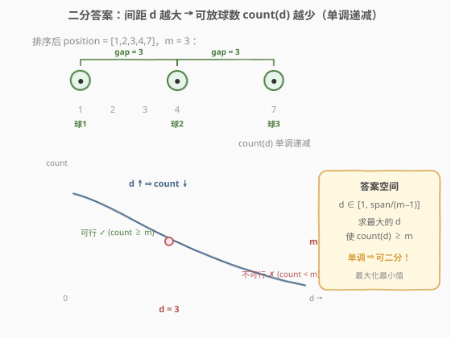
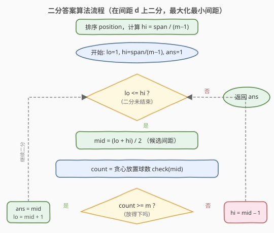

# LeetCode 两球之间的磁力 题解

## 1. 题目概述

- **标题 / 题号**：两球之间的磁力（#1552，medium）
- **链接**：https://leetcode.cn/problems/magnetic-force-between-two-balls/
- **难度**：中等
- **标签**：数组、二分查找、排序

**题意**：给定 `n` 个篮子的位置数组 `position`（各位置互不相同），以及整数 `m` 表示球的数量。将 `m` 个球放入这些篮子中，使得**任意两球之间的最小距离最大化**。返回这个最大化的最小距离。

**示例 1**：

```text
输入：position = [1,2,3,4,7], m = 3
输出：3
解释：将 3 个球分别放在位置 1、4、7，最小距离为 min(4−1, 7−4) = 3。
     若最小距离取 4，则只能放 2 个球（如 1 和 7），不够 m=3 个。
```

**示例 2**：

```text
输入：position = [5,4,3,2,1,1000000000], m = 2
输出：999999999
解释：排序后为 [1,2,3,4,5,1000000000]，两球分别放在首尾，距离 = 10^9 − 1。
```

**约束**：

- `2 <= n <= 10^5`
- `1 <= position[i] <= 10^9`
- `position` 中所有整数互不相同
- `2 <= m <= n`

## 2. 解题思路

### 2.1 暴力思路

将 `position` 排序后，最小距离 `d` 的取值范围是 `[1, position[n-1] - position[0]]`。从 `d = 1` 开始逐个尝试，对每个 `d` 贪心验证能否放下 `m` 个球（从左到右依次放置，每当与上一个球的距离 $\ge d$ 就放一个）。第一个无法放下 `m` 个球的 `d` 减 1 即为答案。

验证单个 `d` 是 $O(n)$，整体 $O(n \times \text{span})$，而 `span` 可达 $10^9$，必然超时。

### 2.2 核心观察：二分答案



关键直觉是：**可放球数 `count(d)` 关于间距 `d` 单调递减**。

- `d` 越小，约束越宽松，能放的球越多。
- `d = 1` 时最宽松，所有位置都能放球，`count = n >= m`，必然可行。
- `d` 足够大时，只能放 2 个球（首尾），`count = 2 < m`（当 `m > 2`），不可行。

于是存在一个**分界点** $d^*$：

```text
d <= d* → count(d) >= m   (放得下，可行)
d > d*  → count(d) < m    (放不下，不可行)
```

这正是二分查找所需的**二段性**。把「求最大可行 `d`」转化为：在有序区间 `[1, hi]` 上二分，每次 $O(n)$ 贪心验证 `mid` 是否可行，可行则去右半找更大的，不可行则去左半缩小间距。

> 💡 **识别信号**：题目求「最大的最小 / 最小的最大 / 最大的满足某单调条件值」，且能 $O(n)$ 验证某个候选值是否合法 → 想「二分答案」。本题是「**最大化最小值**」型，与 [1011. 在 D 天内送达包裹的能力](../1001-1100/1011_在D天内送达包裹的能力.md) 的「**最小化最大值**」型互为镜像——二分方向恰好相反。

> ⚠️ **上下界确定**：
> - **下界 `lo = 1`**：最小距离至少为 1（位置互不相同且为整数）。
> - **上界 `hi = (position[n-1] - position[0]) / (m - 1)`**：`m` 个球有 `m−1` 个间距，即使均匀分布，最小间距也不超过总跨度除以间距数。取更松的 `position[n-1] - position[0]` 也可以，只多几次无效二分。

### 2.3 算法流程图



注意判定为「可行」时**先记录 `ans = mid` 再收缩左界**（`lo = mid + 1`），保证最终保留的是「最大的可行值」。这与 1011 题的方向恰好相反——1011 可行时收缩右界（`hi = mid - 1`）以找更小值。

### 2.4 示例演算

![示例演算：position = [1,2,3,4,7], m = 3](../images/magforce_example_walkthrough.svg)

以 `position = [1,2,3,4,7]`、`m = 3` 为例，排序后 `span = 6`，`hi = 6 / 2 = 3`，答案区间 `[1, 3]`：

- **第 1 轮** `[1,3]`，`mid=2`，`check(2)`：放球 1→3→7（间距 2、4，均 $\ge 2$），`count=3 >= 3` ✓ → 可行，记 `ans=2`，去右半 `lo=3`。
- **第 2 轮** `[3,3]`，`mid=3`，`check(3)`：放球 1→4→7（间距 3、3，均 $\ge 3$），`count=3 >= 3` ✓ → 可行，记 `ans=3`，去右半 `lo=4`。
- **第 3 轮** `lo=4 > hi=3`，循环结束，返回 `ans=3`。

## 3. 参考代码

### C++

```cpp
class Solution {
public:
    int maxDistance(vector<int>& position, int m) {
        sort(position.begin(), position.end());
        int lo = 1;
        int hi = (position.back() - position.front()) / (m - 1);
        int ans = 1;

        while (lo <= hi) {
            int mid = lo + (hi - lo) / 2;
            if (canPlace(position, mid, m)) {
                ans = mid;        // 可行，尝试更大间距
                lo = mid + 1;
            } else {
                hi = mid - 1;     // 放不下，缩小间距
            }
        }
        return ans;
    }

private:
    // 贪心验证：间距 >= d 时能否放下 m 个球
    bool canPlace(const vector<int>& position, int d, int m) {
        int count = 1;            // 第一个球放在 position[0]
        int last = position[0];
        for (int i = 1; i < position.size(); ++i) {
            if (position[i] - last >= d) {
                ++count;
                last = position[i];
            }
        }
        return count >= m;
    }
};
```

### Python

```python
class Solution:
    def maxDistance(self, position: List[int], m: int) -> int:
        position.sort()
        lo, hi = 1, (position[-1] - position[0]) // (m - 1)
        ans = 1

        while lo <= hi:
            mid = (lo + hi) // 2
            if self._can_place(position, mid, m):
                ans = mid       # 可行，尝试更大间距
                lo = mid + 1
            else:
                hi = mid - 1    # 放不下，缩小间距
        return ans

    def _can_place(self, position: List[int], d: int, m: int) -> bool:
        count, last = 1, position[0]   # 第一个球放在 position[0]
        for p in position[1:]:
            if p - last >= d:
                count += 1
                last = p
        return count >= m
```

> ⚠️ **两个易错点**：
> 1. **`count` 初值是 `1` 不是 `0`**：第一个球固定放在 `position[0]`，后续从下标 1 开始贪心。若初始化为 `0`，则所有球都会少算一个。
> 2. **二分方向与 1011 相反**：本题是「最大化最小值」，可行时应向**右**搜索更大值（`lo = mid + 1`）；而 1011 是「最小化最大值」，可行时应向**左**搜索更小值（`hi = mid - 1`）。方向搞反会返回错误答案。

## 4. 复杂度分析

| 维度 | 复杂度 | 说明 |
|------|--------|------|
| 时间复杂度 | $O(n \log n + n \log S)$ | 排序 $O(n \log n)$；二分 $O(\log S)$ 次，每次贪心验证 $O(n)$，$S = \text{span}/(m-1)$ |
| 空间复杂度 | $O(\log n)$ | 排序的递归栈空间（C++ `std::sort`） |

> 💡 由于 `position[i] <= 10^9`，`span` 可达 $10^9$，$\log S \approx 30$，$n \le 10^5$，总运算量约 $3 \times 10^6$，远低于时限。

## 5. 扩展：贪心 `check()` 的正确性

「从左到右依次放置，能放就放」为什么是最优的？即为什么贪心放置的球数 `count(d)` 一定是所有合法方案中**最多**的？

**交换论证**：假设存在一个更优方案 $P$，其球数 $> \text{count}$。考察贪心方案第一个球 $G_1$（放在 `position[0]`）与 $P$ 的第一个球 $P_1$。由于 `position[0]` 是最小位置，必有 $P_1 \ge G_1$。若 $P_1 > G_1$，把 $P_1$ 左移到 `position[0]` 不会减少后续可放的球数（只会让后续球的约束更宽松）。如此逐球对齐，可把 $P$ 调整为贪心方案而球数不增，矛盾。故贪心方案球数最多。

> 💡 **与 [1011. 在 D 天内送达包裹的能力](../1001-1100/1011_在D天内送达包裹的能力.md) 的对照**：两题骨架完全一致——都是「二分答案 + 单调性验证 + 贪心 check」。差别在二分方向与 check 逻辑：
> - 1011 是「**最小化最大值**」：可行时 `hi = mid - 1`（找更小），check 是贪心模拟装船天数。
> - 1552 是「**最大化最小值**」：可行时 `lo = mid + 1`（找更大），check 是贪心放置球数。
>
> 掌握这套「**二分答案框架 + 自定义 check + 方向判定**」的范式，可秒杀一整类「最小化最大值 / 最大化最小值」题。

## 6. 面试要点

1. **为什么能二分？二段性体现在哪？**

   - `count(d)` 随 `d` 单调递减。存在分界点 $d^*$，使 $d \le d^*$ 时放得下 `m` 个球、$d > d^*$ 时放不下。这种「左合法 / 右不合法」的结构就是二段性，可用二分定位 $d^*$。

2. **上界为什么是 `span / (m-1)` 而不是 `span`？**

   - `m` 个球之间有 `m−1` 个间距，若每个间距都 $\ge d$，则总跨度 $\ge d \times (m-1)$。因此 $d \le \text{span} / (m-1)$，超过此值在物理上不可能放下 `m` 个球。用更紧的上界可以减少二分次数，但用 `span` 作为上界也不影响正确性。

3. **二分方向怎么判断？**

   - 看题目求「最大化」还是「最小化」。本题求「最大化最小距离」，可行时要继续尝试更大的 `d`，所以 `lo = mid + 1`。口诀：**最大化 → 可行向右搜；最小化 → 可行向左搜**。

4. **为什么贪心放置得到的球数是最多的？**

   - 贪心「能放就放」让每个球的放置位置尽量靠左，为后续球留出更多空间。交换论证可证：任何更优方案都能在不减少球数的前提下调整为贪心方案（详见第 5 节）。

5. **如果 `m == 2`，答案是什么？**

   - 两球分别放在首尾即可，答案 = `position[n-1] - position[0]`。可作为快速边界判断，跳过二分。

## 同类练习题

| # | 题目 | 与本题的关联 |
|---|------|-------------|
| 1011 | [在 D 天内送达包裹的能力](https://leetcode.cn/problems/capacity-to-ship-packages-within-d-days/) | 同模板二分答案，但方向相反（最小化最大值），check 是贪心装船 |
| 410 | [分割数组的最大值](https://leetcode.cn/problems/split-array-largest-sum/) | 二分「最大子数组和」上限，最小化最大值，几乎与 1011 同构 |
| 719 | [找出第 K 小的数对距离](https://leetcode.cn/problems/find-k-th-smallest-pair-distance/) | 二分距离上限，check 用双指针统计满足条件的数对数 |
| 2517 | [礼盒的最大甜蜜度](https://leetcode.cn/problems/maximum-tastiness-of-candy-basket/) | 同方向（最大化最小值），二分甜蜜度差，check 贪心选糖果 |
| 2064 | [分配给商店的最小商品数量](https://leetcode.cn/problems/minimized-maximum-of-products-distributed-to-any-store/) | 二分最大化分配量，check 统计所需商店数 |
