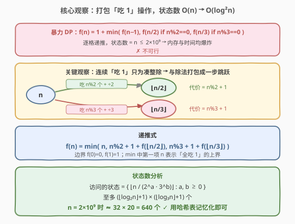
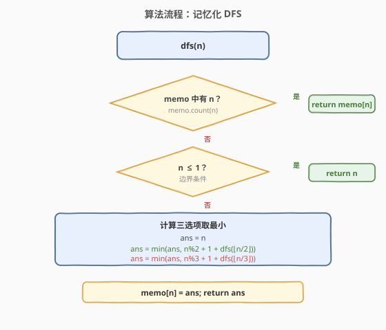
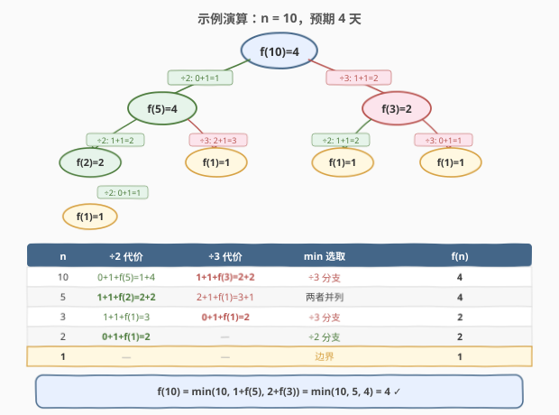

# LeetCode 吃掉 N 个橘子的最少天数 题解

## 1. 题目概述

- **标题 / 题号**：吃掉 N 个橘子的最少天数（#1553，hard）
- **链接**：https://leetcode.cn/problems/minimum-number-of-days-to-eat-n-oranges/
- **难度**：困难
- **标签**：动态规划、记忆化搜索、数学

**题意**：厨房里总共有 `n` 个橘子，每天选择如下**三种方式之一**吃橘子：

1. **吃掉 1 个**橘子；
2. 若剩余橘子数 `n` 能被 2 整除，**吃掉 $n/2$ 个**橘子（剩 $n/2$）；
3. 若剩余橘子数 `n` 能被 3 整除，**吃掉 $2 \cdot (n/3)$ 个**橘子（剩 $n/3$）。

每天只能选一种，返回吃掉所有 `n` 个橘子的**最少天数**。

**示例 1**：

```text
输入：n = 10
输出：4
解释：
第 1 天：吃 1 个，剩 9。
第 2 天：吃 6 个（9 可被 3 整除），剩 3。
第 3 天：吃 2 个（3 可被 3 整除），剩 1。
第 4 天：吃 1 个，剩 0。
```

**示例 2**：

```text
输入：n = 6
输出：3
```

**示例 3**：

```text
输入：n = 1
输出：1
```

**示例 4**：

```text
输入：n = 56
输出：6
```

**约束**：

- $1 \le n \le 2 \times 10^9$

> ⚠️ $n$ 高达 $2 \times 10^9$，常规线性 DP（开 $n$ 大小的数组）在内存与时间上都不可行。必须找到一种**只访问极少状态**的搜索方式。

## 2. 解题思路

### 2.1 暴力思路

最朴素的递推：

$$f(n) = 1 + \min\big(f(n-1),\; f(n/2) \text{ if } n \bmod 2 = 0,\; f(n/3) \text{ if } n \bmod 3 = 0\big)$$

每个状态依赖 $f(n-1)$，因此必须从 $1$ 到 $n$ 逐格填写。当 $n = 2 \times 10^9$ 时，数组需要 $2 \times 10^9$ 个 `int`（约 8 GB），且时间 $O(n)$ 也远超限制。✗ 不可行。

### 2.2 核心观察：打包「吃 1」操作，状态数 $O(n) \to O(\log^2 n)$



**关键洞察**：「吃 1 个」这个操作**永远不会连续使用超过 2 次**而不跟着一次除法。因为无论 $n$ 除以 2 还是 3 的余数是多少（$n \bmod 2 \in \{0, 1\}$，$n \bmod 3 \in \{0, 1, 2\}$），最多吃 2 个就能让剩余橘子数被 2 或 3 整除，然后用一次除法操作吃掉一大批。

因此，**连续的「吃 1」可以与随后的除法操作打包成一步跳跃**：

| 跳跃路径 | 前置「吃 1」次数 | 除法操作 | 到达状态 | 代价 |
|----------|-----------------|---------|---------|------|
| $n \to \lfloor n/2 \rfloor$ | $n \bmod 2$ 个 | 吃 $n/2$ 个（1 天） | $\lfloor n/2 \rfloor$ | $n \bmod 2 + 1$ |
| $n \to \lfloor n/3 \rfloor$ | $n \bmod 3$ 个 | 吃 $2\lfloor n/3 \rfloor$ 个（1 天） | $\lfloor n/3 \rfloor$ | $n \bmod 3 + 1$ |

> 💡 本质上是把「先吃余数个 1，再做除法」看作一个**原子操作**，代价为「余数 + 1 天」。这样从 $n$ 出发只有两条转移边，不需要逐 $n-1$ 递推。

由此得到精简递推式：

$$f(n) = \min\big(n,\;\; n \bmod 2 + 1 + f(\lfloor n/2 \rfloor),\;\; n \bmod 3 + 1 + f(\lfloor n/3 \rfloor)\big)$$

其中 $\min$ 的第一项 $n$ 表示「全部吃 1」的上界（对 $n \le 1$ 的边界也成立）。边界：$f(0) = 0$，$f(1) = 1$。

**状态数分析**：每次递归将 $n$ 除以 2 或 3，因此所有被访问的状态形如：

$$\left\lfloor \frac{n}{2^a \cdot 3^b} \right\rfloor, \quad a, b \ge 0$$

满足 $2^a \cdot 3^b \le n$ 的 $(a, b)$ 对数至多为 $(\lfloor \log_2 n \rfloor + 1)(\lfloor \log_3 n \rfloor + 1)$。当 $n = 2 \times 10^9$ 时，$\log_2 n \approx 31$，$\log_3 n \approx 19$，状态数 $\approx 32 \times 20 = 640$，用**哈希表记忆化**绰绰有余。

### 2.3 算法流程图



1. 维护哈希表 `memo`，键为 $n$，值为 $f(n)$。
2. `dfs(n)`：
   - 若 `memo` 中已有 $n$，直接返回。
   - 若 $n \le 1$，返回 $n$（边界）。
   - 否则计算三选项取最小：$f(n) = \min(n,\; n\%2 + 1 + \text{dfs}(n/2),\; n\%3 + 1 + \text{dfs}(n/3))$。
   - 存入 `memo` 并返回。

> ⚠️ **为什么 `min` 里要保留 `n` 这一项？** 它代表「全部一天吃 1 个」的朴素策略。虽然在 $n \ge 2$ 时，$\div 2$ 或 $\div 3$ 分支总不劣于 $n$，但保留它让代码无需额外证明此性质，且对 $n = 1$ 的边界自然成立。

### 2.4 示例演算

以 $n = 10$ 为例，递归树如下（绿色 = $\div 2$ 分支，红色 = $\div 3$ 分支）：



逐层展开：

| 状态 $n$ | $\div 2$ 分支代价 | $\div 3$ 分支代价 | 选取 | $f(n)$ |
|----------|-------------------|-------------------|------|--------|
| 10 | $0+1+f(5) = 1+4 = 5$ | $1+1+f(3) = 2+2 = \mathbf{4}$ | $\div 3$ | 4 |
| 5 | $1+1+f(2) = 2+2 = \mathbf{4}$ | $2+1+f(1) = 3+1 = 4$ | 并列 | 4 |
| 3 | $1+1+f(1) = 3$ | $0+1+f(1) = \mathbf{2}$ | $\div 3$ | 2 |
| 2 | $0+1+f(1) = \mathbf{2}$ | — | $\div 2$ | 2 |
| 1 | — | — | 边界 | 1 |

$$f(10) = \min(10,\; 1 + f(5),\; 2 + f(3)) = \min(10, 5, 4) = 4 \checkmark$$

> 💡 只访问了 $\{10, 5, 3, 2, 1\}$ 共 5 个状态，而非 $1$–$10$ 全部 10 个。$n$ 越大，跳过的中间态越多——这正是 $O(\log^2 n)$ 相对 $O(n)$ 的优势所在。

## 3. 参考代码

### C++

```cpp
class Solution {
  public:
    unordered_map<int, int> memo;

    int minDays(int n) {
        return dfs(n);
    }

  private:
    int dfs(int n) {
        if (n <= 1) return n;
        auto it = memo.find(n);
        if (it != memo.end()) return it->second;
        int ans = min(n, n % 2 + 1 + dfs(n / 2), n % 3 + 1 + dfs(n / 3));
        memo[n] = ans;
        return ans;
    }
};
```

> ⚠️ 上述 `min` 三参数写法需确保编译器支持 `std::min` 的 initializer_list 版本，或改为两次 `std::min` 调用。下面给出更通用的写法：

```cpp
class Solution {
  public:
    unordered_map<int, int> memo;

    int minDays(int n) {
        if (n <= 1) return n;
        auto it = memo.find(n);
        if (it != memo.end()) return it->second;
        int ans = n;
        ans = min(ans, n % 2 + 1 + minDays(n / 2));
        ans = min(ans, n % 3 + 1 + minDays(n / 3));
        memo[n] = ans;
        return ans;
    }
};
```

### Python

```python
class Solution:
    def minDays(self, n: int) -> int:
        memo = {}

        def dfs(k: int) -> int:
            if k <= 1:
                return k
            if k in memo:
                return memo[k]
            memo[k] = min(k, k % 2 + 1 + dfs(k // 2), k % 3 + 1 + dfs(k // 3))
            return memo[k]

        return dfs(n)
```

> 💡 Python 版用闭包封装 `memo`，避免实例变量在多组测试间残留。若用 `@cache` 装饰器更简洁，但注意测试间需 `dfs.cache_clear()`。

## 4. 复杂度分析

| 维度 | 复杂度 | 说明 |
|------|--------|------|
| 时间复杂度 | $O(\log^2 n)$ | 访问的状态数为 $O(\log_2 n \cdot \log_3 n)$，每个状态计算 $O(1)$（两次取模 + 两次递归） |
| 空间复杂度 | $O(\log^2 n)$ | 哈希表存储 $O(\log^2 n)$ 个状态，递归栈深度 $O(\log n)$ |

> 💡 对 $n = 2 \times 10^9$，$\log^2 n \approx 620$，实际运行在毫秒级。对比暴力 DP 的 $O(n) = O(2 \times 10^9)$，提速约 $3 \times 10^6$ 倍。

## 5. 扩展：BFS 解法

本题也可用 **BFS** 求解：从 $n$ 出发，每层展开 $\div 2$ 和 $\div 3$ 两条边（代价均为 1 步跳跃），第一个到达 $0$ 的层数即为答案。BFS 的优势是天然求最短路，无需在 `min` 中显式比较三选项；劣势是需要队列和去重集合，常数略大。两种方法访问的状态集完全相同（都是 $\{n / (2^a \cdot 3^b)\}$），复杂度一致。

```python
from collections import deque

class Solution:
    def minDays(self, n: int) -> int:
        queue = deque([(n, 0)])
        visited = {n}
        while queue:
            cur, days = queue.popleft()
            if cur == 0:
                return days
            nxt = {cur - 1}
            if cur % 2 == 0:
                nxt.add(cur // 2)
            if cur % 3 == 0:
                nxt.add(cur // 3)
            for nx in nxt:
                if nx not in visited:
                    visited.add(nx)
                    queue.append((nx, days + 1))
```

> ⚠️ BFS 版的 `cur - 1` 分支会导致状态数膨胀。更优的做法与 DFS 一样——**只展开 $\div 2$ 和 $\div 3$**，把「吃余数个 1」隐含在边的代价里。但 BFS 的边权不等（$n\%2+1$ vs $n\%3+1$），需用 **Dijkstra**（优先队列按累计天数弹出），退化为 $O(\log^2 n \cdot \log \log n)$。因此本题 **DFS + 记忆化是首选**。

## 6. 面试要点

1. **为什么不能直接用线性 DP？**
   - $n \le 2 \times 10^9$，数组需要 $\sim 8$ GB 内存，$O(n)$ 时间也远超限制。必须找到只访问 $O(\log^2 n)$ 个状态的搜索方式。

2. **为什么「吃 1」可以和除法打包？**
   - 连续「吃 1」的唯一目的是让剩余橘子数被 2 或 3 整除。$n \bmod 2 \le 1$，$n \bmod 3 \le 2$，所以最多吃 2 个就一定能做除法。把这段「吃余数」和随后的除法看作一个原子操作，代价 $= \text{余数} + 1$ 天，即可从 $n$ 直接跳到 $\lfloor n/2 \rfloor$ 或 $\lfloor n/3 \rfloor$。

3. **状态数为什么是 $O(\log^2 n)$ 而非 $O(\log n)$？**
   - 每次递归可以除以 2 **或** 除以 3，两个方向独立。所有可达状态形如 $\lfloor n / (2^a \cdot 3^b) \rfloor$，$(a, b)$ 的组合数约为 $\log_2 n \cdot \log_3 n$。若只能除以一个数（比如只有 $\div 2$），状态数才是 $O(\log n)$。

4. **为什么用哈希表而不是数组做记忆化？**
   - 状态值 $\lfloor n / (2^a \cdot 3^b) \rfloor$ 虽然只有 $O(\log^2 n)$ 个，但它们的**值域**覆盖 $[1, n]$，无法用数组直接索引。哈希表按需存储，空间正比于实际访问的状态数。

5. **递归会栈溢出吗？**
   - 递归深度 = 从 $n$ 到 $1$ 的最长路径，即不断 $\div 2$ 的次数 $\approx \log_2 n \le 31$，远不会溢出。

## 同类练习题

| # | 题目 | 与本题的关联 |
|---|------|-------------|
| 140 | [单词拆分 II](https://leetcode.cn/problems/word-break-ii/)（[题解](../0101-0200/140_单词拆分II.md)） | 记忆化 DFS 避免后缀重复搜索，同样用哈希表存中间结果 |
| 526 | [优美的排列](https://leetcode.cn/problems/beautiful-arrangement/)（[题解](../0501-0600/526_优美的排列.md)） | 状态压缩 + 记忆化搜索，状态空间大但可达子集小 |
| 264 | [丑数 II](https://leetcode.cn/problems/ugly-number-ii/)（[题解](../0201-0300/264_丑数II.md)） | 三指针多路归并生成 $\div 2\div 3\div 5$ 序列，与本题的「除法跳跃」思想同源 |
| 29 | [两数相除](https://leetcode.cn/problems/divide-two-integers/)（[题解](../0001-0100/29_两数相除.md)） | 位运算左移翻倍模拟除法，$O(\log n)$ 递归加速，与本题的 $\log$ 级状态数异曲同工 |
| 375 | [猜数字大小 II](https://leetcode.cn/problems/guess-number-higher-or-lower-ii/) | 区间记忆化搜索 + Minimax，同样用哈希表/数组避免重复子问题 |
