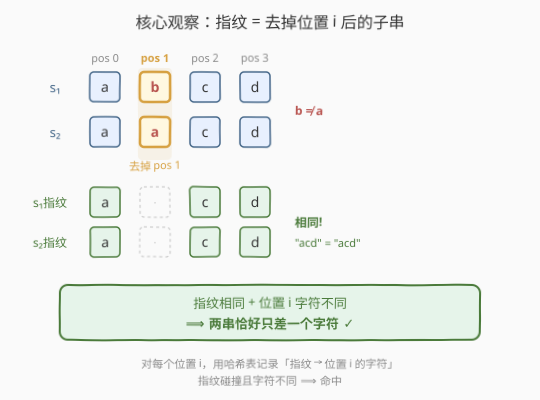
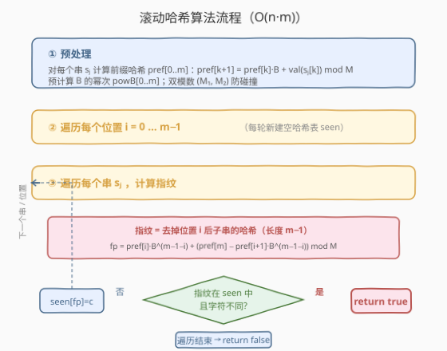
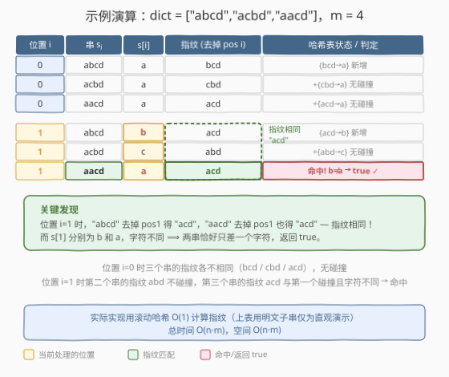

# LeetCode 只有一个不同字符的字符串 题解

## 1. 题目概述

- **标题 / 题号**：只有一个不同字符的字符串（#1554，medium）
- **链接**：https://leetcode.cn/problems/strings-differ-by-one-character/
- **难度**：中等
- **标签**：哈希表、字符串、滚动哈希、Rabin-Karp

**题意**：给定一个字符串列表 `dict`，其中所有字符串**长度相同**且均由小写字母组成。判断是否存在**一对字符串**，它们在**恰好一个位置**上的字符不同（其余位置完全相同）。存在则返回 `true`，否则返回 `false`。

**示例 1**：

```text
输入：dict = ["abcd","acbd","aacd"]
输出：true
解释："abcd" 与 "aacd" 仅在位置 1 不同（b 与 a），其余位置完全相同。
```

**示例 2**：

```text
输入：dict = ["ab","cd","yz"]
输出：false
```

**示例 3**：

```text
输入：dict = ["abcd","cdab","dcba","badc"]
输出：false
```

**约束**：

- `1 <= dict.length <= 10^5`
- `1 <= dict[i].length <= 10^5`
- `dict[i]` 仅由小写英文字母组成
- `dict` 中所有字符串长度相同
- `1 <= n * m <= 10^6`（其中 `n = dict.length`，`m = dict[i].length`）

> ⚠️ 数据规模 $n \cdot m \le 10^6$，要求 $O(n \cdot m)$ 级别的解法。暴力 $O(n^2 \cdot m)$ 和朴素通配符 $O(n \cdot m^2)$ 均会超时——需要滚动哈希把指纹计算压到 $O(1)$。

## 2. 解题思路

### 2.1 暴力思路

枚举所有字符串对 $(s_i, s_j)$，逐字符比较，统计不同位置数。若恰好为 1 则返回 `true`。

- 字符串对数 $O(n^2)$，每对比较 $O(m)$，总复杂度 $O(n^2 \cdot m)$。
- 当 $n = 10^3$、$m = 10^3$ 时已达 $10^9$，必然超时。

> 💡 暴力的问题在于「重复比较」——每对字符串都从头扫起，没有复用任何中间信息。我们需要一种方式把「除一个位置外其余全同」这个条件编码为一个可快速比较的**指纹**。

### 2.2 核心观察：指纹匹配 + 字符不同



**定义指纹。** 对于字符串 $s$ 和位置 $i$，定义**指纹** $\text{fp}(s, i)$ 为 $s$ 去掉第 $i$ 个字符后剩余子串的哈希值，即 $s[0..i{-}1] + s[i{+}1..m{-}1]$ 的哈希。

**关键等价。** 两个字符串 $s_1$、$s_2$ 在位置 $i$ 恰好差一个字符，当且仅当：

$$
\text{fp}(s_1, i) = \text{fp}(s_2, i) \quad \text{且} \quad s_1[i] \ne s_2[i]
$$

- 指纹相同 ⟹ 除位置 $i$ 外所有字符一致（前缀 $s[0..i{-}1]$ 相同 + 后缀 $s[i{+}1..m{-}1]$ 相同）。
- 位置 $i$ 字符不同 ⟹ 恰好差一个字符。

> 💡 **转化思路**：问题从「枚举字符串对逐一比较」变成「**对每个位置 $i$，用哈希表记录指纹→字符映射，发现指纹碰撞且字符不同即命中**」。这正是 Rabin-Karp 思想的延伸——用哈希把字符串比较从 $O(m)$ 降到 $O(1)$。

**朴素实现的瓶颈。** 对每个 $(s_j, i)$ 计算指纹需要 $O(m)$（截取子串再哈希），总计 $n \cdot m$ 个指纹 $\times$ $O(m)$ = $O(n \cdot m^2)$。当 $m$ 较大时超时。

**滚动哈希优化。** 利用多项式哈希的**前缀结构**，将指纹计算从 $O(m)$ 降到 $O(1)$：

- 预计算每个串的前缀哈希 $\text{pref}[k] = \text{hash}(s[0..k{-}1])$。
- 指纹 = 前缀部分 $\text{hash}(s[0..i{-}1])$ 左移 $m{-}1{-}i$ 位 + 后缀部分 $\text{hash}(s[i{+}1..m{-}1])$，两段均可由前缀哈希 $O(1)$ 拼出。

### 2.3 算法流程图



**多项式哈希定义**（基 $B$、模 $M$）：

$$
\text{hash}(s) = \sum_{k=0}^{m-1} s[k] \cdot B^{m-1-k} \pmod{M}
$$

前缀哈希递推：$\text{pref}[k{+}1] = (\text{pref}[k] \cdot B + \text{val}(s[k])) \bmod M$。

**指纹公式**（去掉位置 $i$，长度 $m{-}1$ 的子串哈希）：

$$
\text{fp}(s, i) = \text{pref}[i] \cdot B^{m-1-i} + \big(\text{pref}[m] - \text{pref}[i{+}1] \cdot B^{m-1-i}\big) \pmod{M}
$$

- 第一项 $\text{pref}[i] \cdot B^{m-1-i}$：前缀 $s[0..i{-}1]$ 的哈希左移，对齐到长度 $m{-}1$ 的最高位。
- 第二项 $\text{pref}[m] - \text{pref}[i{+}1] \cdot B^{m-1-i}$：后缀 $s[i{+}1..m{-}1]$ 的哈希。

> ⚠️ **双模数防碰撞**：单模数哈希存在碰撞风险（不同子串可能哈希相同）。使用两个独立的大素数 $(M_1, M_2)$（如 $10^9{+}7$ 和 $10^9{+}9$）做双哈希，碰撞概率降至 $\sim 10^{-18}$，可视为零。命中时也可加一次 $O(m)$ 明文校验确保绝对正确。

**算法步骤**：

1. 预计算 $B$ 的幂次 $\text{powB}[0..m]$（两个模数各一组）。
2. 对每个串 $s_j$ 计算 $\text{pref}_1[j][\cdot]$、$\text{pref}_2[j][\cdot]$ 两组前缀哈希。
3. 对每个位置 $i = 0..m{-}1$：
   - 新建空哈希表 `seen`（键为双哈希指纹对，值为位置 $i$ 的字符）。
   - 对每个串 $s_j$：
     - $O(1)$ 计算指纹 $(\text{fp}_1, \text{fp}_2)$。
     - 若指纹已在 `seen` 中且 $\text{seen}[\text{fp}] \ne s_j[i]$ ⟹ 返回 `true`。
     - 若指纹不在 `seen` 中，存入 $\text{seen}[\text{fp}] = s_j[i]$。
4. 全部遍历完毕未命中 ⟹ 返回 `false`。

### 2.4 示例演算

以 `dict = ["abcd","acbd","aacd"]`（$m = 4$）为例，预期输出 `true`。下表用**明文子串**代替哈希值以直观演示（实际代码用滚动哈希 $O(1)$ 计算）：



| 位置 $i$ | 串 $s_j$ | $s_j[i]$ | 指纹（去掉 pos $i$） | 哈希表状态 / 判定 |
|----------|----------|----------|----------------------|-------------------|
| 0 | abcd | a | bcd | `{bcd→a}` 新增 |
| 0 | acbd | a | cbd | `+{cbd→a}` 无碰撞 |
| 0 | aacd | a | acd | `+{acd→a}` 无碰撞 |
| — | — | — | — | 位置 0 无命中，进入位置 1 |
| **1** | **abcd** | **b** | **acd** | `{acd→b}` 新增 |
| **1** | **acbd** | **c** | **abd** | `+{abd→c}` 无碰撞 |
| **1** | **aacd** | **a** | **acd** | **命中!** `b ≠ a` → **true** ✓ |

> 💡 **看位置 $i=1$ 这一步**：`"abcd"` 去掉 pos 1 得 `"acd"`，`"aacd"` 去掉 pos 1 也得 `"acd"`——指纹相同！而两串在 pos 1 的字符分别是 `b` 和 `a`，字符不同 ⟹ 恰好差一个字符，立即返回 `true`。位置 0 时三个串的指纹各不相同（`bcd`/`cbd`/`acd`），没有碰撞。

## 3. 参考代码

### C++

```cpp
class Solution {
  public:
    bool differByOne(vector<string>& dict) {
        using ll = long long;
        const ll M1 = 1e9 + 7, M2 = 1e9 + 9, B = 31;
        int n = dict.size(), m = dict[0].size();

        // 预计算 B 的幂次
        vector<ll> pw1(m + 1), pw2(m + 1);
        pw1[0] = pw2[0] = 1;
        for (int i = 1; i <= m; ++i) {
            pw1[i] = pw1[i - 1] * B % M1;
            pw2[i] = pw2[i - 1] * B % M2;
        }

        // 预计算每个串的双模数前缀哈希
        vector<vector<ll>> h1(n, vector<ll>(m + 1, 0));
        vector<vector<ll>> h2(n, vector<ll>(m + 1, 0));
        for (int j = 0; j < n; ++j)
            for (int i = 0; i < m; ++i) {
                int c = dict[j][i] - 'a' + 1;
                h1[j][i + 1] = (h1[j][i] * B + c) % M1;
                h2[j][i + 1] = (h2[j][i] * B + c) % M2;
            }

        // 逐位置扫描
        for (int i = 0; i < m; ++i) {
            unordered_map<ll, char> seen;
            for (int j = 0; j < n; ++j) {
                // O(1) 计算指纹：pref[i]*B^(m-1-i) + (pref[m] - pref[i+1]*B^(m-1-i))
                ll suf1 = (h1[j][m] - h1[j][i + 1] * pw1[m - 1 - i] % M1 + M1) % M1;
                ll fp1  = (h1[j][i] * pw1[m - 1 - i] % M1 + suf1) % M1;
                ll suf2 = (h2[j][m] - h2[j][i + 1] * pw2[m - 1 - i] % M2 + M2) % M2;
                ll fp2  = (h2[j][i] * pw2[m - 1 - i] % M2 + suf2) % M2;
                ll key  = fp1 * M2 + fp2;

                char c = dict[j][i];
                if (seen.count(key)) {
                    if (seen[key] != c) return true;
                } else {
                    seen[key] = c;
                }
            }
        }
        return false;
    }
};
```

### Python

```python
class Solution:
    def differByOne(self, dict: List[str]) -> bool:
        MOD1, MOD2, BASE = 10**9 + 7, 10**9 + 9, 31
        n, m = len(dict), len(dict[0])

        # 预计算 B 的幂次
        pw1 = [1] * (m + 1)
        pw2 = [1] * (m + 1)
        for i in range(1, m + 1):
            pw1[i] = pw1[i - 1] * BASE % MOD1
            pw2[i] = pw2[i - 1] * BASE % MOD2

        # 预计算每个串的双模数前缀哈希
        h1 = [[0] * (m + 1) for _ in range(n)]
        h2 = [[0] * (m + 1) for _ in range(n)]
        for j in range(n):
            for i in range(m):
                c = ord(dict[j][i]) - ord('a') + 1
                h1[j][i + 1] = (h1[j][i] * BASE + c) % MOD1
                h2[j][i + 1] = (h2[j][i] * BASE + c) % MOD2

        # 逐位置扫描
        for i in range(m):
            seen = {}
            for j in range(n):
                suf1 = (h1[j][m] - h1[j][i + 1] * pw1[m - 1 - i]) % MOD1
                fp1 = (h1[j][i] * pw1[m - 1 - i] + suf1) % MOD1
                suf2 = (h2[j][m] - h2[j][i + 1] * pw2[m - 1 - i]) % MOD2
                fp2 = (h2[j][i] * pw2[m - 1 - i] + suf2) % MOD2
                key = (fp1, fp2)

                c = dict[j][i]
                if key in seen:
                    if seen[key] != c:
                        return True
                else:
                    seen[key] = c

        return False
```

> 💡 **Python 取模技巧**：Python 的 `%` 对负数也返回非负值，故 `(a - b) % MOD` 无需额外 `+MOD`。C++ 中必须 `+MOD` 再 `%MOD` 防止负数。

## 4. 复杂度分析

| 维度 | 复杂度 | 说明 |
|------|--------|------|
| 时间复杂度 | $O(n \cdot m)$ | 预处理前缀哈希 $O(n \cdot m)$；主循环 $m$ 个位置 $\times$ $n$ 个串 $\times$ $O(1)$ 指纹计算 = $O(n \cdot m)$ |
| 空间复杂度 | $O(n \cdot m)$ | 两组前缀哈希数组各 $n \times (m{+}1)$；幂次数组 $O(m)$；每轮哈希表 $O(n)$ |

> 💡 约束 $n \cdot m \le 10^6$ 保证了 $O(n \cdot m)$ 的时空开销在限制内。若内存紧张，可用**滚动数组**：逐位置处理时只需当前轮的哈希表，前缀哈希也可按需重算（但会牺牲时间效率）。

## 5. 扩展：通配符哈希集（小 $m$ 适用）

若 $m$ 较小（如 $m \le 200$），可用更直观的**通配符法**：对每个串 $s$ 和位置 $i$，将 $s[i]$ 替换为通配符 `*`，得到键 $s[0..i{-}1] + \texttt{*} + s[i{+}1..m{-}1]$，直接用字符串哈希集查重。

```python
class Solution:
    def differByOne(self, dict: List[str]) -> bool:
        n, m = len(dict), len(dict[0])
        for i in range(m):
            seen = {}
            for s in dict:
                key = s[:i] + s[i+1:]     # 去掉位置 i 的子串
                c = s[i]
                if key in seen and seen[key] != c:
                    return True
                if key not in seen:
                    seen[key] = c
        return False
```

- 时间 $O(n \cdot m^2)$（每次切片 $O(m)$），空间 $O(n \cdot m)$。
- $m$ 小时简洁高效；$m$ 大时退化，需换用滚动哈希。

> 💡 **两种方法的关系**：通配符法用「明文子串」做键，滚动哈希法用「子串的哈希值」做键——后者把键构造从 $O(m)$ 压到 $O(1)$，是前者的渐近优化版。思路完全一致：**去掉位置 $i$ 后的指纹相同 + 位置 $i$ 字符不同 = 答案**。

## 6. 面试要点

1. **为什么用「去掉位置 $i$ 的子串哈希」而不是直接比较字符串对？**

   - 直接比较每对字符串需 $O(m)$，共 $O(n^2)$ 对，总计 $O(n^2 \cdot m)$。而「去掉位置 $i$」把「除位置 $i$ 外全同」这一条件编码为指纹，用哈希表 $O(1)$ 查找，总计 $O(n \cdot m)$。本质是用空间换时间，用哈希避免重复比较。

2. **滚动哈希的指纹公式怎么推导？**

   - 多项式哈希 $\text{hash}(s) = \sum s[k] \cdot B^{m-1-k}$。去掉位置 $i$ 后，子串 $s[0..i{-}1] + s[i{+}1..m{-}1]$ 的哈希 = 前缀哈希 $\text{pref}[i]$ 左移 $m{-}1{-}i$ 位（补齐高位）+ 后缀哈希 $\text{hash}(s[i{+}1..m{-}1])$。后缀哈希由前缀数组 $O(1)$ 拼出：$\text{pref}[m] - \text{pref}[i{+}1] \cdot B^{m-1-i}$。

3. **为什么需要双模数？单模数不行吗？**

   - 单模数存在哈希碰撞：两个不同的子串可能恰好同余。$n \cdot m = 10^6$ 时碰撞概率约 $10^{-4}$，不可忽略。双模数将碰撞概率降至 $\sim 10^{-18}$，视为零。若追求绝对正确，可在命中时加一次 $O(m)$ 明文校验。

4. **`seen` 只存第一个字符，会漏掉后续不同字符的匹配吗？**

   - 不会。若同一指纹已有字符 `a`，后续遇到字符 `b` 立即命中返回 `true`；遇到字符 `a` 则跳过（同字符不构成「差一个字符」）。再遇到 `b` 仍会与首个 `a` 命中。只需存一个字符即可覆盖所有情况。

5. **如果题目改为「恰好差 $k$ 个字符」怎么做？**

   - $k = 0$：直接用完整字符串哈希查重（找完全相同的串对）。
   - $k = 1$：本题，去掉一个位置的指纹。
   - $k \ge 2$：需去掉 $k$ 个位置，组合数 $\binom{m}{k}$ 指纹数爆炸，通常改用其他方法（如 BK-Tree 或编辑距离）。本题的「单位置去掉」技巧仅对 $k = 1$ 高效。

## 同类练习题

| # | 题目 | 与本题的关联 |
|---|------|-------------|
| 1062 | [最长重复子串](https://leetcode.cn/problems/longest-repeating-substring/) | 滚动哈希找最长重复子串，同样用前缀哈希 $O(1)$ 比较子串，本题的「哈希查重」延伸 |
| 1044 | [最长重复子串](https://leetcode.cn/problems/longest-duplicate-substring/) | 1062 的加强版，二分答案 + 滚动哈希，双模数防碰撞的经典应用 |
| 187 | [重复的DNA序列](https://leetcode.cn/problems/repeated-dna-sequences/)（[题解](../0201-0300/187_重复的DNA序列.md)） | 定长滑窗 + 滚动哈希查重，与本题「指纹碰撞即命中」同构 |
| 718 | [最长重复子数组](https://leetcode.cn/problems/maximum-length-of-repeated-subarray/)（[题解](../1001-1100/718_最长重复子数组.md)） | 二维 DP / 滚动哈希找公共子串，跨数组版本的哈希查重 |
| 28 | [找出字符串中第一个匹配项的下标](https://leetcode.cn/problems/find-the-index-of-the-first-occurrence-in-a-string/) | KMP / 滚动哈希做模式匹配，Rabin-Karp 的经典场景 |
