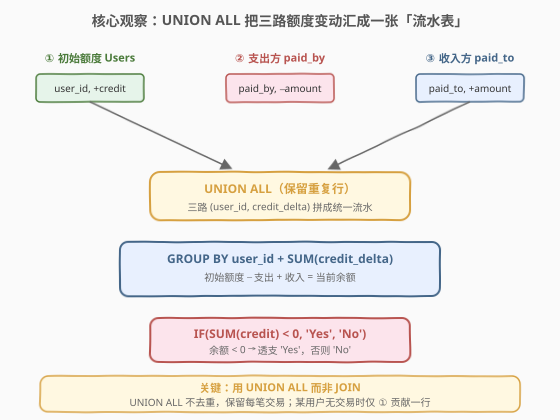
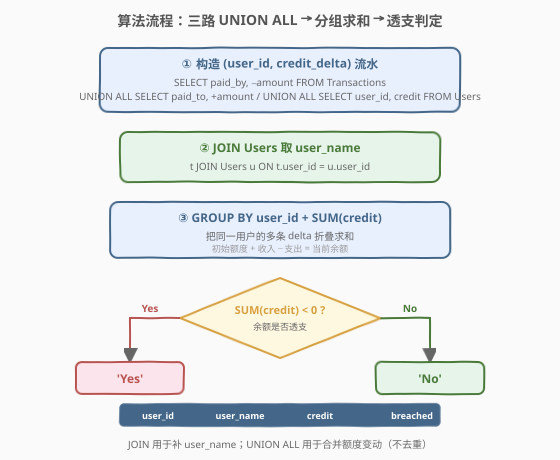
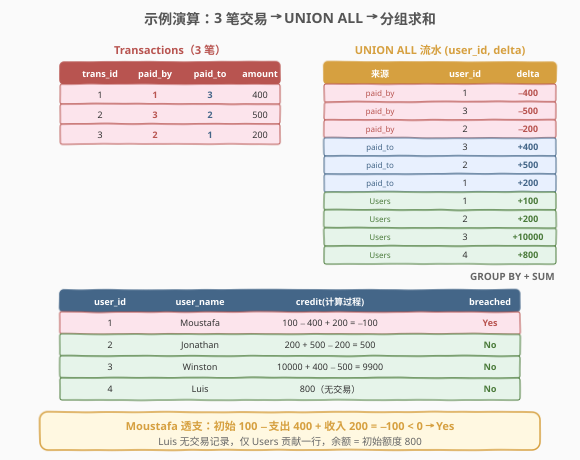

# LeetCode 银行账户概要 题解

## 1. 题目概述

- **标题 / 题号**：银行账户概要（#1555，medium）
- **链接**：https://leetcode.cn/problems/bank-account-summary/
- **难度**：中等
- **标签**：SQL、UNION ALL、GROUP BY、聚合求和、多表关联、条件判定、LeetCode 锁题

**题意**：力扣银行（LCB）记录每一条虚拟支付交易。给定 `Users`（用户当前额度）与 `Transactions`（交易流水）两张表，编写 SQL 查询，报告**每个用户完成所有交易后的当前余额**，并判定是否**透支**（余额 $< 0$）。

**表结构**：

```text
Table: Users
+--------------+---------+
| Column Name  | Type    |
+--------------+---------+
| user_id      | int     |  ← 主键
| user_name    | varchar |
| credit       | int     |
+--------------+---------+
每行含一个用户的初始额度。

Table: Transactions
+---------------+---------+
| Column Name   | Type    |
+---------------+---------+
| trans_id      | int     |  ← 主键
| paid_by       | int     |  → Users.user_id（付款方）
| paid_to       | int     |  → Users.user_id（收款方）
| amount        | int     |
| transacted_on | date    |
+---------------+---------+
每行表示一次转账：paid_by 给 paid_to 转账 amount 元。
```

**输出列**：`user_id`、`user_name`、`credit`（完成交易后的余额）、`credit_limit_breached`（`'Yes'` 表示透支，`'No'` 表示未透支）。结果顺序任意。

**示例 1**：

```text
输入：
Users 表:
+------------+--------------+-------------+
| user_id    | user_name    | credit      |
+------------+--------------+-------------+
| 1          | Moustafa     | 100         |
| 2          | Jonathan     | 200         |
| 3          | Winston      | 10000       |
| 4          | Luis         | 800         |
+------------+--------------+-------------+

Transactions 表:
+------------+------------+------------+----------+---------------+
| trans_id   | paid_by    | paid_to    | amount   | transacted_on |
+------------+------------+------------+----------+---------------+
| 1          | 1          | 3          | 400      | 2020-08-01    |
| 2          | 3          | 2          | 500      | 2020-08-02    |
| 3          | 2          | 1          | 200      | 2020-08-03    |
+------------+------------+------------+----------+---------------+

输出：
+------------+------------+------------+-----------------------+
| user_id    | user_name  | credit     | credit_limit_breached |
+------------+------------+------------+-----------------------+
| 1          | Moustafa   | -100       | Yes                   |
| 2          | Jonathan   | 500        | No                    |
| 3          | Winston    | 9900       | No                    |
| 4          | Luis       | 800        | No                    |
+------------+------------+------------+-----------------------+
```

**解释**：

| user_id | 余额计算 | 结果 | 透支? |
|---------|----------|------|------|
| 1 (Moustafa) | 初始 100 − 支出 400（#1） + 收入 200（#3） | $-100$ | Yes |
| 2 (Jonathan) | 初始 200 + 收入 500（#2） − 支出 200（#3） | $500$ | No |
| 3 (Winston) | 初始 10000 + 收入 400（#1） − 支出 500（#2） | $9900$ | No |
| 4 (Luis) | 初始 800（无任何交易） | $800$ | No |

> ⚠️ Luis 在 `Transactions` 中**既不出现为 `paid_by` 也不出现为 `paid_to`**——若用 `JOIN Transactions` 直接关联会丢失 Luis 这一行。必须用 `UNION ALL` 把「初始额度」也纳入流水，才能保证所有用户都出现在结果中。

**约束**：

- `user_id` 是 `Users` 表的主键
- `trans_id` 是 `Transactions` 表的主键
- `paid_by`、`paid_to` 均引用 `Users.user_id`
- 结果以任意顺序返回

> 💡 本题是 SQL **"UNION ALL 合并多路流水 + GROUP BY 求和"招牌题**——核心三步：① 把「支出方 −amount」「收入方 +amount」「初始额度 +credit」三路用 `UNION ALL` 拼成统一的 `(user_id, delta)` 流水表；② `JOIN Users` 取 `user_name`；③ `GROUP BY user_id` + `SUM(delta)` 算余额，用 `IF(SUM < 0, 'Yes', 'No')` 判透支。难点在于想到「把一次交易拆成两条 delta 记录」并意识到**必须包含无交易用户**。

## 2. 解题思路

### 2.1 暴力思路：逐用户扫描交易

最直觉的过程式思路：对每个用户 `u`，遍历 `Transactions` 表，累加「作为 `paid_by` 的总支出」与「作为 `paid_to` 的总收入」，再用 `u.credit + 收入 − 支出` 得到当前余额。伪代码：

```text
for each user u in Users:
    outflow = sum(amount for t in Transactions if t.paid_by == u.user_id)
    inflow  = sum(amount for t in Transactions if t.paid_to == u.user_id)
    balance = u.credit - outflow + inflow
    breached = 'Yes' if balance < 0 else 'No'
    emit (u.user_id, u.user_name, balance, breached)
```

这对应 SQL 的「相关子查询」写法：每个用户跑两个子查询求和。逻辑正确，但**对每行 Users 都要扫描两遍 Transactions**，复杂度 $O(U \cdot T)$，且写出来嵌套冗长。更糟的是，SQL 表达「求和」最自然的方式是**分组聚合**而非逐行子查询——我们应把数据「拉平」成统一流水，再一次性分组。

### 2.2 核心观察：UNION ALL 把三路额度变动汇成统一流水



**关键洞察**：一次转账对系统产生**两条额度变动**——付款方 `-amount`、收款方 `+amount`。若把「每条变动」视作一行 `(user_id, delta)`，则：

$$\text{当前余额} = \text{初始额度} + \sum_{\text{该用户所有变动}} \text{delta}$$

这样就把「两表关联 + 双向求和」简化为**单一流水表的分组求和**。三路 delta 来源：

| 来源 | user_id 列 | delta 值 | 含义 |
|------|-----------|----------|------|
| `Users` | `user_id` | `+credit` | 初始额度 |
| `Transactions`（付款方） | `paid_by` | `-amount` | 钱转出 |
| `Transactions`（收款方） | `paid_to` | `+amount` | 钱转入 |

三路用 **`UNION ALL`**（不是 `UNION`！）拼成统一的 `(user_id, credit)` 流水表，外层 `GROUP BY user_id` + `SUM(credit)` 即得每个用户的当前余额。

> 💡 **为何用 `UNION ALL` 而非 `UNION`？** `UNION` 会**去重**——若两笔交易的 `(user_id, amount)` 恰好相同（如用户 1 两次都付 400），`UNION` 会合并成一行，导致求和漏数。`UNION ALL` 保留所有行，每笔交易独立计入，求和才正确。

> ⚠️ **必须包含 `Users` 这一路**：Luis 没有任何交易，若只 `UNION ALL` 两路 `Transactions`，Luis 根本不在流水表里，结果会漏掉他。把 `Users.credit` 作为一路 `+credit` delta 纳入，既贡献初始额度，又保证无交易用户也在结果中（一行 `+credit` 即其全部 delta）。

### 2.3 算法流程图



**逻辑执行步骤**：

| 步骤 | 子句 | 作用 |
|------|------|------|
| ① | 三路 `SELECT ... UNION ALL` | 构造 `(user_id, credit_delta)` 流水：支出方 `−amount` / 收入方 `+amount` / 初始 `+credit` |
| ② | `JOIN Users u ON t.user_id = u.user_id` | 补出 `user_name`（流水表只有 id） |
| ③ | `GROUP BY user_id` + `SUM(credit)` | 同一用户的多条 delta 折叠求和 = 当前余额 |
| ④ | `IF(SUM(credit) < 0, 'Yes', 'No')` | 余额 $< 0$ 判透支 |

> 💡 **`JOIN` 的角色定位**：这里 `JOIN Users` **不是为了筛交易**，而是为了从流水表里的 `user_id` 反查 `user_name` 填到输出列。真正的「额度计算」由 `UNION ALL + GROUP BY` 完成——`JOIN` 只负责补字段。这与「`JOIN` 后 `GROUP BY` 聚合」的传统多表查询有本质区别：聚合发生在**已合并的流水表**上，不在 `JOIN` 之后。

### 2.4 示例演算

以示例 1 的 3 笔交易为例，观察「三路 UNION ALL → 分组求和 → 透支判定」的逐步过程：



**步骤 ①：三路 UNION ALL 生成 10 行流水**

| 来源 | user_id | delta |
|------|---------|-------|
| paid_by（#1） | 1 | −400 |
| paid_by（#2） | 3 | −500 |
| paid_by（#3） | 2 | −200 |
| paid_to（#1） | 3 | +400 |
| paid_to（#2） | 2 | +500 |
| paid_to（#3） | 1 | +200 |
| Users | 1 | +100 |
| Users | 2 | +200 |
| Users | 3 | +10000 |
| Users | 4 | +800 |

**步骤 ②③：GROUP BY user_id + SUM(delta)**

| user_id | 求和表达式 | 余额 | 透支? |
|---------|-----------|------|------|
| 1 | $100 - 400 + 200$ | $-100$ | Yes |
| 2 | $200 + 500 - 200$ | $500$ | No |
| 3 | $10000 + 400 - 500$ | $9900$ | No |
| 4 | $800$ | $800$ | No |

**步骤 ④：IF(SUM < 0, 'Yes', 'No')**

Moustafa 余额 $-100 < 0$ → `'Yes'`；其余三人余额 $\geq 0$ → `'No'`。最终输出 4 行，与示例一致。

> 💡 **Luis 的特殊性**：Luis 在流水表中只有 Users 贡献的 `+800` 一行，无任何交易 delta。`GROUP BY` 后 `SUM(800) = 800`，透支判定 `'No'`。这正是「必须把 `Users` 作为 UNION ALL 的一路」的根本原因——否则 Luis 完全消失。

## 3. 参考代码

### SQL（解法 A：子查询 UNION ALL + 外层 GROUP BY）

```sql
SELECT
    t.user_id,
    u.user_name,
    SUM(t.credit) AS credit,
    IF(SUM(t.credit) < 0, 'Yes', 'No') AS credit_limit_breached
FROM (
    SELECT paid_by AS user_id, -amount AS credit FROM Transactions
    UNION ALL
    SELECT paid_to AS user_id,  amount AS credit FROM Transactions
    UNION ALL
    SELECT user_id, credit FROM Users
) AS t
JOIN Users AS u ON t.user_id = u.user_id
GROUP BY t.user_id, u.user_name;
```

> 💡 **写法要点**：
> - **三路 `UNION ALL`**：付款方 `paid_by → user_id` 配 `−amount`；收款方 `paid_to → user_id` 配 `+amount`；初始额度 `Users.user_id → credit`。列名统一为 `user_id, credit`，外层才能 `GROUP BY user_id`。
> - **`JOIN Users`**：子查询 `t` 只有 `user_id`，需 `JOIN Users` 拿 `user_name`。`GROUP BY` 同时带上 `u.user_name`（MySQL 严格模式需 `group by` 所有非聚合列）。
> - **`SUM(t.credit)`**：把同一 `user_id` 的所有 delta 求和 = 当前余额。
> - **`IF(cond, 'Yes', 'No')`**：MySQL 条件表达式，余额 $< 0$ 输出 `'Yes'`。等价写法 `CASE WHEN SUM(t.credit) < 0 THEN 'Yes' ELSE 'No' END`。

### SQL（解法 B：CTE 先建流水再聚合，推荐）

```sql
WITH Delta AS (
    SELECT paid_by AS user_id, -amount AS credit FROM Transactions
    UNION ALL
    SELECT paid_to AS user_id,  amount AS credit FROM Transactions
    UNION ALL
    SELECT user_id, credit FROM Users
)
SELECT
    d.user_id,
    u.user_name,
    SUM(d.credit) AS credit,
    IF(SUM(d.credit) < 0, 'Yes', 'No') AS credit_limit_breached
FROM Delta AS d
JOIN Users AS u ON d.user_id = u.user_id
GROUP BY d.user_id, u.user_name;
```

> 💡 **解法 B 的优势**：用 CTE 把「三路 UNION ALL 建流水」的逻辑封装为 `Delta`，主查询聚焦于「JOIN + 聚合 + 判定」，**层次更清晰、可读性更佳**。MySQL 8.0+ 支持 CTE，LeetCode 在线判题环境兼容。

### SQL（解法 C：LEFT JOIN + 双向聚合，对照思路）

不解构流水，而是对每个用户分别求「总支出」与「总收入」，再用 `Users.credit` 减/加：

```sql
SELECT
    u.user_id,
    u.user_name,
    u.credit
        - IFNULL((SELECT SUM(amount) FROM Transactions t WHERE t.paid_by = u.user_id), 0)
        + IFNULL((SELECT SUM(amount) FROM Transactions t WHERE t.paid_to = u.user_id), 0) AS credit,
    IF(
        u.credit
            - IFNULL((SELECT SUM(amount) FROM Transactions t WHERE t.paid_by = u.user_id), 0)
            + IFNULL((SELECT SUM(amount) FROM Transactions t WHERE t.paid_to = u.user_id), 0) < 0,
        'Yes', 'No'
    ) AS credit_limit_breached
FROM Users u;
```

> ⚠️ **解法 C 的缺陷**：
> - **相关子查询**：对每行 `Users` 跑两次 `SUM` 子查询，$O(U \cdot T)$，数据量大时性能差。
> - **表达式重复**：`credit` 与 `credit_limit_breached` 都要写一遍冗长的加减式，难维护。
> - **优点**：天然包含所有用户（`FROM Users` 保证 Luis 在），不需 `UNION ALL` 拼初始额度。
>
> 仅作「另一种思路」对照，**生产环境推荐解法 A/B**。

### Python（pandas）

```python
import pandas as pd

def bank_account_summary(users: pd.DataFrame, transactions: pd.DataFrame) -> pd.DataFrame:
    deltas = []
    if not transactions.empty:
        deltas.append(pd.DataFrame({
            'user_id': transactions['paid_by'],
            'delta': -transactions['amount'],
        }))
        deltas.append(pd.DataFrame({
            'user_id': transactions['paid_to'],
            'delta': transactions['amount'],
        }))
    deltas.append(pd.DataFrame({
        'user_id': users['user_id'],
        'delta': users['credit'],
    }))
    stream = pd.concat(deltas, ignore_index=True)

    bal = stream.groupby('user_id', as_index=False)['delta'].sum()
    result = users[['user_id', 'user_name']].merge(bal, on='user_id', how='left')
    result['credit'] = result['delta'].fillna(0).astype(int)
    result['credit_limit_breached'] = result['credit'].apply(lambda x: 'Yes' if x < 0 else 'No')
    return result[['user_id', 'user_name', 'credit', 'credit_limit_breached']]
```

> 💡 **pandas 对照**：
> - 三路 `DataFrame` 用 `pd.concat` 合并——对应 SQL 的 `UNION ALL`（不去重）。
> - `.groupby('user_id')['delta'].sum()`——对应 `GROUP BY user_id` + `SUM(credit)`。
> - `.merge(users, on='user_id', how='left')`——对应 `JOIN Users` 取 `user_name`，且 `left` 保证无交易用户也在。
> - `.apply(lambda x: 'Yes' if x < 0 else 'No')`——对应 `IF(SUM < 0, 'Yes', 'No')`。

## 4. 复杂度分析

| 维度 | 解法 A（UNION ALL 子查询） | 解法 B（CTE） | 解法 C（相关子查询） | pandas |
|------|---------------------------|---------------|---------------------|--------|
| **时间** | $O(U + T)$ | $O(U + T)$ | $O(U \cdot T)$ | $O(U + T)$ |
| **空间** | $O(U + T)$ | $O(U + T)$ | $O(1)$ 额外 | $O(U + T)$ |
| **扫表次数** | 各表 1 次 | 各表 1 次 | $2U$ 次扫 Transactions | 各表 1 次 |
| **可读性** | 一般 | ✓ 最清晰 | ✗ 冗长 | ✓ 清晰 |
| **推荐度** | ✓ 兼容旧版 | ✓ **首选** | ✗ 仅对照 | ✓ 验证用 |

> - $U$ = `Users` 行数，$T$ = `Transactions` 行数
> - **解法 A/B**：`UNION ALL` 扫 `Transactions` 两遍（`paid_by`/`paid_to` 各一次）+ `Users` 一遍，生成 $U + 2T$ 行流水；`GROUP BY` 哈希分组 $O(U + 2T)$；总体线性。现代优化器通常能把 `UNION ALL` 的两次扫表合并为一次，实际更优。
> - **解法 C**：对每个用户跑两个相关子查询，每个子查询全扫 `Transactions`，总扫描量 $2U \cdot T$，用户多/交易多时严重退化。
> - **索引优化**：在 `Transactions(paid_by)` 与 `Transactions(paid_to)` 上分别建索引，可使解法 C 的子查询从全表扫降为索引扫，但仍不如解法 A/B 的一次性聚合。

## 5. 扩展：UNION ALL vs UNION vs JOIN

### 5.1 三种「合并表」方式对比

| 操作 | 语义 | 去重? | 列对齐 | 典型用途 |
|------|------|------|--------|----------|
| `UNION ALL` | 垂直拼接两个结果集 | ✗ 不去重 | 列数与类型须一致 | 合并多路流水（本题）、分页 `OFFSET` 优化 |
| `UNION` | 垂直拼接 + 去重 | ✓ 去重（内部排序/哈希） | 同上 | 合并去重，但性能比 `UNION ALL` 差 |
| `JOIN` | 水平横向关联 | — 按连接条件配对 | 列可不同 | 补字段（本题 `JOIN Users` 取 `user_name`） |

> 💡 **口诀**：`UNION ALL` 是「**纵向摞起来**不去重」，`JOIN` 是「**横向拼起来**按条件配对」。本题同时用两者：`UNION ALL` 把三路 delta **纵向**摞成流水，`JOIN` 把流水与 `Users` **横向**拼出名字。方向不同，各司其职。

### 5.2 为何本题不能用 `JOIN` 替代 `UNION ALL`？

设想用 `JOIN` 关联 `Users` 与 `Transactions`（按 `paid_by` 或 `paid_to`）：

- **按 `paid_by` JOIN**：只能拿到「支出」一方的数据，缺收入；且 Luis（无支出）会因 `INNER JOIN` 丢失。
- **按 `paid_by` LEFT JOIN 再按 `paid_to` LEFT JOIN**：一行交易会同时关联到付款方和收款方两行 `Users`，产生笛卡尔积式膨胀，`SUM` 重复计算，逻辑混乱。
- **根本原因**：`JOIN` 是「按匹配条件横向配对」，而本题需要的是「把一次交易**拆**成两条独立 delta 行」——这是 `UNION ALL` 的「纵向摞 + 不配对」语义，`JOIN` 表达不了。

### 5.3 边界情况

| 场景 | 流水表内容 | 余额 | 说明 |
|------|-----------|------|------|
| 用户无任何交易 | 仅 Users 一行 `+credit` | = 初始额度 | Luis 场景，必须含 Users 这一路 |
| 同一用户多笔相同金额支出 | 多行 `−amount` 重复 | 累加全部 | `UNION ALL` 不去重，正确；`UNION` 会漏 |
| 自转交易（paid_by = paid_to） | 同一用户一行 `−amount` + 一行 `+amount` | 净 0 | 自己转给自己，余额不变 |
| 初始额度为负 | Users 行 `credit < 0` | 可能更负 | 题目未限制初始额度非负，逻辑仍成立 |

> ⚠️ **自转交易**（`paid_by = paid_to`）是隐藏陷阱：`UNION ALL` 会生成一行 `−amount` 和一行 `+amount`，`SUM` 后净 0，正确。若误用单路 `JOIN` 或去重 `UNION`，可能算成 `−amount` 或 `+amount`，结果错误。

## 6. 面试要点

1. **为什么用 `UNION ALL` 而不是 `UNION`？**

   > `UNION` 会对结果集**去重**——若同一用户有两笔金额相同的交易（如两次都付 400），`UNION` 会合并成一行，`SUM` 漏算。`UNION ALL` 保留所有行，每笔交易独立计入求和。本题核心是「求和」，必须保留重复，故一律用 `UNION ALL`。

2. **为什么必须把 `Users` 也作为 `UNION ALL` 的一路？**

   > 两个原因：① **贡献初始额度**——用户的当前余额 = 初始 credit + 交易净变动，初始额度本身是一条 `+credit` delta；② **保证无交易用户出现在结果**——Luis 不在任何交易中，若只 `UNION ALL` 两路 `Transactions`，Luis 根本不在流水表，结果会漏他。把 `Users` 纳入流水，既提供初始额度，又让无交易用户至少有一行（`+credit`），`GROUP BY` 后自然出现在结果里。

3. **`JOIN Users` 在本题中的作用是什么？为什么不靠它来算余额？**

   > `JOIN Users` 只为从流水表里的 `user_id` **反查 `user_name`** 填到输出列，不参与余额计算。真正的余额计算由 `UNION ALL + GROUP BY + SUM` 完成。`JOIN` 是「横向补字段」，`UNION ALL` 是「纵向摞流水」——方向不同，各司其职。若试图用 `JOIN` 关联交易来算余额，会陷入「按 `paid_by` 还是 `paid_to` 关联」的二选一困境，丢失另一方向。

4. **`IF(SUM(credit) < 0, 'Yes', 'No')` 中 `SUM` 为什么能在 `SELECT` 里直接用？**

   > 因为外层有 `GROUP BY user_id`，`SUM(credit)` 是**分组聚合函数**，对每个分组求和后作为标量参与 `IF` 判定。`IF` 的第一个参数是聚合结果（每组一个值），不是逐行判定。等价写法是 `CASE WHEN SUM(credit) < 0 THEN 'Yes' ELSE 'No' END`，`CASE` 是 SQL 标准语法，跨数据库通用。

5. **如果要把透支判定阈值从 0 改为「余额低于初始额度的 10%」，怎么改？**

   > 把 `IF(SUM(t.credit) < 0, ...)` 改为 `IF(SUM(t.credit) < 0.1 * u.credit, ...)`——但注意 `u.credit` 是初始额度，需在 `GROUP BY` 后保留为聚合键或用子查询取出。更稳妥的写法：先用 CTE 算出每个用户的 `current_balance` 与 `initial_credit`，再在外层 `SELECT` 中比较 `current_balance < 0.1 * initial_credit`。这体现了「先聚合、后判定」的分层思路。

> 💡 **一句话总结**：1555 是 SQL **"UNION ALL 合并多路流水 + GROUP BY 求和"招牌题**——核心模板「三路 `UNION ALL`（支出 `−amount` / 收入 `+amount` / 初始 `+credit`）→ `JOIN Users` 取名 → `GROUP BY user_id` + `SUM` → `IF(SUM < 0, 'Yes', 'No')`」。最大要点：**用 `UNION ALL` 不去重、必须含 `Users` 一路保无交易用户、`JOIN` 仅补字段不参与余额计算**。

## 同类练习题

| # | 题目 | 与本题的关联 |
|---|------|-------------|
| 578 | [查询回答率最高的问题 🔒](https://leetcode.cn/problems/get-highest-answer-rate-question/) | `UNION ALL` 把两张日志表合并后 `GROUP BY` 求比率，共享「多路 UNION ALL + 分组聚合」骨架 |
| 1174 | [即时食物配送 II 🔒](https://leetcode.cn/problems/immediate-food-delivery-ii/) | `GROUP BY` + 子查询取首单，共享「分组聚合 + 条件判定」思路 |
| 1193 | [每月交易 I 🔒](https://leetcode.cn/problems/monthly-transactions-i/) | `GROUP BY` 月份聚合交易金额与状态计数，同为「交易流水分组汇总」家族 |
| 1321 | [餐厅营业额变化 🔒](https://leetcode.cn/problems/restaurant-growth/) | `GROUP BY` 日期聚合 + 窗口函数滚动均值，叠加「分组求和」与「窗口」两种聚合 |
| 184 | [部门工资最高的员工](https://leetcode.cn/problems/department-highest-salary/) | `JOIN` + `GROUP BY` 取每组最大值，对照「JOIN 横向补字段 + 聚合」的多表查询范式 |
