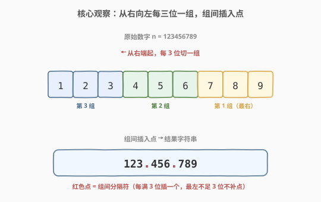
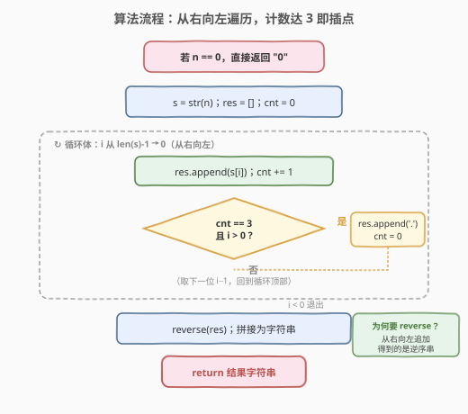
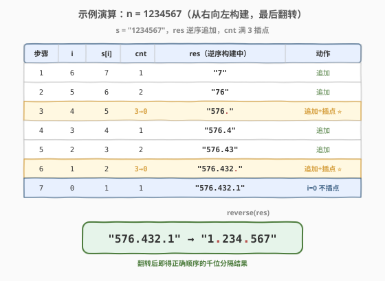

# 千位分隔符

- **题目名称**：千位分隔符
- **链接**：[1556. 千位分隔符](https://leetcode.cn/problems/thousand-separator/)
- **难度**：简单
- **标签**：字符串、数学

## 1. 题目概述

给你一个整数 `n`，请你**从右向左**每隔三位添加一个点 `"."` 作为千位分隔符，返回添加分隔符后的字符串。

**示例 1**：

```text
输入：n = 987
输出："987"
解释：不足三位，无需添加分隔符。
```

**示例 2**：

```text
输入：n = 1000
输出："1.000"
```

**示例 3**：

```text
输入：n = 1234
输出："1.234"
```

**示例 4**：

```text
输入：n = 123456789
输出："123.456.789"
```

**约束条件**：

- `0 <= n <= 2^31 - 1`

> 💡 题目的核心是**按位分组**：从右端（个位）起，每满三位插入一个点。最左一组若不足三位**不补零、不加点**。注意分隔符是从右往左数的，因此必须**从右向左**遍历，而非从左向右。

---

## 2. 解题思路

### 2.1 暴力思路：转字符串后从左向右插点

最直观的朴素做法是：先把 `n` 转成字符串 `s`，然后从左向右扫描，根据 `(len - i) % 3 == 0` 判断在位置 `i` 之后是否插入点。

```text
s = str(n)
for i in 0..len(s)-1:
    res += s[i]
    if (len - i - 1) % 3 == 0 and i != len-1:
        res += '.'
return res
```

这种做法能工作，但**下标判断容易出错**：要算"剩余位数"，还要特判末尾不能加点，边界条件多。更稳妥的思路是**反过来想**——既然分组规则是"从右向左每三位"，那就直接**从右向左遍历**，用一个计数器 `cnt` 数已追加的位数，每满 3 且左侧还有数字就插点，逻辑清晰且无需下标余数运算。

### 2.2 核心观察：从右向左遍历 + 计数器，满 3 插点



关键直觉：**千位分隔符的本质是"从右端起的每三位一组"**。把数字串当成一排格子，从右端开始数，每凑满 3 个数字就在它们前面插一个点；当左侧剩余数字不足 3 个时，它们自成一组且**前面不加点**。

用一个计数器 `cnt` 跟踪"当前已连续追加的位数"：

- 追加一位数字：`res.append(s[i])`，`cnt += 1`。
- 当 `cnt == 3` 且**当前位置不是最左端**（`i > 0`，即左侧仍有数字）时：`res.append('.')`，`cnt = 0`。

> 💡 **为什么从右向左？** 因为分隔符的"锚点"在右端（个位），每三位一个点是从右数过来的。若从左向右，则需要先用 `(len % 3)` 算出第一组长度，再多一层余数判断——容易绕晕。从右向左让"每满 3 插点"的逻辑天然成立。

> ⚠️ **两个易错点**：
> 1. **`i > 0` 的判定不能漏**：当 `cnt == 3` 但已经是最后一位（最左端）时，左侧没有数字了，**不该再加点**（否则结果以点开头，如 `n = 1000` 会得到 `.100.0` 之类的错误）。
> 2. **结果需要翻转**：从右向左追加得到的是**逆序串**，最后必须 `reverse` 一次才是正序结果。

### 2.3 算法流程图



流程要点：先特判 `n == 0` 直接返回 `"0"`；否则转字符串、初始化空结果与计数器；从最右下标向左遍历，每位先追加、计数，计数满 3 且非最左端就插点并清零；循环结束后翻转结果拼接返回。

### 2.4 示例演算



以 `n = 1234567`（`s = "1234567"`，长度 7）为例，从右向左逐位追加：

| 步骤 | i | s[i] | cnt | res（逆序构建） | 动作 |
|------|---|------|-----|-----------------|------|
| 1 | 6 | 7 | 1 | `"7"` | 追加 |
| 2 | 5 | 6 | 2 | `"76"` | 追加 |
| 3 | 4 | 5 | 3→0 | `"576."` | 追加 + 插点 ⭐ |
| 4 | 3 | 4 | 1 | `"576.4"` | 追加 |
| 5 | 2 | 3 | 2 | `"576.43"` | 追加 |
| 6 | 1 | 2 | 3→0 | `"576.432."` | 追加 + 插点 ⭐ |
| 7 | 0 | 1 | 1 | `"576.432.1"` | 追加（i=0 不插点） |

第 7 步中 `cnt` 虽然先变 1（未达 3），即便达到 3 也会因 `i == 0` 跳过插点。最终 `res = "576.432.1"`，翻转后得到 **`"1.234.567"`**。

> 💡 **观察规律**：长度为 7 的串产生 2 个分隔符（$7 / 3 = 2$ 余 1），即分隔符数量为 $\lfloor (\text{len} - 1) / 3 \rfloor$。这可作为结果校验的快速心算。

---

## 3. 参考代码

### C++（从右向左 + 计数器）

```cpp
class Solution {
  public:
    string thousandSeparator(int n) {
        if (n == 0) return "0";
        string s = to_string(n);
        string res;
        int cnt = 0;
        for (int i = (int)s.size() - 1; i >= 0; --i) {
            res.push_back(s[i]);
            ++cnt;
            if (cnt == 3 && i > 0) {
                res.push_back('.');
                cnt = 0;
            }
        }
        reverse(res.begin(), res.end());
        return res;
    }
};
```

### Python

```python
class Solution:
    def thousandSeparator(self, n: int) -> str:
        if n == 0:
            return "0"
        s = str(n)
        res = []
        cnt = 0
        for i in range(len(s) - 1, -1, -1):
            res.append(s[i])
            cnt += 1
            if cnt == 3 and i > 0:
                res.append(".")
                cnt = 0
        return "".join(res[::-1])
```

> 💡 **Python 一行流（仅供对照）**：`return f"{n:,}".replace(",", ".")` 利用 Python 格式化 `,` 千分位再替换为点。但面试中建议手写上述计数器版本，以展示对"从右向左分组"本质的理解。

---

## 4. 复杂度分析

| 维度 | 复杂度 | 说明 |
|------|--------|------|
| 时间复杂度 | $O(\log n)$ | 数字 `n` 的位数为 $\lfloor \log_{10} n \rfloor + 1$，遍历位数次；翻转亦为位数级 |
| 空间复杂度 | $O(\log n)$ | 结果字符串长度与位数成正比（含分隔符约 $\frac{4}{3}$ 倍位数） |

> 💡 由于 `n <= 2^31 - 1`，位数最多 10 位，实际为常数级；但按数字规模记法仍记作 $O(\log n)$。

---

## 5. 扩展：其他实现方式

### 5.1 从左向右 + 余数判定

不翻转结果，直接正序构建。关键是用 `(len - i) % 3 == 1` 判定"当前位置之后剩余位数恰为 3 的倍数"，并在非末位插点：

```python
s = str(n)
res = []
for i, ch in enumerate(s):
    res.append(ch)
    if (len(s) - i) % 3 == 1 and i != len(s) - 1:
        res.append(".")
return "".join(res)
```

两种写法等价，从右向左版本更贴近"千位分隔"的定义直觉。

### 5.2 推广到任意分隔宽度 / 分隔符

若把"每 3 位"改为"每 $K$ 位"、分隔符改为逗号或空格，只需把 `cnt == 3` 改为 `cnt == K`、`'.'` 换成目标符号即可。这正是 [273. 整数转换英文表示](https://leetcode.cn/problems/integer-to-english-words/) 中"每三位一组读数"思想的底层结构。

---

## 6. 面试要点

1. **为什么从右向左而不是从左向右？**

   - 千位分隔符的锚点在个位（右端），"每三位一点"是从右数过来的。从右向左遍历让"满 3 插点"的逻辑直接成立，无需额外计算 `len % 3` 的余数来对齐第一组。

2. **`i > 0` 这个条件能不能省？**

   - 不能。当最左端一组恰好满 3 位时（如 `n = 1000`，最左端追加完 `1` 后左侧无数字），若不加 `i > 0` 会在开头多插一个点，得到 `".1.000"` 之类的错误结果。`i > 0` 确保"只在还有左侧数字时才插点"。

3. **为什么要翻转结果？**

   - 从右向左追加，先进入 `res` 的是个位、最后是最高位，因此 `res` 是逆序的。翻转后才恢复"高位在前"的正常书写顺序。也可以用双端队列从前端插入来避免翻转，但代码稍复杂。

4. **`n == 0` 为什么要特判？**

   - `str(0) = "0"`，循环本身也能正确输出 `"0"`。特判并非必需，但能跳过无意义的字符串构建，并避免某些写法（如 `while n > 0` 取余构造数字串）在 `n == 0` 时返回空串的 bug。

5. **如果用取余法逐位构造（而非转字符串）该怎么写？**

   - 用 `n % 10` 取末位、`n /= 10` 去末位，配合 `cnt` 计数，从低到高追加数字字符和点。注意 `n == 0` 须特判返回 `"0"`，否则循环不执行返回空串。本质与转字符串版完全一致，只是省去了 `to_string`。

---

## 7. 同类练习题

- [273. 整数转换英文表示](https://leetcode.cn/problems/integer-to-english-words/)：同样按"每三位一组"分组处理数字，是本题三位分组思想的英文读数升级版
- [405. 数字转换为十六进制数](https://leetcode.cn/problems/convert-a-number-to-hexadecimal/)：数字逐位（按 16 进制）转字符串，同属"数字 → 字符串"的逐位构造
- [12. 整数转罗马数字](https://leetcode.cn/problems/integer-to-roman/)：按规则把数字转成符号串，与本题同为"数字按位/按段映射为字符"的套路
- [168. Excel表列名称](https://leetcode.cn/problems/excel-sheet-column-title/)：1-indexed 进制转换，数字逐位映射为字符，对照本题的位处理
- [9. 回文数](https://leetcode.cn/problems/palindrome-number/)：逐位拆解数字（取余 + 除 10），与取余法构造千位分隔串的位处理同源
