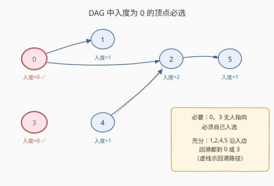
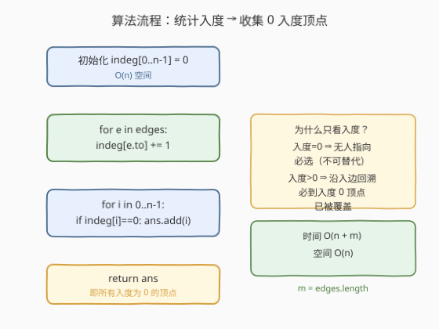
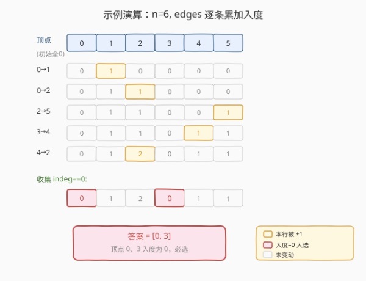

# 可以到达所有节点的最少顶点数目

- **题目名称**：可以到达所有节点的最少顶点数目
- **链接**：[1557. 可以到达所有节点的最少顶点数目](https://leetcode.cn/problems/minimum-number-of-vertices-to-reach-all-nodes/)
- **难度**：中等
- **标签**：图、有向无环图、入度、贪心

## 1. 题目概述

给定一个**有向无环图（DAG）**，包含 `n` 个编号为 `0` 到 `n-1` 的顶点，以及边数组 `edges`，其中 `edges[i] = [from_i, to_i]` 表示一条从 `from_i` 指向 `to_i` 的有向边。求**最小的顶点集合**，使得从该集合中的顶点出发，能够到达图中的**所有节点**。返回任意一个满足条件的最小集合即可。

**示例 1**：

```text
输入：n = 6, edges = [[0,1],[0,2],[2,5],[3,4],[4,2]]
输出：[0,3]
解释：从 0 出发可到 0,1,2,5；从 3 出发可到 3,4,2,5。并集覆盖全部 0~5。
```

**示例 2**：

```text
输入：n = 5, edges = [[0,1],[2,1],[3,1],[1,4],[2,4]]
输出：[0,2,3]
解释：0,2,3 均无人指向，必须各自放入集合；1、4 可由它们到达。
```

**约束条件**：

- $2 \le n \le 10^5$
- $1 \le \text{edges.length} \le \min(10^5,\ \frac{n(n-1)}{2})$
- 边无重复、无自环，且保证图为**有向无环图**
- 可返回任意一个最小集合，答案唯一

---

## 2. 解题思路

### 2.1 暴力思路：枚举顶点子集？

从 $n$ 个顶点中枚举所有子集，对每个子集做一次 BFS/DFS 验证可达性。子集数 $2^n$，`n = 10^5` 时完全不可行；即便 $n = 20$，$2^{20} \approx 10^6$ 也已偏大。

> 💡 转换视角：不要「选谁去覆盖别人」，而要问「**谁必须被选，因为没有别人能覆盖它**」——这就是**入度为 0** 的顶点。

### 2.2 核心观察：入度为 0 的顶点必选



**关键性质**：在有向无环图中，**入度为 0 的顶点集合**就是答案。理由如下：

1. **必要性**：若顶点 $u$ 的入度为 0，则没有任何边指向 $u$，即没有任何其他顶点能到达 $u$。因此 $u$ **必须**放入答案集合，否则 $u$ 不可达。

2. **充分性**：对于任意入度 $> 0$ 的顶点 $v$，它至少有一条入边 $(u \to v)$，即 $u$ 可到达 $v$。沿着入边不断回溯，由于图是 **DAG（无环）**，回溯路径必定终止于某个入度为 0 的顶点 $w$——而 $w$ 已在答案集合中，故 $v$ 可由 $w$ 到达。

> ⚠️ **为什么 DAG 是关键**：若图有环，环上每个顶点都有入度 $>0$，回溯会在环内打转永远到不了入度 0 的点，结论失效。本题保证无环，故此性质成立。

> 💡 **一句话**：答案 = 所有入度为 0 的顶点。问题从「集合覆盖」退化成「数入度」。

### 2.3 算法流程图



### 2.4 示例演算

以示例 1 `n = 6, edges = [[0,1],[0,2],[2,5],[3,4],[4,2]]` 为例：



| 顶点 | 入边来源 | 入度 | 是否入选 |
|------|---------|------|---------|
| 0 | — | 0 | ✅ |
| 1 | 0 | 1 | ❌ |
| 2 | 0, 4 | 2 | ❌ |
| 3 | — | 0 | ✅ |
| 4 | 3 | 1 | ❌ |
| 5 | 2 | 1 | ❌ |

最终答案 `[0, 3]`。验证：0→{1,2,5}，3→{4,2,5}，并集 = {0,1,2,3,4,5} 全覆盖。

---

## 3. 参考代码

### C++

```cpp
class Solution {
  public:
    vector<int> findSmallestSetOfVertices(int n, vector<vector<int>>& edges) {
        vector<int> indeg(n, 0);
        for (auto& e : edges) indeg[e[1]]++;   // 只需统计入度

        vector<int> ans;
        for (int i = 0; i < n; ++i)
            if (indeg[i] == 0) ans.push_back(i);
        return ans;
    }
};
```

### Python

```python
class Solution:
    def findSmallestSetOfVertices(self, n: int, edges: List[List[int]]) -> List[int]:
        indeg = [0] * n
        for _, v in edges:
            indeg[v] += 1
        return [i for i in range(n) if indeg[i] == 0]
```

> 💡 **进一步优化空间**：用 `bitset` 或 `bool` 数组代替 `int` 入度表——只需标记「是否被指向过」，未标记者即入度 0。但 $n \le 10^5$ 下 `int` 数组已足够快，可读性更好。

---

## 4. 复杂度分析

| 维度 | 复杂度 | 说明 |
|------|--------|------|
| 时间复杂度 | $O(n + m)$ | 遍历 $m$ 条边累加入度 $O(m)$，再扫一遍 $n$ 个顶点收集答案 $O(n)$ |
| 空间复杂度 | $O(n)$ | 入度数组长度 $n$（不计返回的答案数组） |

其中 $m = \text{edges.length}$。本题 $n, m \le 10^5$，$O(n+m)$ 轻松通过。

---

## 5. 扩展：如果图不是 DAG？

本题保证无环，结论才成立。若图可能含环，则需用**强连通分量（SCC）缩点**：

1. 用 Tarjan 或 Kosaraju 求 SCC，把每个 SCC 压缩成一个超级节点，得到一张**缩点后的 DAG**。
2. 在缩点后的 DAG 上，**入度为 0 的超级节点**对应的 SCC 中任取一个原顶点，即为答案。

> 💡 这是因为环内任一顶点都能互相到达，选一个代表即可；缩点后问题退化为 DAG，回到本题套路。相关题目见 [802. 找到最终的安全态](https://leetcode.cn/problems/find-eventual-safe-states/)（反向拓扑排序）。

---

## 6. 面试要点

1. **为什么答案是所有入度为 0 的顶点？**

   - **必要**：入度为 0 的顶点无人指向，必须自己入选，否则不可达。
   - **充分**：入度 $>0$ 的顶点沿入边回溯，因 DAG 无环必终止于某个入度 0 顶点，而该顶点已在答案中，故可达。

2. **为什么必须是无环图？给个反例。**

   - 若有环 `0→1→2→0`，三个顶点入度均为 1，按本算法答案为空集，但显然无法覆盖任何顶点。无环性保证回溯不会在环内打转。

3. **需要建邻接表吗？**

   - 不需要。本题只统计**入度**，遍历 `edges` 时对 `to` 端 `+1` 即可，连出边信息都不必存。这是「只问度数不问路径」的简化。

4. **答案是否唯一？**

   - **唯一**。入度为 0 的顶点集合由图结构唯一确定，故答案唯一（顺序可不同）。

5. **如果要求返回字典序最小的集合呢？**

   - 答案集合本身唯一，按顶点编号升序收集即为字典序最小，无需额外排序。

---

## 7. 同类练习题

- [547. 省份数量](https://leetcode.cn/problems/number-of-provinces/)：无向图连通分量，并查集或 DFS，与本题的「入度」互补，是图论度数统计的另一面
- [207. 课程表](https://leetcode.cn/problems/course-schedule/)：拓扑排序判 DAG 可行性，本题是其「找起点」的简化版
- [802. 找到最终的安全状态](https://leetcode.cn/problems/find-eventual-safe-states/)：反向图 + 拓扑排序，求不陷入环的节点，DAG 性质进阶
- [997. 找到小镇的法官](https://leetcode.cn/problems/find-the-town-judge/)：入度 - 出度判定，与本题同为「度数即答案」的套路
