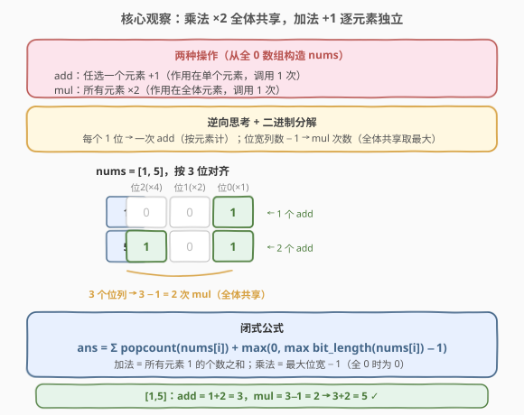
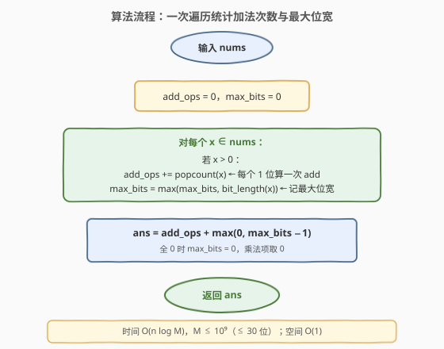
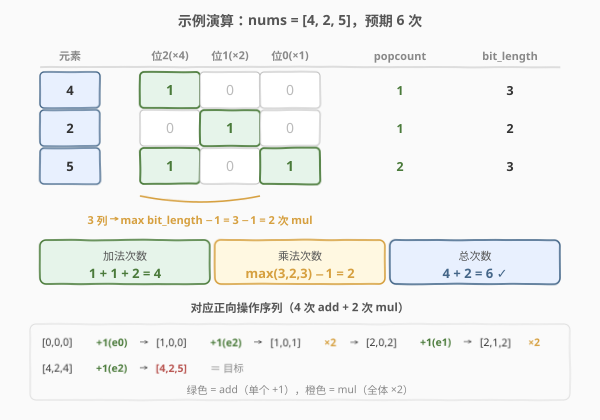

# LeetCode 得到目标数组的最少函数调用次数 题解

## 1. 题目概述

- **标题 / 题号**：得到目标数组的最少函数调用次数（#1558，medium）
- **链接**：https://leetcode.cn/problems/minimum-numbers-of-function-calls-to-make-target-array/
- **难度**：中等
- **标签**：贪心、位运算、数学

**题意**：给定目标数组 `nums`，初始数组 `arr` 与 `nums` 等长且全为 `0`。只允许调用以下两种函数：

1. **add**：任选 `arr` 中的一个元素，将其 **+1**（作用在单个元素上）；
2. **mul**：将 `arr` 中**所有元素**同时 **×2**（作用在全体元素上）。

返回把 `arr` 变成 `nums` 的**最少函数调用次数**。答案保证在 32 位有符号整数范围内。

**示例 1**：

```text
输入：nums = [1,5]
输出：5
解释：+1(第二个) -> [0,1]；×2 -> [0,2] -> [0,4]；+1(两个) -> [1,4] -> [1,5]。共 1+2+2=5 次。
```

**示例 2**：

```text
输入：nums = [2,2]
输出：3
解释：+1(两个) -> [1,1]；×2 -> [2,2]。共 2+1=3 次。
```

**示例 3**：

```text
输入：nums = [4,2,5]
输出：6
```

**约束**：

- $1 \le \text{nums.length} \le 10^5$
- $0 \le \text{nums}[i] \le 10^9$

> ⚠️ 关键不对称：**add 作用在单个元素**，**mul 作用在全体元素**。mul 是"共享"的——一次 ×2 同时推进所有元素，代价被全体分摊。

## 2. 解题思路

### 2.1 暴力思路

正向 BFS：从全 0 数组出发，每步要么对某元素 +1（$n$ 种选择），要么全体 ×2（1 种选择），搜索到达 `nums` 的最短步数。

问题在于状态空间：每个元素取值可达 $10^9$，$n$ 个元素组成的状态数是 $(10^9)^n$，完全不可行。

> 💡 转换视角：**逆向思考**——从 `nums` 倒推回全 0。逆向操作只有两种：奇数元素 −1（撤销单个 add），全体偶数则 ÷2（撤销 mul）。这立刻暴露了 add/mul 的不对称结构。

### 2.2 核心观察：乘法共享、加法独立 —— 二进制分解



**逆向操作的两个性质**：

| 逆向操作 | 撤销的正向操作 | 作用范围 | 触发条件 |
|----------|---------------|---------|---------|
| 奇数元素 −1 | add（+1 单个） | **单个元素** | 该元素为奇数 |
| 全体 ÷2 | mul（×2 全体） | **全体元素** | 所有元素都为偶数 |

由此得到两条关键结论：

1. **加法次数 = 所有元素二进制中 1 的总数**。每次 −1 消除一个元素的最低位 1，等价于把该数的一个 1 位变 0。因此每个元素 $x$ 贡献 $\text{popcount}(x)$ 次 add。
2. **乘法次数 = 最大位宽 − 1**。每次 ÷2 把所有元素右移一位，能进行 ÷2 的次数等于**最大元素的二进制位数 − 1**（位宽为 $b$ 的数需要 $b-1$ 次右移才能变成 1，再 −1 归零）。由于 ÷2 作用于全体，**只取决于最大的那个元素**，其余元素"搭便车"。

> 💡 **为什么是"最大位宽"而非"所有元素位宽之和"？** mul 作用于全体，是"共享"操作：一次 ×2 同时推进所有元素。只要还有一个元素没归零，就需要继续 ÷2（前提当前全偶）。位宽最大的元素决定了 ÷2 的总轮数；位宽小的元素在归零后保持 0，而 $0 \div 2 = 0$，不增加额外 mul。

综上得到闭式公式：

$$\text{ans} = \sum_{i} \text{popcount}(\text{nums}[i]) \;+\; \max\big(0,\; \max_i \text{bit\_length}(\text{nums}[i]) - 1\big)$$

其中外层 $\max(0,\cdot)$ 处理全 0 数组（此时加法、乘法均为 0）。

### 2.3 算法流程图



一次遍历：对每个非零元素累加其 popcount，并维护最大位宽；最后用公式求和。

### 2.4 示例演算

以 `nums = [4, 2, 5]` 为例，将各元素按 3 位二进制对齐：



| 元素 | 二进制 | popcount（add 次数） | bit_length |
|------|--------|---------------------|------------|
| 4 | `100` | 1 | 3 |
| 2 | `010` | 1 | 2 |
| 5 | `101` | 2 | 3 |
| **合计 / 最值** | — | **4** | **max = 3** |

- 加法次数 = $1 + 1 + 2 = 4$
- 乘法次数 = $\max(3, 2, 3) - 1 = 2$
- **总次数** $= 4 + 2 = 6$ ✓

对应的正向操作序列（与官方解释一致）：

```text
[0,0,0] --+1(e0)--> [1,0,0] --+1(e2)--> [1,0,1] --×2--> [2,0,2]
        --+1(e1)--> [2,1,2] --×2--> [4,2,4] --+1(e2)--> [4,2,5]
```

恰好 4 次 add + 2 次 mul = 6 次。

## 3. 参考代码

### C++

```cpp
class Solution {
  public:
    int minOperations(vector<int>& nums) {
        int addOps = 0, maxBits = 0;
        for (int x : nums) {
            if (x == 0) continue;
            addOps += __builtin_popcount(x);
            maxBits = max(maxBits, 32 - __builtin_clz(x));  // bit_length
        }
        return addOps + max(0, maxBits - 1);
    }
};
```

> 💡 `32 - __builtin_clz(x)` 等价于 `bit_length(x)`（最高位 1 的位置 +1）。也可手写循环数位，但内置函数最快。

### Python

```python
class Solution:
    def minOperations(self, nums: List[int]) -> int:
        add_ops = 0
        max_bits = 0
        for x in nums:
            if x == 0:
                continue
            add_ops += x.bit_count()   # Python 3.10+，等价于 bin(x).count('1')
            max_bits = max(max_bits, x.bit_length())
        return add_ops + max(0, max_bits - 1)
```

> ⚠️ 若 Python 版本低于 3.10，用 `bin(x).count('1')` 代替 `x.bit_count()`。

## 4. 复杂度分析

| 维度 | 复杂度 | 说明 |
|------|--------|------|
| 时间复杂度 | $O(n \log M)$ | 遍历 $n$ 个元素，每个计算 popcount 与 bit_length 为 $O(\log M)$，$M = 10^9$ 即 $\le 30$ 位 |
| 空间复杂度 | $O(1)$ | 仅用常数个变量 |

> 💡 popcount 在硬件层面常为单条指令（如 x86 的 `POPCNT`），实际近似 $O(n)$。即使软件实现，每元素也仅 30 次位运算，$n = 10^5$ 时约 $3 \times 10^6$ 次操作，毫秒级。

## 5. 扩展：逆向贪心模拟

除了闭式公式，也可直接**模拟逆向过程**——无需推导 popcount 公式，逻辑更直观：

```python
class Solution:
    def minOperations(self, nums: List[int]) -> int:
        ans = 0
        while any(nums):
            has_odd = False
            for i in range(len(nums)):
                if nums[i] % 2 == 1:      # 奇数：-1 撤销 add
                    nums[i] -= 1
                    ans += 1
                    has_odd = True
            if not has_odd and any(nums): # 全偶且非全 0：÷2 撤销 mul
                for i in range(len(nums)):
                    nums[i] //= 2
                ans += 1
        return ans
```

| 维度 | 闭式公式 | 逆向模拟 |
|------|---------|---------|
| 时间 | $O(n \log M)$ | $O(n \log M)$ |
| 空间 | $O(1)$（不改输入） | $O(1)$（原地改输入） |
| 思维难度 | 需推导 popcount / bit_length | 直接模拟，易解释 |
| 推荐 | **面试首选**（一次遍历） | 备选 / 讲思路用 |

> 💡 逆向模拟的循环次数 = 最大位宽（$\le 30$），每轮扫描 $n$ 个元素，故同样 $O(n \log M)$。两种方法复杂度一致，但闭式公式常数更小、且不修改输入。

## 6. 面试要点

1. **为什么 mul 的次数取决于最大位宽而非所有元素位宽之和？**
   - mul 作用于**全体元素**，是"共享"操作。一次 ×2 同时推进所有元素，因此只需统计"需要多少轮 ÷2 才能让最大元素归零"，即 $\max(\text{bit\_length}) - 1$。位宽小的元素归零后保持 0，$0 \div 2 = 0$，不增加额外 mul。

2. **为什么 add 的次数等于 popcount 之和？**
   - 每次 add +1 作用于单个元素。逆向看，÷2 只能消除末尾的 0，遇到 1 必先 −1。因此元素 $x$ 的每个 1 位恰好对应一次 −1，共 $\text{popcount}(x)$ 次 add，各元素独立累加。

3. **全 0 数组怎么处理？**
   - 公式中 `max(0, maxBits - 1)`：全 0 时 `maxBits` 保持 0，乘法项为 $\max(0, -1) = 0$；加法项也为 0。返回 0，正确（无需任何操作）。

4. **为什么不能正向 BFS？**
   - 正向状态是整个数组的快照，取值空间 $(10^9)^n$，爆炸。逆向 + 二进制分解把"数组状态"压缩为"每个元素的位信息"，状态从指数级降为线性。

5. **逆向贪心模拟和闭式公式哪个更好？**
   - 复杂度同为 $O(n \log M)$。闭式公式一次遍历、不修改输入、常数小，是面试首选；逆向模拟逻辑直观，适合先讲思路再优化到公式。

## 同类练习题

| # | 题目 | 与本题的关联 |
|---|------|-------------|
| 1526 | [形成目标数组的子数组最少增加次数](https://leetcode.cn/problems/minimum-number-of-increments-on-subarrays-to-form-a-target-array/)（[题解](../1501-1600/1526_形成目标数组的子数组最少增加次数.md)） | 同样是"从全 0 构造目标数组"的最少操作，但操作是"子数组全体 +1"，用差分思想，对照本题"单点 +1 / 全体 ×2" |
| 1551 | [使数组中所有元素相等的最小操作数](https://leetcode.cn/problems/minimum-operations-to-make-array-equal/)（[题解](../1501-1600/1551_使数组中所有元素相等的最小操作数.md)） | 贪心 + 数学闭式公式，同样把模拟优化为 $O(1)$ |
| 191 | [位 1 的个数](https://leetcode.cn/problems/number-of-1-bits/)（[题解](../0001-0100/191_位1的个数.md)） | popcount 基本功，`n & (n-1)` 消最低位 1，是本题加法计数的核心原语 |
| 29 | [两数相除](https://leetcode.cn/problems/divide-two-integers/)（[题解](../0001-0100/29_两数相除.md)） | 位运算左移翻倍模拟除法，与本题"×2 推进位宽"同属位运算加速家族 |
| 231 | [2 的幂](https://leetcode.cn/problems/power-of-two/)（[题解](../0201-0300/231_2的幂.md)） | `n & (n-1) == 0` 判单 1，bit_length 与 popcount 的退化特例 |
