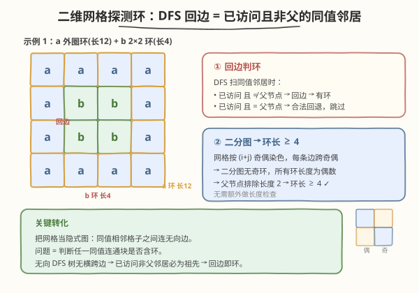
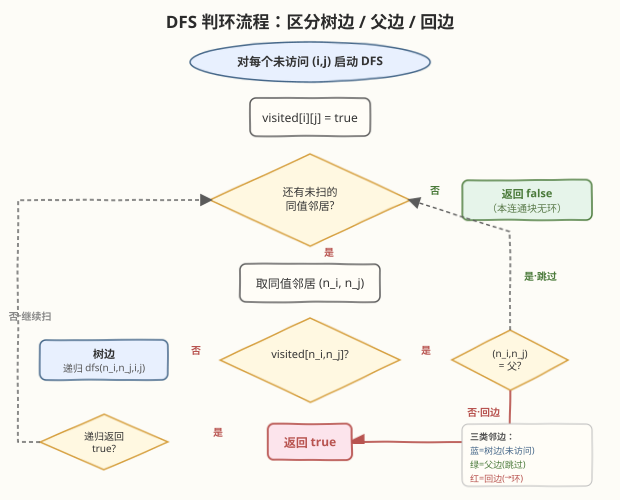
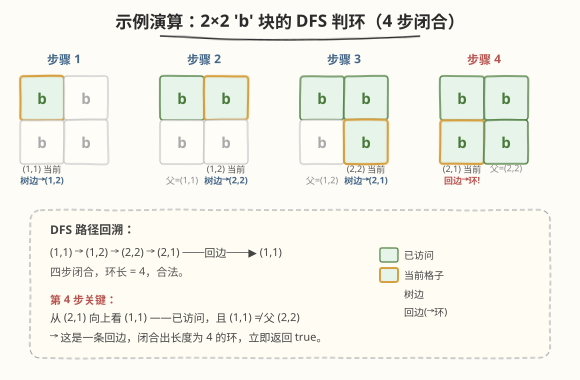

# LeetCode 二维网格图中探测环 题解

## 1. 题目概述

- **标题 / 题号**：二维网格图中探测环（#1559，medium）
- **链接**：https://leetcode.cn/problems/detect-cycles-in-2d-grid/
- **难度**：中等
- **标签**：深度优先搜索、图、二维网格、并查集

**题意**：给定一个 $m \times n$ 的二维字符网格 `grid`（仅含小写字母），判断其中是否存在由**相同值**的格子构成的**环**。

**环的定义**：

- 一条**起点和终点为同一格子**的路径，路径长度 **$\ge 4$**；
- 每一步只能移动到上、下、左、右四个相邻格子，且**相邻格子值必须相同**；
- **不能回到上一次移动时所在的格子**（即不能立即原路返回，例如 `(1,1) → (1,2) → (1,1)` 非法）；
- 路径中除起点=终点外，其余格子不重复。

**示例 1**：

```text
输入：grid = [["a","a","a","a"],
              ["a","b","b","a"],
              ["a","b","b","a"],
              ["a","a","a","a"]]
输出：true
解释：外圈 'a' 构成一个长度为 12 的环；中间 2×2 的 'b' 也构成一个长度为 4 的环。
```

**示例 2**：

```text
输入：grid = [["c","c","c","a"],
              ["c","d","c","c"],
              ["c","c","e","c"],
              ["f","c","c","c"]]
输出：true
解释：'c' 字符的连通块中存在一个长度为 12 的合法环。
```

**示例 3**：

```text
输入：grid = [["a","b","b"],
              ["b","z","b"],
              ["b","b","a"]]
输出：false
解释：'b' 字符围成一个"C"形（缺两个角），是树形结构，无环。
```

**约束**：

- $m = \text{grid.length}$，$n = \text{grid[i].length}$
- $1 \le m \le 500$，$1 \le n \le 500$
- `grid` 只包含小写英文字母

> ⚠️ 网格规模可达 $500 \times 500 = 2.5 \times 10^5$，要求 $O(m \cdot n)$ 级别的解法。同时最坏情况下单个连通块可退化成长蛇形路径，递归深度可达 $2.5 \times 10^5$——需注意栈溢出风险（见第 5 节）。

## 2. 解题思路

### 2.1 暴力思路

把每个格子看作图节点，**同值相邻格子之间连无向边**。问题等价于：判断任意一个同值连通块中是否存在环。

- 暴力做法：对每个连通块，枚举所有简单路径判断是否首尾相接——组合爆炸，完全不可行。
- 通用做法：**在无向图上做 DFS，利用「回边」判定环**。无向图 DFS 中，若访问某节点时发现其相邻节点「已访问且不是父节点」，则存在环。

> 💡 这正是无向图判环的标准模板。本题的关键只在两点：(1) 只在同值格子之间连边；(2) 用**父节点坐标**排除「立即原路返回」的伪环。

### 2.2 核心观察：DFS + 父节点跟踪



**把网格当作隐式图。** 对每个未访问格子 $(i, j)$ 启动 DFS，只走向**同值**的四邻位。DFS 传入**父节点坐标** $(p_i, p_j)$，到达某格子时扫描其同值邻居：

| 邻居状态 | 判定 | 动作 |
|----------|------|------|
| 未访问 | 树边 | 递归深入，父节点 = 当前格子 |
| 已访问 **且** 是父节点 | 合法回退边 | 跳过（这是「不能回到上一次格子」的排除） |
| 已访问 **且** 不是父节点 | **回边** | **发现环，返回 `true`** |

> 💡 **为什么「已访问且非父」一定是环？** 在无向图的 DFS 树中，**不存在横跨边（cross edge）**——每条非树边都是指向祖先的**回边**。所以遇到一个已访问的非父邻居，它一定是当前 DFS 路径上的某个祖先；从当前格子沿 DFS 路径回溯到该祖先，再走这条回边，就闭合出一个环。

**为什么环长度一定 $\ge 4$？** 这是网格图的**二分性**保证的：

- 把格子按 $(i + j)$ 的奇偶性**着色**（棋盘染色）：每条四邻位边必然连接**不同奇偶**的格子。
- 二分图**不存在奇数长度的环**，所以所有环长度都是偶数。
- 父节点检查排除了长度为 2 的「立即往返」伪环（而且网格是简单图，本就不存在重边）；
- 偶数且 $> 2$ ⟹ $\ge 4$。

> ⚠️ 因此**无需额外做环长度检查**——只要回边触发，长度天然 $\ge 4$。这是本题最优雅的地方。

### 2.3 算法流程图



**算法步骤**：

1. 维护 `visited[i][j]` 标记数组，初始化为 `false`。
2. 遍历每个格子 $(i, j)$：若未访问，以其为起点启动 DFS（父节点设为 $(-1, -1)$ 表示无父）。
3. DFS $(i, j, p_i, p_j, c)$：
   - 标记 `visited[i][j] = true`。
   - 枚举四邻位 $(n_i, n_j)$：越界或不同值则跳过。
   - 若未访问 ⟹ 递归 `dfs(n_i, n_j, i, j, c)`，返回 `true` 则向上传 `true`。
   - 若已访问且 $(n_i, n_j) \ne (p_i, p_j)$ ⟹ 返回 `true`（发现环）。
   - 四邻位扫完未命中 ⟹ 返回 `false`。
4. 所有连通块均未发现环 ⟹ 返回 `false`。

### 2.4 示例演算

以示例 1 中间 $2 \times 2$ 的 `'b'` 块为例（坐标从 0 起），演示 DFS 如何在 4 步内发现长度为 4 的环：



| 步骤 | 当前格子 | 父节点 | 扫描同值邻居 | 动作 |
|------|----------|--------|--------------|------|
| 1 | (1,1) 'b' | (−1,−1) | (1,2) 未访问 | 标记 visited，递归进入 (1,2) |
| 2 | (1,2) 'b' | (1,1) | (2,2) 未访问（(1,1) 是父，跳过） | 递归进入 (2,2) |
| 3 | (2,2) 'b' | (1,2) | (2,1) 未访问（(1,2) 是父，跳过） | 递归进入 (2,1) |
| 4 | (2,1) 'b' | (2,2) | **(1,1) 已访问且非父** | **回边！返回 true** ✓ |

> 💡 第 4 步是关键：从 (2,1) 看向上方的 (1,1)，它已访问、且不是 (2,1) 的父节点 (2,2)——这正是闭合 $2 \times 2$ 方块的回边。回溯路径 `(1,1)→(1,2)→(2,2)→(2,1)` 加上回边 `(2,1)→(1,1)`，环长 4，合法。

## 3. 参考代码

### C++

```cpp
class Solution {
  public:
    bool containsCycle(vector<vector<char>>& grid) {
        int m = grid.size(), n = grid[0].size();
        vector<vector<char>> visited(m, vector<char>(n, 0));
        // 四方向：上、下、左、右
        const int dx[4] = {-1, 1, 0, 0};
        const int dy[4] = {0, 0, -1, 1};

        // 递归 DFS：返回当前连通块是否含环
        // (pi, pj) 为父节点坐标，起点传 (-1, -1)
        function<bool(int, int, int, int)> dfs =
            [&](int i, int j, int pi, int pj) -> bool {
            visited[i][j] = 1;
            for (int k = 0; k < 4; ++k) {
                int ni = i + dx[k], nj = j + dy[k];
                if (ni < 0 || ni >= m || nj < 0 || nj >= n) continue;
                if (grid[ni][nj] != grid[i][j]) continue;     // 只走同值
                if (!visited[ni][nj]) {
                    if (dfs(ni, nj, i, j)) return true;       // 树边：递归深入
                } else if (ni != pi || nj != pj) {
                    return true;                              // 回边：发现环
                }
            }
            return false;
        };

        for (int i = 0; i < m; ++i)
            for (int j = 0; j < n; ++j)
                if (!visited[i][j] && dfs(i, j, -1, -1))
                    return true;
        return false;
    }
};
```

### Python

```python
class Solution:
    def containsCycle(self, grid: List[List[str]]) -> bool:
        m, n = len(grid), len(grid[0])
        visited = [[False] * n for _ in range(m)]
        dirs = [(-1, 0), (1, 0), (0, -1), (0, 1)]

        def dfs(i: int, j: int, pi: int, pj: int) -> bool:
            visited[i][j] = True
            for di, dj in dirs:
                ni, nj = i + di, j + dj
                if 0 <= ni < m and 0 <= nj < n and grid[ni][nj] == grid[i][j]:
                    if not visited[ni][nj]:
                        if dfs(ni, nj, i, j):
                            return True
                    elif (ni, nj) != (pi, pj):
                        return True
            return False

        for i in range(m):
            for j in range(n):
                if not visited[i][j] and dfs(i, j, -1, -1):
                    return True
        return False
```

> ⚠️ **Python 递归深度**：$500 \times 500$ 网格的连通块最坏可退化成长蛇形路径，递归深度达 $2.5 \times 10^5$，远超 Python 默认递归上限（1000）。提交时需 `import sys; sys.setrecursionlimit(300000)`。若仍担心 C 栈溢出（CPython 特性），可改用第 5 节的**迭代版 DFS** 或**并查集**解法。

## 4. 复杂度分析

| 维度 | 复杂度 | 说明 |
|------|--------|------|
| 时间复杂度 | $O(m \cdot n)$ | 每个格子仅在首次访问时进入 DFS 一次；每次访问扫描 4 个邻位，总操作数 $\le 4 \cdot m \cdot n$ |
| 空间复杂度 | $O(m \cdot n)$ | `visited` 数组 $O(m \cdot n)$；递归栈最坏 $O(m \cdot n)$（连通块退化为长蛇形路径时） |

> 💡 时空复杂度均为 $O(m \cdot n)$，与网格规模同阶，是本题的渐近下界——至少需要看完每个格子才能下结论。常数因子极小（每格 4 次邻位判断），实际运行很快。

## 5. 扩展：并查集解法（避免递归栈风险）

并查集（Union-Find）同样能在 $O(m \cdot n \cdot \alpha)$ 时间内判环，且**完全迭代、无栈溢出风险**，是递归 DFS 的稳健替代。

**思路**：把每个格子视作一个元素，逐格向**右、下**两个方向检查同值邻居（只看右、下是为了让每条无向边只被处理一次，避免重复）：

- 若两格同值且**已在同一集合** ⟹ 出现第二条连接它们的路径 ⟹ **有环**；
- 否则将两格 `union` 合并。

> 💡 **为什么「已在同一集合」就一定有环？** 并查集维护的是连通关系。若 $(i,j)$ 与 $(n_i,n_j)$ 已连通，说明之前已有一条路径连接它们；现在又发现一条直接相邻的边——两条不同路径构成环。又因网格是二分图、且每条边只处理一次（无重边），所成环长度天然 $\ge 4$，与 DFS 版同理。

### C++

```cpp
class Solution {
  public:
    bool containsCycle(vector<vector<char>>& grid) {
        int m = grid.size(), n = grid[0].size();
        vector<int> parent(m * n);
        iota(parent.begin(), parent.end(), 0);
        auto find = [&](int x) {
            while (parent[x] != x) {
                parent[x] = parent[parent[x]];   // 路径压缩
                x = parent[x];
            }
            return x;
        };
        for (int i = 0; i < m; ++i)
            for (int j = 0; j < n; ++j) {
                int cur = i * n + j;
                // 只看右、下，避免每条边处理两次
                if (i + 1 < m && grid[i + 1][j] == grid[i][j]) {
                    int nxt = (i + 1) * n + j;
                    int ra = find(cur), rb = find(nxt);
                    if (ra == rb) return true;    // 已连通 → 环
                    parent[ra] = rb;
                }
                if (j + 1 < n && grid[i][j + 1] == grid[i][j]) {
                    int nxt = i * n + (j + 1);
                    int ra = find(cur), rb = find(nxt);
                    if (ra == rb) return true;
                    parent[ra] = rb;
                }
            }
        return false;
    }
};
```

> 💡 **DFS vs 并查集**：DFS 直观体现「回边判环」的图论思想，代码更短；并查集完全迭代、无栈溢出风险，适合极大规模网格。两者复杂度同阶，按场景选用。本题 LeetCode 测试数据下两者均能通过。

## 6. 面试要点

1. **为什么用父节点坐标就能排除「立即原路返回」？**

   - 网格是简单无向图，每个格子有唯一坐标。DFS 进入 $(i,j)$ 时记录其来源 $(p_i, p_j)$，扫描邻居时若邻居恰好是 $(p_i, p_j)$ 即「上一次所在格子」，跳过即可。这比维护「上一步方向」更不易出错——坐标比较是精确的。

2. **为什么不需要显式判断环长度 $\ge 4$？**

   - 网格图是**二分图**（按 $(i+j)$ 奇偶染色，所有边跨奇偶），二分图无奇环；父节点检查排除了长度 2 的往返伪环；故任何回边对应的环长度必为 $\ge 4$ 的偶数。这是「网格 + 同值边」结构赋予的免费性质。

3. **DFS 中遇到已访问邻居，会不会是「已完成的兄弟分支」而非祖先？**

   - 不会。**无向图的 DFS 树不存在横跨边（cross edge）**，所有非树边都是指向祖先的回边。若存在边 $(u, v)$ 且 $v$ 已访问、非父，则 $v$ 必是 $u$ 的祖先——否则在更早访问 $v$ 时就会沿这条边把 $u$ 收为 $v$ 的子节点，而非等到现在才发现。这是无向 DFS 与有向 DFS 的关键区别。

4. **为什么并查集版只看「右、下」两个方向？**

   - 无向边 $(u, v)$ 会在 $u$ 的右/下扫描和 $v$ 的左/上扫描中各出现一次。若四个方向全扫，每条边被处理两次，第二次必然发现「已连通」而**误判为环**。只扫右、下保证每条边处理一次，逻辑等价且无重复。

5. **极端长蛇形连通块会导致 DFS 栈溢出吗？如何应对？**

   - 会。$500 \times 500$ 网格的连通块最坏退化成蛇形路径，递归深度 $2.5 \times 10^5$。Python 默认递归上限 1000，需 `setrecursionlimit`；CPython 即使提上限仍可能因 C 栈不足而段错误。C++ 默认栈 8MB 也可能不够。稳健方案是改用**并查集**或**显式栈迭代 DFS**（栈帧需额外记录「下一个待探方向索引」以正确跳过已探子节点）。

## 同类练习题

| # | 题目 | 与本题的关联 |
|---|------|-------------|
| 200 | [岛屿数量](https://leetcode.cn/problems/number-of-islands/) | 二维网格 DFS 的母题，同值/同标记连通块的遍历模板，本题在其基础上加「父节点跟踪」判环 |
| 1254 | [统计封闭岛屿的数目](https://leetcode.cn/problems/number-of-closed-islands/)（[题解](../1201-1300/1254_统计封闭岛屿的数目.md)） | 网格 DFS + 边界连通判定，与本题同属「网格图 DFS」家族 |
| 684 | [冗余连接](https://leetcode.cn/problems/redundant-connection/)（[题解](../0601-0700/684_冗余连接.md)） | 并查集判环的经典题，本题并查集解法的思路源头——`find(u)==find(v)` 即环 |
| 547 | [省份数量](https://leetcode.cn/problems/number-of-provinces/)（[题解](../0501-0600/547_省份数量.md)） | 并查集连通分量计数，理解 `union` / `find` 模板后再来看本题并查集版 |
| 785 | [判断二分图](https://leetcode.cn/problems/is-bipartite-graph/)（[题解](../0701-0800/785_判断二分图.md)） | 二分图着色判定，本题「环长度必为偶数」的结论正源于网格图的二分性 |
