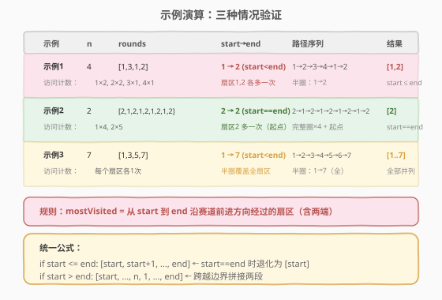

# LeetCode 圆形赛道上经过次数最多的扇区 题解

## 1. 题目概述

- **标题 / 题号**：圆形赛道上经过次数最多的扇区（#1560，easy）
- **链接**：https://leetcode.cn/problems/most-visited-sector-in-a-circular-track/
- **难度**：简单
- **标签**：数组、模拟、数学

**题意**：给你一个整数 `n` 和一个整数数组 `rounds`。有一条圆形赛道由 `n` 个扇区组成，扇区编号从 `1` 到 `n`。马拉松全程由 `m` 个阶段组成，第 `i` 个阶段从扇区 `rounds[i-1]` 开始，到扇区 `rounds[i]` 结束。赛道按扇区编号升序逆时针形成圆。请返回经过次数最多的扇区，按编号升序排列。

**示例 1**：

```text
输入：n = 4, rounds = [1,3,1,2]
输出：[1,2]
解释：路径 1→2→3（阶段1）→4→1（阶段2）→2（阶段3）
扇区 1 和 2 都经过 2 次，扇区 3 和 4 各 1 次。
```

**示例 2**：

```text
输入：n = 2, rounds = [2,1,2,1,2,1,2,1,2]
输出：[2]
解释：路径 2→1→2→1→2→1→2→1→2，扇区 2 经过 5 次，扇区 1 经过 4 次。
```

**示例 3**：

```text
输入：n = 7, rounds = [1,3,5,7]
输出：[1,2,3,4,5,6,7]
解释：路径 1→2→3→4→5→6→7，每个扇区各经过 1 次，全部并列最多。
```

**约束**：

- `2 <= n <= 100`
- `1 <= m <= 100`
- `rounds.length == m + 1`
- `1 <= rounds[i] <= n`
- `rounds[i] != rounds[i + 1]`（相邻阶段端点不同）

> 💡 本题数据规模极小（$n, m \le 100$），暴力模拟即可通过。但题目隐藏了一个优美的数学结构——**只有起点 `rounds[0]` 和终点 `rounds[-1]` 决定答案**，中间途径点完全不影响结果。掌握这个观察可以将解法从 $O(n \cdot m)$ 优化到 $O(n)$。

## 2. 解题思路

### 2.1 暴力思路：逐阶段模拟访问

最直观的做法是：对每个阶段，从 `rounds[i-1]` 出发，逐个扇区前进到 `rounds[i]`，用一个计数数组 `cnt[1..n]` 累加每个扇区的访问次数。最后取最大值对应的扇区集合。

```text
cnt = [0] * (n + 1)
for i in 1..m:
    cur = rounds[i-1]
    while cur != rounds[i]:
        cnt[cur]++
        cur = cur % n + 1
    cnt[rounds[i]]++
取 cnt 中最大值对应的扇区
```

- 每个阶段最多绕一整圈（$n$ 步），共 $m$ 个阶段，时间 $O(n \cdot m)$。
- 空间 $O(n)$。

> 💡 暴力法能过，但完全没有利用题目结构。我们观察一下：**中间的途径点 `rounds[1], rounds[2], ..., rounds[m-1]` 真的影响最终结果吗？**

### 2.2 核心观察：只有起点和终点决定答案


将圆形赛道「展开」为线性，整个马拉松的路径等价于：**若干完整圈 + 一段从 `rounds[0]` 到 `rounds[-1]` 的半圈**。

$$\text{总路径} = \underbrace{k \text{ 个完整圈}}_{\text{每个扇区各访问 } k \text{ 次}} + \underbrace{\text{从 start 到 end 的半圈}}_{\text{这些扇区各多访问 1 次}}$$

- **完整圈**：每个扇区被均等访问，不产生差异。
- **半圈**：从 `start` 沿前进方向到 `end`（含两端），这些扇区比其他扇区多访问一次。

因此，**经过次数最多的扇区 = 从 `rounds[0]` 到 `rounds[-1]` 沿赛道前进方向经过的所有扇区**。

> ⚠️ **为什么中间途径点不影响？** 从 `rounds[0]` 经 `rounds[1], rounds[2], ..., rounds[m-1]` 到 `rounds[-1]` 的总路径，其总前进距离等于各阶段距离之和。由于每个阶段都沿前进方向（编号递增模 $n$），总距离 telescopes 为 `(rounds[-1] - rounds[0] + k*n)`，其中 $k$ 为完整圈数。中间途径点只影响 $k$（完整圈数），不影响「半圈从哪到哪」。

### 2.3 算法流程图


根据 `start = rounds[0]` 与 `end = rounds[-1]` 的关系分三种情况：

| 情况 | 条件 | 最多访问扇区 | 示例 |
|------|------|-------------|------|
| **start ≤ end** | `rounds[0] <= rounds[-1]` | `[start, start+1, ..., end]` | start=1, end=2, n=4 → [1, 2] |
| **start > end** | `rounds[0] > rounds[-1]` | `[start, ..., n, 1, ..., end]` | start=3, end=1, n=4 → [3, 4, 1] |
| **start == end** | `rounds[0] == rounds[-1]` | `[start]`（start≤end 的特例） | start=2, end=2, n=4 → [2] |

> 💡 **start == end 的含义**：总路径恰好是整数个完整圈。起点扇区因作为初始位置被多访问一次，其余扇区均等。故最多访问的只有起点本身。这在 `start <= end` 的规则下自然退化为 `[start]`（`range(start, end+1)` 即 `[start]`）。

### 2.4 示例演算



以示例 1 `n=4, rounds=[1,3,1,2]` 为例：

| 阶段 | 路径 | 经过的扇区 |
|------|------|-----------|
| 阶段 1 | 1 → 3 | 1, 2, 3 |
| 阶段 2 | 3 → 1 | 4, 1 |
| 阶段 3 | 1 → 2 | 2 |

合并路径序列：`1 → 2 → 3 → 4 → 1 → 2`

| 扇区 | 访问次数 | 最多? |
|------|---------|-------|
| 1 | 2 | ✓ |
| 2 | 2 | ✓ |
| 3 | 1 | — |
| 4 | 1 | — |

`start=1, end=2`，`start < end` → `[1, 2]` ✓

> 💡 观察到路径 `1→2→3→4→1→2` 可以分解为：1 个完整圈（`1→2→3→4→1`，每扇区各 1 次）+ 半圈（`1→2`，扇区 1、2 各多 1 次）。半圈恰好是 start 到 end 的路径。

## 3. 参考代码

### 方法一：数学观察 $O(n)$（推荐）

### C++

```cpp
class Solution {
  public:
    vector<int> mostVisited(int n, vector<int>& rounds) {
        int start = rounds[0], end = rounds.back();
        vector<int> ans;
        if (start <= end) {
            for (int i = start; i <= end; ++i) ans.push_back(i);
        } else {
            for (int i = start; i <= n; ++i) ans.push_back(i);
            for (int i = 1; i <= end; ++i) ans.push_back(i);
        }
        return ans;
    }
};
```

### Python

```python
class Solution:
    def mostVisited(self, n: int, rounds: List[int]) -> List[int]:
        start, end = rounds[0], rounds[-1]
        if start <= end:
            return list(range(start, end + 1))
        else:
            return list(range(start, n + 1)) + list(range(1, end + 1))
```

> 💡 `start <= end` 已涵盖 `start == end` 的情况——此时 `range(start, end + 1)` 退化为 `[start]`，恰好是唯一最多访问的扇区。无需单独特判。

### 方法二：模拟 $O(n \cdot m)$（验证思路）

### C++

```cpp
class Solution {
  public:
    vector<int> mostVisited(int n, vector<int>& rounds) {
        vector<int> cnt(n + 1, 0);
        for (int i = 1; i < rounds.size(); ++i) {
            int cur = rounds[i - 1];
            cnt[cur]++;
            while (cur != rounds[i]) {
                cur = cur % n + 1;
                cnt[cur]++;
            }
        }
        int mx = *max_element(cnt.begin() + 1, cnt.end());
        vector<int> ans;
        for (int i = 1; i <= n; ++i)
            if (cnt[i] == mx) ans.push_back(i);
        return ans;
    }
};
```

### Python

```python
class Solution:
    def mostVisited(self, n: int, rounds: List[int]) -> List[int]:
        cnt = [0] * (n + 1)
        for i in range(1, len(rounds)):
            cur = rounds[i - 1]
            cnt[cur] += 1
            while cur != rounds[i]:
                cur = cur % n + 1
                cnt[cur] += 1
        mx = max(cnt[1:])
        return [i for i in range(1, n + 1) if cnt[i] == mx]
```

> 💡 模拟法用 `cur = cur % n + 1` 实现环形前进：当 `cur == n` 时 `n % n + 1 = 1`，绕回扇区 1。这是环形编号 1..n 的标准写法。

## 4. 复杂度分析

| 维度 | 方法一（数学） | 方法二（模拟） | 说明 |
|------|---------------|---------------|------|
| 时间复杂度 | $O(n)$ | $O(n \cdot m)$ | 数学法直接枚举 start→end 的扇区；模拟法每个阶段最多绕一圈 |
| 空间复杂度 | $O(1)$（不计返回值） | $O(n)$ | 数学法无额外空间；模拟法需 cnt 数组 |

> ⚠️ 本题 $n, m \le 100$，两种方法均可通过。但面试中应优先给出 $O(n)$ 的数学解法，展示对环形结构的洞察。若 $n$ 很大（如 $10^9$）而结果扇区数很少，数学法的优势更明显。

## 5. 扩展：环形编号的通用技巧

本题的环形编号 $1, 2, \ldots, n$（首尾相接）是 LeetCode 中常见的结构。几个通用技巧：

1. **环形前进**：`cur = cur % n + 1`（1-indexed）或 `cur = (cur + 1) % n`（0-indexed）。当到达 $n$ 时绕回 1（或从 $n-1$ 绕回 0）。

2. **环形距离**：从 $a$ 到 $b$ 沿前进方向的距离 $= (b - a + n) \% n$（$a \ne b$ 时）或 $n$（$a = b$ 时，需绕一整圈）。

3. **环形区间枚举**：
   - `start <= end`：直接 `range(start, end + 1)`
   - `start > end`：`range(start, n + 1) + range(1, end + 1)`（跨越边界拼接两段）

4. ** telescoping（望远镜求和）**：各段环形距离之和 $= \sum (rounds[i] - rounds[i-1] + n) \% n$，当所有段都沿前进方向时，中间项抵消，结果 $= (rounds[-1] - rounds[0] + k \cdot n)$，其中 $k$ 为完整圈数。这是本题核心观察的数学基础。

> 💡 这些技巧在环形数组、循环队列、约瑟夫环等问题中反复出现，值得归纳记忆。

## 6. 面试要点

1. **为什么中间途径点不影响结果？**

   - 从 `rounds[0]` 经所有途径点到 `rounds[-1]` 的总前进距离 = 各阶段距离之和。由于每段都沿前进方向（编号递增模 $n$），总距离 telescopes 为 `(rounds[-1] - rounds[0]) mod n + k*n`。中间途径点只影响 $k$（完整圈数），不改变半圈的起止。完整圈对所有扇区均等，半圈决定差异。

2. **start == end 时为什么答案是 [start] 而不是全部扇区？**

   - `start == end` 意味着总路径恰好是整数个完整圈。每个扇区被均等访问 $k$ 次，但起点扇区因作为初始位置额外被记录一次（路径的第 0 个位置），所以起点 $= k+1$ 次，其余 $= k$ 次。最多访问的只有起点。

3. **如果赛道可以逆时针走呢？**

   - 本题限定赛道按编号升序逆时针形成圆，且每阶段从 `rounds[i-1]` 到 `rounds[i]` 沿编号递增方向前进。若允许逆时针，则需要分别讨论每段的方向，telescoping 不再成立，只能暴力模拟。

4. **模拟法的 `cur = cur % n + 1` 有什么陷阱？**

   - 这是 1-indexed 的环形前进写法。当 `cur == n` 时 `n % n + 1 = 1`，正确绕回。若改为 `cur = (cur + 1) % (n + 1)` 则当 `cur == n` 时得到 `0`，越界。1-indexed 环形编号的标准写法是 `cur % n + 1`。

5. **数据规模这么小，为什么要追求 $O(n)$ 解法？**

   - $n, m \le 100$ 时暴力即可。但面试考察的不是「能不能过」，而是「能不能看出结构」。能从模拟中抽象出「只有首尾决定结果」的洞察，体现对环形 telescoping 的理解，这是更值钱的能力。

## 同类练习题

| # | 题目 | 与本题的关联 |
|---|------|-------------|
| 189 | [轮转数组](https://leetcode.cn/problems/rotate-array/) | 环形右移数组，`k % n` 取模处理超界，与本题 `cur % n + 1` 同源 |
| 704 | [二分查找](https://leetcode.cn/problems/binary-search/)（[题解](../0001-0100/704_二分查找.md)） | 环形编号的基础——模运算处理下标越界是通用技巧 |
| 390 | [消除游戏](https://leetcode.cn/problems/elimination-game/) | 列表两端交替消除，数学公式推导胜过模拟，与本题「看结构而非暴力」思路一致 |
| 54 | [螺旋矩阵](https://leetcode.cn/problems/spiral-matrix/) | 环形遍历的方向控制与边界处理，环形结构的另一种应用 |
| 59 | [螺旋矩阵 II](https://leetcode.cn/problems/spiral-matrix-ii/) | 按层填充环形矩阵，方向轮换与 `cur % n + 1` 的环形前进同属模运算技巧 |
