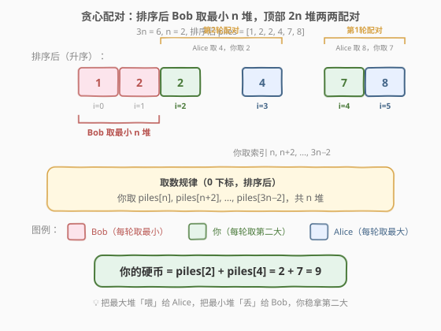
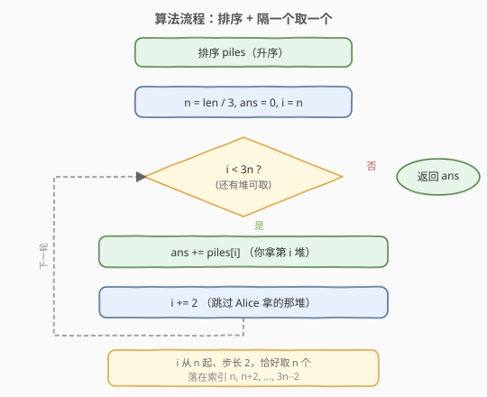

# 你可以获得的最大硬币数

- **题目名称**：你可以获得的最大硬币数
- **链接**：[1561. 你可以获得的最大硬币数](https://leetcode.cn/problems/maximum-number-of-coins-you-can-get/)
- **难度**：中等
- **标签**：贪心、数组、排序

## 1. 题目概述

有 `3n` 堆硬币，每堆硬币数量不同。你和朋友 Alice、Bob 一起玩一个游戏，共进行 `n` 轮。每轮规则如下：

1. 从所有剩余硬币堆中**任意选出 3 堆**；
2. Alice 拿走硬币数量**最多**的那一堆；
3. **你**拿走硬币数量**第二多**的那一堆；
4. Bob 拿走硬币数量**最少**的那一堆。

游戏直到没有硬币堆剩余为止。返回你能获得的最大硬币总数。

**示例 1**：

```text
输入：piles = [2,4,1,2,7,8]
输出：9
解释：n = 2，共 2 轮。
第 1 轮：选 [1,7,8] → Alice 取 8，你取 7，Bob 取 1。
第 2 轮：选 [2,2,4] → Alice 取 4，你取 2，Bob 取 2。
你的总数 = 7 + 2 = 9。
```

**示例 2**：

```text
输入：piles = [2,4,5]
输出：4
解释：n = 1，1 轮。选 [2,4,5] → Alice 取 5，你取 4，Bob 取 2。
```

**示例 3**：

```text
输入：piles = [9,8,7,6,5,1,2,3,4]
输出：18
解释：n = 3，排序后 [1,2,3,4,5,6,7,8,9]。
你取索引 3,5,7 → 4 + 6 + 8 = 18。
```

**约束条件**：

- `3 <= piles.length <= 10^5`
- `piles.length % 3 == 0`
- `1 <= piles[i] <= 10^4`

---

## 2. 解题思路

### 2.1 暴力思路

每轮从剩余堆中枚举所有 $\binom{m}{3}$ 种三元组（$m$ 为剩余堆数），递归搜索所有方案取最大值。$n$ 轮的组合数呈阶乘爆炸，$3n = 9$ 时已不可行，更不用说 $3n = 10^5$。

需要抓住两个关键约束：
- 你在每轮中**永远只能拿第二大**——最大的那堆一定归 Alice，最小的那堆一定归 Bob。
- 你可以**自由选择哪 3 堆**组成一轮，因此能控制「把哪些大堆配在一起送给 Alice」。

### 2.2 核心观察：排序 + 贪心配对



将 `piles` **升序排序**后，把 `3n` 堆分成三组：

| 角色 | 取哪几堆 | 数量 |
|------|----------|------|
| **Bob** | 最小的 `n` 堆（索引 `0 ~ n-1`） | `n` |
| **你** | 索引 `n, n+2, n+4, …, 3n-2` | `n` |
| **Alice** | 索引 `n+1, n+3, …, 3n-1` | `n` |

**贪心策略**：每一轮把「当前最大堆 + 当前次大堆 + 当前最小堆」凑成一组——

- 最大堆给 Alice（反正最大的总归她，不如配个次大让你多拿）；
- 次大堆归你；
- 最小堆丢给 Bob（最小堆对你最无用，送给 Bob 损失最小）。

排序后从右往左看，每轮消耗「最大的两个 + 最小的一个」，等价于：

> 你取**索引 `n` 开始、步长 2** 的那 `n` 个堆，即 `piles[n], piles[n+2], …, piles[3n-2]`。

> 💡 **为什么这样最优？** 全局最大堆 `piles[3n-1]` 在任何包含它的轮次中都会被 Alice 拿走（它永远是该轮最大）。与其让它「浪费」地配两个小堆，不如配 `piles[3n-2]`——这样你稳拿次大值。同理，把最小堆配给 Bob 比配给你或 Alice 损失都小。交换论证可证任何偏离此配对的方案都不会更优。

> ⚠️ **不能让 Bob 拿大堆**：Bob 拿的堆不进你的口袋也不进 Alice 的，纯属「沉没损失」。让 Bob 拿最小的 `n` 堆，相当于把损失降到最低；你和 Alice 再瓜分剩余 `2n` 个较大的堆。

### 2.3 算法流程图



整体只需一次排序 + 一次遍历：排序后令 `i` 从 `n` 出发、步长 `2`，累加 `piles[i]` 直到 `i` 越界。循环恰好执行 `n` 次（`i = n, n+2, …, 3n-2`，共 `n` 项）。

### 2.4 示例演算

![示例演算：piles = [2,4,1,2,7,8]](../images/maxcoins_example_walkthrough.svg)

以 `piles = [2,4,1,2,7,8]` 为例，`3n = 6, n = 2`，排序后 `[1, 2, 2, 4, 7, 8]`：

| 轮次 | 选出 3 堆 | Bob（最小） | 你（第二大） | Alice（最大） |
|------|-----------|-------------|--------------|---------------|
| 1 | {1, 7, 8} | 1 | 7 | 8 |
| 2 | {2, 2, 4} | 2 | 2 | 4 |
| **合计** | — | 3 | **9** | 12 |

你的硬币总数 = `piles[2] + piles[4] = 2 + 7 = 9`。

> 💡 注意第 2 轮里两个 `2` 同值，「最大/第二大/最小」按位置区分，不影响取数结果。

---

## 3. 参考代码

### C++

```cpp
class Solution {
public:
    int maxCoins(vector<int>& piles) {
        sort(piles.begin(), piles.end());
        int n = piles.size() / 3;
        int ans = 0;
        for (int i = n; i < piles.size(); i += 2) {
            ans += piles[i];
        }
        return ans;
    }
};
```

### Python

```python
class Solution:
    def maxCoins(self, piles: List[int]) -> int:
        piles.sort()
        n = len(piles) // 3
        return sum(piles[n::2])
```

> 💡 Python 的切片 `piles[n::2]` 从索引 `n` 起步长 2 取到末尾，恰好是 `piles[n], piles[n+2], …`，一行搞定。注意 `piles.size()` 是 `3n`，循环条件 `i < piles.size()` 在 `i = 3n-2` 时仍成立（`3n-2 < 3n`），下一轮 `i = 3n` 退出，正好取 `n` 个。

---

## 4. 复杂度分析

| 维度 | 复杂度 | 说明 |
|------|--------|------|
| 时间复杂度 | $O(n \log n)$ | 排序主导 $O(3n \log 3n) = O(n \log n)$；遍历仅 $O(n)$ |
| 空间复杂度 | $O(\log n)$ | 排序的递归栈空间（C++ `std::sort` / Python Timsort） |

$3n \le 10^5$，$n \log n \approx 1.7 \times 10^6$，远低于时限。

---

## 5. 扩展：贪心正确性的交换论证

设排序后数组为 $a_0 \le a_1 \le \cdots \le a_{3n-1}$。我们需要证明：**任何合法方案中你的总收益 $\le \sum_{k=0}^{n-1} a_{n+2k}$**。

**两步观察**：

1. **Bob 必拿 `n` 堆，且这些堆对总收益无贡献**。要让损失最小，Bob 应拿最小的 `n` 堆 $a_0, \ldots, a_{n-1}$。若某方案让 Bob 拿了 $a_j$（$j \ge n$）而把某个 $a_i$（$i < n$）留给 Alice 或你，交换二者后 Alice/你的收益不减（拿到更大的堆）。

2. **剩余 `2n` 堆 $a_n, \ldots, a_{3n-1}$ 在 Alice 与你之间分配，每轮 Alice $\ge$ 你**。把这 `2n` 堆从大到小配对：$(a_{3n-1}, a_{3n-2}), (a_{3n-3}, a_{3n-4}), \ldots, (a_{n+1}, a_n)$。每对中 Alice 拿较大、你拿较小，你的收益即 $\sum a_{n+2k}$。若某方案让你拿了某对中较大的而 Alice 拿较小，可在不违反「每轮 Alice 最大」的前提下调整回本方案，收益不降——因为配对内两堆相邻，差异最小，交换不会让其他轮次变差。

因此贪心方案达到上界，最优。

> 💡 这类「三人分蛋糕、你拿中间档」的题，本质都是**排序后隔位取数**。关键在于识别「最大必归 Alice、最小必归 Bob」这一刚性约束，从而把自由度压缩到「如何配对」上。

---

## 6. 面试要点

1. **为什么 Bob 必须拿最小的 `n` 堆？**

   - Bob 拿的堆对所有人都是「沉没损失」。让 Bob 拿最小堆可把损失降到最低，使剩余较大的 `2n` 堆留给 Alice 与你瓜分。若 Bob 拿了大堆，相当于把本可给你的硬币白白丢掉。

2. **为什么是「隔一个取一个」而不是别的取法？**

   - 排序后剩 `2n` 堆给 Alice 和你，每轮 Alice 必 $\ge$ 你。从最大端起两两配对（最大配次大），Alice 拿每对的较大、你拿较小，恰好对应索引 $n, n+2, \ldots, 3n-2$。任何其他配对都会让某轮你的堆更小或 Alice 的堆更大，不更优。

3. **能否不用排序？**

   - 不能。本题的最优解依赖堆的大小顺序来配对。若追求 $O(n)$ 可用快速选择划出前 `n` 小与后 `2n`，但后 `2n` 仍需排序或两两配对，整体仍 $O(n \log n)$。$n \le 10^5$ 排序已足够。

4. **`piles[n::2]` 在 Python 中如何工作？**

   - 切片 `[start:stop:step]`，`n::2` 表示从索引 `n` 开始、步长 2、取到末尾，结果为 `[piles[n], piles[n+2], …]`。数组长度 `3n`，最后取到的下标是 `3n-2`（`3n-2` 与 `n` 同奇偶，因为 `3n-2-n = 2n-2` 为偶数），共 `n` 个元素。

5. **如果题目改成「你拿最小、Alice 拿最大、Bob 拿中间」怎么办？**

   - 你永远拿最小，最优策略变成把最大堆配给 Alice、中间堆配给 Bob、最小堆留给你——你取索引 `0, 2, 4, …, 2n-2`（前 `n` 个偶数位）。仍为排序 + 隔位取，只是起点变为 0。

---

## 7. 同类练习题

- [561. 数组拆分](https://leetcode.cn/problems/array-partition/)：排序后隔位取最小，思路同构（两两配对取较小），对照「取大/取小」方向
- [2144. 打包购买糖果的最小花费](https://leetcode.cn/problems/minimum-cost-of-buying-candies-with-discount/)：排序后隔位取免费，同为「排序 + 隔位贪心」家族
- [881. 救生艇](https://leetcode.cn/problems/boats-to-save-people/)：排序 + 双指针贪心配对（最重配最轻），对比「配对」策略的另一面
- [877. 石子游戏](https://leetcode.cn/problems/stone-game/)：同为分堆博弈，但用区间 DP / 数学贪心，体会「博弈型」与「分配型」的差异
- [1402. 做菜顺序](https://leetcode.cn/problems/reducing-dishes/)：排序后前缀和贪心，对照「顺序影响收益」的贪心思路
