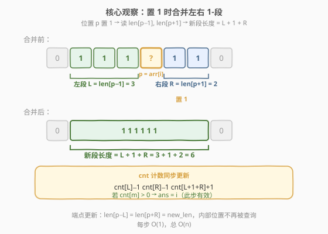
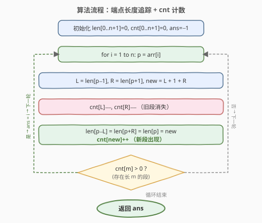

# LeetCode 查找大小为 M 的最新分组 题解

## 1. 题目概述

- **标题 / 题号**：查找大小为 M 的最新分组（#1562，medium）
- **链接**：https://leetcode.cn/problems/find-latest-group-of-size-m/
- **难度**：中等
- **标签**：数组、并查集、模拟

**题意**：给定一个长度为 $n$ 的数组 `arr`，它是 $1$ 到 $n$ 的一个排列。另有一个长度为 $n$ 的二进制串，初始全为 `0`。

在从 $1$ 到 $n$ 的第 $i$ 步中（$1$ 下标），将二进制串上位置 `arr[i]` 的位设为 `1`。

再给定整数 $m$，找出二进制串上**存在长度恰好为 $m$ 的一组 `1`** 的**最后步骤**。一组 `1` 指由连续 `1` 组成、左右两边不能再延伸的子串。若不存在这样的步骤，返回 $-1$。

**示例 1**：

```text
输入：arr = [3,5,1,2,4], m = 1
输出：4
解释：
步骤 1："00100"，组：["1"]
步骤 2："00101"，组：["1", "1"]
步骤 3："10101"，组：["1", "1", "1"]
步骤 4："11101"，组：["111", "1"]     ← 仍存在长度为 1 的组
步骤 5："11111"，组：["11111"]        ← 不再存在长度为 1 的组
最后有效步骤为 4。
```

**示例 2**：

```text
输入：arr = [3,1,5,4,2], m = 2
输出：-1
解释：任何步骤都不存在长度恰好为 2 的 1-组。
```

**示例 3**：

```text
输入：arr = [1], m = 1
输出：1
```

**示例 4**：

```text
输入：arr = [2,1], m = 2
输出：2
```

**约束**：

- $n = \text{arr.length}$
- $1 \le n \le 10^5$
- $1 \le \text{arr}[i] \le n$
- `arr` 中所有整数互不相同
- $1 \le m \le \text{arr.length}$

## 2. 解题思路

### 2.1 暴力思路

每一步置 `1` 后，线性扫描整个二进制串，统计所有 `1`-组的长度，判断是否存在长度为 $m$ 的组。单步 $O(n)$，$n$ 步共 $O(n^2)$。$n = 10^5$ 时 $10^{10}$ 次操作，不可行。

瓶颈在于：每步都**从头重新统计所有组**。但实际上每步只改动一个位置 `p`，它最多影响**左右两个相邻的 `1`-段**——如果能只维护这一局部信息，就能做到每步 $O(1)$。

### 2.2 核心观察：端点长度追踪 + cnt 计数



关键在于维护两个数组：

| 数组 | 含义 |
|------|------|
| `len[p]` | 位置 $p$ 所在 `1`-段的长度（$p$ 为 `0` 时无意义） |
| `cnt[L]` | 当前长度恰好为 $L$ 的 `1`-段有多少个 |

**当位置 $p$ 被置为 `1` 时**，只需查看**左右紧邻**的两个位置：

- **左段长度** $L = \text{len}[p-1]$（若 $p-1$ 为 `0`，则 $L=0$，无左段）
- **右段长度** $R = \text{len}[p+1]$（若 $p+1$ 为 `0`，则 $R=0$，无右段）
- **新段长度** $= L + 1 + R$（左段 + $p$ 自身 + 右段，三段合一）

合并时 `cnt` 同步更新：

$$\text{cnt}[L] \mathrel{-}= 1, \quad \text{cnt}[R] \mathrel{-}= 1, \quad \text{cnt}[L+1+R] \mathrel{+}= 1$$

（$L=0$ 或 $R=0$ 时跳过对应减法。）

> 💡 **为什么只需更新端点？** 合并产生的新段跨越 $[p-L,\, p+R]$。后续只有当某个**新置 `1`** 紧邻此段的左端点（$p-L-1$）或右端点（$p+R+1$）时，才会再次触及此段。由于 `arr` 是排列、每个位置只置一次，段内部的旧 `len` 值永不被查询。因此只需更新 $\text{len}[p-L]$ 和 $\text{len}[p+R]$ 两个端点（外加 $\text{len}[p]$ 本身），即可保证后续读取 $\text{len}[\text{邻居}]$ 时始终拿到正确长度。

> ⚠️ **哨兵简化**：`len` 数组开 $n+2$ 大小，索引 $0$ 和 $n+1$ 恒为 `0`，避免边界判断。位置 $1 \sim n$ 对应 `arr` 中的值。

每步结束后，若 $\text{cnt}[m] > 0$，说明当前存在长度为 $m$ 的组，更新 $\text{ans} = i$。遍历完毕后返回 `ans`（初始 $-1$）。

### 2.3 算法流程图



整体只需一次遍历：每步读取左右邻居长度、计算新段长度、更新 `cnt` 和端点 `len`、检查 `cnt[m]`。

### 2.4 示例演算

![示例演算：arr = [3,5,1,2,4], m = 1](../images/latestgroup_example_walkthrough.svg)

以 `arr = [3,5,1,2,4], m = 1` 为例，逐步追踪 `cnt[1]` 的变化：

| 步骤 | arr[i] | 二进制串 | 1-组 | cnt[1] 变化 | cnt[1] | 有效? |
|------|--------|----------|------|-------------|--------|-------|
| 1 | 3 | `00100` | `["1"]` | +1 | 1 | ✓ |
| 2 | 5 | `00101` | `["1","1"]` | +1 | 2 | ✓ |
| 3 | 1 | `10101` | `["1","1","1"]` | +1 | 3 | ✓ |
| 4 | 2 | `11101` | `["111","1"]` | −2 +1（两个旧段合并为 len=3） | 1 | ✓ |
| 5 | 4 | `11111` | `["11111"]` | −2 +1（len=3 与 len=1 合并为 len=5） | 0 | ✗ |

> 💡 **步骤 4 是关键转折**：$p=2$ 置 `1` 后，左段（$p=1$，长度 $1$）和右段（$p=3$，长度 $1$）合并为新段长度 $3$。两个长度为 $1$ 的旧段消失（`cnt[1]` 减 $2$），新段长度 $3$ 出现（`cnt[3]` 加 $1$），但右侧 $p=5$ 处仍有一个独立的长度 $1$ 段，故 `cnt[1]` 降为 $1 > 0$，此步仍有效。

> ⚠️ **步骤 5 后 `cnt[1]` 归零**：$p=4$ 置 `1` 后，左段（长度 $3$）与右段（长度 $1$）合并为全串长度 $5$。`cnt[1]` 减 $1$ 后归零，此后不再有长度为 $1$ 的组——因为所有 `1` 已连成一片，只会越来越长。最终答案为 $4$。

## 3. 参考代码

### C++

```cpp
class Solution {
public:
    int findLatestStep(vector<int>& arr, int m) {
        int n = arr.size();
        vector<int> len(n + 2, 0);
        vector<int> cnt(n + 2, 0);
        int ans = -1;
        for (int i = 0; i < n; i++) {
            int p = arr[i];
            int L = len[p - 1];
            int R = len[p + 1];
            int new_len = L + 1 + R;
            if (L > 0) cnt[L]--;
            if (R > 0) cnt[R]--;
            len[p - L] = new_len;
            len[p + R] = new_len;
            len[p] = new_len;
            cnt[new_len]++;
            if (cnt[m] > 0) ans = i + 1;
        }
        return ans;
    }
};
```

### Python

```python
class Solution:
    def findLatestStep(self, arr: List[int], m: int) -> int:
        n = len(arr)
        length = [0] * (n + 2)
        cnt = [0] * (n + 2)
        ans = -1
        for i, p in enumerate(arr, 1):
            L = length[p - 1]
            R = length[p + 1]
            new_len = L + 1 + R
            if L > 0:
                cnt[L] -= 1
            if R > 0:
                cnt[R] -= 1
            length[p - L] = new_len
            length[p + R] = new_len
            length[p] = new_len
            cnt[new_len] += 1
            if cnt[m] > 0:
                ans = i
        return ans
```

> 💡 **数组开 $n+2$**：索引 $0$ 和 $n+1$ 作为哨兵恒为 `0`，避免 `p-1`、`p+1` 越界判断。`arr` 中的值范围是 $1 \sim n$，正好对应 `len` 的索引 $1 \sim n$。`cnt` 也开 $n+2$：新段长度最大为 $n$（全串合一），无需更大。

## 4. 复杂度分析

| 维度 | 复杂度 | 说明 |
|------|--------|------|
| 时间复杂度 | $O(n)$ | 每步仅常数次数组读写，共 $n$ 步 |
| 空间复杂度 | $O(n)$ | `len` 与 `cnt` 各 $n+2$ 大小 |

$n \le 10^5$，$O(n)$ 远低于时限。

## 5. 扩展：逆向思维（反向并查集）

本题还有另一种思路——**从终态倒推**：

- **终态**（第 $n$ 步后）：全串为 `1`，唯一一组长度 $n$。若 $m = n$，直接返回 $n$。
- **倒序遍历** $i = n, n-1, \ldots, 1$：在第 $i$ 步对应的逆操作中，将位置 $\text{arr}[i]$ 从 `1` 改回 `0`，把一个长 $L+1+R$ 的段**拆分**为左段（长 $L$）和右段（长 $R$）。
- 倒序第 $k$ 次逆操作后的状态 = 正序第 $n-k$ 步后的状态。我们要找**最早**（倒序中）出现 `cnt[m] > 0` 的时刻，对应正序中**最晚**的有效步。

逆向做法同样需要维护段长度和 `cnt`，复杂度也是 $O(n)$。区别在于：

| 维度 | 正向（本解） | 逆向 |
|------|-------------|------|
| 操作 | 置 `1` → **合并**两段 | 置 `0` → **拆分**一段 |
| cnt 更新 | 旧两段 $-1$，新段 $+1$ | 旧大段 $-1$，新两段 $+1$ |
| 端点更新 | 新段两端 | 拆分点两侧 |
| 判定方向 | 每步检查，取**最后**有效 | 倒序检查，取**最先**有效 |

> 💡 **逆向思维**在「动态删点」类问题中很常见（如 [803. 砖块掉落](https://leetcode.cn/problems/bricks-falling-when-hit/)），核心是「把难以正向模拟的删除转化为逆向的添加」。本题正向已足够简洁，但逆向视角有助于理解状态演变。

## 6. 面试要点

1. **为什么每步只需看左右紧邻的两个位置？**

   - 每步只改一个位置 $p$。$p$ 置 `1` 后，唯一可能发生变化的是 $p$ 所在的新段——它由左邻段（$p-1$ 所在段）、$p$ 自身、右邻段（$p+1$ 所在段）合并而成。远离 $p$ 的段不受影响。因此只读 `len[p-1]` 和 `len[p+1]` 即可。

2. **为什么更新端点就够了，内部位置的 `len` 不会出错吗？**

   - 内部位置的 `len` 确实会变成「过时值」，但它们**永不被再次读取**。后续读取 `len[q]` 只发生在 $q$ 被置 `1` 时（读 `len[q-1]`、`len[q+1]`），而每个位置只置一次 `1`。$q$ 若已是 `1`，就不会再被置 `1`，其 `len` 值不再被需要。只有段的两个端点可能被未来新置 `1` 的位置紧邻触及。

3. **`cnt[m]` 什么时候会从正变零、再也无法回升？**

   - 当所有长度为 $m$ 的段都被合并进更大的段、且没有新的长度 $m$ 段产生时，`cnt[m]` 归零。一旦全串连成一片（单一长 $n$ 段），`cnt[m]` 只可能为 $0$（$m \ne n$）或 $1$（$m = n$）。因此答案是有限步内确定的。

4. **哨兵位置 `len[0]` 和 `len[n+1]` 的作用？**

   - 它们恒为 `0`，表示位置 $1$ 的左侧和位置 $n$ 的右侧「没有 `1`-段」。当 $p=1$ 时 `len[p-1] = len[0] = 0`，$p=n$ 时 `len[p+1] = len[n+1] = 0`，天然处理边界，省去条件判断。

5. **如果 `m = n`，答案一定是 `n` 吗？**

   - 是的。第 $n$ 步后全串为 `1`，唯一组的长度恰为 $n = m$。且此前不可能有长度 $n$ 的段（少于 $n$ 个 `1`），所以最后有效步就是第 $n$ 步。算法也能正确处理：第 $n$ 步时 `new_len = n`，`cnt[n] = 1 > 0`，`ans = n`。

## 同类练习题

| # | 题目 | 与本题的关联 |
|---|------|-------------|
| 128 | [最长连续序列](https://leetcode.cn/problems/longest-consecutive-sequence/) | 哈希集合维护连续段，思路同构（端点查邻居判断是否可延伸） |
| 305 | [岛屿数量 II](https://leetcode.cn/problems/number-of-islands-ii/) | 动态加点 + 并查集合并，与本题「逐点置 1 后合并相邻段」同模板 |
| 803 | [砖块掉落](https://leetcode.cn/problems/bricks-falling-when-hit/) | 逆向并查集（把删除转为倒序添加），对照第 5 节逆向思路 |
| 547 | [省份数量](https://leetcode.cn/problems/number-of-provinces/) | 并查集基础模板，理解 `union` 合并两段的底层逻辑 |
| 1541 | [平衡括号字符串的最少插入次数](https://leetcode.cn/problems/minimum-insertions-to-balance-a-parentheses-string/) | 同为「逐步扫描 + 局部状态维护」类型，体会 O(n) 单遍扫描的思路 |
