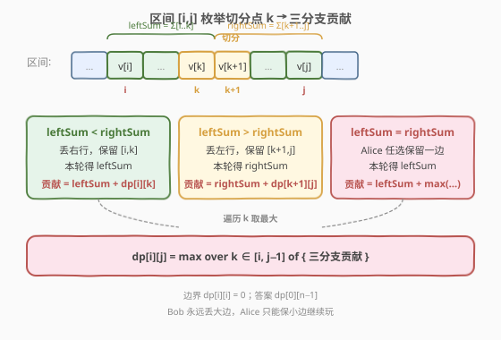
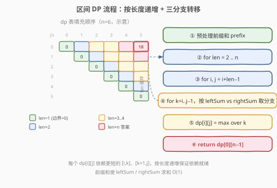
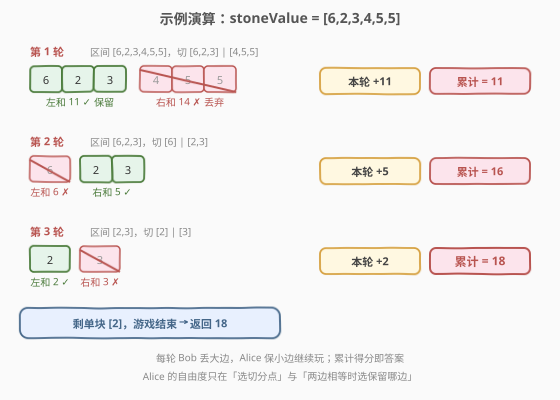

# 石子游戏 V

- **题目名称**：石子游戏 V
- **链接**：[1563. 石子游戏 V](https://leetcode.cn/problems/stone-game-v/)
- **难度**：困难
- **标签**：数组、动态规划、区间 DP、前缀和

## 1. 题目概述

`stoneValue` 排成一行，每块石子关联一个正整数值。游戏每一轮：

1. Alice 将当前行切成两个**非空**行（左行、右行）；
2. Bob 计算两行各自的总和，**丢弃总和较大的那一行**，Alice 的得分 = 剩下那行的总和（累加到 Alice 总分）；
3. 若两行总和相等，Alice 自行决定丢弃哪一行；
4. 下一轮从剩下的那行继续。

当只剩一块石子时游戏结束，Alice 初始分数为 0。返回 Alice 能获得的最大分数。

**示例 1**：

```text
输入：stoneValue = [6,2,3,4,5,5]
输出：18
解释：
第 1 轮：切 [6,2,3] | [4,5,5]，左和 11 < 右和 14，丢右，得 11，剩 [6,2,3]。
第 2 轮：切 [6] | [2,3]，左和 6 > 右和 5，丢左，得 5，剩 [2,3]，累计 16。
第 3 轮：切 [2] | [3]，左和 2 < 右和 3，丢右，得 2，剩 [2]，累计 18。
剩单块，结束。
```

**示例 2**：

```text
输入：stoneValue = [7,7,7,7,7,7,7]
输出：28
```

**示例 3**：

```text
输入：stoneValue = [4]
输出：0
```

**约束条件**：

- `1 <= stoneValue.length <= 500`
- `1 <= stoneValue[i] <= 10^6`

> ⚠️ 与 [877. 石子游戏](../0801-0900/877_石子游戏.md) 的「两端取堆」不同，本题是「**切一刀再丢大半**」，得分只来自被保留的小半边。状态转移要从「净赚」改为「**保留下半边的总分 + 该半边后续能再赚到的分数**」。

---

## 2. 解题思路

### 2.1 暴力思路

每轮枚举所有合法切分点（共 $j-i$ 个），三分支递归到保留下来的子区间。整行有 $n$ 块时切分树最坏呈 $n$ 叉递归，复杂度 $O(n!)$ 级别，`n=500` 完全不可行。注意到「同一区间上的最优得分」会被反复求解，天然适合区间 DP。

### 2.2 核心观察：区间 DP（枚举切分点 + 三分支）



定义：

> `dp[i][j]` = 当前区间 `stoneValue[i..j]` 上 Alice 能获得的最大累计分数。

枚举切分点 `k`（`i ≤ k < j`），将区间切成左 `[i, k]` 与右 `[k+1, j]`，记两段和为 `leftSum`、`rightSum`（用前缀和 $O(1)$ 求得）。Bob 永远丢弃大的一边，Alice 只能在「被保留的那一边」继续玩。于是有三种情况：

- `leftSum < rightSum`：右被丢，Alice 得 `leftSum` 并在 `[i, k]` 上继续 → 贡献 `leftSum + dp[i][k]`。
- `leftSum > rightSum`：左被丢，Alice 得 `rightSum` 并在 `[k+1, j]` 上继续 → 贡献 `rightSum + dp[k+1][j]`。
- `leftSum == rightSum`：Alice 任选一边保留 → 贡献 `leftSum + max(dp[i][k], dp[k+1][j])`。

Alice 在所有切分点中选贡献最大者：

$$
\text{dp}[i][j] = \max_{i \le k < j} \begin{cases}
\text{leftSum} + \text{dp}[i][k], & \text{leftSum} < \text{rightSum} \\
\text{rightSum} + \text{dp}[k+1][j], & \text{leftSum} > \text{rightSum} \\
\text{leftSum} + \max(\text{dp}[i][k], \text{dp}[k+1][j]), & \text{leftSum} = \text{rightSum}
\end{cases}
$$

**边界**：`dp[i][i] = 0`（只剩一块石子，游戏结束，本轮无得分）。
**答案**：`dp[0][n-1]`。

> 💡 **与 877 的对比**：877 是零和博弈，记「净赚差值」即可；本题不是零和（丢掉的部分直接消失，不进对手口袋），所以必须记「**保留下半边的累计得分**」而非差值。状态转移里也没有「减号」，全是「加上半边的总分与子区间的最优」。

### 2.3 算法流程图



按**区间长度**从短到长递推：长度 1 全填 0（边界），长度 2 枚举唯一切分点，……，长度 `n` 填右上角 `dp[0][n-1]`。每个 `dp[i][j]` 只依赖更短的子区间 `[i,k]` 与 `[k+1,j]`（长度均 `< len`），按长度递增即可保证依赖就绪。

### 2.4 示例演算

以 `stoneValue = [6,2,3,4,5,5]` 为例，Alice 的最优路径如下（每轮保留和较小的一边，累计得分逐轮累加）：



| 轮次 | 当前区间 | 切分 | 左和 | 右和 | 保留 | 本轮得分 | 累计 |
|------|----------|------|------|------|------|----------|------|
| 1 | `[6,2,3,4,5,5]` | `[6,2,3] \| [4,5,5]` | 11 | 14 | 左 | 11 | 11 |
| 2 | `[6,2,3]` | `[6] \| [2,3]` | 6 | 5 | 右 | 5 | 16 |
| 3 | `[2,3]` | `[2] \| [3]` | 2 | 3 | 左 | 2 | 18 |

游戏结束，Alice 总得分 18。

> 💡 注意每轮「保留较小的一边」是 Bob 强制的（除非两边相等），并非 Alice 自由选择；Alice 的自由度只在「**选哪个切分点**」和「两边相等时选保留哪边」。

---

## 3. 参考代码

### C++

```cpp
class Solution {
  public:
    int stoneGameV(vector<int>& stoneValue) {
        int n = stoneValue.size();
        vector<int> prefix(n + 1, 0);
        for (int i = 0; i < n; i++) prefix[i + 1] = prefix[i] + stoneValue[i];
        vector<vector<int>> dp(n, vector<int>(n, 0));
        for (int len = 2; len <= n; len++) {
            for (int i = 0; i + len - 1 < n; i++) {
                int j = i + len - 1;
                int best = 0;
                for (int k = i; k < j; k++) {
                    int leftSum  = prefix[k + 1] - prefix[i];
                    int rightSum = prefix[j + 1] - prefix[k + 1];
                    int cur;
                    if (leftSum < rightSum)      cur = leftSum  + dp[i][k];
                    else if (leftSum > rightSum) cur = rightSum + dp[k + 1][j];
                    else                         cur = leftSum  + max(dp[i][k], dp[k + 1][j]);
                    best = max(best, cur);
                }
                dp[i][j] = best;
            }
        }
        return dp[0][n - 1];
    }
};
```

### Python

```python
class Solution:
    def stoneGameV(self, stoneValue: List[int]) -> int:
        n = len(stoneValue)
        prefix = [0] * (n + 1)
        for i in range(n):
            prefix[i + 1] = prefix[i] + stoneValue[i]
        dp = [[0] * n for _ in range(n)]
        for length in range(2, n + 1):
            for i in range(n - length + 1):
                j = i + length - 1
                best = 0
                for k in range(i, j):
                    leftSum  = prefix[k + 1] - prefix[i]
                    rightSum = prefix[j + 1] - prefix[k + 1]
                    if leftSum < rightSum:
                        cur = leftSum + dp[i][k]
                    elif leftSum > rightSum:
                        cur = rightSum + dp[k + 1][j]
                    else:
                        cur = leftSum + max(dp[i][k], dp[k + 1][j])
                    if cur > best:
                        best = cur
                dp[i][j] = best
        return dp[0][n - 1]
```

> 💡 **写法选择**：C++/Python 都给迭代区间 DP（按 `len → i → k` 三重循环），避免 `n=500` 时递归栈与 `lru_cache` 的开销。若追求代码简洁，也可写记忆化 DFS `@cache def dfs(l, r)`，思路一致，但 Python 在最坏用例上可能超时。

---

## 4. 复杂度分析

| 维度 | 复杂度 | 说明 |
|------|--------|------|
| 时间复杂度 | $O(n^3)$ | 状态数 $O(n^2)$，每状态枚举 $O(n)$ 个切分点，前缀和让求和 $O(1)$ |
| 空间复杂度 | $O(n^2)$ | 二维 dp 表 + 长度 $n+1$ 的前缀和数组 |

$n=500$ 时约 $n^3/6 \approx 2 \times 10^7$ 次内层循环，C++ 稳过；Python 需注意常数，必要时改用第 5 节的 $O(n^2)$ 优化。

---

## 5. 扩展：$O(n^2)$ 优化思路

朴素的 $O(n^3)$ 已能 AC，但存在 $O(n^2)$ 的优化做法。核心观察：**当切分点 `k` 从左向右滑动时，`leftSum` 单调递增、`rightSum` 单调递减**，二者大小关系只会发生一次翻转。可对每个区间 `[i, j]` 维护：

- `maxL[i][j]` = 在 `[i, j]` 上所有满足 `leftSum ≤ rightSum` 的切分点中，`leftSum + dp[i][k]` 的最大值；
- `maxR[i][j]` = 在 `[i, j]` 上所有满足 `leftSum ≥ rightSum` 的切分点中，`rightSum + dp[k+1][j]` 的最大值。

转移时用双指针定位「左 ≤ 右」与「左 ≥ 右」的分界点，分别取 `maxL`、`maxR` 的最大值即可把内层 `k` 循环降为 $O(1)$，总复杂度 $O(n^2)$。实现细节较多，面试中除非被追问否则以 $O(n^3)$ 为主解。

---

## 6. 面试要点

1. **为什么不能用 877 那种「净赚差值」状态？**
   - 本题**不是零和博弈**：Bob 丢弃的那一行分数直接消失，不进入任何人口袋。Alice 的得分只来自被保留的小半边，所以状态必须记「累计得分」而非「双方差值」。

2. **三分支里 `leftSum == rightSum` 那条为什么取 `max`？**
   - 两边和相等时 Bob 让 Alice 决定丢哪边，相当于 Alice 可任选保留左或右，自然取两种保留方案的最大值。这一步是 Alice 唯一的额外自由度。

3. **为什么要按区间长度递增枚举？**
   - `dp[i][j]` 依赖 `[i,k]` 与 `[k+1,j]`，二者长度均严格小于 `j-i+1`。按长度从小到大填充可保证依赖就绪，无需递归栈与记忆化判重。

4. **前缀和的作用？**
   - 求 `stoneValue[i..k]` 之和若每次累加则内层变 $O(n)$，总复杂度退化到 $O(n^4)$。预处理前缀和后 `leftSum = prefix[k+1] - prefix[i]` 是 $O(1)$，把整体压回 $O(n^3)$。

5. **`n=1` 时返回 0，代码如何自然处理？**
   - 外层 `for (len = 2; ...)` 在 `n=1` 时不进入循环，`dp[0][0]` 保持初始化值 0，直接 `return dp[0][0]` 即 0，与示例 3 一致。

---

## 7. 同类练习题

- [877. 石子游戏](https://leetcode.cn/problems/stone-game/)（[题解](../0801-0900/877_石子游戏.md)）：两端取堆、零和博弈，对比「净赚差值」与「累计得分」两种状态定义的取舍
- [1690. 石子游戏 VII](https://leetcode.cn/problems/stone-game-vii/)：移除一堆后得分由「区间剩余和」决定，转移用 `min`（对手让你拿得少），同为区间 DP 博弈家族
- [312. 戳气球](https://leetcode.cn/problems/burst-balloons/)：区间 DP 经典，按「最后戳的位置」切分区间，对比「枚举切分点」与「枚举最后操作」两种视角
- [1043. 分隔数组以得到最大和](https://leetcode.cn/problems/partition-array-for-maximum-sum/)：分段 DP，每段长度 ≤ k，对比「切分点」与「分段长度」两种枚举维度
- [1000. 合并石子的最低成本](https://leetcode.cn/problems/minimum-cost-to-merge-stones/)：区间 DP + 分段合并，难度更高，体会「分段数约束」对状态的影响
