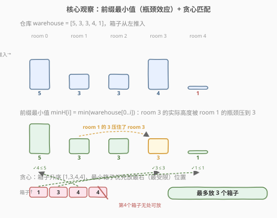
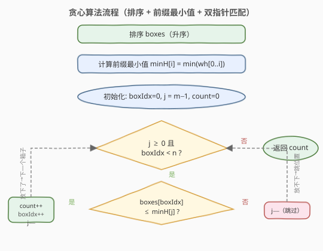
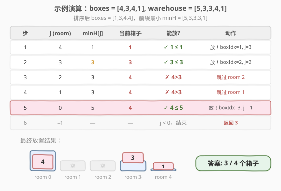

# 把箱子放进仓库里 I

- **题目名称**：把箱子放进仓库里 I
- **链接**：[1564. 把箱子放进仓库里 I](https://leetcode.cn/problems/put-boxes-into-the-warehouse-i/)
- **难度**：中等
- **标签**：贪心、排序、数组、双指针

## 1. 题目概述

给定两个正整数数组 `boxes` 和 `warehouse`，分别表示若干个**单位宽度箱子**的高度和仓库中 `n` 个**房间**的高度。仓库房间从左到右编号 `0` 到 `n−1`，`warehouse[i]` 为第 `i` 个房间的高度。

将箱子放入仓库需遵守以下规则：

- 箱子**不能堆叠**（每个房间最多放一个箱子）。
- **可以重排**箱子的顺序。
- 箱子**只能从左向右**推入仓库。
- 如果某个房间的高度**小于**箱子高度，则该箱子和它后面的箱子都会**被挡在该房间之前**。

返回**最多能放入仓库的箱子数量**。

**示例 1**：

```text
输入：boxes = [4,3,4,1], warehouse = [5,3,3,4,1]
输出：3
解释：先将高度 1 的箱子推入 room 4，再将高度 3 的箱子推入 room 1/2/3 之一，
     最后将高度 4 的箱子推入 room 0。无法放入全部 4 个箱子。
```

**示例 2**：

```text
输入：boxes = [1,2,2,3,4], warehouse = [3,4,1,2]
输出：3
解释：高度 4 的箱子无法通过 room 0（高度 3）。room 2/3 只能放高度 1 的箱子。
     最多放 3 个。
```

**示例 3**：

```text
输入：boxes = [1,2,3], warehouse = [1,2,3,4]
输出：1
解释：room 0 高度为 1，只能放高度 1 的箱子，其余箱子被挡在 room 0 之前。
```

**示例 4**：

```text
输入：boxes = [4,5,6], warehouse = [3,3,3,3,3]
输出：0
解释：所有房间高度均为 3，没有任何箱子能放入。
```

**约束条件**：

- `n == warehouse.length`
- $1 \le \text{boxes.length}, \text{warehouse.length} \le 10^5$
- $1 \le \text{boxes[i]}, \text{warehouse[i]} \le 10^9$

---

## 2. 解题思路

### 2.1 暴力思路

枚举箱子的所有排列（$n!$ 种），对每种排列模拟从左到右推入仓库的过程：每个箱子从 room 0 开始向右滑动，直到遇到高度不足的房间则停在前一个房间。统计每种排列能放入的箱子数，取最大值。

排列数 $n!$ 在 $n = 10^5$ 时完全不可行。即使只枚举少量排列，单次模拟也需要 $O(n \times m)$，必然超时。

### 2.2 核心观察：前缀最小值 + 贪心匹配



本题有两个关键观察：

**观察 1：瓶颈效应 → 前缀最小值**

箱子从左向右推入，要到达 room `i` 必须先穿过 room `0` 到 `i−1`。因此 room `i` 的**有效高度**不是 `warehouse[i]`，而是从左到右的**前缀最小值**：

$$\text{minH}[i] = \min(\text{warehouse}[0], \text{warehouse}[1], \ldots, \text{warehouse}[i])$$

例如 `warehouse = [5,3,3,4,1]`，前缀最小值为 `[5,3,3,3,1]`——room 3 虽然自身高度为 4，但被 room 1 的高度 3 卡住，有效高度只有 3。

> 💡 前缀最小值 `minH` 是**非递增**的（从左到右只减不增），意味着越靠右的房间越"挑剔"。

**观察 2：排序 + 贪心匹配**

既然可以重排箱子，就排序成升序。最小的箱子最灵活（能适应更多位置），应该优先放到最挑剔（最右、minH 最小）的位置。具体策略：

- 箱子指针 `boxIdx` 从最小箱子开始（排序后 index 0）。
- 仓库指针 `j` 从最右房间开始（index `m−1`）。
- 若 `boxes[boxIdx] ≤ minH[j]`：当前最小箱子能放入 room `j`，放入并两个指针各推进一步。
- 若 `boxes[boxIdx] > minH[j]`：连最小的箱子都放不进 room `j`，其余箱子更不行，跳过 room `j`（`j−−`）。

> ⚠️ **为什么从右往左扫描？** 因为 `minH` 非递增，右端最受限。把最小箱子优先放在最受限位置，能为较大的箱子保留左侧较宽松的位置。这与 [455. 分发饼干](../0401-0500/455_分发饼干.md) 的「小饼干优先喂胃口小的孩子」是同一种贪心直觉。

### 2.3 算法流程图



算法只需一趟扫描：排序后计算前缀最小值，然后双指针从右向左贪心匹配。无需二分、无需回溯。

### 2.4 示例演算

以 `boxes = [4,3,4,1]`、`warehouse = [5,3,3,4,1]` 为例：



| 步骤 | j (room) | minH[j] | 当前箱子 | 判定 | 动作 |
|------|----------|---------|----------|------|------|
| 1 | 4 | 1 | 1 | $1 \le 1$ ✓ | 放入 room 4，boxIdx→1, j→3 |
| 2 | 3 | 3 | 3 | $3 \le 3$ ✓ | 放入 room 3，boxIdx→2, j→2 |
| 3 | 2 | 3 | 4 | $4 > 3$ ✗ | 跳过 room 2，j→1 |
| 4 | 1 | 3 | 4 | $4 > 3$ ✗ | 跳过 room 1，j→0 |
| 5 | 0 | 5 | 4 | $4 \le 5$ ✓ | 放入 room 0，boxIdx→3, j→−1 |
| 6 | −1 | — | — | j < 0 | 结束，返回 3 |

最终 3 个箱子分别放入 room 0、room 3、room 4，第 4 个箱子（高度 4）无处可放。

---

## 3. 参考代码

### C++

```cpp
class Solution {
public:
    int maxBoxesInWarehouse(vector<int>& boxes, vector<int>& warehouse) {
        sort(boxes.begin(), boxes.end());

        int m = warehouse.size();
        for (int i = 1; i < m; i++) {
            warehouse[i] = min(warehouse[i], warehouse[i - 1]);
        }

        int count = 0;
        int boxIdx = 0;
        for (int j = m - 1; j >= 0; j--) {
            if (boxIdx < (int)boxes.size() && boxes[boxIdx] <= warehouse[j]) {
                count++;
                boxIdx++;
            }
        }
        return count;
    }
};
```

### Python

```python
class Solution:
    def maxBoxesInWarehouse(self, boxes: List[int], warehouse: List[int]) -> int:
        boxes.sort()

        m = len(warehouse)
        for i in range(1, m):
            warehouse[i] = min(warehouse[i], warehouse[i - 1])

        count = 0
        box_idx = 0
        for j in range(m - 1, -1, -1):
            if box_idx < len(boxes) and boxes[box_idx] <= warehouse[j]:
                count += 1
                box_idx += 1
        return count
```

> ⚠️ **两个易错点**：
> 1. **前缀最小值不是后缀最小值**：箱子从左推入，瓶颈在左侧，所以取**前缀**最小值 `min(wh[0..i])`，不是后缀。取反方向会导致完全错误的匹配。
> 2. **扫描方向是从右到左**：`minH` 非递增，右端最受限，最小箱子优先放右端。若从左到右扫描，会把小箱子浪费在宽松位置，导致大箱子无处可放。

---

## 4. 复杂度分析

| 维度 | 复杂度 | 说明 |
|------|--------|------|
| 时间复杂度 | $O(n \log n + m)$ | 排序 $O(n \log n)$；前缀最小值 $O(m)$；双指针扫描 $O(m)$，其中 $n$ = 箱子数，$m$ = 仓库房间数 |
| 空间复杂度 | $O(1)$ | 前缀最小值在 `warehouse` 原地修改，仅需常数额外空间（排序的递归栈 $O(\log n)$ 不计） |

> 💡 $n, m \le 10^5$，$n \log n \approx 1.7 \times 10^6$，加上 $O(m)$ 的一趟扫描，总运算量远低于时限。

---

## 5. 扩展：贪心正确性证明

**命题**：上述贪心策略放入的箱子数 $k$ 是最优的。

**证明（交换论证）**：

设贪心方案为 $G$，放入了 $k$ 个箱子；设最优方案为 $O$，放入了 $k'$ 个箱子。我们要证 $k \ge k'$。

考察贪心扫描过程。从右到左处理每个 room `j`：

- **情形 A**：贪心在 room `j` 放入了箱子 $b_G$（即 `boxes[boxIdx]`）。此时 $b_G$ 是剩余箱子中最小的。设 $O$ 在 room `j` 放入的箱子为 $b_O$（若 $O$ 未在 `j` 放箱，视 $b_O = \infty$）。由于 $b_G$ 是最小剩余箱子，$b_G \le b_O$。将 $O$ 在 room `j` 的箱子替换为 $b_G$ 不影响 $O$ 在 `j` 左侧的放置（$b_G$ 更小，不增加任何约束），因此替换后 $O$ 仍合法且箱子数不减少。

- **情形 B**：贪心未在 room `j` 放箱（`boxes[boxIdx] > minH[j]`）。此时**所有**剩余箱子高度都 $> \text{minH}[j]$，任何方案都无法在 room `j` 放箱。$O$ 也必然未在 `j` 放箱。

逐房间归纳：在每个 room，贪心要么放入一个不劣于 $O$ 的箱子（情形 A），要么 $O$ 也无法放入（情形 B）。因此 $k \ge k'$。$\blacksquare$

> 💡 **本质**：贪心在每个位置选择"最省"的箱子（最小的），为后续位置保留最大灵活性。这与 [455. 分发饼干](../0401-0500/455_分发饼干.md) 的正确性论证同构——"最小资源优先满足最苛刻需求"。

---

## 6. 面试要点

1. **为什么需要前缀最小值？**

   - 箱子从左推入，到达 room `i` 前必须穿过 room `0` 到 `i−1`。若途中任一房间高度不足，箱子就被挡住。因此 room `i` 的有效容纳高度是 `min(warehouse[0..i])`，而非 `warehouse[i]` 本身。不做前缀最小值会误判高位房间可达性。

2. **为什么从右往左扫描而不是从左往右？**

   - `minH` 非递增，右端最受限。从右端开始用最小箱子去匹配，能把宽松的左端位置留给大箱子。若从左往右，小箱子会占据宽松位置，大箱子到右端时放不下，总数反而更少。

3. **为什么最小的箱子放不进时，直接跳过该 room？**

   - 箱子已升序排序，当前最小箱子是所有剩余箱子里最小的。如果它都放不进 room `j`（`> minH[j]`），其余箱子更高，更放不进。所以该 room 对任何方案都不可用，直接跳过。

4. **前缀最小值可以原地修改吗？**

   - 可以。LeetCode 传的是引用但函数结束后不再使用 `warehouse`，原地修改 `warehouse[i] = min(warehouse[i], warehouse[i-1])` 节省 $O(m)$ 额外空间。若面试官要求不改输入，复制一份即可。

5. **如果箱子数远大于仓库房间数怎么办？**

   - 最多放入 `m` 个箱子（每个房间一个）。算法自然处理：`boxIdx` 到达 `boxes.size()` 后停止，或 `j` 到达 `−1` 后停止，取先到者。无需额外判断。

---

## 7. 同类练习题

- [455. 分发饼干](https://leetcode.cn/problems/assign-cookies/)（[题解](../0401-0500/455_分发饼干.md)）：同套路——排序 + 双指针贪心匹配，最小资源优先满足最苛刻需求
- [1565. 把箱子放进仓库里 II](https://leetcode.cn/problems/put-boxes-into-the-warehouse-ii/)：本题进阶版，箱子可从仓库**两端**推入，需双向贪心 + 前后缀最小值
- [435. 无重叠区间](https://leetcode.cn/problems/non-overlapping-intervals/)（[题解](../0401-0500/435_无重叠区间.md)）：贪心区间调度，按右端点排序选最多不重叠区间，同为"排序 + 贪心选最优"范式
- [881. 救生艇](https://leetcode.cn/problems/boats-to-save-people/)：排序 + 双指针贪心，最重的人搭配最轻的人共乘一条船，双指针从两端向内收缩
- [1011. 在 D 天内送达包裹的能力](https://leetcode.cn/problems/capacity-to-ship-packages-within-d-days/)（[题解](../1001-1100/1011_在D天内送达包裹的能力.md)）：贪心验证 + 二分答案，对比"纯贪心"与"二分 + 贪心 check"两种范式
