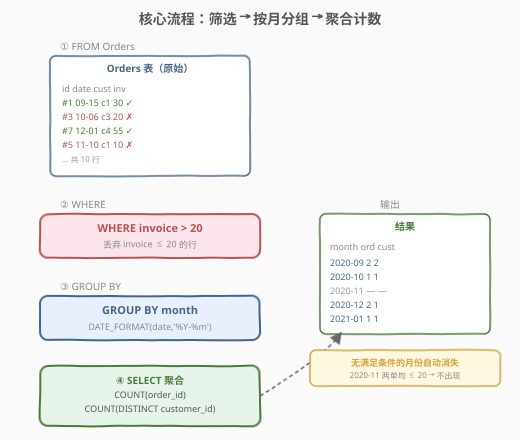
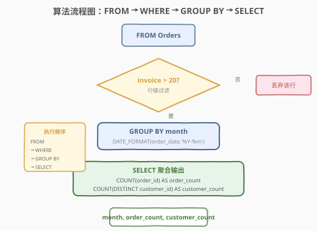
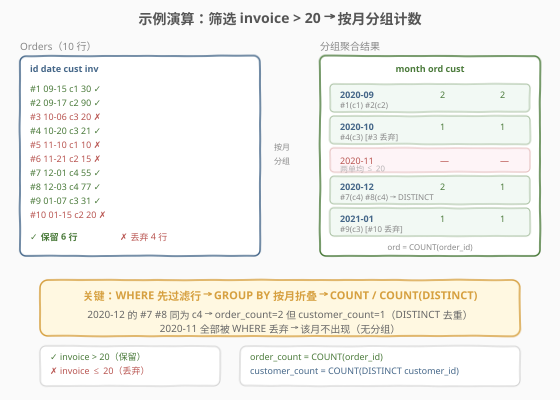

# LeetCode 按月统计订单数与顾客数 题解

## 1. 题目概述

- **标题 / 题号**：按月统计订单数与顾客数（#1565，easy）
- **链接**：https://leetcode.cn/problems/unique-orders-and-customers-per-month/
- **难度**：简单
- **标签**：数据库、SQL、`GROUP BY`、`COUNT`、`COUNT(DISTINCT)`、`DATE_FORMAT`、`WHERE` 行级过滤、LeetCode 锁题

**题意**：给定 `Orders` 表，编写 SQL 查询，**按月**统计金额（`invoice`）**大于 $20** 的唯一**订单数**和唯一**顾客数**。查询结果无排序要求。

**表结构**：

```text
Table: Orders
+---------------+---------+
| Column Name   | Type    |
+---------------+---------+
| order_id      | int     |  ← 具有唯一值
| order_date    | date    |
| customer_id   | int     |
| invoice       | int     |
+---------------+---------+
该表包含顾客(customer_id)所下订单的信息。
```

**示例 1**：

```text
输入：
Orders 表:
+----------+------------+-------------+---------+
| order_id | order_date | customer_id | invoice |
+----------+------------+-------------+---------+
| 1        | 2020-09-15 | 1           | 30      |
| 2        | 2020-09-17 | 2           | 90      |
| 3        | 2020-10-06 | 3           | 20      |
| 4        | 2020-10-20 | 3           | 21      |
| 5        | 2020-11-10 | 1           | 10      |
| 6        | 2020-11-21 | 2           | 15      |
| 7        | 2020-12-01 | 4           | 55      |
| 8        | 2020-12-03 | 4           | 77      |
| 9        | 2021-01-07 | 3           | 31      |
| 10       | 2021-01-15 | 2           | 20      |
+----------+------------+-------------+---------+

输出:
+---------+-------------+----------------+
| month   | order_count | customer_count |
+---------+-------------+----------------+
| 2020-09 | 2           | 2              |
| 2020-10 | 1           | 1              |
| 2020-12 | 2           | 1              |
| 2021-01 | 1           | 1              |
+---------+-------------+----------------+
```

**解释**：

| 月份 | 原始订单 | invoice > 20 的订单 | order_count | customer_count | 说明 |
|------|----------|---------------------|-------------|----------------|------|
| 2020-09 | #1(30), #2(90) | #1, #2 | 2 | 2（c1, c2） | 两单均达标，两位不同顾客 |
| 2020-10 | #3(20), #4(21) | #4 | 1 | 1（c3） | #3 的 invoice=20 不大于 20，丢弃 |
| 2020-11 | #5(10), #6(15) | — | — | — | 两单均 ≤ 20，**该月不出现** |
| 2020-12 | #7(55), #8(77) | #7, #8 | 2 | 1（c4） | 两单达标但同为顾客 c4，`DISTINCT` 去重 |
| 2021-01 | #9(31), #10(20) | #9 | 1 | 1（c3） | #10 的 invoice=20 不大于 20，丢弃 |

**约束**：

- `order_id` 是 `Orders` 表具有唯一值的列
- `invoice` 为整数
- 查询结果无排序要求

> 💡 本题是 SQL **"条件筛选 + 分组聚合计数"入门招牌题**——核心三步：① `WHERE invoice > 20` 行级过滤；② `DATE_FORMAT(order_date, '%Y-%m')` 提取月份并 `GROUP BY`；③ `COUNT(order_id)` 计订单数 + `COUNT(DISTINCT customer_id)` 记去重顾客数。难点在于区分 `COUNT` 与 `COUNT(DISTINCT)` 的语义，以及理解"被 `WHERE` 全部过滤掉的月份不会出现在结果中"。

## 2. 解题思路

### 2.1 暴力思路：逐月扫描

最直觉的过程式思路：遍历所有可能的月份，对每个月遍历全部订单，筛出属于该月且 `invoice > 20` 的订单，再统计订单数和去重顾客数。伪代码：

```text
for each month m:
    rows = [o for o in Orders if month(o.order_date) == m and o.invoice > 20]
    result += (m, len(rows), len(set(o.customer_id for o in rows)))
```

但**纯 SQL 没有显式逐行循环**——"按月分组 + 组内聚合计数"需换成集合式表达：用 `GROUP BY` 把订单按月份折叠成一行，再用聚合函数 `COUNT` / `COUNT(DISTINCT)` 一次性算出结果。

### 2.2 核心观察：WHERE 过滤 + GROUP BY 分组 + 双重 COUNT



**问题拆解为三个子问题**：

1. **行级过滤**：`WHERE invoice > 20` 保留金额大于 $20$ 的订单，丢弃 `invoice ≤ 20` 的行。这是**聚合前**的过滤——作用于行，不是作用于组，故用 `WHERE` 而非 `HAVING`。

2. **按月分组**：`DATE_FORMAT(order_date, '%Y-%m')` 把 `2020-09-15` 格式化为 `2020-09`，再 `GROUP BY` 该月份表达式。同月订单折叠成一组。

3. **聚合计数**：
   - `COUNT(order_id)`：组内订单数。因 `order_id` 具有唯一值，等价于 `COUNT(*)`，但写 `COUNT(order_id)` 语义更明确。
   - `COUNT(DISTINCT customer_id)`：组内**去重**顾客数。同一顾客在同一月有多笔达标订单时只计一次（如 2020-12 的 #7、#8 同为 c4，`customer_count = 1`）。

> ⚠️ **`COUNT` vs `COUNT(DISTINCT)`**：`COUNT(col)` 计 `col` 非空值的行数（不去重）；`COUNT(DISTINCT col)` 先去重再计数。本题订单数不需去重（每笔订单都是独立的），顾客数必须去重（同一顾客多笔订单只算一位）。混淆两者是本题唯一易错点。

> 💡 **月份消失现象**：2020-11 的两笔订单 `invoice` 分别为 10 和 15，均被 `WHERE` 过滤掉——该月无任何行进入 `GROUP BY`，自然不产生分组，**不出现在结果中**。这是"先 `WHERE` 后 `GROUP BY`"的必然结果：被过滤殆尽的分组不存在。

### 2.3 算法流程图



**逻辑执行步骤**：

| 步骤 | 子句 | 作用 |
|------|------|------|
| ① | `FROM Orders` | 读取全部订单行 |
| ② | `WHERE invoice > 20` | 行级过滤，丢弃金额 ≤ 20 的订单 |
| ③ | `GROUP BY DATE_FORMAT(order_date, '%Y-%m')` | 按月份折叠，同月订单归为一组 |
| ④ | `SELECT COUNT(order_id), COUNT(DISTINCT customer_id)` | 每组计算订单数与去重顾客数 |

> 💡 **SQL 子句执行顺序**：`FROM` → `WHERE` → `GROUP BY` → `HAVING` → `SELECT` → `ORDER BY` → `LIMIT`。`WHERE` 在 `GROUP BY` 之前执行，过滤的是**行**（聚合前的明细）；`HAVING` 在 `GROUP BY` 之后执行，过滤的是**组**（聚合后的结果）。本题的 `invoice > 20` 是行级条件，必须放 `WHERE`。

### 2.4 示例演算

以示例 1 的 10 行数据为例，观察「`WHERE` 过滤 → `GROUP BY` 分月 → 聚合计数」的逐步过程：



**步骤 ①②：WHERE invoice > 20 过滤**

| order_id | order_date | customer_id | invoice | 保留? |
|----------|------------|-------------|---------|-------|
| 1 | 2020-09-15 | 1 | 30 | ✓ |
| 2 | 2020-09-17 | 2 | 90 | ✓ |
| 3 | 2020-10-06 | 3 | 20 | ✗（= 20，不大于） |
| 4 | 2020-10-20 | 3 | 21 | ✓ |
| 5 | 2020-11-10 | 1 | 10 | ✗ |
| 6 | 2020-11-21 | 2 | 15 | ✗ |
| 7 | 2020-12-01 | 4 | 55 | ✓ |
| 8 | 2020-12-03 | 4 | 77 | ✓ |
| 9 | 2021-01-07 | 3 | 31 | ✓ |
| 10 | 2021-01-15 | 2 | 20 | ✗（= 20，不大于） |

过滤后保留 6 行，丢弃 4 行。

**步骤 ③④：GROUP BY month + 聚合**

| 月份 | 保留的订单 | COUNT(order_id) | COUNT(DISTINCT customer_id) |
|------|-----------|-----------------|------------------------------|
| 2020-09 | #1(c1), #2(c2) | 2 | 2 |
| 2020-10 | #4(c3) | 1 | 1 |
| 2020-11 | （无） | — | — |
| 2020-12 | #7(c4), #8(c4) | 2 | 1（c4 去重） |
| 2021-01 | #9(c3) | 1 | 1 |

> 💡 **看 2020-12 这一组**：#7 和 #8 都是顾客 c4 下达的订单，`order_count = 2`（两笔订单），但 `customer_count = COUNT(DISTINCT customer_id) = 1`（去重后只有一位顾客）。这正是 `DISTINCT` 的价值——区分"订单数"和"顾客数"两个口径。

> ⚠️ **`invoice = 20` 的边界**：题目要求 `invoice > 20`（严格大于），故 #3（20）和 #10（20）被丢弃。若误写 `>= 20` 则这两行会保留，导致 2020-10 的 `order_count` 变为 2、2021-01 的 `order_count` 也变为 2，答案错误。

## 3. 参考代码

### SQL（解法 A：`DATE_FORMAT` + `GROUP BY`，推荐）

```sql
SELECT
    DATE_FORMAT(order_date, '%Y-%m') AS month,
    COUNT(order_id) AS order_count,
    COUNT(DISTINCT customer_id) AS customer_count
FROM Orders
WHERE invoice > 20
GROUP BY 1;
```

> 💡 **写法要点**：
> - **`DATE_FORMAT(order_date, '%Y-%m')`**：MySQL 日期格式化函数，`%Y` 四位年、`%m` 两位月，拼成 `2020-09` 格式。
> - **`GROUP BY 1`**：按 `SELECT` 第 1 列（即 `month` 别名所对应的表达式）分组。也可写成 `GROUP BY DATE_FORMAT(order_date, '%Y-%m')` 显式重复表达式，两者等价。
> - **`COUNT(order_id)`**：因 `order_id` 非空且唯一，等价于 `COUNT(*)`，但语义更清晰。
> - **`COUNT(DISTINCT customer_id)`**：同组内顾客去重计数——本题核心考点。
> - **`WHERE invoice > 20`**：严格大于，`= 20` 的订单被丢弃。
> - ✓ **最推荐**：一行 `DATE_FORMAT` + `GROUP BY 1` 简洁高效，MySQL 标准 写法。

### SQL（解法 B：`LEFT` 截取月份，跨数据库通用）

```sql
SELECT
    LEFT(order_date, 7) AS month,
    COUNT(order_id) AS order_count,
    COUNT(DISTINCT customer_id) AS customer_count
FROM Orders
WHERE invoice > 20
GROUP BY LEFT(order_date, 7);
```

> 💡 **解法 B 的思路**：`LEFT(order_date, 7)` 直接截取日期字符串前 7 位（`2020-09-15` → `2020-09`）。`order_date` 为 `DATE` 类型时 MySQL 会隐式转为 `YYYY-MM-DD` 字符串再截取。
>
> **与解法 A 的区别**：不依赖 `DATE_FORMAT` 函数，兼容 PostgreSQL（`LEFT` 通用）、SQL Server 等数据库。PostgreSQL 也可用 `TO_CHAR(order_date, 'YYYY-MM')`，SQL Server 用 `FORMAT(order_date, 'yyyy-MM')`。`GROUP BY` 中须重复 `LEFT` 表达式（不能用别名 `month`），因 `GROUP BY` 在 `SELECT` 别名定义之前执行。

### Python（pandas）

```python
import pandas as pd

def unique_orders_and_customers(orders: pd.DataFrame) -> pd.DataFrame:
    filtered = orders[orders['invoice'] > 20]
    filtered = filtered.copy()
    filtered['month'] = filtered['order_date'].dt.to_period('M').astype(str)
    result = (
        filtered.groupby('month')
        .agg(
            order_count=('order_id', 'count'),
            customer_count=('customer_id', 'nunique'),
        )
        .reset_index()
    )
    return result
```

> 💡 **pandas 对照**：
> - `orders[orders['invoice'] > 20]` 对应 SQL 的 `WHERE invoice > 20`（布尔索引行级过滤）。
> - `.dt.to_period('M').astype(str)` 对应 SQL 的 `DATE_FORMAT(order_date, '%Y-%m')`——`to_period('M')` 把日期转为月度周期对象，`astype(str)` 转为 `'2020-09'` 字符串。
> - `.groupby('month').agg(...)` 对应 `GROUP BY month` + 聚合函数。
> - `('order_id', 'count')` 对应 `COUNT(order_id)`；`('customer_id', 'nunique')` 对应 `COUNT(DISTINCT customer_id)`——pandas 的 `nunique` 就是 "number of unique"，天然去重。
> - `reset_index()` 把 `groupby` 的分组键从索引变回普通列，对应 SQL 结果的 `month` 列。

## 4. 复杂度分析

| 维度 | 解法 A（`DATE_FORMAT`） | 解法 B（`LEFT`） | pandas |
|------|------------------------|------------------|--------|
| **时间** | $O(n)$ | $O(n)$ | $O(n)$ |
| **空间** | $O(m)$ | $O(m)$ | $O(n)$ |
| **跨数据库** | MySQL 专用 | 通用 | — |
| **推荐度** | ✓ **MySQL 首选** | ✓ 跨库首选 | ✓ 验证用 |

> - $n$ = `Orders` 表行数，$m$ = 保留后的月份数（$m \le n$）
> - **时间**：`WHERE` 全表扫描 $O(n)$；`GROUP BY` 哈希聚合 $O(n)$（每个分组维护计数器，均摊 $O(1)$）；总时间 $O(n)$。`DATE_FORMAT` 和 `LEFT` 对每行 $O(1)$ 计算。
> - **空间**：SQL 解法仅需 $O(m)$ 存储分组结果（月份→计数器）；pandas 需 $O(n)$ 存过滤后的 DataFrame 副本。
> - **索引优化**：在 `Orders(invoice, order_date)` 上建索引可让 `WHERE invoice > 20` 走索引范围扫描，减少全表扫描开销。但 `GROUP BY DATE_FORMAT(...)` 因函数包裹列无法直接走索引，需建函数索引（MySQL 8.0.13+）或生成列索引。

## 5. 扩展：各数据库提取月份的方法

不同数据库提取 `YYYY-MM` 月份字符串的写法各异，下表对照常见数据库：

| 数据库 | 写法 | 示例 |
|--------|------|------|
| **MySQL** | `DATE_FORMAT(order_date, '%Y-%m')` | `2020-09` |
| **PostgreSQL** | `TO_CHAR(order_date, 'YYYY-MM')` | `2020-09` |
| **SQL Server** | `FORMAT(order_date, 'yyyy-MM')` | `2020-09` |
| **通用** | `LEFT(CAST(order_date AS VARCHAR), 7)` | `2020-09` |
| **通用** | `EXTRACT(YEAR FROM order_date) \|\| '-' \|\| EXTRACT(MONTH FROM ...)` | 需补零 |

> 💡 **`LEFT(order_date, 7)` 为何通用**：SQL 标准的 `DATE` 类型转字符串默认为 `YYYY-MM-DD` 格式，前 7 位恰好是 `YYYY-MM`。`LEFT` 函数在 MySQL、PostgreSQL、SQL Server 中均受支持，是跨库最简写法。但若 `order_date` 存储为 `DATETIME`（含时分秒），`LEFT` 需截取更多字符或先 `CAST` 为 `DATE`。

### 5.1 `COUNT` 家族辨析

| 写法 | 含义 | 本题用途 |
|------|------|----------|
| `COUNT(*)` | 所有行数（含 NULL） | 可替代 `COUNT(order_id)` |
| `COUNT(col)` | `col` 非空值的行数 | ✓ 计订单数 |
| `COUNT(DISTINCT col)` | `col` 非空去重后的值数 | ✓ 计顾客数 |
| `COUNT(1)` | 等价 `COUNT(*)` | 可替代 `COUNT(order_id)` |

> 💡 本题 `order_id` 非空且唯一，`COUNT(order_id)` = `COUNT(*)` = `COUNT(1)`，三者等价。但 `COUNT(customer_id)` ≠ `COUNT(DISTINCT customer_id)`——前者不去重，2020-12 会得 2 而非 1。写 `COUNT(order_id)` 而非 `COUNT(*)` 是为了语义自文档化：明确表达"数订单"。

## 6. 面试要点

1. **`COUNT` 和 `COUNT(DISTINCT)` 有什么区别？本题为何两个都要用？**

   > `COUNT(col)` 计算 `col` 非空值的行数，不去重；`COUNT(DISTINCT col)` 先去重再计数。本题 `order_count` 计订单数，每笔订单独立，用 `COUNT(order_id)`；`customer_count` 计顾客数，同一顾客同月多笔订单只算一位，必须用 `COUNT(DISTINCT customer_id)`。2020-12 的 #7、#8 同为顾客 c4，`order_count = 2` 但 `customer_count = 1`——这正是 `DISTINCT` 的作用。

2. **`WHERE` 和 `HAVING` 有何区别？本题的 `invoice > 20` 放哪个？**

   > `WHERE` 在 `GROUP BY` 之前执行，过滤**行**（聚合前的明细）；`HAVING` 在 `GROUP BY` 之后执行，过滤**组**（聚合后的结果）。`invoice > 20` 是对单行订单的判断，与聚合无关，必须放 `WHERE`。若误放 `HAVING`，需写成 `HAVING invoice > 20`——但 `HAVING` 作用于分组后，语义混乱且部分数据库会报错（`invoice` 不是分组列也不是聚合函数）。规则：**行级条件放 `WHERE`，组级条件（含聚合函数）放 `HAVING`**。

3. **为什么 2020-11 不出现在结果中？**

   > 2020-11 的两笔订单 `invoice` 分别为 10 和 15，均被 `WHERE invoice > 20` 过滤掉。`GROUP BY` 只对 `WHERE` 过滤后的行分组——该月无任何行进入分组阶段，不产生分组，自然不在结果中。这与"该月订单数为 0"不同：0 是一个值，而该月根本不存在分组。若题目要求"所有月份都列出，无达标订单的月份显示 0"，需用日历表 `LEFT JOIN` 补齐缺失月份——但本题无此要求。

4. **`GROUP BY 1` 是什么语法？和 `GROUP BY month` 一样吗？**

   > `GROUP BY 1` 表示按 `SELECT` 列表中第 1 列分组，是 MySQL/PostgreSQL 支持的**位置引用**语法。等价于 `GROUP BY DATE_FORMAT(order_date, '%Y-%m')`（重复表达式）或 `GROUP BY month`（别名，MySQL 扩展支持但非标准）。`GROUP BY 1` 简洁但需注意列顺序变更会影响语义；生产环境推荐显式写表达式或用 CTE 先算月份列再分组。

5. **`invoice = 20` 的订单会被保留吗？**

   > 不会。题目要求 `invoice > 20`（严格大于），`invoice = 20` 不满足。示例中 #3（20）和 #10（20）均被丢弃。若误写 `>= 20` 则会保留这两行，导致 2020-10 的 `order_count` 从 1 变为 2、2021-01 从 1 变为 2，答案错误。这是 SQL 中 `>` 与 `>=` 的经典边界陷阱。

> 💡 **一句话总结**：1565 是 SQL **"条件筛选 + 分组聚合计数"入门招牌题**——核心模板「`WHERE invoice > 20` → `GROUP BY DATE_FORMAT(order_date,'%Y-%m')` → `COUNT(order_id)` + `COUNT(DISTINCT customer_id)`」。最大要点：**`COUNT` 计订单不去重、`COUNT(DISTINCT)` 计顾客要去重**；被 `WHERE` 过滤殆尽的月份不产生分组、自动消失。

## 同类练习题

| # | 题目 | 与本题的关联 |
|---|------|-------------|
| 1174 | [即时食物配送 II 🔒](https://leetcode.cn/problems/immediate-food-delivery-ii/) | `GROUP BY` + `COUNT`/`AVG` 聚合，同为"分组后统计比例"的入门题，巩固 `GROUP BY` 骨架 |
| 550 | [游戏玩法分析 IV 🔒](https://leetcode.cn/problems/game-play-analysis-iv/) | `GROUP BY player_id` + `COUNT`/条件聚合，与本题共享"分组计数"思想但叠加首次登录判定 |
| 511 | [游戏玩法分析 I](https://leetcode.cn/problems/game-play-analysis-i/) | `GROUP BY player_id` + `MIN(event_date)`，比 1565 更基础的分组聚合入门题 |
| 1511 | [消费者下单频率](https://leetcode.cn/problems/customer-order-frequency/)（[题解](../1501-1600/1511_消费者下单频率.md)） | `GROUP BY` + `HAVING` 双条件聚合过滤，本题的进阶——行级条件放 `WHERE`、组级条件放 `HAVING` 的对照练习 |
| 1582 | [二进制矩阵中的特殊位置](https://leetcode.cn/problems/special-positions-in-a-binary-matrix/) | 行/列聚合后判定，与本题"行级过滤 + 分组计数"思路相通的矩阵版 |
