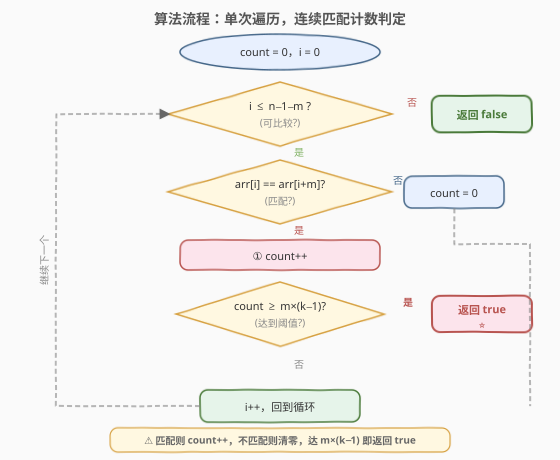

# LeetCode 重复至少 K 次且长度为 M 的模式 题解

## 1. 题目概述

- **标题 / 题号**：重复至少 K 次且长度为 M 的模式（#1566，easy）
- **链接**：https://leetcode.cn/problems/detect-pattern-of-length-m-repeated-k-or-more-times/
- **难度**：简单
- **标签**：数组、滑动窗口

**题意**：给你一个正整数数组 `arr` 和两个整数 `m`、`k`。长度为 `m` 的**模式**是 `arr` 中一段长度为 `m` 的连续子数组。如果一个模式 `p` 在 `arr` 中连续重复了 $k$ 次或更多次（即存在某个下标 `i`，使得 `arr[i..i+m-1]`、`arr[i+m..i+2m-1]`、…、`arr[i+(k-1)*m..i+k*m-1]` 这 $k$ 段长度为 $m$ 的子数组全部等于 `p`），则称该模式重复了 $k$ 次及以上。

请判断 `arr` 中是否存在某个长度为 $m$ 的模式被重复了 $k$ 次及以上。存在返回 `true`，否则返回 `false`。

**示例 1**：

```text
输入：arr = [1,2,4,4,4,4], m = 1, k = 3
输出：true
解释：模式 [4] 在下标 2 处连续重复 3 次：[4,4,4]。
```

**示例 2**：

```text
输入：arr = [1,2,1,2,1,1,1,3], m = 2, k = 2
输出：true
解释：模式 [1,2] 在下标 0 处连续重复 2 次：[1,2,1,2]。
```

**示例 3**：

```text
输入：arr = [1,2,1,2,1,3], m = 2, k = 3
输出：false
解释：模式 [1,2] 只连续重复了 2 次：[1,2,1,2]，第 3 段 [1,3] ≠ [1,2]。
```

**约束**：

- `2 <= arr.length <= 100`
- `1 <= arr[i] <= 100`
- `1 <= m <= 100`
- `2 <= k <= 100`

> 💡 数据规模虽小（$n \le 100$），暴力枚举即可通过。但题目隐藏了一个优美的观察：**$k$ 个全等块等价于 $m \times (k-1)$ 个连续位置满足 `arr[i] == arr[i+m]`**，可将 $O(n \cdot m \cdot k)$ 优化到 $O(n)$。

## 2. 解题思路

### 2.1 暴力思路：枚举起点 + 逐块比较

最直观的做法：枚举模式起始位置 `i`（`0 <= i <= n - m*k`），取 `pattern = arr[i..i+m-1]`，然后检查接下来的 $k-1$ 段是否都等于 `pattern`。

```text
for i in 0..n-m*k:
    pattern = arr[i..i+m-1]
    ok = true
    for j in 1..k-1:
        if arr[i+j*m .. i+(j+1)*m-1] != pattern:
            ok = false; break
    if ok: return true
return false
```

- 每个起点检查 $k-1$ 段、每段 $m$ 个元素，最坏 $O(n \cdot m \cdot k)$。
- 空间 $O(1)$（不计 pattern 拷贝）。

> 💡 暴力法的问题在于：**相邻起点 `i` 和 `i+1` 的检查大量重叠**——位置 `i+1` 的元素在起点 `i` 时被比较过，在起点 `i+1` 时又被重新比较。如果能将"块相等"分解为"逐位置匹配"，用计数器跟踪连续匹配数，就能避免重复比较。

### 2.2 核心观察：连续匹配计数——arr[i]==arr[i+m] 累计 m×(k−1) 次

![核心观察：连续匹配计数，arr[i]==arr[i+m] 累计 m×(k−1) 次](../images/dplmrk_concept.svg)

关键直觉：$k$ 个全等块只需 $k-1$ 对相邻块相同（传递性保证）。而"相邻块相同"可分解为 $m$ 个对应位置的元素匹配——即 `arr[pos] == arr[pos+m]`。因此：

$$\text{k 个全等块} \iff m \times (k-1) \text{ 个连续位置满足 } arr[i] == arr[i+m]$$

以 `arr = [1,2,1,2,1,2], m=2, k=3` 为例：3 个块 `[1,2] [1,2] [1,2]` 全等，等价于 4 个连续位置满足 `arr[i] == arr[i+2]`：

| 位置 i | arr[i] | arr[i+2] | 匹配? | count |
|--------|--------|----------|-------|-------|
| 0 | 1 | 1 | ✓ | 1 |
| 1 | 2 | 2 | ✓ | 2 |
| 2 | 1 | 1 | ✓ | 3 |
| 3 | 2 | 2 | ✓ | 4 = $m \times (k-1)$ → 命中 |

- **匹配**：`arr[i] == arr[i+m]` → `count++`
- **不匹配**：`arr[i] != arr[i+m]` → `count = 0`（块链断裂，之前的累积全部失效）
- **达到阈值**：`count >= m*(k-1)` → 返回 `true`

> ⚠️ **阈值是 $m \times (k-1)$ 而非 $m \times k$**：$k$ 个块只需要 $k-1$ 对相邻块相同（块0==块1、块1==块2、…、块k-2==块k-1），每对需要 $m$ 个位置匹配，总共 $m \times (k-1)$ 个连续匹配。多算一组 $m$ 会漏掉合法答案。

> 💡 **为什么清零而不是减 $m$？** 不匹配意味着"当前块的第 `(i mod m)` 个元素 ≠ 下一块的第 `(i mod m)` 个元素"，这打断了块链——从这个位置之前的位置出发，不可能再形成 $k$ 个全等块。必须从零重新计数。

### 2.3 算法流程图



整个流程是单层循环：判断 `i` 是否在可比较范围内（`i <= n-1-m`）→ 比较 `arr[i]` 与 `arr[i+m]` → 匹配则 `count++`，不匹配则 `count=0` → 检查 `count` 是否达到阈值 `m*(k-1)`，达到则立即返回 `true`，否则 `i++` 继续循环。遍历结束仍未触发则返回 `false`。

### 2.4 示例演算

![示例演算：arr = [1,2,4,4,4,4], m=1, k=3](../images/dplmrk_example_walkthrough.svg)

以示例 1 `arr = [1,2,4,4,4,4], m=1, k=3` 为例，目标阈值 $= m \times (k-1) = 1 \times 2 = 2$：

| i | arr[i] | arr[i+1] | 匹配? | count | 动作 |
|---|--------|----------|-------|-------|------|
| 0 | 1 | 2 | ✗ | 0 | 1≠2 → count=0 |
| 1 | 2 | 4 | ✗ | 0 | 2≠4 → count=0 |
| 2 | 4 | 4 | ✓ | 1 | 4==4 → count++ |
| 3 | 4 | 4 | ✓ | 2 | count++ → **2 ≥ 2 → 返回 true ⭐** |
| 4 | 4 | — | — | — | 未执行（已短路返回） |

在 `i=3` 时 `count` 达到 2，立即返回 `true`。模式 `[4]` 在下标 2 处连续重复 3 次。

## 3. 参考代码

### 方法一：连续匹配计数 $O(n)$（推荐）

### C++

```cpp
class Solution {
  public:
    bool containsPattern(vector<int>& arr, int m, int k) {
        int n = arr.size();
        int target = m * (k - 1);
        int count = 0;
        for (int i = 0; i + m < n; ++i) {
            if (arr[i] == arr[i + m]) {
                if (++count >= target) return true;
            } else {
                count = 0;
            }
        }
        return false;
    }
};
```

### Python

```python
class Solution:
    def containsPattern(self, arr: list[int], m: int, k: int) -> bool:
        target = m * (k - 1)
        count = 0
        for i in range(len(arr) - m):
            if arr[i] == arr[i + m]:
                count += 1
                if count >= target:
                    return True
            else:
                count = 0
        return False
```

> 💡 **循环条件 `i + m < n`**：确保 `arr[i + m]` 不越界。当 $m \ge n$ 时循环不执行，直接返回 `false`——此时数组连一个完整块都放不下，更不可能重复 $k$ 次。当 $m \times k > n$ 时，`count` 最多达到 $n - m < m \times (k-1)$，自然无法命中阈值，也返回 `false`。**无需任何特判**。

### 方法二：暴力枚举 $O(n \cdot m \cdot k)$（验证思路）

### C++

```cpp
class Solution {
  public:
    bool containsPattern(vector<int>& arr, int m, int k) {
        int n = arr.size();
        for (int i = 0; i + m * k <= n; ++i) {
            bool ok = true;
            for (int j = 1; j < k && ok; ++j) {
                for (int p = 0; p < m; ++p) {
                    if (arr[i + p] != arr[i + j * m + p]) {
                        ok = false;
                        break;
                    }
                }
            }
            if (ok) return true;
        }
        return false;
    }
};
```

### Python

```python
class Solution:
    def containsPattern(self, arr: list[int], m: int, k: int) -> bool:
        n = len(arr)
        for i in range(n - m * k + 1):
            if all(arr[i + p] == arr[i + j * m + p]
                   for j in range(1, k) for p in range(m)):
                return True
        return False
```

> 💡 暴力法对每个起点独立检查 $k$ 段，相邻起点的检查大量重叠。优化法将"块相等"分解为"逐位置匹配"并用计数器跟踪连续性，将三重循环降为单层。

## 4. 复杂度分析

| 维度 | 方法一（计数） | 方法二（暴力） | 说明 |
|------|---------------|---------------|------|
| 时间复杂度 | $O(n)$ | $O(n \cdot m \cdot k)$ | 计数法每个位置只比较一次；暴力法每起点检查 $k-1$ 段各 $m$ 元素 |
| 空间复杂度 | $O(1)$ | $O(1)$ | 两种方法均只用常数变量 |

> ⚠️ 本题 $n \le 100$，两种方法均可通过。但面试中应优先给出 $O(n)$ 的计数法，展示对"块相等 ↔ 逐位置匹配"等价转换的洞察。

## 5. 扩展：从"判定存在"到"最大重复次数"

本题问"是否存在重复 $k$ 次的模式"。若改为"找出数组中**任意**长度为 $m$ 的模式的最大重复次数"，思路类似——遍历时维护 `count` 记录当前连续匹配数，最大重复次数 $= \lfloor \text{max\_count} / m \rfloor + 1$（`count` 个连续匹配意味着 $\lfloor \text{count}/m \rfloor + 1$ 个全等块）。

这与字符串问题 [1668. 最大重复子字符串](https://leetcode.cn/problems/maximum-repeating-substring/) 同源——后者给定固定模式 `word`，求其在 `sequence` 中的最大连续重复次数，同样可用逐位置匹配计数法解决。

> 💡 进一步地，若模式长度 $m$ 也未知（求"数组是否由某个模式周期性重复构成"），则退化为 [459. 重复的子字符串](https://leetcode.cn/problems/repeated-substring-pattern/) 的数组版本，需枚举 $m$ 为 $n$ 的约数逐个验证。

## 6. 面试要点

1. **为什么阈值是 $m \times (k-1)$ 而不是 $m \times k$？**

   - $k$ 个全等块只需 $k-1$ 对相邻块相同（传递性：块0==块1==…==块k-1）。每对相邻块需要 $m$ 个对应位置匹配，总共 $m \times (k-1)$ 个连续匹配。用 $m \times k$ 会多要求一组 $m$ 个匹配，导致合法答案被漏判。

2. **为什么不匹配时清零而不是减 $m$？**

   - 不匹配意味着"当前块的第 `(i mod m)` 个元素 ≠ 下一块对应元素"，打断了块链。从这个位置之前出发不可能再形成 $k$ 个全等块——之前累积的匹配全部失效，必须从零重新计数。这与"连续奇数计数遇偶清零"（[1550](https://leetcode.cn/problems/three-consecutive-odds/)）是同一思路。

3. **暴力法 $O(n \cdot m \cdot k)$ 和计数法 $O(n)$ 的本质区别？**

   - 暴力法以"块"为单位，每个起点独立检查 $k-1$ 个块，相邻起点的检查大量重叠。计数法将"块相等"分解为"逐位置匹配"，用 `count` 跟踪连续匹配数，每个位置只比较一次 `arr[i]` 与 `arr[i+m]`，天然支持"找到即停"的短路返回。

4. **如果 $m \times k > n$ 怎么办？需要特判吗？**

   - 不需要。若 $m \ge n$，循环条件 `i + m < n` 直接不满足，返回 `false`。若 $m < n$ 但 $m \times k > n$，`count` 最多达到 $n - m < m \times (k-1)$，无法命中阈值，自然返回 `false`。

5. **这个方法和字符串匹配（KMP）有什么关系？**

   - 本质上都在检查"模式是否在序列中重复出现"。KMP 解决的是"给定模式在文本中出现的位置"，更通用但更复杂。本题的特殊性在于模式是数组自身的子数组（自引用）且要求**连续重复**，因此可以用更简单的逐位置匹配计数法，无需预处理 next 数组。

## 同类练习题

| # | 题目 | 与本题的关联 |
|---|------|-------------|
| 1668 | [最大重复子字符串](https://leetcode.cn/problems/maximum-repeating-substring/) | 从"判定存在"升级为"求最大重复次数"，给定固定模式在序列中的最大连续重复数，同属逐位置匹配计数 |
| 459 | [重复的子字符串](https://leetcode.cn/problems/repeated-substring-pattern/) | 判断字符串是否由某个子串周期性重复构成，模式长度未知需枚举约数，本题的"模式长度给定"退化版 |
| 718 | [最长重复子数组](https://leetcode.cn/problems/maximum-length-of-repeated-subarray/)（[题解](../0401-0500/718_最长重复子数组.md)） | 两个数组的最长公共子数组，二维 DP 逐位置匹配，与本题"逐位置比较"思想同源 |
| 686 | [重复叠加字符串匹配](https://leetcode.cn/problems/repeated-string-match/) | 重复叠加字符串使其包含目标串，与本题"模式重复"概念相关但方向相反 |
| 1550 | [存在连续三个奇数的数组](https://leetcode.cn/problems/three-consecutive-odds/)（[题解](../1501-1600/1550_存在连续三个奇数的数组.md)） | 连续计数器遇断清零，与本题 `count` 的增减逻辑完全同构 |
