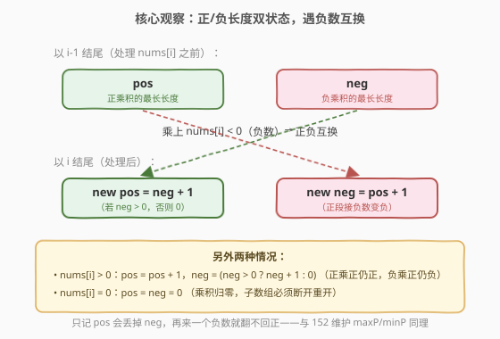
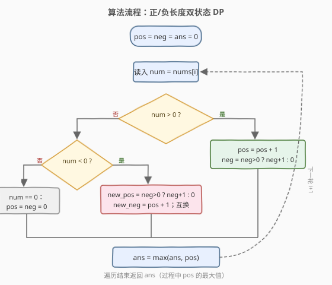

# 乘积为正的最长子数组长度

- **题目名称**：乘积为正的最长子数组长度
- **链接**：[1567. 乘积为正的最长子数组长度](https://leetcode.cn/problems/maximum-length-of-subarray-with-positive-product/)
- **难度**：中等
- **标签**：数组、动态规划、贪心

## 1. 题目概述

给你一个整数数组 `nums`，请你求出**乘积为正数**的**最长连续子数组**的长度（子数组至少包含一个元素）。一个子数组的乘积是其所有元素相乘的结果。

**示例 1**：

```text
输入：nums = [1,-2,-3,4]
输出：4
解释：整个数组 [1,-2,-3,4] 的乘积 1·(-2)·(-3)·4 = 24 > 0，长度为 4。
```

**示例 2**：

```text
输入：nums = [0,1,-2,-3,-4]
输出：3
解释：子数组 [1,-2,-3] 乘积 1·(-2)·(-3) = 6 > 0，长度为 3。
       [-2,-3,-4] 乘积为 -24 < 0，不合要求。
```

**示例 3**：

```text
输入：nums = [-1,-2,-3,0,1]
输出：2
解释：子数组 [-1,-2] 乘积 2 > 0；[-2,-3] 乘积 6 > 0；长度均为 2。
       0 之后的 [1] 长度只有 1。
```

**示例 4**：

```text
输入：nums = [-1,2]
输出：1
解释：单独取 [2] 乘积 2 > 0；[-1,2] 乘积 -2 < 0。最长长度 1。
```

**约束条件**：

- `1 <= nums.length <= 10^5`
- `-10^9 <= nums[i] <= 10^9`

> 💡 本题是 [152. 乘积最大子数组](../0101-0200/152_乘积最大子数组.md) 的「计数版变体」：152 求**乘积的最大值**，本题求**乘积为正的最长长度**。两者共享同一条核心洞察——**负数会让「正/负」两种状态互换**，因此必须同时维护两个状态。

---

## 2. 解题思路

### 2.1 暴力思路

枚举所有连续子数组 `nums[i..j]`，逐个累乘判断乘积是否为正，记录最长长度。时间复杂度 `O(n^2)`，在 `n = 10^5` 时**超时**，且累乘还会溢出 64 位整数（元素绝对值可达 `10^9`，连乘 `10^5` 个）。

```text
ans = 0
for i in range(n):
    prod = 1
    for j in range(i, n):
        prod *= nums[j]      # 溢出风险！
        if prod > 0:
            ans = max(ans, j - i + 1)
```

> ⚠️ 两个瓶颈：① 每个起点都重新累乘，未复用前一步信息；② 真去算乘积会溢出。**关键转念**：我们只关心乘积的**符号**，不关心其数值——而符号由「负数个数的奇偶」和「是否遇到 0」决定，完全可以**只数长度**。

### 2.2 核心观察：正/负长度双状态 DP



借鉴 152 的双状态思想，但把「乘积值」换成「**长度**」。定义两个以当前下标 `i` 结尾的状态：

- `pos`：乘积为**正**的最长子数组长度；
- `neg`：乘积为**负**的最长子数组长度（若无这样的子数组则为 `0`）。

按 `nums[i]` 的符号分三种情况转移（注意 0 是天然的分隔符，乘积一旦遇 0 即归零，子数组必须断开）：

| `nums[i]` | `pos` 更新 | `neg` 更新 | 直觉 |
|-----------|------------|------------|------|
| `> 0`（正数） | `pos + 1` | `neg > 0` 时 `neg + 1`，否则 `0` | 正乘正仍正，接长；负乘正仍负，接长（若原本就有负段） |
| `< 0`（负数） | `neg > 0` 时 `neg + 1`，否则 `0` | `pos + 1` | **正负互换**：负段接负数翻正，正段接负数变负 |
| `== 0`（零） | `0` | `0` | 乘积归零，任何跨越 0 的子数组乘积都是 0，必须重新开段 |

> 💡 **为什么 `pos = pos + 1` 在 `pos = 0` 时也对？** `pos = 0` 表示「以 `i-1` 结尾没有正乘积子数组」。当 `nums[i] > 0` 时，单独取 `nums[i]` 本身就是正乘积、长度为 `1`，恰好等于 `pos + 1 = 0 + 1`。这一「巧合」让正数情况无需特判。但负数情况**必须特判**：`nums[i] < 0` 单独成段是**负**乘积，不能算入 `pos`，所以只有当 `neg > 0`（存在可翻正的负段）时 `pos` 才能更新为 `neg + 1`，否则置 `0`。

> ⚠️ **负数情况必须用临时变量互换**：`new_pos` 依赖旧 `neg`，`new_neg` 依赖旧 `pos`，二者同时基于上一轮旧值计算后才能赋值。若先更新 `pos` 再用它算 `neg`，会把新值当旧值用，导致错误（与 152 同款陷阱）。

最终答案为遍历过程中 `pos` 的最大值。

### 2.3 算法流程图



外层顺序扫描 `nums`，每步根据 `nums[i]` 符号走三个分支之一，更新 `pos`/`neg` 后用 `pos` 刷新全局答案 `ans`。由于 `pos`、`neg` 只依赖上一轮的值，可用两个变量滚动，空间压到 `O(1)`。

### 2.4 示例演算

以 `nums = [1,-2,-3,4]` 为例，跟踪 `pos`、`neg`、`ans` 的滚动过程：

![示例演算：[1,-2,-3,4] 逐格递推](../images/maxpos_walkthrough.svg)

| i | nums[i] | pos | neg | ans | 说明 |
|---|---------|-----|-----|-----|------|
| 0 | 1       | 1   | 0   | 1   | 正数：`pos=0+1=1`；`neg=0`（无负段可接） |
| 1 | -2      | 0   | 2   | 1   | 负数互换：`new_pos=0`（`neg=0` 无负段翻正）；`new_neg=pos+1=2`（正段 [1] 接 -2 变负） |
| 2 | -3      | 3   | 1   | 3   | 负数互换：`new_pos=neg+1=3`（负段 [1,-2] 接 -3 翻正）；`new_neg=pos+1=1`（[-3] 单独成负段） |
| 3 | 4       | 4   | 2   | 4   | 正数：`pos=3+1=4`；`neg=1+1=2`（负段接 4 仍负） |

最终答案 `ans = 4`（整个数组乘积 `24 > 0`）。

> 💡 注意 `i=1` 这一步：虽然 `pos` 跌到 `0`，但 `neg` 记下了 `2`（负段 [1,-2] 的长度）。正是这个 `neg` 让 `i=2` 遇到第二个负数 `-3` 时能翻回 `pos = 3`——这就是同时维护正/负两个长度的意义，与 152 维护 `maxP`/`minP` 完全同理。

---

## 3. 参考代码

### C++

```cpp
class Solution {
  public:
    int getMaxLen(vector<int>& nums) {
        int pos = 0, neg = 0, ans = 0;
        for (int num : nums) {
            if (num > 0) {
                pos = pos + 1;
                neg = (neg > 0) ? neg + 1 : 0;
            } else if (num < 0) {
                int newPos = (neg > 0) ? neg + 1 : 0;
                int newNeg = pos + 1;
                pos = newPos;
                neg = newNeg;
            } else {
                pos = 0;
                neg = 0;
            }
            ans = max(ans, pos);
        }
        return ans;
    }
};
```

### Python

```python
class Solution:
    def getMaxLen(self, nums: List[int]) -> int:
        pos = neg = ans = 0
        for num in nums:
            if num > 0:
                pos += 1
                neg = neg + 1 if neg > 0 else 0
            elif num < 0:
                # 右侧整体求值后再赋值，天然基于旧值互换，无需临时变量
                pos, neg = (neg + 1 if neg > 0 else 0), pos + 1
            else:
                pos = neg = 0
            ans = max(ans, pos)
        return ans
```

> ⚠️ **C++ 易错点**：负数分支必须用 `newPos`/`newNeg` 暂存后一次性赋值，不能写成 `pos = ...; neg = pos + 1;`——第二步的 `pos` 已是新值。Python 的多重赋值 `pos, neg = ..., ...` 右侧先整体求值再绑定，天然规避此坑，可写得比 C++ 更紧凑。

---

## 4. 复杂度分析

| 维度 | 复杂度 | 说明 |
|------|--------|------|
| 时间复杂度 | $O(n)$ | 只遍历数组一次，每步 `O(1)` 的比较与赋值，无乘法运算 |
| 空间复杂度 | $O(1)$ | 仅用 `pos`、`neg`、`ans` 三个滚动变量 |

$n = 10^5$ 时单趟扫描极快，C++/Python 均可轻松 AC。相比暴力法，本解法**完全不算乘积**，只追踪长度，天然回避溢出问题。

---

## 5. 扩展：前缀积分段 + 负数计数法

除了双状态 DP，还有一种「**按 0 分段 + 段内数负数**」的思路，同样 $O(n)$ / $O(1)$，更贴近「符号只由负数个数奇偶决定」的直觉：

1. **按 0 切段**：0 是分隔符，任何含 0 的子数组乘积都是 0，答案必落在某个不含 0 的连续段内。
2. **段内决策**：对一个不含 0 的段 `[L, R]`，设其中负数个数为 `cnt`：
   - `cnt` 为**偶数**：整段乘积为正，直接取 `R - L + 1`。
   - `cnt` 为**奇数**：必须丢掉一个负数让奇偶变偶。丢最左负数左边的部分或最右负数右边的部分更长——即 `max(最右负数下标 - L, R - 最左负数下标)`。
3. 扫描时维护当前段的 `firstNeg`（首个负数下标）、`lastNeg`（末个负数下标）、`negCnt`，遇 0 重置。

```cpp
class Solution {
  public:
    int getMaxLen(vector<int>& nums) {
        int ans = 0;
        int L = 0;                 // 当前不含 0 段的左端
        int firstNeg = -1, lastNeg = -1, negCnt = 0;
        for (int i = 0; i < (int)nums.size(); ++i) {
            if (nums[i] == 0) {    // 段结束，结算并重置
                L = i + 1;
                firstNeg = lastNeg = -1;
                negCnt = 0;
                continue;
            }
            if (nums[i] < 0) {
                if (firstNeg == -1) firstNeg = i;
                lastNeg = i;
                ++negCnt;
            }
            int len;
            if (negCnt % 2 == 0) {
                len = i - L + 1;
            } else {
                len = max(i - firstNeg, lastNeg - L);
            }
            ans = max(ans, len);
        }
        return ans;
    }
};
```

> 💡 **两种解法对比**：分段法把「符号」问题显式化为「负数个数奇偶」，逻辑直观但分支多、边界多（首/末负数下标、段重置）；双状态 DP 把「正/负」封装成两个长度变量、靠互换处理翻转，代码更短更不易错。**面试推荐 DP 写法**，分段法作为思路印证或追问备选。

---

## 6. 面试要点

1. **状态怎么定义？为什么是「长度」而不是「乘积」？**
   - `pos`/`neg` 分别为以 `i` 结尾、乘积为正/负的**最长子数组长度**。本题求长度而非乘积值，且真算乘积会溢出（元素绝对值可达 `10^9`，连乘 `10^5` 个）；只追踪长度既回避溢出又直接对应答案。

2. **负数情况为什么是「互换」？为什么 `pos` 更新要判 `neg > 0`？**
   - 负数会让正乘积变负、负乘积变正，所以 `new_pos` 来自旧 `neg`、`new_neg` 来自旧 `pos`，方向互换。但 `nums[i] < 0` 单独成段是**负**乘积，不能贡献给 `pos`；只有当 `neg > 0`（存在可翻正的负段）时 `pos` 才能 `= neg + 1`，否则置 `0`。

3. **为什么 `nums[i] > 0` 时 `pos = pos + 1` 在 `pos = 0` 时也成立？**
   - `pos = 0` 表示上一步无正段；`nums[i] > 0` 单独取就是正乘积长度 `1`，恰好等于 `pos + 1 = 0 + 1`。这一巧合让正数情况免特判，但负数情况因「单独成段是负不是正」必须特判 `neg > 0`。

4. **遇到 0 为什么直接把 `pos`、`neg` 都置 0？**
   - 任何含 0 的子数组乘积都是 0（非正非负），不可能再接长成「正乘积」或「负乘积」子数组。置 0 等价于「在此处掐断、从下一个元素重新开段」，与子数组不能跨越 0 的语义一致。

5. **和 152「乘积最大子数组」的核心区别是什么？**
   - 152 维护 `maxP`/`minP`（**乘积值**），求最大值；本题维护 `pos`/`neg`（**长度**），求最长长度。两者共享「负数让两种状态互换、必须同时维护」的洞察，差别只在状态语义是值还是长度。152 的乘积会因 0 自然归零，本题则需显式置 0 断段。

---

## 7. 同类练习题

- [152. 乘积最大子数组](https://leetcode.cn/problems/maximum-product-subarray/)（[题解](../0101-0200/152_乘积最大子数组.md)）：同骨架双状态 DP，但状态是「乘积值」而非「长度」，求最大值；本题是其计数版变体
- [53. 最大子数组和](https://leetcode.cn/problems/maximum-subarray/)（[题解](../0001-0100/53_最大子数组和.md)）：加法版 Kadane，只维护一个最大值（负数不会翻正，无需双状态），对比乘法为何要双状态
- [918. 环形子数组的最大和](https://leetcode.cn/problems/maximum-sum-circular-subarray/)：Kadane 环形变体，同为「以 i 结尾」滚动 DP 家族，对比状态定义的差异
- [978. 最长湍流子数组](https://leetcode.cn/problems/longest-turbulent-subarray/)：维护「上升/下降」两种长度的滚动 DP，符号比较驱动状态切换，与本题「正/负长度互换」结构高度相似
