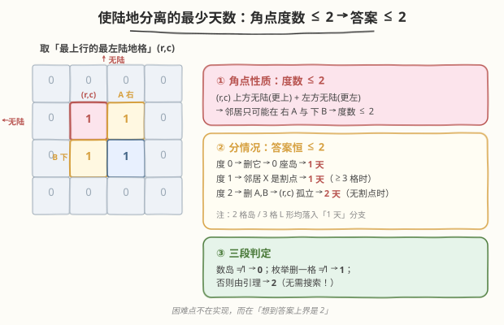
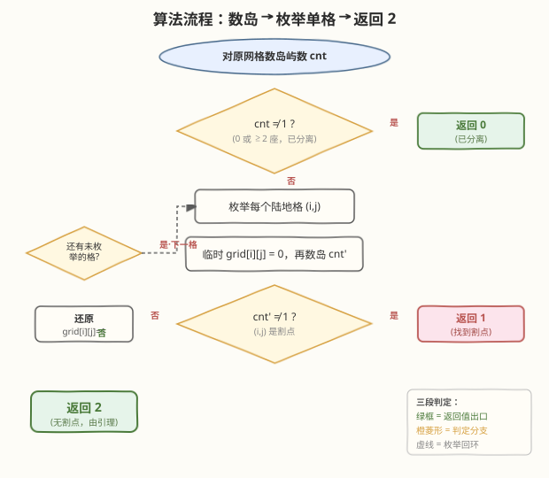
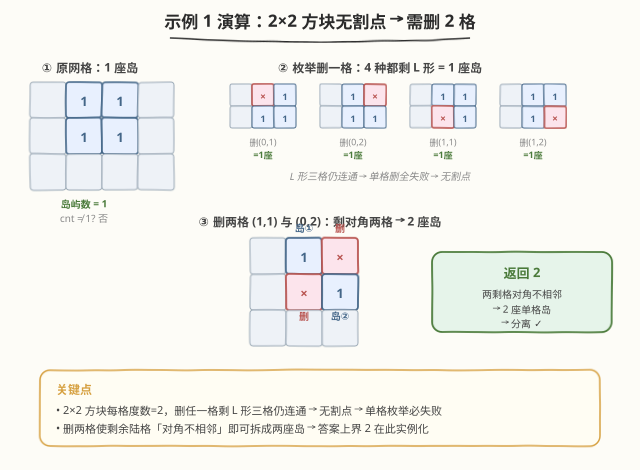

# 使陆地分离的最少天数

- **题目名称**：使陆地分离的最少天数
- **链接**：[1568. 使陆地分离的最少天数](https://leetcode.cn/problems/minimum-number-of-days-to-disconnect-island/)
- **难度**：困难
- **标签**：图、深度优先搜索、二维网格、割点、脑筋急转弯

## 1. 题目概述

给定一个 $m \times n$ 的二维网格 `grid`，其中 `1` 表示陆地，`0` 表示水。**岛屿**由水平或竖直方向上相邻的 `1` 连接形成。如果**恰好只有一座岛屿**，则陆地是**连通的**；否则（$0$ 座或 $\ge 2$ 座）就是**分离的**。

每天可以将**任意一个**陆地单元改成水单元。返回使陆地分离的**最少天数**。

**示例 1**：

```text
输入：grid = [[0,1,1,0],
             [0,1,1,0],
             [0,0,0,0]]
输出：2
解释：至少需要 2 天。把 grid[1][1] 和 grid[0][2] 改为水，得到两座分离的岛屿。
```

**示例 2**：

```text
输入：grid = [[1,1]]
输出：2
解释：全水也视为分离（0 座岛屿）。[[1,1]] → [[0,0]]，需要 2 天。
```

**约束条件**：

- $m = \text{grid.length}$，$n = \text{grid[i].length}$
- $1 \le m, n \le 30$
- `grid[i][j]` 为 `0` 或 `1`

> 💡 注意「分离」的判定是 $\text{岛屿数} \ne 1$：**$0$ 座岛屿也算分离**（见示例 2），这是边界情况的关键。

---

## 2. 解题思路

### 2.1 暴力思路：每天试删一个格子？

最少天数最少是 $0$，最多能到多少？直觉上可能需要删很多格才能把一座大岛屿拆开。但本题 $m, n \le 30$，岛屿最多 $900$ 格，若答案是 $k$，暴力枚举「删哪 $k$ 个格子」是 $C(900, k)$，组合爆炸。

> 💡 转换视角：先回答「答案的上界是多少」。如果能证明**答案永远 $\le 2$**，那么只需判断三种情况：$0$、$1$、$2$——分别用一次「数岛屿」和一次「枚举单格删除」即可，无需组合搜索。

### 2.2 核心观察：答案永远不超过 2



**关键引理**：在一座连通的岛屿中，取「最上方一行中最靠左的陆地格」$(r, c)$。由于它上方（第 $r-1$ 行）无陆地、左边（同行第 $c-1$ 列）无陆地，它的陆地邻居**只可能在右边 $(r, c+1)$ 和下边 $(r+1, c)$**——即**度数 $\le 2$**。

据此分情况（设岛屿已连通，即原始岛屿数为 $1$）：

| $(r,c)$ 度数 | 岛屿规模 | 结论 | 说明 |
|--------------|----------|------|------|
| $0$ | 单格 | 答案 $= 1$ | 删掉它 → $0$ 座岛屿（分离） |
| $1$ | $\ge 3$ 格 | 答案 $= 1$ | 唯一邻居 $X$ 是**割点**：删 $X$ 后叶子 $(r,c)$ 孤立成 $1$ 座岛，其余 $\ge 1$ 座 → $\ge 2$ 座 |
| $1$ | $2$ 格 $\{(r,c), X\}$ | 答案 $= 2$ | 删任一格剩 $1$ 格 $= 1$ 座岛；需删两格 → $0$ 座（分离） |
| $2$ | $3$ 格 $\{(r,c), A, B\}$ | 答案 $= 1$ | $A=(r,c+1)$ 与 $B=(r+1,c)$ **对角不相邻**，$(r,c)$ 是割点：删 $(r,c)$ → $A, B$ 分离 |
| $2$ | $\ge 4$ 格且无割点 | 答案 $= 2$ | 删 $A, B$ 两格 → $(r,c)$ 孤立成 $1$ 座岛，其余 $\ge 1$ 格成另一座 → $\ge 2$ 座 |

> 💡 **最后一种情况为什么「无割点」时删 $A, B$ 必然分离？** 若岛屿只有 $3$ 格 $\{(r,c),A,B\}$，$(r,c)$ 就是割点（上表第 4 行已处理）；所以「无割点 + 度数 $2$」时岛屿必有 $\ge 4$ 格。删去 $A, B$ 后，$(r,c)$ 失去全部邻居沦为单格岛，而剩余 $\ge 1$ 格构成另一座岛，岛屿数 $\ge 2$ → 分离。

> ⚠️ 上述讨论覆盖了所有情况，**结论是答案永远 $\le 2$**。因此只需三段判定：$0$（已分离）→ $1$（存在割点）→ $2$（其余）。这正是本题「困难」的精华所在——看似搜索，实为脑筋急转弯。

### 2.3 算法流程图



**算法步骤**：

1. **判 $0$**：对原网格数岛屿数 `cnt`。若 `cnt != 1`（$0$ 或 $\ge 2$），直接返回 $0$。
2. **判 $1$**：枚举每个陆地格 $(i, j)$，临时把它改成水，再数岛屿数。若任一改动使岛屿数 $\ne 1$，返回 $1$（该格就是割点）。改完后还原。
3. **判 $2$**：若上两步都不命中，由引理知答案必为 $2$，直接返回 $2$。

### 2.4 示例演算

以示例 1 `grid = [[0,1,1,0],[0,1,1,0],[0,0,0,0]]` 为例。岛屿是第 $0\!-\!1$ 行、第 $1\!-\!2$ 列的 $2\times 2$ 方块：$(0,1),(0,2),(1,1),(1,2)$。



| 步骤 | 操作 | 剩余陆地 | 岛屿数 | 判定 |
|------|------|----------|--------|------|
| 1 | 原网格 | $(0,1),(0,2),(1,1),(1,2)$ | $1$ | $\ne 1$? 否，进入步骤 2 |
| 2 | 删 $(0,1)$ | $(0,2),(1,1),(1,2)$（L 形连通） | $1$ | $\ne 1$? 否 |
| 2 | 删 $(0,2)$ | $(0,1),(1,1),(1,2)$（L 形连通） | $1$ | $\ne 1$? 否 |
| 2 | 删 $(1,1)$ | $(0,1),(0,2),(1,2)$（L 形连通） | $1$ | $\ne 1$? 否 |
| 2 | 删 $(1,2)$ | $(0,1),(0,2),(1,1)$（L 形连通） | $1$ | $\ne 1$? 否 |
| 3 | 单格删全失败 → 返回 $2$ | — | — | 删 $(1,1)$ 与 $(0,2)$ → $(0,1),(1,2)$ 对角不相邻 → $2$ 座岛 ✓ |

> 💡 $2\times 2$ 方块的每个格子度数都是 $2$，删任一格剩 L 形三格仍连通（$1$ 座岛），所以无割点、单格删全部失败 → 答案 $2$。验证：删 $(1,1)$ 和 $(0,2)$ 后剩 $(0,1)$、$(1,2)$，二者对角不相邻 → $2$ 座岛 → 分离。

---

## 3. 参考代码

### C++

```cpp
class Solution {
    int m, n;
    const int dx[4] = {-1, 1, 0, 0};
    const int dy[4] = {0, 0, -1, 1};

    // 数岛屿数：对每个未访问的 '1' 启动 BFS
    int countIslands(vector<vector<int>>& g) {
        vector<vector<char>> vis(m, vector<char>(n, 0));
        int cnt = 0;
        for (int i = 0; i < m; ++i)
            for (int j = 0; j < n; ++j)
                if (g[i][j] == 1 && !vis[i][j]) {
                    ++cnt;
                    queue<pair<int,int>> q;
                    q.push({i, j});
                    vis[i][j] = 1;
                    while (!q.empty()) {
                        auto [x, y] = q.front(); q.pop();
                        for (int k = 0; k < 4; ++k) {
                            int nx = x + dx[k], ny = y + dy[k];
                            if (nx < 0 || nx >= m || ny < 0 || ny >= n) continue;
                            if (g[nx][ny] == 1 && !vis[nx][ny]) {
                                vis[nx][ny] = 1;
                                q.push({nx, ny});
                            }
                        }
                    }
                }
        return cnt;
    }
  public:
    int minDays(vector<vector<int>>& grid) {
        m = grid.size(), n = grid[0].size();
        // 步骤 1：已分离？
        if (countIslands(grid) != 1) return 0;
        // 步骤 2：存在割点？枚举删一格
        for (int i = 0; i < m; ++i)
            for (int j = 0; j < n; ++j)
                if (grid[i][j] == 1) {
                    grid[i][j] = 0;
                    if (countIslands(grid) != 1) return 1;
                    grid[i][j] = 1;  // 还原
                }
        // 步骤 3：无割点，由引理答案为 2
        return 2;
    }
};
```

### Python

```python
class Solution:
    def minDays(self, grid: List[List[int]]) -> int:
        m, n = len(grid), len(grid[0])
        dirs = [(-1, 0), (1, 0), (0, -1), (0, 1)]

        def count_islands() -> int:
            vis = [[False] * n for _ in range(m)]
            cnt = 0
            for i in range(m):
                for j in range(n):
                    if grid[i][j] == 1 and not vis[i][j]:
                        cnt += 1
                        q = collections.deque([(i, j)])
                        vis[i][j] = True
                        while q:
                            x, y = q.popleft()
                            for dx, dy in dirs:
                                nx, ny = x + dx, y + dy
                                if 0 <= nx < m and 0 <= ny < n \
                                        and grid[nx][ny] == 1 and not vis[nx][ny]:
                                    vis[nx][ny] = True
                                    q.append((nx, ny))
            return cnt

        if count_islands() != 1:
            return 0
        for i in range(m):
            for j in range(n):
                if grid[i][j] == 1:
                    grid[i][j] = 0
                    if count_islands() != 1:
                        return 1
                    grid[i][j] = 1
        return 2
```

> 💡 **数岛屿用 BFS 而非 DFS**：$30 \times 30$ 规模下两者皆可，但 BFS 用 `deque` 迭代、无栈溢出风险，且每次 `countIslands` 都新建 `vis` 数组避免状态污染。每次枚举删格后**务必还原** `grid[i][j] = 1`，否则会污染后续判定。

---

## 4. 复杂度分析

| 维度 | 复杂度 | 说明 |
|------|--------|------|
| 时间复杂度 | $O((mn)^2)$ | 枚举 $mn$ 个陆地格，每次调用 `countIslands` 扫描全网格 $O(mn)$；$mn \le 900$，总操作 $\le 8.1 \times 10^5$ |
| 空间复杂度 | $O(mn)$ | `vis` 数组 + BFS 队列，均 $O(mn)$ |

> 💡 本题规模极小（$mn \le 900$），$O((mn)^2)$ 完全够用。若 $m, n$ 放大到 $500$，则需改用第 5 节的 Tarjan 割点 $O(mn)$ 解法。

---

## 5. 扩展：Tarjan 割点算法（$O(mn)$）

「答案是否为 $1$」等价于「岛屿连通图是否存在**割点**」（删去后图不连通的顶点）。可用 **Tarjan 割点算法**在 $O(mn)$ 时间内一次性判定，避免枚举每个格子。

**核心思想**：对岛屿连通图做 DFS，维护两个数组：

- `dfn[u]`：节点 $u$ 的 DFS 时间戳（访问序）。
- `low[u]`：$u$ 经至多一条非树边（回边）能回溯到的最小时间戳。

**割点判定**（$u$ 非根）：

$$
\exists \text{ 子节点 } v,\ \ \text{low}[v] \ge \text{dfn}[u] \implies u \text{ 是割点}
$$

> 💡 直觉：`low[v] >= dfn[u]` 说明子树 $v$ 无法绕过 $u$ 回到 $u$ 的祖先——删掉 $u$ 后子树 $v$ 与外界断开，故 $u$ 是割点。根节点是割点当且仅当它有 $\ge 2$ 个 DFS 子节点。

**算法流程**：

1. 数岛屿数。若 $\ne 1$，返回 $0$。
2. 对唯一岛屿做一次 Tarjan，记录是否存在割点。
3. 若存在割点，返回 $1$；否则返回 $2$。

### C++（Tarjan 版骨架）

```cpp
class Solution {
    int m, n, ts = 0;
    const int dx[4] = {-1,1,0,0}, dy[4] = {0,0,-1,1};
    vector<vector<int>> dfn, low;
    bool hasArt = false;

    // parent (pi,pj) 排除「立即原路返回」
    void tarjan(vector<vector<int>>& g, int i, int j, int pi, int pj) {
        dfn[i][j] = low[i][j] = ++ts;
        int child = 0;
        for (int k = 0; k < 4; ++k) {
            int ni = i+dx[k], nj = j+dy[k];
            if (ni<0||ni>=m||nj<0||nj>=n||g[ni][nj]!=1) continue;
            if (dfn[ni][nj] == 0) {           // 树边
                ++child;
                tarjan(g, ni, nj, i, j);
                low[i][j] = min(low[i][j], low[ni][nj]);
                // 非根割点判定；根割点判定（child>=2）在调用处处理
                if ((pi!=-1||pj!=-1) && low[ni][nj] >= dfn[i][j]) hasArt = true;
            } else if (!(ni==pi && nj==pj)) { // 回边
                low[i][j] = min(low[i][j], dfn[ni][nj]);
            }
        }
        if (pi==-1 && pj==-1 && child >= 2) hasArt = true;  // 根割点
    }
    // countIslands 同前，略
  public:
    int minDays(vector<vector<int>>& grid) {
        m = grid.size(); n = grid[0].size();
        if (countIslands(grid) != 1) return 0;
        dfn.assign(m, vector<int>(n, 0));
        low.assign(m, vector<int>(n, 0));
        // 找一个 '1' 作 DFS 根
        for (int i=0;i<m && !hasArt;++i)
            for (int j=0;j<n && !hasArt;++j)
                if (grid[i][j]==1 && dfn[i][j]==0)
                    tarjan(grid, i, j, -1, -1);
        return hasArt ? 1 : 2;
    }
};
```

| 维度 | 枚举删格法 | Tarjan 割点法 |
|------|-----------|---------------|
| 时间 | $O((mn)^2)$ | $O(mn)$ |
| 空间 | $O(mn)$ | $O(mn)$ |
| 实现 | 简短直观 | 需手写 `dfn`/`low` |
| 适用 | $m,n \le 30$（本题） | 大规模网格 |

> ⚠️ **不要忘了「答案 $\le 2$」这一上界**。无论用哪种方法，本质都是「判 $0$ → 判 $1$（割点）→ 否则 $2$」。若误以为答案可以很大而去写搜索/DP，就会陷入组合爆炸的死胡同。

---

## 6. 面试要点

1. **为什么答案是 $0/1/2$ 三选一，不会更大？**

   - 取岛屿「最上方一行最靠左的陆地格」$(r,c)$，它的陆地邻居只可能在右、下，**度数 $\le 2$**。分度数 $0/1/2$ 三类讨论，每种情况要么存在割点（答案 $1$），要么删 $(r,c)$ 的两个邻居即可分离（答案 $2$）。详见 2.2 节引理。

2. **「分离」为什么包括 $0$ 座岛屿？**

   - 题目明确定义「恰好一座岛屿才算连通」，其余（$0$ 或 $\ge 2$）都算分离。所以把陆地全删成水（$0$ 座）也满足条件——这正是示例 2 `[[1,1]]` 答案为 $2$ 而非 $1$ 的原因。

3. **枚举删格时，为什么「岛屿数 $\ne 1$」就说明该格是割点？**

   - 删格前岛屿数为 $1$。删格后若岛屿数变成 $0$（删的是单格岛）或 $\ge 2$（删的是割点，把一座岛拆成多座），都满足 $\ne 1$，即该格删除后陆地分离，故答案 $\le 1$，返回 $1$。

4. **Tarjan 割点判定中，`low[v] >= dfn[u]` 的直觉是什么？**

   - `low[v]` 表示 $v$ 的子树能回溯到的最早时间戳。若它 $\ge dfn[u]$，说明子树 $v$ 怎么绕都到不了 $u$ 的祖先——$u$ 是子树 $v$ 与外界的唯一通道，删 $u$ 必断开子树 $v$。

5. **能否用并查集判割点？**

   - 不能直接判割点。并查集判的是「两点的连通性」，要判「删某点后是否断开」需对每个候选点重跑一次并查集，退化为 $O((mn)^2)$。Tarjan 是判割点的标准 $O(V+E)$ 方法。

---

## 7. 同类练习题

- [200. 岛屿数量](https://leetcode.cn/problems/number-of-islands/)：二维网格数岛屿的母题，本题 `countIslands` 的模板来源
- [1254. 统计封闭岛屿的数目](https://leetcode.cn/problems/number-of-closed-islands/)（[题解](../1201-1300/1254_统计封闭岛屿的数目.md)）：网格 DFS + 边界判定，与本题同属「网格图 DFS」家族
- [1559. 二维网格图中探测环](https://leetcode.cn/problems/detect-cycles-in-2d-grid/)（[题解](./1559_二维网格图中探测环.md)）：网格隐式图 + DFS 父节点跟踪，与本题同用「网格当图」的转化思想
- [1192. 查找集群内的关键连接](https://leetcode.cn/problems/critical-connections-in-a-network/)：Tarjan 求桥边（割边），与第 5 节割点判定同源，`low[v] > dfn[u]` 即桥
- [743. 网络延迟时间](https://leetcode.cn/problems/network-delay-time/)（[题解](../0701-0800/743_网络延迟时间.md)）：图 BFS/DFS 与连通性的基础练习
