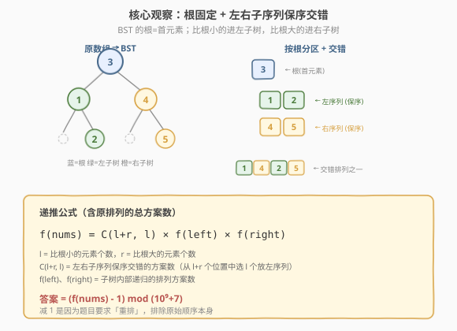
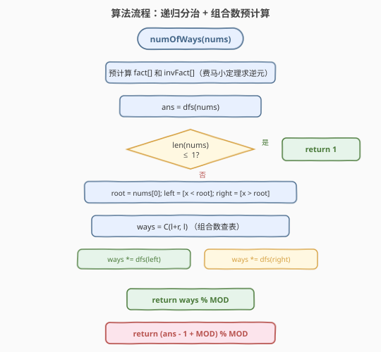
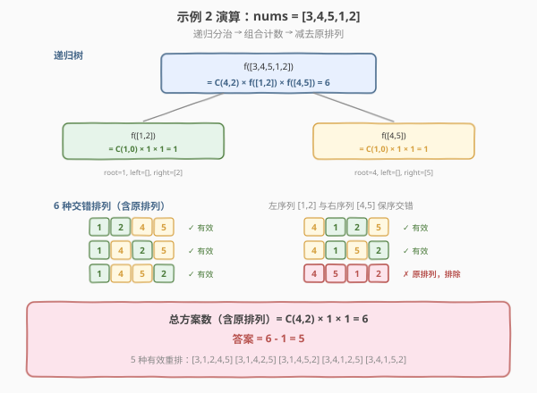

# LeetCode 将子数组重新排序得到同一个二叉搜索树的方案数 题解

## 1. 题目概述

- **标题 / 题号**：将子数组重新排序得到同一个二叉搜索树的方案数（#1569，hard）
- **链接**：https://leetcode.cn/problems/number-of-ways-to-reorder-array-to-get-same-bst/
- **难度**：困难
- **标签**：树、二叉搜索树、递归、组合数学、分治

**题意**：给定一个数组 `nums`，它是 `1` 到 `n` 的一个排列。按照元素在 `nums` 中的顺序依次插入一个初始为空的二叉搜索树（BST）。统计将 `nums` 重新排序后，得到的 BST 与原数组顺序得到的 BST **相同**的方案数。由于答案可能很大，对 $10^9 + 7$ 取余。

**示例 1**：

```text
输入：nums = [2,1,3]
输出：1
解释：[2,3,1] 能得到相同的 BST（2 为根，1 为左孩子，3 为右孩子）。
      [3,2,1] 会得到不同的 BST，不算。
```

**示例 2**：

```text
输入：nums = [3,4,5,1,2]
输出：5
解释：以下 5 个排列能得到相同的 BST：
      [3,1,2,4,5]  [3,1,4,2,5]  [3,1,4,5,2]  [3,4,1,2,5]  [3,4,1,5,2]
```

**示例 3**：

```text
输入：nums = [1,2,3]
输出：0
解释：没有其他排列能得到相同的 BST（退化为右链，顺序唯一）。
```

**约束**：

- `1 <= nums.length <= 1000`
- `1 <= nums[i] <= nums.length`
- `nums` 中所有数互不相同

## 2. 解题思路

### 2.1 暴力思路：枚举全排列？

`nums` 是 `1..n` 的排列，全排列共 $n!$ 种。`n = 1000` 时 $n!$ 是天文数字，完全不可行。即使 `n = 10` 也有 $3628800$ 种，每种还要 $O(n)$ 建 BST 比较——不可接受。

> 💡 转换视角：不要枚举排列再验证，而要**直接计数**——分析「什么样的排列能生成同一棵 BST」。

### 2.2 核心观察：根固定 + 左右子序列保序交错



BST 的插入过程有一个关键性质：**第一个元素永远是根**。因为初始树为空，第一个插入的元素没有比较对象，直接成为根节点。

根确定后，后续所有元素按 BST 规则分流：

- **比根小的元素** → 进入左子树
- **比根大的元素** → 进入右子树

关键观察有三点：

1. **根必须固定**：任何能生成同一棵 BST 的排列，首元素必须相同（都是 `nums[0]`）。
2. **左右子树各自内部相对顺序不变**：左子树的结构由左子序列的插入顺序决定。要使左子树相同，左子序列中元素的相对顺序必须与原数组一致；右子树同理。
3. **左右子序列可以任意交错**：左子序列和右子序列之间的相对位置可以任意打乱——因为左子树的元素无论何时插入，都会沿着左子树的路径走，右子树元素同理，两者互不干扰。

> 💡 **交错数 = 组合数**：左子序列有 $l$ 个元素，右子序列有 $r$ 个元素。保持各自内部相对顺序、将两者交错排列，等价于从 $l + r$ 个位置中选 $l$ 个放左子序列元素，其余放右子序列元素。方案数为 $\binom{l+r}{l}$。

于是递推公式为：

$$f(\text{nums}) = \binom{l+r}{l} \times f(\text{left}) \times f(\text{right})$$

其中 `left` 是 `nums[1:]` 中比 `nums[0]` 小的元素（保持原序），`right` 是比 `nums[0]` 大的元素（保持原序）。

**边界条件**：当 `nums` 长度 $\le 1$ 时，只有一种排列，$f = 1$。

**最终答案**：$f(\text{nums})$ 包含了原始排列本身，题目要求「重排」方案数，所以答案为 $f(\text{nums}) - 1$。

### 2.3 算法流程图



算法分两阶段：

**阶段一：预计算组合数表**

$n \le 1000$，需要频繁查询 $\binom{n}{k} \mod (10^9+7)$。预计算阶乘 `fact[]` 和逆阶乘 `invFact[]`，利用费马小定理（$10^9+7$ 是质数）求逆元：

$$\text{fact}[i] = \text{fact}[i-1] \times i \mod p$$

$$\text{invFact}[n] = \text{fact}[n]^{p-2} \mod p \quad \text{（快速幂）}$$

$$\text{invFact}[i] = \text{invFact}[i+1] \times (i+1) \mod p$$

$$\binom{n}{k} = \text{fact}[n] \times \text{invFact}[k] \times \text{invFact}[n-k] \mod p$$

**阶段二：递归分治计数**

按递推公式对 `nums` 递归求解，每层将元素按根值分为 `left` 和 `right`，乘以组合数和子问题的结果。

### 2.4 示例演算

以示例 2 `nums = [3,4,5,1,2]` 为例：



**第一层**：`root = 3`，`left = [1, 2]`，`right = [4, 5]`

- $l = 2, r = 2$，$\binom{4}{2} = 6$
- $f([3,4,5,1,2]) = 6 \times f([1,2]) \times f([4,5])$

**第二层左**：`f([1,2])`，`root = 1`，`left = []`，`right = [2]`

- $l = 0, r = 1$，$\binom{1}{0} = 1$
- $f([1,2]) = 1 \times f([]) \times f([2]) = 1 \times 1 \times 1 = 1$

**第二层右**：`f([4,5])`，`root = 4`，`left = []`，`right = [5]`

- $l = 0, r = 1$，$\binom{1}{0} = 1$
- $f([4,5]) = 1 \times f([]) \times f([5]) = 1 \times 1 \times 1 = 1$

**汇总**：

$$f([3,4,5,1,2]) = 6 \times 1 \times 1 = 6$$

$$\text{答案} = 6 - 1 = 5$$

6 种交错排列（含原排列 `[3,4,5,1,2]`），排除原排列后正好 5 种，与示例吻合。

> 💡 **示例 3 为何为 0**：`nums = [1,2,3]`，每次 `root` 都是最小值，左子树始终为空（$l = 0$），$\binom{r}{0} = 1$，递归到右子树同理。整棵树退化为右链，每层组合数都是 1，$f = 1$，答案 $= 1 - 1 = 0$。

## 3. 参考代码

### C++

```cpp
class Solution {
    static const int MOD = 1e9 + 7;
    long long fact[1001], invFact[1001];

    long long power(long long base, long long exp, long long mod) {
        long long result = 1;
        base %= mod;
        while (exp > 0) {
            if (exp & 1) result = result * base % mod;
            base = base * base % mod;
            exp >>= 1;
        }
        return result;
    }

    void precompute(int n) {
        fact[0] = 1;
        for (int i = 1; i <= n; i++)
            fact[i] = fact[i - 1] * i % MOD;
        invFact[n] = power(fact[n], MOD - 2, MOD);
        for (int i = n - 1; i >= 0; i--)
            invFact[i] = invFact[i + 1] * (i + 1) % MOD;
    }

    long long C(int n, int k) {
        if (k < 0 || k > n) return 0;
        return fact[n] * invFact[k] % MOD * invFact[n - k] % MOD;
    }

    long long dfs(vector<int>& nums) {
        if (nums.size() <= 1) return 1;
        int root = nums[0];
        vector<int> left, right;
        for (int i = 1; i < (int)nums.size(); i++) {
            if (nums[i] < root) left.push_back(nums[i]);
            else right.push_back(nums[i]);
        }
        int l = left.size(), r = right.size();
        return C(l + r, l) * dfs(left) % MOD * dfs(right) % MOD;
    }

  public:
    int numOfWays(vector<int>& nums) {
        int n = nums.size();
        precompute(n);
        return (dfs(nums) - 1 + MOD) % MOD;
    }
};
```

### Python

```python
class Solution:
    def numOfWays(self, nums: List[int]) -> int:
        MOD = 10**9 + 7
        n = len(nums)

        fact = [1] * (n + 1)
        for i in range(1, n + 1):
            fact[i] = fact[i - 1] * i % MOD

        invFact = [1] * (n + 1)
        invFact[n] = pow(fact[n], MOD - 2, MOD)
        for i in range(n - 1, -1, -1):
            invFact[i] = invFact[i + 1] * (i + 1) % MOD

        def C(n, k):
            if k < 0 or k > n:
                return 0
            return fact[n] * invFact[k] % MOD * invFact[n - k] % MOD

        def dfs(arr):
            if len(arr) <= 1:
                return 1
            root = arr[0]
            left = [x for x in arr[1:] if x < root]
            right = [x for x in arr[1:] if x > root]
            l, r = len(left), len(right)
            return C(l + r, l) * dfs(left) % MOD * dfs(right) % MOD

        return (dfs(nums) - 1) % MOD
```

> 💡 **为何用费马小定理求逆元**：$p = 10^9 + 7$ 是质数，对于 $a$ 不被 $p$ 整除，$a^{-1} \equiv a^{p-2} \pmod{p}$。预计算 $\text{invFact}[n]$ 后，利用 $\text{invFact}[i] = \text{invFact}[i+1] \times (i+1)$ 线性回推，避免对每个 $i$ 都做快速幂。

## 4. 复杂度分析

| 维度 | 复杂度 | 说明 |
|------|--------|------|
| 时间复杂度 | $O(n^2)$ | 每层递归遍历当前子数组分区 $O(n)$，最坏退化链 $n$ 层，总计 $O(n^2)$；预计算组合数 $O(n)$ |
| 空间复杂度 | $O(n^2)$ | 递归每层创建 left/right 子数组，最坏 $n$ 层每层 $O(n)$，合计 $O(n^2)$ |

> ⚠️ 最坏情况是退化为链（如 `nums = [1,2,3,...,n]`），递归深度 $n$ 层，每层分区扫描长度递减，总时间 $\sum_{i=1}^{n} i = O(n^2)$。$n \le 1000$ 时 $n^2 = 10^6$，完全可以接受。

## 5. 扩展：避免拷贝的索引传递优化

上述实现每层递归都创建新的 `left`/`right` 向量，空间开销 $O(n^2)$。若 $n$ 更大或内存敏感，可改为**传递索引区间 + 原地分区**：

```cpp
long long dfs(vector<int>& nums, int lo, int hi) {
    if (hi - lo + 1 <= 1) return 1;
    int root = nums[lo];
    // 原地分区：把 [lo+1, hi] 中 < root 的放左边，> root 的放右边
    int l = 0;
    for (int i = lo + 1; i <= hi; i++)
        if (nums[i] < root) swap(nums[lo + 1 + (l++)], nums[i]);
    int r = (hi - lo) - l;
    return C(l + r, l) * dfs(nums, lo + 1, lo + l) % MOD
                    * dfs(nums, lo + l + 1, hi) % MOD;
}
```

此版本原地分区，空间降至 $O(n)$（递归栈 + 组合数表），时间仍 $O(n^2)$。但会修改原数组，面试时需与面试官确认是否允许。

## 6. 面试要点

1. **为什么根必须是首元素？**

   - BST 从空树开始插入，第一个元素没有比较对象，直接成为根。因此所有能生成同一棵 BST 的排列，首元素必须相同。

2. **为什么左右子序列可以任意交错但各自保序？**

   - 左子树的元素无论何时插入，都会沿左子树路径走（因为都比根小）；右子树同理。两者路径完全独立，互不干扰。但各自内部的相对顺序决定了子树的结构，所以必须保序。

3. **组合数 $\binom{l+r}{l}$ 的含义是什么？**

   - 从 $l+r$ 个总位置中选 $l$ 个放左子序列元素，其余 $r$ 个放右子序列元素。每种选法对应一种交错方案，且左右各自内部顺序已固定。

4. **为什么要减 1？**

   - $f(\text{nums})$ 计算的是所有能生成同一棵 BST 的排列数（含原始排列）。题目要求「重排」方案数，即排除原始排列，所以答案为 $f(\text{nums}) - 1$。

5. **如何处理大数取模？**

   - 预计算阶乘和逆阶乘数组，用费马小定理 $a^{p-2} \equiv a^{-1} \pmod{p}$ 求逆元。$\binom{n}{k} = \text{fact}[n] \times \text{invFact}[k] \times \text{invFact}[n-k]$，每次乘法后取模防溢出。

## 同类练习题

| # | 题目 | 与本题的关联 |
|---|------|-------------|
| 96 | [不同的二叉搜索树](https://leetcode.cn/problems/unique-binary-search-trees/) | BST 计数 + 卡塔兰数 DP，与本题共享「BST 结构由插入顺序决定」的核心思想 |
| 95 | [不同的二叉搜索树 II](https://leetcode.cn/problems/unique-binary-search-trees-ii/) | 枚举所有 BST 结构，是 96 的构造版，加深对 BST 形态的理解 |
| 89 | [格雷编码](https://leetcode.cn/problems/gray-code/) | 组合数学 + 递归构造，与本题同为「计数/构造 + 分治」范式 |
| 77 | [组合](https://leetcode.cn/problems/combinations/) | 组合数基础，回溯枚举 $\binom{n}{k}$ 的所有方案，对照本题直接用公式计数 |
| 509 | [斐波那契数](https://leetcode.cn/problems/fibonacci-number/) | 递推 + 预计算思想，与本题预计算阶乘/逆阶乘的思路一致 |
