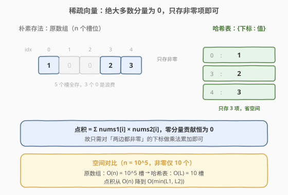
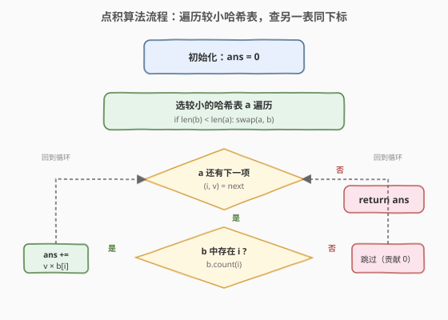
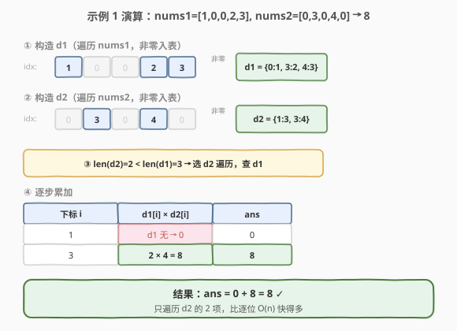

# LeetCode 两个稀疏向量的点积 题解

## 1. 题目概述

- **标题 / 题号**：两个稀疏向量的点积（#1570，medium）
- **链接**：https://leetcode.cn/problems/dot-product-of-two-sparse-vectors/
- **难度**：中等
- **标签**：设计、数组、哈希表、双指针

**题意**：给定两个**稀疏向量**（绝大多数分量为 0 的向量），要求高效存储并计算它们的**点积**。实现类 `SparseVector`：

- `SparseVector(nums)`：以向量 `nums` 初始化对象。
- `dotProduct(vec)`：计算此向量与 `vec` 的点积 $\sum_i \text{nums1}[i] \times \text{nums2}[i]$。

> ⚠️ 本题为 LeetCode **Plus 会员专享**（🔒 锁题），但思路经典，面试中常作为「设计 + 哈希表」的模板题出现。

**示例 1**：

```text
输入：nums1 = [1,0,0,2,3], nums2 = [0,3,0,4,0]
输出：8
解释：v1 = SparseVector(nums1), v2 = SparseVector(nums2)
v1.dotProduct(v2) = 1*0 + 0*3 + 0*0 + 2*4 + 3*0 = 8
```

**示例 2**：

```text
输入：nums1 = [0,1,0,0,0], nums2 = [0,0,0,0,2]
输出：0
解释：两边非零下标完全不重合，点积为 0
```

**示例 3**：

```text
输入：nums1 = [0,1,0,0,2,0,0], nums2 = [1,0,0,0,3,0,4]
输出：6
解释：仅下标 4 同时非零：2*3=6
```

**约束**：

- `n == nums1.length == nums2.length`
- `1 <= n <= 10^5`
- `0 <= nums1[i], nums2[i] <= 100`

**进阶**：当其中只有一个向量是稀疏向量时，该如何解决？

## 2. 解题思路

### 2.1 暴力思路：原数组逐位相乘

最直白的做法是 `SparseVector` 内部直接存原数组，`dotProduct` 时逐位相乘累加：

```python
ans = sum(nums1[i] * nums2[i] for i in range(n))
```

- 时间 $O(n)$，空间 $O(n)$。

问题在于题目明确强调**稀疏**：$n$ 可达 $10^5$，但非零项可能只有几个到几十个。把整条数组原样存下来、再逐位相乘，绝大多数计算都是「$0 \times \text{某数} = 0$」的无效操作——既浪费空间也浪费时间。

> 💡 转换视角：零分量对点积的贡献恒为 0，**只有「两边都非零」的下标才需要做乘法**。因此只需把非零项存下来，点积时只遍历这些非零项。

### 2.2 核心观察：哈希表只存非零项



核心思路：

- **存储**：用哈希表 `d` 保存非零项，键为下标 `i`，值为 `nums[i]`。零项直接丢弃。
- **点积**：遍历其中**较小的**哈希表 `a`，对每个 `(i, v)` 查另一表 `b` 是否也有 `i`；若有，则累加 `v * b[i]`。

> 💡 **为什么遍历较小的表？** 点积只关心「两边都有」的下标，从哪边遍历结果相同。但遍历较短的一边，循环次数最少——这是把单次点积从 $O(\min(L_1, L_2))$ 进一步做实的常数优化（$L$ 为非零项数）。

### 2.3 算法流程图



### 2.4 示例演算

以示例 1 `nums1 = [1,0,0,2,3]`, `nums2 = [0,3,0,4,0]` 为例：



| 步骤 | 下标 `i` | `d1[i]` | `d2[i]` | 贡献 | `ans` |
|------|---------|---------|---------|------|-------|
| 构造 `d1` | — | `{0:1, 3:2, 4:3}` | — | — | — |
| 构造 `d2` | — | — | `{1:3, 3:4}` | — | — |
| 选较小表 | — | `len=3` | `len=2` ← 遍历 `d2` | — | 0 |
| 遍历 `d2` | 1 | 不存在 | 3 | 0（跳过） | 0 |
| 遍历 `d2` | 3 | 2 | 4 | $2 \times 4 = 8$ | 8 |

> 💡 关键在于下标 3：这是**两边都非零**的唯一位置，其余下标要么某边为 0（不在哈希表中），要么乘积为 0，全部跳过。

## 3. 参考代码

### 方法一：哈希表（推荐）

### C++

```cpp
class SparseVector {
public:
    unordered_map<int, int> d;

    SparseVector(vector<int>& nums) {
        for (int i = 0; i < (int)nums.size(); ++i) {
            if (nums[i]) d[i] = nums[i];
        }
    }

    int dotProduct(SparseVector& vec) {
        auto& a = d;
        auto& b = vec.d;
        if (a.size() > b.size()) swap(a, b);
        int ans = 0;
        for (auto& [i, v] : a) {
            auto it = b.find(i);
            if (it != b.end()) ans += v * it->second;
        }
        return ans;
    }
};
```

### Python

```python
class SparseVector:
    def __init__(self, nums: List[int]):
        self.d = {i: v for i, v in enumerate(nums) if v}

    def dotProduct(self, vec: "SparseVector") -> int:
        a, b = self.d, vec.d
        if len(b) < len(a):
            a, b = b, a
        return sum(v * b.get(i, 0) for i, v in a.items())
```

> ⚠️ C++ 中 `dotProduct` 里 `swap(a, b)` 交换的是**引用的绑定**（`a`/`b` 是 `auto&` 引用），不会修改成员本身，安全无误。

## 4. 复杂度分析

| 维度 | 复杂度 | 说明 |
|------|--------|------|
| 构造时间 | $O(n)$ | 初始化时遍历整个 `nums` 一次，非零项入表 |
| 点积时间 | $O(\min(L_1, L_2))$ | 只遍历较小哈希表，每次查另一表 $O(1)$；$L$ 为非零项数 |
| 空间复杂度 | $O(L)$ | 只存非零项，$L \le n$，稀疏时 $L \ll n$ |

> 💡 对比暴力 $O(n)$ 时间 + $O(n)$ 空间：当 $n = 10^5$、$L = 10$ 时，点积从 $10^5$ 次运算降到 $\sim 10$ 次，空间从 $10^5$ 槽降到 10 槽——这正是「稀疏」二字的价值。

## 5. 扩展：双指针法与单边稀疏进阶

### 5.1 双指针归并法（不用哈希表）

如果不想用哈希表（例如嵌入式环境无标准库），可把非零项存成**按下标升序的 `(index, value)` 列表**（构造时按 `i` 顺序扫描天然有序）。点积时用**双指针归并**：谁的下标小谁前进，相等则乘积累加并同前进。

### C++

```cpp
class SparseVector {
public:
    vector<pair<int,int>> vec;  // (index, value)，按下标升序

    SparseVector(vector<int>& nums) {
        for (int i = 0; i < (int)nums.size(); ++i) {
            if (nums[i]) vec.push_back({i, nums[i]});
        }
    }

    int dotProduct(SparseVector& other) {
        int ans = 0;
        int i = 0, j = 0;
        while (i < (int)vec.size() && j < (int)other.vec.size()) {
            if (vec[i].first == other.vec[j].first) {
                ans += vec[i].second * other.vec[j].second;
                ++i; ++j;
            } else if (vec[i].first < other.vec[j].first) {
                ++i;
            } else {
                ++j;
            }
        }
        return ans;
    }
};
```

| 维度 | 哈希表法 | 双指针法 |
|------|---------|---------|
| 构造 | $O(n)$ | $O(n)$ |
| 点积 | $O(\min(L_1, L_2))$ | $O(L_1 + L_2)$ |
| 空间 | $O(L)$ | $O(L)$ |
| 缓存友好 | 一般（哈希散列） | 好（顺序访问） |
| 实现依赖 | 需哈希表 | 仅需数组 |

> 💡 当两边非零项数接近时，双指针 $O(L_1 + L_2)$ 与哈希表 $O(\min(L_1, L_2))$ 同阶；当一边远稀疏于另一边时，哈希表「遍历较小表」策略更优。归并骨架与 [986. 区间列表的交集](../0901-1000/986_区间列表的交集.md) 的双指针归并完全同构。

### 5.2 进阶：只有一个向量稀疏怎么办？

题目进阶问：当**只有一个向量稀疏**（另一个稠密）时如何处理？

- **不要**把稠密向量也塞进哈希表——那样构造代价 $O(n)$、空间 $O(n)$，等于白费。
- 正确做法：`SparseVector` 内部根据是否稀疏选择存储方式。点积时**只遍历稀疏向量的非零项**，对稠密向量直接按下标随机访问数组：
  - 稀疏方：哈希表 / `(index, value)` 列表
  - 稠密方：原数组 `nums`
  - 点积：遍历稀疏方的每个 `(i, v)`，累加 `v * dense.nums[i]`（`nums[i]` 为 0 时自然贡献 0，但省去了哈希查表）

```python
class SparseVector:
    def __init__(self, nums: List[int], sparse: bool = True):
        self.sparse = sparse
        if sparse:
            self.d = {i: v for i, v in enumerate(nums) if v}
        else:
            self.nums = nums

    def dotProduct(self, vec: "SparseVector") -> int:
        # 确保自己这一侧是稀疏方（遍历自己，查对方）
        if not self.sparse:
            return vec.dotProduct(self)
        if vec.sparse:
            a, b = self.d, vec.d
            if len(b) < len(a): a, b = b, a
            return sum(v * b.get(i, 0) for i, v in a.items())
        else:
            # 对方稠密：直接按下标访问数组
            return sum(v * vec.nums[i] for i, v in self.d.items())
```

> ⚠️ 朴素哈希表解法其实**已经隐含了进阶的正确性**——遍历稀疏方的非零项，查另一方的哈希表。当另一方稠密时，把它存成哈希表的构造开销是浪费，但点积逻辑本身没问题；优化点在于让稠密方用数组而非哈希表存储，省去构造期的 $O(n)$ 哈希插入。

## 6. 面试要点

1. **为什么用哈希表而不是数组存稀疏向量？**

   - 稀疏向量中零项占绝大多数（如 $n = 10^5$ 但非零仅 10 个）。原数组存储需 $O(n)$ 空间，且点积时要逐位相乘产生大量 $0 \times x = 0$ 的无效运算。哈希表只存非零项，空间 $O(L)$，点积时只遍历非零项，$O(\min(L_1, L_2))$。

2. **点积时为什么遍历较小的哈希表？**

   - 点积只关心「两边都有」的下标，从哪边遍历结果相同。遍历较短的一边循环次数最少，是常数优化。注意 `swap` 的是引用绑定，不能改成员本身。

3. **双指针法和哈希表法各有什么优劣？**

   - 哈希表点积 $O(\min(L_1, L_2))$，双指针 $O(L_1 + L_2)$；一边远稀疏于另一边时哈希表更优，两边接近时同阶。双指针顺序访问缓存更友好、不依赖哈希库；哈希表实现更简洁。面试中两种都应能写。

4. **进阶：只有一个向量稀疏怎么办？**

   - 只把稀疏方存进哈希表，稠密方保留原数组。点积时遍历稀疏方的非零项，对稠密方按下标直接访问数组——避免给稠密方做 $O(n)$ 的哈希构造。本质是「按数据特征选择存储」。

5. **如果两个向量都不是稀疏的呢？**

   - 退化为普通数组点积，$O(n)$ 时间 $O(1)$ 额外空间（直接用传入数组，不额外建表）。本题解法在 $L \approx n$ 时退化到 $O(n)$，不会更差，但会多一份哈希表空间——所以判断是否使用稀疏存储应基于实际非零率。

## 同类练习题

| # | 题目 | 与本题的关联 |
|---|------|-------------|
| 303 | [区域和检索 - 数组不可变](https://leetcode.cn/problems/range-sum-query-immutable/) | 同样是「构造期预处理 + 查询期高效」的设计题，对照预处理方向（前缀和 vs 哈希表） |
| 986 | [区间列表的交集](https://leetcode.cn/problems/interval-list-intersections/) | 双指针归并取交集，与本题双指针法骨架完全同构（下标相等则累加/取交集，否则小者前进） |
| 705 | [设计哈希集合](https://leetcode.cn/problems/design-hashset/) | 哈希表底层设计，理解 `index → value` 映射的存储原理 |
| 146 | [LRU 缓存](https://leetcode.cn/problems/lru-cache/) | 另一道经典「设计 + 数据结构」题，哈希表 + 双向链表的组合 |
| 349 | [两个数组的交集](https://leetcode.cn/problems/intersection-of-two-arrays/) | 求「两边都有」的元素，与点积中「两边都非零」的下标匹配思想同源 |
