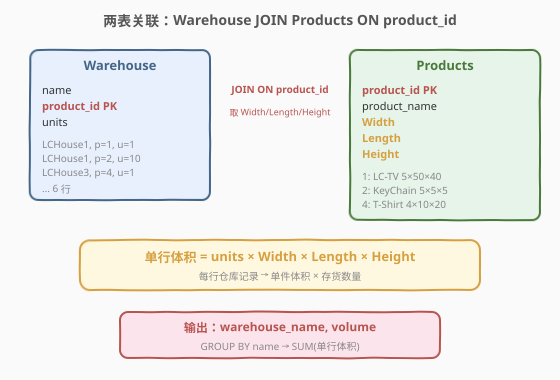
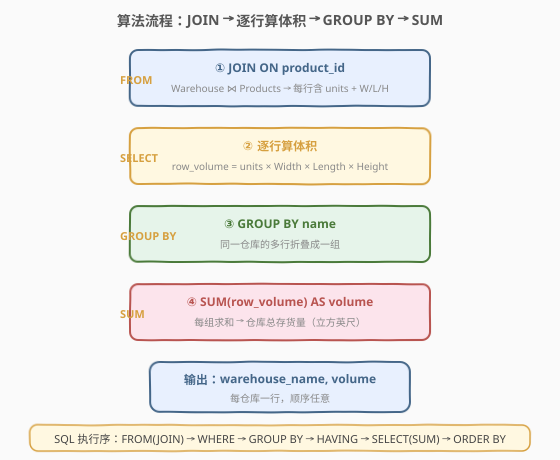
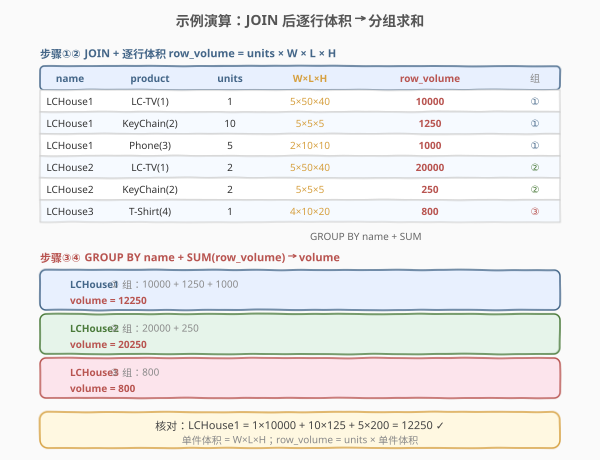

# LeetCode 仓库经理 题解

## 1. 题目概述

- **标题 / 题号**：仓库经理（#1571，easy）
- **链接**：https://leetcode.cn/problems/warehouse-manager/
- **难度**：简单
- **标签**：SQL、多表 JOIN、GROUP BY、聚合求和、LeetCode 锁题

**题意**：给定 `Warehouse`（仓库存货表）与 `Products`（商品尺寸表）两张表，编写 SQL 查询，报告**每个仓库的存货量是多少立方英尺**。

**存货量** = 该仓库中每种商品的「件数 × 单件体积」之和，单件体积由 `Products` 表的 `Width × Length × Height`（英尺）给出。

**表结构**：

```text
Table: Warehouse
+--------------+---------+
| Column Name  | Type    |
+--------------+---------+
| name         | varchar |
| product_id   | int     |  ← (name, product_id) 联合主键
| units        | int     |
+--------------+---------+
每行表示某仓库存储了 units 件 product_id 商品。

Table: Products
+---------------+---------+
| Column Name   | Type    |
+---------------+---------+
| product_id    | int     |  ← 主键
| product_name  | varchar |
| Width         | int     |  ← 宽（英尺）
| Length        | int     |  ← 长（英尺）
| Height        | int     |  ← 高（英尺）
+---------------+---------+
每行给出一件商品的三维尺寸。
```

**输出列**：`warehouse_name`、`volume`（该仓库总存货量立方英尺）。结果顺序任意。

**示例 1**：

```text
输入：
Warehouse 表:
+------------+--------------+-------------+
| name       | product_id   | units       |
+------------+--------------+-------------+
| LCHouse1   | 1            | 1           |
| LCHouse1   | 2            | 10          |
| LCHouse1   | 3            | 5           |
| LCHouse2   | 1            | 2           |
| LCHouse2   | 2            | 2           |
| LCHouse3   | 4            | 1           |
+------------+--------------+-------------+
Products 表:
+------------+--------------+------------+----------+-----------+
| product_id | product_name | Width      | Length   | Height    |
+------------+--------------+------------+----------+-----------+
| 1          | LC-TV        | 5          | 50       | 40        |
| 2          | LC-KeyChain  | 5          | 5        | 5         |
| 3          | LC-Phone     | 2          | 10       | 10        |
| 4          | LC-T-Shirt   | 4          | 10       | 20        |
+------------+--------------+------------+----------+-----------+

输出：
+----------------+------------+
| warehouse_name | volume     |
+----------------+------------+
| LCHouse1       | 12250      |
| LCHouse2       | 20250      |
| LCHouse3       | 800        |
+----------------+------------+
```

**解释**：

| 商品 | 单件体积 W×L×H | 含义 |
|------|----------------|------|
| LC-TV (1) | $5 \times 50 \times 40 = 10000$ | 大件家电 |
| LC-KeyChain (2) | $5 \times 5 \times 5 = 125$ | 小挂件 |
| LC-Phone (3) | $2 \times 10 \times 10 = 200$ | 手机 |
| LC-T-Shirt (4) | $4 \times 10 \times 20 = 800$ | T 恤 |

| 仓库 | 存货明细 | 总存货量计算 |
|------|----------|--------------|
| LCHouse1 | 1×LC-TV + 10×KeyChain + 5×Phone | $1 \times 10000 + 10 \times 125 + 5 \times 200 = 12250$ |
| LCHouse2 | 2×LC-TV + 2×KeyChain | $2 \times 10000 + 2 \times 125 = 20250$ |
| LCHouse3 | 1×T-Shirt | $1 \times 800 = 800$ |

> ⚠️ 注意 `Warehouse` 表的主键是 `(name, product_id)`——同一仓库可存多种商品（多行），但同一仓库同一商品只有一行（`units` 已汇总）。计算时要**按仓库分组**，把该仓库所有商品行的体积累加。

**约束**：

- `(name, product_id)` 是 `Warehouse` 表的主键
- `product_id` 是 `Products` 表的主键
- `Warehouse.product_id` 引用 `Products.product_id`
- 结果以任意顺序返回

> 💡 本题是 SQL **"多表 JOIN + GROUP BY 聚合求和"入门招牌题**——核心三步：① `JOIN Products` 取尺寸 `W/L/H`；② 每行算体积 `units × W × L × H`；③ `GROUP BY name` + `SUM` 汇总每个仓库。难点不在语法，在于把「单件体积 × 件数」拆成行级表达式后交给 `SUM` 分组聚合。

## 2. 解题思路

### 2.1 暴力思路：逐仓库逐商品累加

最直觉的过程式思路：对每个仓库，遍历其所有商品行，关联 `Products` 取尺寸，算出每行体积后累加。伪代码：

```text
for each warehouse w (grouped by name):
    volume = 0
    for each row (name, product_id, units) in w:
        p = SELECT * FROM Products WHERE product_id = row.product_id
        single = p.Width * p.Length * p.Height
        volume += units * single
    emit (w.name, volume)
```

这对应 SQL 的「相关子查询 + 逐行计算」写法。逻辑正确，但**对每行 Warehouse 都要探测一次 Products**，复杂度 $O(W \cdot \text{lookup})$。更自然的方式是先 `JOIN` 把尺寸"贴"到每行 Warehouse 上，再一次性分组求和——这正是关系代数中"连接 + 聚合"的标准范式。

### 2.2 核心观察：JOIN 取尺寸 + GROUP BY 分组求和



**问题拆解为两个子问题**：

1. **取尺寸算行体积**：`Warehouse` 表只有 `product_id` 和 `units`，没有尺寸——需 `JOIN Products ON product_id` 取 `Width/Length/Height`，才能算每行的**行体积**：

$$\text{row\_volume} = \text{units} \times \text{Width} \times \text{Length} \times \text{Height}$$

2. **按仓库分组汇总**：同一仓库 `name` 下有多个商品行（LCHouse1 有 3 行），需 `GROUP BY name` 折叠成一行，用 `SUM(row_volume)` 累加得该仓库总存货量：

$$\text{volume} = \sum_{\text{该仓库所有商品行}} \text{units}_i \times W_i \times L_i \times H_i$$

> 💡 **为何 `SUM` 里能直接写乘法表达式？** `SUM(units * width * length * height)` 是合法的——聚合函数的参数可以是任意标量表达式，先对每行求值再累加。等价于先 `JOIN` 后用 `SELECT units * width * length * height AS row_vol` 算出行体积，再 `SUM(row_vol)`。两种写法语义一致，前者更紧凑。

> ⚠️ **`JOIN` 方式的选择**：本题 `Warehouse.product_id` 必然引用 `Products.product_id`（外键完整性），用 `INNER JOIN` 即可。若存在"仓库存了某商品但 Products 表缺该商品"的脏数据，`INNER JOIN` 会丢弃该行；此时可用 `LEFT JOIN` 保留，但尺寸为 `NULL` 时 `SUM` 会跳过该行（`NULL × 任何值 = NULL`，`SUM` 忽略 `NULL`）。题目保证数据完整，用 `JOIN`/`INNER JOIN` 即可。

### 2.3 算法流程图



**逻辑执行步骤**：

| 步骤 | 子句 | 作用 |
|------|------|------|
| ① | `FROM Warehouse JOIN Products ON product_id` | 两表按 `product_id` 等值连接，每行 Warehouse 获得 `W/L/H` |
| ② | `units * width * length * height` | 行级表达式：算该行（某仓库的某商品）的体积 |
| ③ | `GROUP BY name` | 按仓库名折叠，同一仓库的多行归一组 |
| ④ | `SUM(units * width * length * height) AS volume` | 每组求和 = 该仓库总存货量 |

> 💡 **SQL 子句执行顺序**：`FROM`（含 `JOIN`/`ON`）→ `WHERE` → `GROUP BY` → `HAVING` → `SELECT`（含 `SUM`）→ `ORDER BY` → `LIMIT`。步骤 ① 的 `JOIN` 在 `FROM` 阶段完成，产出"仓库行 × 尺寸"的明细行集；步骤 ③ 的 `GROUP BY` 把明细按仓库折叠；步骤 ④ 的 `SUM` 在 `SELECT` 阶段对每组求和。本题**不需要 `WHERE`/`HAVING`**——全量聚合，无过滤条件。

### 2.4 示例演算

以示例 1 的 6 行 Warehouse 数据为例，观察「JOIN 取尺寸 → 逐行算体积 → 分组求和」的逐步过程：



**步骤 ①②：JOIN Products + 逐行算 row_volume**

`Warehouse JOIN Products ON product_id` 后，每行获得 `W/L/H`，行体积 = `units × W × L × H`：

| name | product | units | W×L×H | row_volume |
|------|---------|-------|-------|------------|
| LCHouse1 | LC-TV (1) | 1 | 5×50×40 = 10000 | $1 \times 10000 = 10000$ |
| LCHouse1 | KeyChain (2) | 10 | 5×5×5 = 125 | $10 \times 125 = 1250$ |
| LCHouse1 | Phone (3) | 5 | 2×10×10 = 200 | $5 \times 200 = 1000$ |
| LCHouse2 | LC-TV (1) | 2 | 5×50×40 = 10000 | $2 \times 10000 = 20000$ |
| LCHouse2 | KeyChain (2) | 2 | 5×5×5 = 125 | $2 \times 125 = 250$ |
| LCHouse3 | T-Shirt (4) | 1 | 4×10×20 = 800 | $1 \times 800 = 800$ |

**步骤 ③④：GROUP BY name + SUM(row_volume)**

| 仓库 | 求和表达式 | volume |
|------|-----------|--------|
| LCHouse1 | $10000 + 1250 + 1000$ | $12250$ |
| LCHouse2 | $20000 + 250$ | $20250$ |
| LCHouse3 | $800$ | $800$ |

最终输出 3 行，与示例一致。

> 💡 **`USING` 子句的便利**：两表都有同名列 `product_id` 时，可用 `JOIN Products USING (product_id)` 代替 `ON Warehouse.product_id = Products.product_id`——更简洁，且连接后 `product_id` 只出现一列（不重复）。本题 `product_id` 是 `Products` 主键、`Warehouse` 外键，同名同义，适合用 `USING`。

## 3. 参考代码

### SQL（解法 A：`JOIN + GROUP BY + SUM`，推荐）

```sql
SELECT
    name AS warehouse_name,
    SUM(units * width * length * height) AS volume
FROM
    Warehouse
    JOIN Products USING (product_id)
GROUP BY 1;
```

> 💡 **写法要点**：
> - **`JOIN Products USING (product_id)`**：等值连接，把 `Width/Length/Height` 贴到每行 Warehouse。`USING (product_id)` 等价于 `ON Warehouse.product_id = Products.product_id`，但更简洁。
> - **`SUM(units * width * length * height)`**：聚合函数内嵌乘法表达式——先对每行求 `units × W × L × H`，再按组累加。MySQL 列名不区分大小写，`width/Width` 等价。
> - **`GROUP BY 1`**：按 `SELECT` 第 1 列（`name`，即 `warehouse_name`）分组。也可写 `GROUP BY name`，等价。MySQL 允许 `GROUP BY` 引用 `SELECT` 列别名或列序号，标准 SQL 推荐用原列名 `GROUP BY name`。
> - ✓ **最推荐**：一行表达式完成"取尺寸 + 算体积 + 分组汇总"，最紧凑。

### SQL（解法 B：CTE 先算行体积再聚合，可读性更佳）

```sql
WITH Joined AS (
    SELECT
        w.name,
        w.units * p.Width * p.Length * p.Height AS row_volume
    FROM Warehouse w
    JOIN Products p ON w.product_id = p.product_id
)
SELECT
    name AS warehouse_name,
    SUM(row_volume) AS volume
FROM Joined
GROUP BY name;
```

> 💡 **解法 B 的优势**：用 CTE 把「JOIN + 行体积计算」封装为 `Joined`，主查询聚焦于「分组求和」，**职责分离、可读性更佳**。当行级表达式复杂（如含 `IFNULL`、`CASE` 等）时，CTE 拆分能避免 `SUM` 内嵌冗长表达式。MySQL 8.0+ 支持 CTE。

### SQL（解法 C：相关子查询，对照思路）

不解构为 JOIN，而是对每个仓库分组后用相关子查询求体积：

```sql
SELECT DISTINCT
    w.name AS warehouse_name,
    (
        SELECT SUM(w2.units * p.Width * p.Length * p.Height)
        FROM Warehouse w2 JOIN Products p ON w2.product_id = p.product_id
        WHERE w2.name = w.name
    ) AS volume
FROM Warehouse w;
```

> ⚠️ **解法 C 的缺陷**：
> - **相关子查询**：对每个仓库执行一次子查询，重复扫描 `Warehouse` + `Products`，$O(W \cdot (W + P))$，性能差。
> - **`SELECT DISTINCT`**：因每行 Warehouse 都会算一次 `volume`，需 `DISTINCT` 去重，额外排序开销。
> - **优点**：思路直观（"对每个仓库算体积"），不依赖 `GROUP BY`。
>
> 仅作「另一种思路」对照，**生产环境推荐解法 A/B**。

### Python（pandas）

```python
import pandas as pd

def warehouse_manager(warehouse: pd.DataFrame, products: pd.DataFrame) -> pd.DataFrame:
    merged = warehouse.merge(products, on='product_id')
    merged['row_volume'] = merged['units'] * merged['Width'] * merged['Length'] * merged['Height']
    result = (
        merged.groupby('name', as_index=False)['row_volume']
        .sum()
        .rename(columns={'name': 'warehouse_name', 'row_volume': 'volume'})
    )
    return result[['warehouse_name', 'volume']]
```

> 💡 **pandas 对照**：
> - `warehouse.merge(products, on='product_id')` 对应 SQL 的 `JOIN Products USING (product_id)`。
> - `merged['row_volume'] = units * Width * Length * Height` 对应行级体积表达式。
> - `.groupby('name')['row_volume'].sum()` 对应 `GROUP BY name` + `SUM(row_volume)`。
> - `.rename(...)` 对应 `SELECT` 中的列别名 `warehouse_name` / `volume`。

## 4. 复杂度分析

| 维度 | 解法 A（`JOIN + SUM`） | 解法 B（CTE） | 解法 C（相关子查询） | pandas |
|------|------------------------|---------------|----------------------|--------|
| **时间** | $O(W + P)$ | $O(W + P)$ | $O(W \cdot (W + P))$ | $O(W + P)$ |
| **空间** | $O(W)$ | $O(W)$ | $O(1)$ 额外 | $O(W)$ |
| **扫表次数** | 各表 1 次 | 各表 1 次 | $W$ 次扫 Warehouse+Products | 各表 1 次 |
| **可读性** | ✓ 紧凑 | ✓ 最清晰 | ✗ 冗长 | ✓ 清晰 |
| **推荐度** | ✓ **首选** | ✓ 备选 | ✗ 仅对照 | ✓ 验证用 |

> - $W$ = `Warehouse` 行数，$P$ = `Products` 行数
> - **解法 A/B**：`JOIN` 在 `product_id`（Products 主键）上探测 $O(\log P)$（B+树索引）或 $O(1)$（哈希连接），$W$ 行探测 $O(W)$；`GROUP BY + SUM` 扫描 $W$ 行 $O(W)$。总体线性。
> - **解法 C**：对每个仓库（设 $K$ 个去重仓库）执行一次子查询，子查询全扫 `Warehouse` + `JOIN Products`，总扫描量 $O(K \cdot (W + P))$，仓库多时严重退化。
> - **索引优化**：`Products(product_id)` 是主键自带索引；在 `Warehouse(product_id)` 上建索引可加速 `JOIN`。

## 5. 扩展：JOIN 类型与聚合表达式的选择

### 5.1 INNER JOIN vs LEFT JOIN

| 场景 | 推荐 JOIN | 原因 |
|------|-----------|------|
| 外键完整（Warehouse.product_id 必在 Products 中） | `INNER JOIN` / `JOIN` | 数据干净，丢弃无意义 |
| 可能存在脏数据（商品已下架但仓库仍有记录） | `LEFT JOIN` | 保留仓库行，但尺寸 `NULL` 时该行 `row_volume = NULL`，`SUM` 忽略 |
| 想找出"无尺寸的孤儿商品" | `LEFT JOIN ... WHERE p.product_id IS NULL` | 反连接，定位脏数据 |

> 💡 本题题面保证 `Warehouse.product_id` 引用 `Products.product_id`，用 `JOIN` 即可。若面试官追问"数据可能不干净怎么办"，答 `LEFT JOIN` 并说明 `SUM` 自动忽略 `NULL` 行——但要注意这会**低估**体积（缺尺寸的商品不计入），生产中应配合 `COUNT(*)` vs `COUNT(p.product_id)` 对比定位缺失。

### 5.2 `SUM(表达式)` vs 先算列再 `SUM`

两种写法等价：

```sql
-- 写法 1：SUM 内嵌表达式（解法 A）
SUM(units * width * length * height)

-- 写法 2：先算列再 SUM（解法 B 的 CTE）
SELECT units * width * length * height AS row_volume ...
SUM(row_volume)
```

| 维度 | 写法 1（内嵌） | 写法 2（先算列） |
|------|----------------|-------------------|
| 简洁度 | ✓ 一行搞定 | 需 CTE/子查询拆层 |
| 可读性 | 表达式简单时佳 | 表达式复杂时佳 |
| 性能 | 等价（优化器展开） | 等价 |
| 复用性 | ✗ 无法引用中间值 | ✓ `row_volume` 可在 `HAVING`/`ORDER BY` 复用 |

> 💡 **口诀**：表达式简单（如本题四元乘积）用写法 1；表达式复杂（含 `CASE`/`IFNULL`/多层运算）或中间值需复用时用写法 2（CTE）。

### 5.3 边界情况

| 场景 | 结果 | 说明 |
|------|------|------|
| 仓库无任何商品行 | 不出现在结果 | `GROUP BY` 只对存在的 `name` 分组，空仓库不会被补出 |
| 商品 `units = 0` | 该行 `row_volume = 0` | `SUM` 加 0 不影响总量，但该仓库仍出现在结果（若有其他商品行） |
| 商品某维度为 0（如 `Height = 0`） | `row_volume = 0` | 扁平商品体积为 0，合理 |
| 仓库只有 `units = 0` 的商品 | `volume = 0` | 仓库出现在结果，体积为 0 |

> ⚠️ **空仓库遗漏**：若一个仓库在 `Warehouse` 表中**完全没有任何商品行**（连 `units = 0` 的行都没有），它不会出现在 `GROUP BY` 的结果中。本题题面未要求包含空仓库（`Warehouse` 表只记实际存货），故无需处理。若业务要求列出所有仓库（含空的），需另维护 `Warehouses(name)` 主表并 `LEFT JOIN`。

## 6. 面试要点

1. **`SUM(units * width * length * height)` 为什么能直接写在 `SUM` 里？**

   > 聚合函数的参数可以是任意**标量表达式**——`SUM` 会对每行先求该表达式的值，再累加。`units * width * length * height` 是行级标量（每行一个值），`SUM` 把同组的所有行级值相加。等价于先用 `SELECT units * width * length * height AS row_vol` 算列，再 `SUM(row_vol)`。

2. **`GROUP BY 1` 是什么意思？为什么不推荐滥用？**

   > `GROUP BY 1` 表示按 `SELECT` 子句的第 1 列分组（本题即 `name AS warehouse_name`）。MySQL/PostgreSQL 支持用列序号引用，等价于 `GROUP BY name`。但标准 SQL 不保证支持序号，且列顺序变动时 `GROUP BY 1` 语义会错乱——生产代码推荐用列名 `GROUP BY name`，序号写法仅用于快速探索。

3. **`USING (product_id)` 和 `ON w.product_id = p.product_id` 有何区别？**

   > 语义等价，都按 `product_id` 等值连接。区别在于连接后的结果集：`USING` 会**合并**同名列（`product_id` 只出现一列），而 `ON` 会**保留**两表的列（`Warehouse.product_id` 和 `Products.product_id` 都出现，需用表名限定）。当两表同名列且语义一致时，`USING` 更简洁。

4. **如果要把体积单位从立方英尺换成立方米，怎么改？**

   > 1 英尺 = 0.3048 米，故 1 立方英尺 = $0.3048^3 \approx 0.0283$ 立方米。把 `SUM(units * width * length * height)` 改为 `SUM(units * width * length * height) * 0.3048 * 0.3048 * 0.3048 AS volume` 即可。注意浮点精度——若需精确可乘以 `0.028316846592`。这体现了"行级表达式可嵌任意运算"的灵活性。

5. **为什么本题不需要 `HAVING`？**

   > `HAVING` 用于**组级过滤**（如"体积 > 1000 的仓库"）。本题要求报告**所有**仓库的体积，无过滤条件，故只需 `GROUP BY + SUM`，不需 `HAVING`。若追加"只报告体积超过 10000 的仓库"，则加 `HAVING SUM(units * width * length * height) > 10000`。

> 💡 **一句话总结**：1571 是 SQL **"多表 JOIN + GROUP BY 聚合求和"入门招牌题**——核心模板「`JOIN Products USING (product_id)` 取尺寸 → `SUM(units × W × L × H)` 行级表达式 → `GROUP BY name` 分组」。最大要点：**聚合函数内可嵌行级表达式**，先逐行求值再分组累加，一行 SQL 搞定"按仓库汇总存货量"。

## 同类练习题

| # | 题目 | 与本题的关联 |
|---|------|-------------|
| 1068 | [产品销售分析 I](https://leetcode.cn/problems/product-sales-analysis-i/) | `JOIN Sales + Product` 取价格再 `SELECT`，共享 1571 的「JOIN 取商品属性」骨架，无聚合更简单 |
| 586 | [订单最多的客户 🔒](https://leetcode.cn/problems/customer-placing-the-largest-number-of-orders/) | `GROUP BY + COUNT + ORDER BY LIMIT 1`，同为「分组聚合」家族，单组取最值 |
| 620 | [有趣的电影](https://leetcode.cn/problems/not-boring-movies/) | `WHERE` 行级过滤 + `ORDER BY`，对照 1571 无过滤全聚合的极简形态 |
| 1174 | [即时食物配送 II 🔒](https://leetcode.cn/problems/immediate-food-delivery-ii/) | `GROUP BY + MIN` 求首单 → `JOIN` 回原表 → `AVG`，在 1571 基础上叠加子查询关联与多层聚合 |
| 1193 | [每月交易 I 🔒](https://leetcode.cn/problems/monthly-transactions-i/) | `GROUP BY` 月份聚合交易金额与状态计数，同为「分组求和」家族，叠加 `CASE WHEN` 条件计数 |
