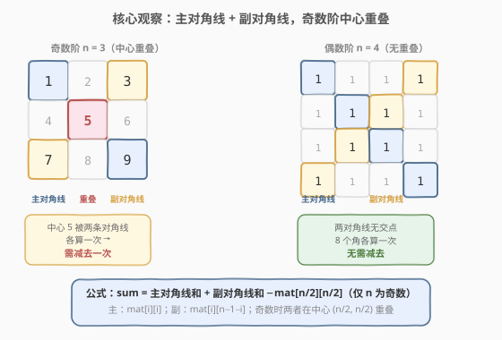
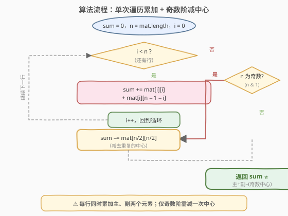

# 矩阵对角线元素的和

- **题目名称**：矩阵对角线元素的和
- **链接**：[1572. 矩阵对角线元素的和](https://leetcode.cn/problems/matrix-diagonal-sum/)
- **难度**：简单
- **标签**：数组、矩阵

## 1. 题目概述

给你一个正方形矩阵 `mat`，请你返回矩阵**对角线元素的和**。即主对角线上的元素和加上副对角线上且不在主对角线上的元素和。

**示例 1**：

```text
输入：mat = [[1,2,3],
            [4,5,6],
            [7,8,9]]
输出：25
解释：对角线的和为：1 + 5 + 9 + 3 + 7 = 25
      注意，元素 mat[1][1] = 5 只会被计算一次。
```

**示例 2**：

```text
输入：mat = [[1,1,1,1],
            [1,1,1,1],
            [1,1,1,1],
            [1,1,1,1]]
输出：8
```

**示例 3**：

```text
输入：mat = [[5]]
输出：5
```

**约束条件**：

- `n == mat.length == mat[i].length`
- `1 <= n <= 100`
- `1 <= mat[i][j] <= 100`

> 💡 题目的核心是**两条对角线求和**，唯一陷阱是当 $n$ 为奇数时，中心元素同时位于主、副对角线上，会被累加两次，需减去一次。

---

## 2. 解题思路

### 2.1 暴力思路：分别枚举两条对角线再合并

最直观的做法是：先遍历主对角线 `mat[i][i]` 累加，再遍历副对角线 `mat[i][n-1-i]` 累加，最后判断 $n$ 奇偶性决定是否减去中心。

```text
sum = 0
for i in 0..n-1:                      # 主对角线
    sum += mat[i][i]
for i in 0..n-1:                      # 副对角线
    sum += mat[i][n-1-i]
if n 奇数:
    sum -= mat[n/2][n/2]              # 中心被加了两次
return sum
```

这种写法正确，但**遍历了两次**。其实两条对角线的同位置元素可以**在一次遍历中同时取出**——第 $i$ 行的主对角线元素是 `mat[i][i]`，副对角线元素是 `mat[i][n-1-i]`，下标都用 $i$ 即可表达。合并到单次循环更简洁，也省去了一次遍历。

### 2.2 核心观察：单次遍历同时累加两条对角线，奇数阶减中心



关键直觉：

- **主对角线**：行号等于列号，即 `mat[i][i]`，$i$ 从 $0$ 到 $n-1$。
- **副对角线**：行号 + 列号 = $n-1$，即列号 $= n-1-i$，元素为 `mat[i][n-1-i]`。
- **重叠**：当 $n$ 为奇数时，中心位置 $(\lfloor n/2 \rfloor, \lfloor n/2 \rfloor)$ 同时满足 `i == i`（主）和 `i + (n-1-i) == n-1`（副），被两条对角线各算一次。偶数阶时两条对角线无公共点。

因此算法为：

$$\text{sum} = \sum_{i=0}^{n-1} \text{mat}[i][i] + \sum_{i=0}^{n-1} \text{mat}[i][n-1-i] - \begin{cases} \text{mat}[n/2][n/2] & n \text{ 为奇数} \\ 0 & n \text{ 为偶数} \end{cases}$$

> 💡 **奇偶判定用位运算**：`n & 1` 取二进制末位，奇数为 1、偶数为 0，比 `n % 2 == 1` 更简洁。

> ⚠️ **不要漏掉奇数中心**：这是本题唯一易错点。若不减去，奇数阶结果会比正确值大一个中心元素。

### 2.3 算法流程图



流程要点：初始化 `sum = 0`；单层循环 $i$ 从 $0$ 到 $n-1$，每步同时累加 `mat[i][i]` 与 `mat[i][n-1-i]`；循环结束后判断 $n$ 奇偶性，若为奇数则 `sum -= mat[n/2][n/2]`，最后返回 `sum`。

### 2.4 示例演算

![示例演算：mat = [[1,2,3],[4,5,6],[7,8,9]]](../images/matrix_diagonal_sum_example_walkthrough.svg)

以 `mat = [[1,2,3],[4,5,6],[7,8,9]]`（$n=3$，奇数）为例：

| 步骤 | $i$ | 主 `mat[i][i]` | 副 `mat[i][n-1-i]` | sum（累加后） |
|------|-----|----------------|---------------------|---------------|
| 1 | 0 | 1 | 3 | 4 |
| 2 | 1 | 5 | 5 | 14 |
| 3 | 2 | 9 | 7 | 30 |
| 4 | — | $n$ 奇数 | 减去 `mat[1][1]` = $-5$ | **25** |

第 2 步中中心 `mat[1][1] = 5` 被作为主、副各加一次，故第 4 步需减去一次。最终结果 **$25$**。

> 💡 **观察规律**：主对角线和 $= 1+5+9 = 15$，副对角线和 $= 3+5+7 = 15$，二者相加 $30$，减去重复的中心 $5$ 得 $25$。偶数阶时无重叠，直接相加即可。

---

## 3. 参考代码

### C++（单次遍历 + 奇数减中心）

```cpp
class Solution {
  public:
    int diagonalSum(vector<vector<int>>& mat) {
        int n = mat.size();
        int sum = 0;
        for (int i = 0; i < n; ++i) {
            sum += mat[i][i] + mat[i][n - 1 - i];
        }
        if (n & 1) {
            sum -= mat[n / 2][n / 2];
        }
        return sum;
    }
};
```

### Python

```python
class Solution:
    def diagonalSum(self, mat: list[list[int]]) -> int:
        n = len(mat)
        total = 0
        for i in range(n):
            total += mat[i][i] + mat[i][n - 1 - i]
        if n & 1:
            total -= mat[n // 2][n // 2]
        return total
```

> 💡 **Python 一行流（仅供对照）**：用 `zip` 取主对角线、切片反转取副对角线，再用集合去重求和：
> ```python
> return sum({mat[i][j] for i in range(n) for j in {i, n-1-i}}) if ...
> ```
> 但集合去重会**误并相同值的对角线元素**（如示例 2 全为 1），并不正确。面试中建议手写上述单次遍历版本。

---

## 4. 复杂度分析

| 维度 | 复杂度 | 说明 |
|------|--------|------|
| 时间复杂度 | $O(n)$ | 单次遍历 $n$ 行，每行 $O(1)$ 累加两个元素 |
| 空间复杂度 | $O(1)$ | 只用常数变量 `sum` |

> 💡 由于 $n \le 100$，$O(n)$ 绰绰有余。矩阵规模再大几个数量级也能通过。

---

## 5. 扩展：奇偶分支的统一写法

如果不希望在循环外加 `if (n & 1)` 判断，可以用一个**更隐蔽但更紧凑**的写法——循环内对中心位置单独处理：

```cpp
int diagonalSum(vector<vector<int>>& mat) {
    int n = mat.size(), sum = 0;
    for (int i = 0; i < n; ++i) {
        sum += mat[i][i];
        if (i != n - 1 - i) sum += mat[i][n - 1 - i];  // 中心只加一次
    }
    return sum;
}
```

关键是 `if (i != n - 1 - i)`：当 $i = n-1-i$（即 $2i = n-1$，$n$ 为奇数且 $i$ 为中心）时跳过副对角线的累加，从而**中心只被主对角线加一次**，无需事后修正。两种写法等价，循环外加判断的版本更易读，循环内判等的版本更紧凑。

> ⚠️ 中心判定 `i != n-1-i` 等价于 `2*i != n-1`，仅当 $n$ 为奇数且 $i = n/2$（整除）时为假，恰好是中心位置。

---

## 6. 面试要点

1. **主、副对角线的下标规律是什么？**

   - 主对角线：行列相等，元素为 `mat[i][i]`。副对角线：行号 + 列号 = $n-1$，即列号为 $n-1-i$，元素为 `mat[i][n-1-i]`。两者都用行号 $i$ 作循环变量即可同步遍历。

2. **为什么奇数阶要减去中心？**

   - 当 $n$ 为奇数时，中心位置 $(\lfloor n/2 \rfloor, \lfloor n/2 \rfloor)$ 同时满足主对角线条件（`i == i`）和副对角线条件（`i + (n-1-i) == n-1`），在累加时被加了两次。题目要求中心只算一次，故需减去一次。偶数阶两条对角线无公共点，无需修正。

3. **为什么用单次遍历而不是两次？**

   - 两条对角线的同位置元素都由行号 $i$ 索引，在一次循环中可同时取出 `mat[i][i]` 和 `mat[i][n-1-i]`。合并到单次循环代码更简洁，且少一次遍历（虽然都是 $O(n)$，但常数更优）。

4. **如何判断 $n$ 奇偶？`n & 1` 和 `n % 2` 有区别吗？**

   - 二者等价（对正整数），`n & 1` 取二进制末位，奇数为 1 偶数为 0。位运算通常更快，可读性差异不大，面试中两种写法均可。

5. **如果题目改成"只统计主对角线"或"只统计副对角线"呢？**

   - 只需保留对应那条的累加即可，无需奇偶修正——因为重叠问题只在两条同时求和时才出现。副对角线单独求和就是 $\sum_{i=0}^{n-1} \text{mat}[i][n-1-i]$。

---

## 7. 同类练习题

- [54. 螺旋矩阵](https://leetcode.cn/problems/spiral-matrix/)：矩阵遍历的另一经典变体，按螺旋顺序访问所有元素，与本题同属"按规律下标遍历矩阵"
- [73. 矩阵置零](https://leetcode.cn/problems/set-matrix-zeroes/)：矩阵原地修改，需用标记位记录行列置零状态，同属矩阵下标操作
- [566. 重塑矩阵](https://leetcode.cn/problems/reshape-the-matrix/)：二维矩阵与一维索引的互转，与本题对角线下标映射同源
- [832. 翻转图像](https://leetcode.cn/problems/flipping-an-image/)：行内反转 + 异或，涉及 `mat[i][n-1-j]` 这类副对角线式下标
- [2133. 检查是否每一行每一列都包含全部整数](https://leetcode.cn/problems/check-if-every-row-and-column-contains-all-numbers/)：矩阵行/列完整性校验，同属矩阵遍历判定题
