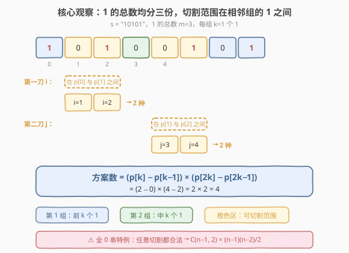
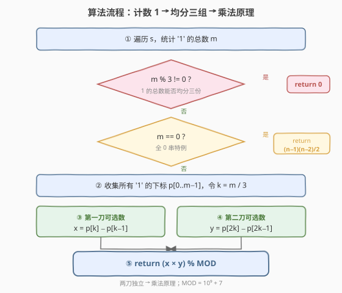
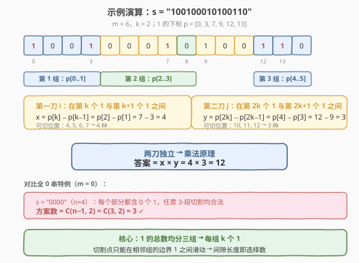

# LeetCode 分割字符串的方案数 题解

## 1. 题目概述

- **标题 / 题号**：分割字符串的方案数（#1573，medium）
- **链接**：https://leetcode.cn/problems/number-of-ways-to-split-a-string/
- **难度**：中等
- **标签**：字符串、数学、计数

**题意**：给定一个二进制串 `s`（只包含 `'0'` 和 `'1'`），将其分割成 3 个**非空**字符串 $s_1, s_2, s_3$（$s_1 + s_2 + s_3 = s$），满足 $s_1$、$s_2$、$s_3$ 中字符 `'1'` 的**数目相同**。返回分割方案数，对 $10^9 + 7$ 取余。

**示例 1**：

```text
输入：s = "10101"
输出：4
解释：共 4 种分割，每个部分都含 1 个 '1'：
  "1|010|1"   "1|01|01"   "10|10|1"   "10|1|01"
```

**示例 2**：

```text
输入：s = "1001"
输出：0
解释：'1' 的总数为 2，无法均分三份。
```

**示例 3**：

```text
输入：s = "0000"
输出：3
解释：全 0 串，任意 3-段分割均合法："0|0|00"  "0|00|0"  "00|0|0"
```

**示例 4**：

```text
输入：s = "100100010100110"
输出：12
```

**约束**：

- `s[i] == '0'` 或 `s[i] == '1'`
- $3 \leq \text{s.length} \leq 10^5$

> 💡 关键在于 `'1'` 的总数必须能被 3 整除——否则直接返回 0。能整除时，每个部分恰好分到 $k = m/3$ 个 `'1'`，三组 `'1'` 的归属固定，切割点只能在**相邻两组 `'1'` 的间隙**中滑动，用乘法原理即可计数。

## 2. 解题思路

### 2.1 暴力思路：枚举所有切割点

枚举两个切割位置 $i, j$（$1 \leq i < j \leq n-1$），将 $s$ 分成 $s[0..i{-}1]$、$s[i..j{-}1]$、$s[j..n{-}1]$，逐个统计三段中 `'1'` 的数目是否相等。两重循环 + 每次线性扫 $O(n)$，总计 $O(n^3)$；用前缀和优化到 $O(n^2)$，在 $n = 10^5$ 时仍超时。

> ⚠️ **致命缺陷**：暴力枚举没有利用「`'1'` 的总数决定可行性」这一结构——若总数不能被 3 整除，所有分割都无效；若能整除，每组 `'1'` 的归属已被题意锁定，切割点只在一小段间隙内有自由度。

### 2.2 核心观察：按 1 的位置锁定切割范围



**第一步：总数整除判定。** 设 `s` 中 `'1'` 的总数为 $m$。若 $m \bmod 3 \neq 0$，无法均分，直接返回 0。

**第二步：全 0 特例。** 若 $m = 0$（全 0 串），每个部分都含 0 个 `'1'`，任意 3-段非空分割均合法。将长度为 $n$ 的串分成 3 个非空段，等价于在 $n - 1$ 个间隙中选 2 个切割点，方案数为：

$$\binom{n-1}{2} = \frac{(n-1)(n-2)}{2}$$

**第三步：一般情况——乘法原理。** 设 $k = m / 3$，收集所有 `'1'` 的下标 $p[0], p[1], \ldots, p[m{-}1]$。第 1 组含 $p[0..k{-}1]$，第 2 组含 $p[k..2k{-}1]$，第 3 组含 $p[2k..m{-}1]$。

- **第一刀** $i$（$s_1$ 与 $s_2$ 的分界）：必须让 $s_1$ 恰好含第 1 组的 $k$ 个 `'1'`，即 $i$ 在第 $k$ 个 `'1'`（$p[k{-}1]$）**之后**、第 $k{+}1$ 个 `'1'`（$p[k]$）**处或之前**。可选位置为 $p[k{-}1]{+}1, \ldots, p[k]$，共 $p[k] - p[k{-}1]$ 种。
- **第二刀** $j$（$s_2$ 与 $s_3$ 的分界）：同理，$j$ 在第 $2k$ 个 `'1'`（$p[2k{-}1]$）之后、第 $2k{+}1$ 个 `'1'`（$p[2k]$）处或之前，共 $p[2k] - p[2k{-}1]$ 种。

> 💡 **为什么间隙长度就是选择数？** 切割点 $i$ 表示 $s_1 = s[0..i{-}1]$、$s_2 = s[i..]$。要让 $s_1$ 恰好含前 $k$ 个 `'1'`，$i$ 必须 $> p[k{-}1]$（否则第 $k$ 个 `'1'` 漏到 $s_2$）且 $\leq p[k]$（否则第 $k{+}1$ 个 `'1'` 提前进入 $s_1$）。闭区间 $[p[k{-}1]{+}1,\, p[k]]$ 的整数个数为 $p[k] - p[k{-}1]$，正是相邻两个 `'1'` 之间的字符间距。

两刀的选择**互相独立**（第一刀落在第 1、2 组 `'1'` 之间，第二刀落在第 2、3 组 `'1'` 之间，互不干扰），由**乘法原理**：

$$\text{ans} = \big(p[k] - p[k{-}1]\big) \times \big(p[2k] - p[2k{-}1]\big) \bmod (10^9 + 7)$$

### 2.3 算法流程图



整体只需**一次遍历**收集 `'1'` 的下标，再 $O(1)$ 计算两个间隙长度相乘：

1. 遍历 `s`，统计 `'1'` 总数 $m$，同时记录所有 `'1'` 的下标到数组 `pos`。
2. 若 $m \bmod 3 \neq 0$，返回 0。
3. 若 $m = 0$，返回 $\frac{(n-1)(n-2)}{2} \bmod \text{MOD}$。
4. 令 $k = m / 3$，计算 $x = \text{pos}[k] - \text{pos}[k{-}1]$，$y = \text{pos}[2k] - \text{pos}[2k{-}1]$。
5. 返回 $x \times y \bmod \text{MOD}$。

### 2.4 示例演算

以 `s = "100100010100110"` 为例：



`'1'` 的下标为 $p = [0, 3, 7, 9, 12, 13]$，$m = 6$，$k = 2$。

| 切割点 | 范围 | 公式 | 选择数 |
|--------|------|------|--------|
| 第一刀 $i$ | 在 $p[1]=3$ 与 $p[2]=7$ 之间 | $x = p[2] - p[1] = 7 - 3$ | 4 |
| 第二刀 $j$ | 在 $p[3]=9$ 与 $p[4]=12$ 之间 | $y = p[4] - p[3] = 12 - 9$ | 3 |

$$\text{ans} = 4 \times 3 = 12 \quad \checkmark$$

**对照全 0 特例** `s = "0000"`（$n = 4$，$m = 0$）：方案数 $= \binom{3}{2} = 3$，对应 `"0|0|00"`、`"0|00|0"`、`"00|0|0"` ✓

## 3. 参考代码

### C++

```cpp
class Solution {
  public:
    int numWays(string s) {
        const long long MOD = 1e9 + 7;
        int n = s.size();
        vector<int> pos;
        for (int i = 0; i < n; ++i)
            if (s[i] == '1') pos.push_back(i);
        int m = pos.size();
        if (m % 3 != 0) return 0;
        if (m == 0)
            return (long long)(n - 1) * (n - 2) / 2 % MOD;
        int k = m / 3;
        long long x = pos[k] - pos[k - 1];
        long long y = pos[2 * k] - pos[2 * k - 1];
        return x * y % MOD;
    }
};
```

### Python

```python
class Solution:
    def numWays(self, s: str) -> int:
        MOD = 10**9 + 7
        n = len(s)
        pos = [i for i, c in enumerate(s) if c == '1']
        m = len(pos)
        if m % 3 != 0:
            return 0
        if m == 0:
            return (n - 1) * (n - 2) // 2 % MOD
        k = m // 3
        x = pos[k] - pos[k - 1]
        y = pos[2 * k] - pos[2 * k - 1]
        return x * y % MOD
```

> ⚠️ **溢出注意**：全 0 特例中 $(n-1)(n-2)$ 可达 $10^{10}$，C++ 必须用 `long long` 计算后再取模，且**先除 2 再取模**（$n-1$ 与 $n-2$ 必有一偶数，整数除法安全）。一般情况 $x, y \leq n \leq 10^5$，乘积 $\leq 10^{10}$ 同样需 `long long` 中间值。

## 4. 复杂度分析

| 维度 | 复杂度 | 说明 |
|------|--------|------|
| 时间复杂度 | $O(n)$ | 单趟扫描收集 `'1'` 的下标，后续 $O(1)$ 计算间隙 |
| 空间复杂度 | $O(m)$ | `pos` 数组存储所有 `'1'` 的下标，$m \leq n$ |

> 💡 空间可优化到 $O(1)$：只记录第 $k$、$2k$ 个 `'1'` 前后的下标（共 4 个关键位置），无需存全部 `pos`。但 $m \leq 10^5$ 时 $O(m)$ 空间完全可接受，存全部下标更清晰。

## 5. 扩展：O(1) 空间的单趟实现

若追求极致空间，可在遍历时只跟踪 4 个关键位置：第 $k$ 个 `'1'`（`pos[k-1]`、`pos[k]`）与第 $2k$ 个 `'1'`（`pos[2k-1]`、`pos[2k]`），无需存整个 `pos` 数组：

```cpp
class Solution {
  public:
    int numWays(string s) {
        const long long MOD = 1e9 + 7;
        int n = s.size(), m = 0;
        for (char c : s) m += (c == '1');
        if (m % 3 != 0) return 0;
        if (m == 0)
            return (long long)(n - 1) * (n - 2) / 2 % MOD;
        int k = m / 3;
        // 找第 k, k+1, 2k, 2k+1 个 1 的下标（1-indexed 计数）
        int p1 = -1, p2 = -1, p3 = -1, p4 = -1, cnt = 0;
        for (int i = 0; i < n; ++i) {
            if (s[i] != '1') continue;
            ++cnt;
            if (cnt == k)     p1 = i;
            if (cnt == k + 1) p2 = i;
            if (cnt == 2 * k) p3 = i;
            if (cnt == 2 * k + 1) { p4 = i; break; }
        }
        return (long long)(p2 - p1) * (p4 - p3) % MOD;
    }
};
```

| 维度 | 数组版（主解） | O(1) 空间版 |
|------|---------------|------------|
| 时间 | $O(n)$ | $O(n)$（第二趟最多扫到第 $2k{+}1$ 个 `'1'`） |
| 空间 | $O(m)$ | $O(1)$ |
| 可读性 | 高，直接套公式 | 中，需理解 4 个关键位置 |
| 两趟 vs 一趟 | 一趟收集 | 两趟（先计数再定位） |

> 💡 面试中先用数组版讲清思路（收集 → 均分 → 乘法），再提一句「可优化到 $O(1)$ 空间只记 4 个位置」即可，不必一开始就写复杂版本。

## 6. 面试要点

1. **为什么 `'1'` 的总数不能被 3 整除就直接返回 0？**

   - 三段 `'1'` 的数目相同，则总数 $= 3 \times \text{每段数目}$，必然被 3 整除。不能整除时无解，提前剪枝避免无效枚举。

2. **为什么切割点只能在相邻组 `'1'` 的间隙内滑动？**

   - 第 $k$ 个 `'1'` 是 $s_1$ 的最后一个 `'1'`，第 $k{+}1$ 个 `'1'` 是 $s_2$ 的第一个 `'1'`。切割点 $i$ 必须在两者之间（$p[k{-}1] < i \leq p[k]$），否则会改变某段的 `'1'` 计数。这段间隙内的 `'0'` 个数 $+1$ 就是可选位置数。

3. **全 0 串为什么要单独处理？**

   - $m = 0$ 时 $k = 0$，公式 $p[k] - p[k{-}1]$ 会访问 $p[-1]$（越界）。此时每个部分都含 0 个 `'1'`，任意非空 3-段分割均合法，方案数为 $\binom{n-1}{2}$，需特判。

4. **两刀为什么独立，可以用乘法原理？**

   - 第一刀在第 1、2 组 `'1'` 之间，第二刀在第 2、3 组 `'1'` 之间，两段间隙不重叠。无论第一刀选哪个位置，第二刀的可选范围不变（仍由 $p[2k{-}1]$ 与 $p[2k]$ 决定），反之亦然。满足乘法原理的「独立」条件。

5. **C++ 中全 0 特例的除法为什么先除 2 再取模？**

   - $(n-1)(n-2)$ 是两个相邻整数之积，必为偶数，整数除以 2 精确无损。若先取模再除 2，可能因奇数取模后变偶数导致除法不精确。乘法取模 $\text{MOD}$ 为质数时也可用乘法逆元，但直接 `long long` 先除后模更简洁安全。

## 同类练习题

| # | 题目 | 与本题的关联 |
|---|------|-------------|
| 1513 | [仅含 1 的子串数](https://leetcode.cn/problems/number-of-substrings-with-only-1s/)（[题解](../1501-1600/1513_仅含1的子串数.md)） | 二进制串计数，按 `'0'` 切段后等差数列求和，与本题同属「二进制串 + 数学计数」家族 |
| 1525 | [字符串的好分割数目](https://leetcode.cn/problems/number-of-good-ways-to-split-a-string/)（[题解](../1501-1600/1525_字符串的好分割数目.md)） | 字符串二分割计数，前缀/后缀预算 + 逐点比较，对照本题的三分割计数 |
| 1524 | [和为奇数的子数组数目](https://leetcode.cn/problems/number-of-sub-arrays-with-odd-sum/)（[题解](../1501-1600/1524_和为奇数的子数组数目.md)） | 前缀和 + 分桶计数，另一类「计数型」问题，与本题的乘法原理计数对照 |
| 191 | [位 1 的个数](https://leetcode.cn/problems/number-of-1-bits/)（[题解](../0201-0300/191_位1的个数.md)） | `popcount` 母题，本题统计 `'1'` 总数的基础操作 |
| 1869 | [哪种连续子字符串更长](https://leetcode.cn/problems/longer-contiguous-segments-of-ones-than-zeros/) | 二进制串连续段统计，与本题按 `'1'` 位置分组的思路相关 |
