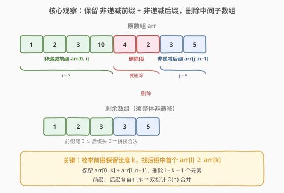
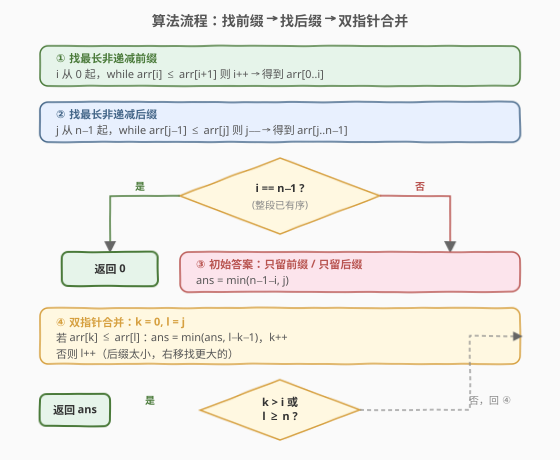
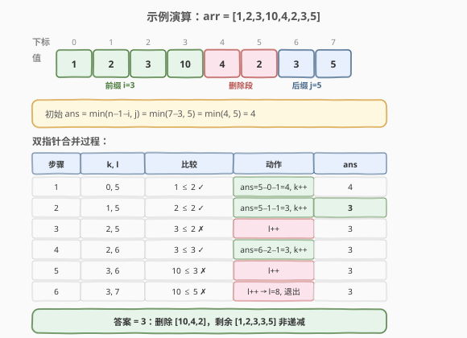

# LeetCode 删除最短的子数组使剩余数组有序 题解

## 1. 题目概述

- **标题 / 题号**：删除最短的子数组使剩余数组有序（#1574，medium）
- **链接**：https://leetcode.cn/problems/shortest-subarray-to-be-removed-to-make-array-sorted/
- **难度**：中等
- **标签**：数组、双指针、贪心

**题意**：给定一个整数数组 `arr`，从中删除**一个子数组**（可以为空，且必须是连续的一段），使得**剩余元素**按**非递减**顺序排列。返回**需要删除的子数组的最短长度**。

> 💡 「子数组」指原数组中连续的一段；删除后剩余元素**保持原相对顺序**，只是中间被挖掉一段。

**示例 1**：

```text
输入：arr = [1,2,3,10,4,2,3,5]
输出：3
解释：删除 [10,4,2]，剩余 [1,2,3,3,5] 非递减。
```

**示例 2**：

```text
输入：arr = [5,4,3,2,1]
输出：4
解释：整个数组递减，只能保留一个元素，删除其余 4 个。
```

**示例 3**：

```text
输入：arr = [1,2,3]
输出：0
解释：已经非递减，无需删除。
```

**约束**：

- $1 \le \text{arr.length} \le 10^5$
- $0 \le \text{arr}[i] \le 10^9$

## 2. 解题思路

### 2.1 暴力思路：枚举删除区间

枚举所有子数组 `arr[l..r]`（共 $O(n^2)$ 个），删除后检查剩余是否非递减（$O(n)$）。总复杂度 $O(n^3)$，$n = 10^5$ 完全不可行。

> 💡 转换视角：与其「枚举删除什么」，不如想「**保留什么**」。保留的必定是原数组中**靠左的一段非递减前缀**和**靠右的一段非递减后缀**拼起来的——中间挖掉。

### 2.2 核心观察：前缀 + 后缀 双指针合并



关键观察：

1. **保留部分的结构**：删除一段后，剩余的左边部分来自原数组的**某个非递减前缀** `arr[0..k]`，右边部分来自**某个非递减后缀** `arr[l..n-1]`，且需满足 `arr[k] <= arr[l]`（拼接处不破坏非递减）。
2. **前缀、后缀各自取最长**：要让删除段最短，前缀和后缀应尽可能长。所以先求：
   - 最长非递减前缀：从左扫描，`i` 为满足 `arr[0..i]` 非递减的最大下标。
   - 最长非递减后缀：从右扫描，`j` 为满足 `arr[j..n-1]` 非递减的最小下标。
3. **三种保留方案取最小**：
   - **只留前缀**：删除 `arr[i+1..n-1]`，长度 $n - 1 - i$。
   - **只留后缀**：删除 `arr[0..j-1]`，长度 $j$。
   - **前缀 + 后缀合并**：枚举前缀保留到 `k`（$0 \le k \le i$），在后缀中找首个 `arr[l] >= arr[k]`（$l \ge j$），删除中间 $l - k - 1$ 个。
4. **合并用双指针 $O(n)$**：前缀非递减 → `arr[k]` 随 `k` 增大而增大；后缀非递减 → 满足 `arr[l] >= arr[k]` 的最小 `l` 也随之单调右移。故 `k`、`l` 各至多走一遍，总 $O(n)$。

> ⚠️ 若 `i == n-1`（整段已非递减），直接返回 `0`，无需后续处理。

### 2.3 算法流程图



### 2.4 示例演算

以示例 1 `arr = [1,2,3,10,4,2,3,5]` 为例：

- 最长非递减前缀：`[1,2,3,10]`，`i = 3`。
- 最长非递减后缀：`[2,3,5]`，`j = 5`。
- 初始答案：`ans = min(n-1-i, j) = min(4, 5) = 4`。



| 步骤 | (k, l) | 比较 | 动作 | ans |
|------|--------|------|------|-----|
| 1 | (0, 5) | `1 ≤ 2` ✓ | `ans=min(4, 5-0-1=4)`, `k++` | 4 |
| 2 | (1, 5) | `2 ≤ 2` ✓ | `ans=min(4, 5-1-1=3)`, `k++` | 3 |
| 3 | (2, 5) | `3 ≤ 2` ✗ | `l++` | 3 |
| 4 | (2, 6) | `3 ≤ 3` ✓ | `ans=min(3, 6-2-1=3)`, `k++` | 3 |
| 5 | (3, 6) | `10 ≤ 3` ✗ | `l++` | 3 |
| 6 | (3, 7) | `10 ≤ 5` ✗ | `l++` → `l=8`，退出 | 3 |

> 💡 步骤 2 找到了最优解：保留前缀 `[1,2]` 与后缀 `[3,5]`（中间 `[3,10,4,2]` 中 `l=5` 对应值 `2` ≥ `arr[1]=2`，保留 `arr[0..1]+arr[5..7] = [1,2,2,3,5]` 非递减，删除 `5-1-1=3` 个）。最终答案 **3**。

## 3. 参考代码

### C++

```cpp
class Solution {
  public:
    int findLengthOfShortestSubarray(vector<int>& arr) {
        int n = arr.size();

        // 1. 最长非递减前缀 arr[0..i]
        int i = 0;
        while (i + 1 < n && arr[i] <= arr[i + 1]) i++;
        if (i == n - 1) return 0;  // 整段已有序

        // 2. 最长非递减后缀 arr[j..n-1]
        int j = n - 1;
        while (j - 1 >= 0 && arr[j - 1] <= arr[j]) j--;

        // 3. 只留前缀 / 只留后缀
        int ans = min(n - 1 - i, j);

        // 4. 双指针合并：枚举前缀末位 k，后缀找首个 arr[l] >= arr[k]
        int k = 0, l = j;
        while (k <= i && l < n) {
            if (arr[k] <= arr[l]) {
                ans = min(ans, l - k - 1);  // 删除 (k, l) 之间
                k++;
            } else {
                l++;  // 后缀当前值太小，右移
            }
        }
        return ans;
    }
};
```

### Python

```python
class Solution:
    def findLengthOfShortestSubarray(self, arr: List[int]) -> int:
        n = len(arr)

        # 1. 最长非递减前缀
        i = 0
        while i + 1 < n and arr[i] <= arr[i + 1]:
            i += 1
        if i == n - 1:
            return 0

        # 2. 最长非递减后缀
        j = n - 1
        while j - 1 >= 0 and arr[j - 1] <= arr[j]:
            j -= 1

        # 3. 只留前缀 / 只留后缀
        ans = min(n - 1 - i, j)

        # 4. 双指针合并
        k, l = 0, j
        while k <= i and l < n:
            if arr[k] <= arr[l]:
                ans = min(ans, l - k - 1)
                k += 1
            else:
                l += 1
        return ans
```

> 💡 **为什么 `l - k - 1` 不会为负？** 进入合并循环时必有 `i < j - 1`（否则整段已有序会提前返回 0），即前缀与后缀之间至少隔着一个待删元素，故首次 `arr[k] <= arr[l]` 命中时 `l > k + 1`，`l - k - 1 >= 1`。

## 4. 复杂度分析

| 维度 | 复杂度 | 说明 |
|------|--------|------|
| 时间复杂度 | $O(n)$ | 找前缀、找后缀各一次线性扫描；双指针合并 `k`、`l` 各至多遍历一次，合计 $O(n)$ |
| 空间复杂度 | $O(1)$ | 仅用常数个指针变量，原地操作 |

> ⚠️ 本题 $n \le 10^5$，$O(n)$ 是必要门槛——$O(n^2)$ 的枚举删除区间方案会超时。

## 5. 扩展：二分查找替代双指针

合并阶段也可对每个 `k` 在后缀 `arr[j..n-1]` 中**二分查找**首个 `>= arr[k]` 的位置（`lower_bound`）。由于后缀非递减，二分合法。

```cpp
// 替代第 4 步的双指针
for (int k = 0; k <= i; ++k) {
    auto it = lower_bound(arr.begin() + j, arr.end(), arr[k]);
    int l = it - arr.begin();         // 首个 arr[l] >= arr[k]
    ans = min(ans, l - k - 1);        // l 必在 [j, n]，l-k-1 >= 0
}
```

| 维度 | 双指针 | 二分 |
|------|--------|------|
| 时间 | $O(n)$ | $O(i \log(n-j))$ |
| 实现 | 单循环，常数更小 | 复用 `lower_bound`，更直观 |
| 推荐 | **首选**（更快） | 备选（思路更易讲解） |

> 💡 二分版的好处是**思路分步清晰**：先确定「保留结构是前缀+后缀」，再对每个前缀末位用现成的 `lower_bound` 求后缀起点。面试中若一时想不清双指针单调性，可先写二分版保证正确，再优化为双指针。

## 6. 面试要点

1. **为什么删除一段后剩余部分一定是「前缀 + 后缀」？**

   删除的是连续子数组 `arr[l..r]`，剩余就是 `arr[0..l-1]` 和 `arr[r+1..n-1]` 两段——前者是前缀、后者是后缀。要让剩余非递减，前缀内部、后缀内部、以及拼接处 `arr[l-1] <= arr[r+1]` 都须满足。前缀和后缀各自取**最长非递减段**即可覆盖所有可能。

2. **为什么要单独考虑「只留前缀」「只留后缀」？**

   合并方案要求 `arr[k] <= arr[l]`，但若前缀末位恒大于后缀首位（如 `[5,4,3,2,1]`，前缀 `[5]`、后缀 `[1]`，`5 > 1`），合并无解。此时只能二选一：留前缀（删后缀）或留后缀（删前缀），取较小删除量。

3. **双指针的单调性来自哪里？**

   前缀 `arr[0..i]` 非递减 → `arr[k]` 随 `k` 增大不减；后缀 `arr[j..n-1]` 非递减 → 在有序序列中找「首个 `>= arr[k]`」的位置，随 `arr[k]` 增大而右移。故 `k` 增时 `l` 不回退，总移动量 $O(n)$。

4. **`i == n-1` 提前返回 0 的意义？**

   若整段已非递减，无需删除任何元素。这一特判避免了 `j` 计算和后续合并的逻辑歧义（此时 `j` 会等于 0，`ans = min(n-1, 0) = 0`，结果虽对但流程冗余）。

5. **能删空子数组吗？**

   能。当数组已非递减时删除长度为 0 的空段，即示例 3 的情况。代码中 `i == n-1` 分支返回 0 正是处理此情形。

## 同类练习题

| # | 题目 | 与本题的关联 |
|---|------|-------------|
| 2972 | [统计移除递增子数组的总数 II](https://leetcode.cn/problems/count-the-number-of-incremovable-subarrays-ii/) | 本题的计数变体——同样找前缀+后缀，但统计合法移除方案数，双指针计数 $O(n)$ |
| 2971 | [找到最大周长的多边形](https://leetcode.cn/problems/find-polygon-with-the-largest-perimeter/) | 排序后前缀和 + 贪心，同样利用「前缀有序」的性质 |
| 11 | [盛最多水的容器](https://leetcode.cn/problems/container-with-most-water/) | 双指针单调性经典题，左右指针随条件单向收缩，与本题双指针合并同源 |
| 167 | [两数之和 II - 输入有序数组](https://leetcode.cn/problems/two-sum-ii-input-array-is-sorted/) | 有序数组双指针查找，本题合并阶段「有序后缀中找首个 >= 值」的二分版即此思想 |
| 524 | [通过删除字母匹配到字典里最长单词](https://leetcode.cn/problems/longest-word-in-dictionary-through-deleting/) | 删除子序列使剩余匹配，与本题「删除子数组使剩余有序」对照（子序列 vs 子数组） |
