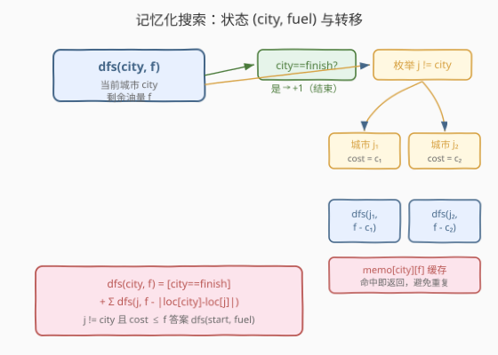
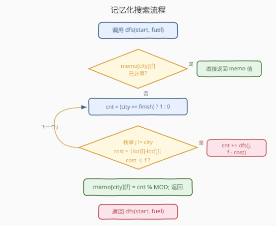
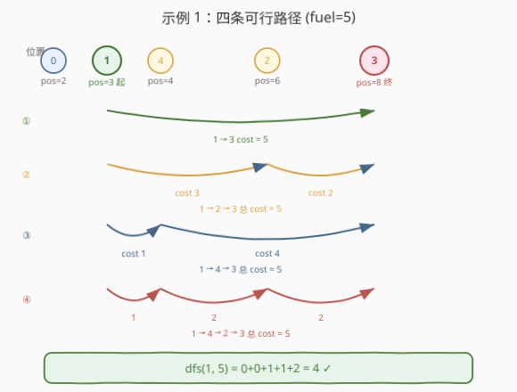

# 统计所有可行路径

- **题目名称**：统计所有可行路径
- **链接**：[1575. 统计所有可行路径](https://leetcode.cn/problems/count-all-possible-routes/)
- **难度**：困难
- **标签**：数组、动态规划、记忆化搜索

## 1. 题目概述

给定 `n` 个**互不相同**的城市位置 `locations[i]`，以及出发城市 `start`、目的城市 `finish` 和初始油量 `fuel`。每一步可从当前城市 `i` 移动到任意城市 `j`（`j != i`），消耗油量 `|locations[i] - locations[j]|`。油量**任何时刻不能为负**，且**可以经过任意城市超过一次**（包括 `start` 和 `finish`）。求从 `start` 到 `finish` 的**所有可能路径数目**，答案对 $10^9 + 7$ 取余。

**示例 1**：

```text
输入：locations = [2,3,6,8,4], start = 1, finish = 3, fuel = 5
输出：4
解释：以下为所有可能路径，每一条都用了 5 单位的汽油：
1 -> 3
1 -> 2 -> 3
1 -> 4 -> 3
1 -> 4 -> 2 -> 3
```

**示例 2**：

```text
输入：locations = [4,3,1], start = 1, finish = 0, fuel = 6
输出：5
解释：以下为所有可能的路径：
1 -> 0，使用汽油量为 fuel = 1
1 -> 2 -> 0，使用汽油量为 fuel = 5
1 -> 2 -> 1 -> 0，使用汽油量为 fuel = 5
1 -> 0 -> 1 -> 0，使用汽油量为 fuel = 3
1 -> 0 -> 1 -> 0 -> 1 -> 0，使用汽油量为 fuel = 5
```

**示例 3**：

```text
输入：locations = [5,2,1], start = 0, finish = 2, fuel = 3
输出：0
解释：没有办法只用 3 单位的汽油从 0 到达 2。因为最短路径需要 4 单位的汽油。
```

**约束条件**：

- `2 <= locations.length <= 100`
- `1 <= locations[i] <= 10^9`
- 所有 `locations` 中的整数互不相同
- `0 <= start, finish < locations.length`
- `1 <= fuel <= 200`

> ⚠️ 关键观察：`fuel <= 200`，而城市数 `n <= 100`。状态的**有效规模**由 `(城市, 剩余油量)` 决定，至多 $100 \times 200 = 2 \times 10^4$ 个状态——这是典型的**记忆化搜索**甜区。又因为路径可以反复经过同一城市，**只要剩余油量不同就是不同状态**，天然消除环上的重复计数问题。

---

## 2. 解题思路

### 2.1 暴力思路：枚举所有路径

从 `start` 出发 DFS，每一步尝试移动到任意其他城市，油量不够就剪枝，到达 `finish` 就计数。问题是路径可以**反复经过同一城市**，理论上路径长度无上界（只要油量还够绕圈），暴力 DFS 会指数爆炸。

> 💡 转换视角：路径的"未来"只取决于**当前所在城市**和**剩余油量**——与"之前怎么走来的"无关。这正是**最优子结构 + 重叠子问题**的标志：把 `(city, fuel)` 作为状态，用记忆化搜索避免重复计算。

### 2.2 核心观察：记忆化搜索（状态 = 当前城市 + 剩余油量）



**状态定义**：

> $\text{dfs}(\text{city}, f)$ = 从城市 `city` 出发、剩余油量为 `f` 时，到达 `finish` 的所有可行路径数目。

**状态转移**：

当前位于 `city`，剩余油量 `f`。一条路径可以在 `city == finish` 时**选择结束**（这是一条合法路径），也可以**选择继续前进**：

- 若 `city == finish`：先累加 1（在此结束算一条路径）；
- 枚举下一个城市 `j != city`，若移动代价 $\text{cost} = |\text{locations}[\text{city}] - \text{locations}[j]| \le f$，则递归累加 $\text{dfs}(j,\ f - \text{cost})$。

$$
\text{dfs}(\text{city}, f) = \underbrace{[\text{city} = \text{finish}]}_{\text{在此结束}} + \sum_{\substack{j \ne \text{city} \\ |\text{loc}[\text{city}]-\text{loc}[j]| \le f}} \text{dfs}\bigl(j,\ f - |\text{loc}[\text{city}]-\text{loc}[j]|\bigr)
$$

**答案**：$\text{dfs}(\text{start}, \text{fuel})$。

> 💡 **为什么「到达 finish 也可以继续走」？** 题目允许反复经过 `finish`。例如示例 2 中 `1 -> 0 -> 1 -> 0` 经过 `finish=0` 两次，每次到达都算一条独立路径。因此转移中**先累加"在此结束"的贡献，再累加"继续前进"的贡献**，二者并列求和，不互斥。

> ⚠️ **为什么不会无限递归？** 每次转移油量严格递减（`cost >= 1`，因为城市位置互不相同），所以递归深度至多 `fuel` 层。状态空间 $O(n \cdot \text{fuel})$ 有界，记忆化保证每个状态只算一次。

### 2.3 算法流程图



**记忆化搜索骨架**：

1. 用二维数组 `memo[city][f]`（初值 `-1` 表示未计算）缓存结果；
2. 进入 `dfs(city, f)`：若 `memo[city][f] != -1` 直接返回；
3. 计数 `cnt = (city == finish) ? 1 : 0`；
4. 遍历所有 `j != city`，若 `cost <= f` 则 `cnt += dfs(j, f - cost)`；
5. 取模后写入 `memo`，返回 `cnt`。

### 2.4 示例演算

以示例 1 `locations = [2,3,6,8,4], start = 1, finish = 3, fuel = 5` 为例。各城市位置：

| 城市编号 | 0 | 1 | 2 | 3 | 4 |
|----------|---|---|---|---|---|
| 位置 | 2 | 3 | 6 | 8 | 4 |



四条路径及其油量消耗：

| 路径 | 逐段代价 | 总油量 |
|------|----------|--------|
| `1 -> 3` | 5 | 5 |
| `1 -> 2 -> 3` | 3 + 2 | 5 |
| `1 -> 4 -> 3` | 1 + 4 | 5 |
| `1 -> 4 -> 2 -> 3` | 1 + 2 + 2 | 5 |

关键递归调用（仅展开到 `finish=3` 的命中分支）：

| 调用 | city | f | 在此结束? | 枚举 j | 命中分支 | 返回值 |
|------|------|---|-----------|--------|----------|--------|
| `dfs(1, 5)` | 1 | 5 | 否(0) | 0,2,3,4 | 见下 | 4 |
| `dfs(3, 0)` | 3 | 0 | **是(1)** | 无（油量为 0） | — | 1 |
| `dfs(2, 2)` | 2 | 2 | 否(0) | 3(代价2) | `dfs(3,0)=1` | 1 |
| `dfs(4, 4)` | 4 | 4 | 否(0) | 3(代价4), 2(代价2) | `dfs(3,0)=1` + `dfs(2,2)=1` | 2 |

汇总：`dfs(1,5) = 0 + dfs(0,4)=0 + dfs(2,2)=1 + dfs(3,0)=1 + dfs(4,4)=2 = 4` ✓

> 💡 注意 `dfs(3, 0)` 在 `dfs(1,5)`（直奔 finish）和 `dfs(4,4)`（绕路到 finish）中**被重复请求**——记忆化使其只计算一次，这正是「重叠子问题」的体现。

---

## 3. 参考代码

### 方法一：记忆化 DFS（推荐，自顶向下）

### C++

```cpp
class Solution {
    static constexpr int MOD = 1e9 + 7;
    int n, finish;
    vector<int> loc;
    int memo[105][205];

  public:
    int countRoutes(vector<int>& locations, int start, int finish, int fuel) {
        n = locations.size();
        this->finish = finish;
        loc = locations;
        memset(memo, -1, sizeof(memo));
        return dfs(start, fuel);
    }

  private:
    int dfs(int city, int f) {
        if (memo[city][f] != -1) return memo[city][f];
        int cnt = (city == finish) ? 1 : 0;
        for (int j = 0; j < n; ++j) {
            if (j == city) continue;
            int cost = abs(loc[city] - loc[j]);
            if (cost <= f) {
                cnt = (cnt + dfs(j, f - cost)) % MOD;
            }
        }
        return memo[city][f] = cnt;
    }
};
```

### Python

```python
class Solution:
    def countRoutes(self, locations: List[int], start: int, finish: int, fuel: int) -> int:
        MOD = 10**9 + 7
        n = len(locations)
        memo = {}

        @cache
        def dfs(city: int, f: int) -> int:
            cnt = 1 if city == finish else 0
            for j in range(n):
                if j == city:
                    continue
                cost = abs(locations[city] - locations[j])
                if cost <= f:
                    cnt = (cnt + dfs(j, f - cost)) % MOD
            return cnt

        return dfs(start, fuel)
```

> 💡 **记忆化的关键**：`@cache`（Python）或手写 `memo` 表（C++）把重复子问题压缩到 $O(n \cdot \text{fuel})$。没有记忆化的朴素 DFS 会因路径可重复经过城市而陷入指数级搜索。

### 方法二：自底向上迭代 DP

把 `(city, fuel)` 看作二维状态，按**油量从小到大**递推（因为 `dfs(city, f)` 依赖 `dfs(j, f - cost)`，即更小油量的状态）。

### C++

```cpp
class Solution {
    static constexpr int MOD = 1e9 + 7;

  public:
    int countRoutes(vector<int>& locations, int start, int finish, int fuel) {
        int n = locations.size();
        vector<vector<int>> dp(n, vector<int>(fuel + 1, 0));
        for (int f = 0; f <= fuel; ++f) {
            for (int city = 0; city < n; ++city) {
                dp[city][f] = (city == finish) ? 1 : 0;
                for (int j = 0; j < n; ++j) {
                    if (j == city) continue;
                    int cost = abs(locations[city] - locations[j]);
                    if (cost <= f) {
                        dp[city][f] = (dp[city][f] + dp[j][f - cost]) % MOD;
                    }
                }
            }
        }
        return dp[start][fuel];
    }
};
```

> 💡 **迭代 vs 记忆化**：迭代版按油量递增填表，每个 `dp[city][f]` 只依赖 `dp[?][f - cost]`（更小油量），依赖方向单一无环。记忆化版只计算真正到达的状态，常数更小；迭代版无递归栈、可读性强。本题两者均可，$n \cdot \text{fuel} \le 2 \times 10^4$ 状态量都很小。

---

## 4. 复杂度分析

| 维度 | 复杂度 | 说明 |
|------|--------|------|
| 时间复杂度 | $O(n^2 \cdot \text{fuel})$ | 状态数 $O(n \cdot \text{fuel})$，每个状态枚举 $O(n)$ 个目标城市 |
| 空间复杂度 | $O(n \cdot \text{fuel})$ | 记忆化表 / dp 表大小；递归栈深度至多 $O(\text{fuel})$ |

> ⚠️ 代入上限 $n = 100, \text{fuel} = 200$：状态数 $2 \times 10^4$，转移 $100$，总操作 $\approx 2 \times 10^6$，远低于时间限制。注意 `locations[i]` 可达 $10^9$，但**位置值不参与状态规模**——只有位置**差**（代价）参与转移判定，差值上界由 `fuel` 限制。

---

## 5. 扩展：为什么贪心/最短路不行？

一个常见误区是"油量刚好够走最短路就行"——但题目要数**所有**路径，不是找最短一条。示例 2 中 `1 -> 0 -> 1 -> 0 -> 1 -> 0` 反复横跳仍然合法，只要总油量不超过 6。这类"计数"问题天然需要 DP/记忆化，贪心只能处理"最值"问题。

**与最短路问题的对比**：

| 维度 | 最短路（如 743） | 本题（1575） |
|------|------------------|--------------|
| 目标 | 求最小代价 | 求路径**数目** |
| 是否可重复经过 | 最短路无需重复 | 允许重复，是计数关键 |
| 状态 | `(节点)` + 贪心松弛 | `(节点, 剩余油量)` |
| 算法 | Dijkstra / Bellman-Ford | 记忆化搜索 |

> 💡 **油量作为状态维度**的通用套路：当问题有"预算/容量"约束（油量、步数、金钱）且需要计数/最值时，把预算作为状态的一维是标准做法。参见 [787. K 站中转内最便宜的航班](../0701-0800/787_K站中转内最便宜的航班.md)（步数作为维度）、[322. 零钱兑换](../0301-0400/322_零钱兑换.md)（金额作为维度）。

---

## 6. 面试要点

1. **为什么状态要带上「剩余油量」？**

   - 因为路径可以反复经过同一城市，仅用 `city` 作状态会形成环，无法定义无环的递推。引入剩余油量后，每次转移油量严格递减，状态无环，记忆化才有效。

2. **`city == finish` 时为什么是「先加 1 再继续枚举」而不是「二选一」？**

   - 题目允许在 `finish` 结束，也允许经过 `finish` 后继续走再来一次。两者是**并列求和**而非互斥：`cnt = [city==finish] + sum(继续前进的路径数)`。

3. **记忆化 DFS 和迭代 DP 怎么选？**

   - 本题状态依赖方向清晰（油量递减），迭代版按油量递增填表即可。但记忆化版只计算从 `start` 可达的状态，对稀疏情况常数更优；且递归式与状态定义一一对应，不易写错。面试推荐先写记忆化版讲清思路，再提迭代版作为优化。

4. **为什么答案要取模？**

   - 路径数随 `fuel` 增长极快（可反复绕圈），不加取模会溢出。每一步累加后立即 `% MOD`，避免中间值溢出 `int`（C++ 中 `int` 上界约 $2 \times 10^9$，两路相加就可能溢出）。

5. **复杂度里的 $10^9$ 位置值会影响吗？**

   - 不会。`locations[i]` 的绝对值只用于计算 `cost = |loc[i] - loc[j]|`，是 $O(1)$ 运算。状态规模由 $n$ 和 `fuel` 决定，与位置值大小无关。只有 `cost <= fuel` 的转移才有效，过大的代价自然被剪枝。

---

## 7. 同类练习题

- [787. K 站中转内最便宜的航班](https://leetcode.cn/problems/cheapest-flights-within-k-stops/)（[题解](../0701-0800/787_K站中转内最便宜的航班.md))：把"中转站数"作为状态维度的限制松弛 Bellman-Ford，与本题"油量作为维度"同构，对比"最值型"与"计数型"
- [322. 零钱兑换](https://leetcode.cn/problems/coin-change/)（[题解](../0301-0400/322_零钱兑换.md))：金额作为维度的完全背包 DP，转移结构"枚举下一步选择"与本题一致，对比"最小硬币数"与"路径数目"
- [931. 下降路径最小和](https://leetcode.cn/problems/minimum-falling-path-sum/)：网格 DP，每步从上一行三选一，状态 `(行, 列)` + 枚举转移，骨架同本题
- [63. 不同路径 II](https://leetcode.cn/problems/unique-paths-ii/)：经典网格计数 DP，"数路径数目"的目标与本题相同，区别在于无"预算"维度
- [576. 出界的路径数](https://leetcode.cn/problems/out-of-boundary-paths/)：三维计数 DP `(行, 列, 剩余步数)`，与本题 `(城市, 剩余油量)` 结构完全同构，是本题的最佳姊妹题
