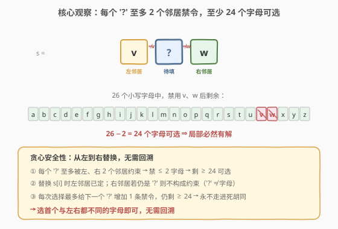
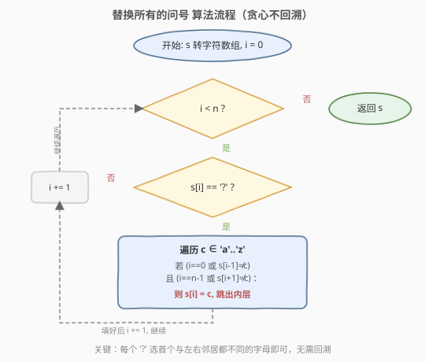
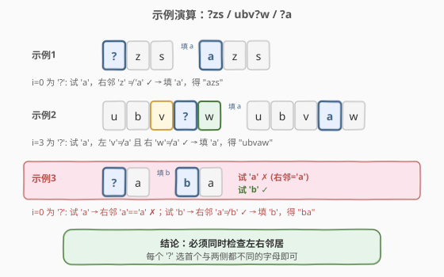

# 替换所有的问号

- **题目名称**：替换所有的问号
- **链接**：[1576. 替换所有的问号](https://leetcode.cn/problems/replace-all-s-to-avoid-consecutive-repeating-characters/)
- **难度**：简单
- **标签**：字符串、贪心

## 1. 题目概述

给你一个仅包含小写英文字母和 `'?'` 字符的字符串 `s`，请你将所有的 `'?'` 替换为若干小写字母，使最终的字符串**不包含任何连续重复的字符**。

- **不能**修改非 `'?'` 字符。
- 题目测试用例保证：除 `'?'` 外，原串中**不存在**连续重复的字符。
- 完成所有替换后返回最终字符串。若有多种方案，返回**任意一种**即可。可以证明在给定约束下答案总是存在的。

**示例 1**：

```text
输入：s = "?zs"
输出："azs"
解释：共 25 种方案，从 "azs" 到 "yzs" 均合法。只有填 "z" 非法，因为 "zzs" 出现连续两个 'z'。
```

**示例 2**：

```text
输入：s = "ubv?w"
输出："ubvaw"
解释：共 24 种方案，只有填 "v" 和 "w" 非法（"ubvvw"、"ubvww" 含连续重复字符）。
```

**约束条件**：

- `1 <= s.length <= 100`
- `s` 仅包含小写英文字母和 `'?'`

> 💡 关键约束是「除 `'?'` 外无连续重复」——这保证我们只需关注每个 `'?'` 与其**左右相邻**字符的关系，替换不会与更远位置产生冲突。

---

## 2. 解题思路

### 2.1 暴力思路：回溯枚举

最朴素的思路是对每个 `'?'` 依次尝试 26 个字母，一旦某次选择导致与相邻字符重复就**回溯**换一个再试。最坏情况时间复杂度 $O(26^k)$（$k$ 为 `'?'` 的个数）。

> 💡 但其实根本不需要回溯。本题有一个很强的结构性保证：每个 `'?'` 的可选字母**非常多**（见 2.2），局部随便选一个都不会把后续「逼到死路」。回溯在这里是多余的复杂度。

### 2.2 核心观察：贪心不回溯，局部选择必然存在且不污染未来



**观察一：每个 `'?'` 至多有 2 个邻居约束，至少剩 24 个字母可选。**

位置 $i$ 的 `'?'`，其可选字母只受左右邻居限制：

| 邻居 | 是否构成约束 | 最多禁用字母数 |
|------|-------------|---------------|
| 左邻居 $s[i-1]$（若存在且为字母） | 是，禁用 $s[i-1]$ | 1 |
| 右邻居 $s[i+1]$（若存在且为字母） | 是，禁用 $s[i+1]$ | 1 |

26 个字母至多被禁掉 2 个，**至少剩 24 个可选**。这正是题目「答案总是存在」的证明——每个 `'?'` 局部都至少有 24 个合法选择。

**观察二：从左到右替换时，贪心选择不会污染未来。**

- 替换 $s[i]$ 时，左邻居 $s[i-1]$ 已是确定字母（原字母或之前刚填的字母）。
- 右邻居 $s[i+1]$ 若仍是 `'?'`，则**不构成约束**——因为 `'?'` 不等于任何字母，条件 $s[i+1] \neq c$ 自动成立。若右邻居是字母，则需避开它。
- 填入 $s[i]$ 后，最多给右邻居（若为 `'?'`）增加 1 条禁令（不能等于刚填的字母）。而该 `'?'` 仍有 $26 - 2 = 24$ 个选择，**永远不会无解**。

> 💡 因此只需**从左到右**扫描，每个 `'?'` 选第一个与左右邻居都不同的字母即可，**无需回溯**。这是一道「贪心正确性由计数保证」的典型题——可选集足够大，局部最优不会导致全局无解。

### 2.3 算法流程图



整体只有一重遍历，每个 `'?'` 内层至多尝试 26 个字母（常数），总操作 $O(26n) = O(n)$。

### 2.4 示例演算



以三个例子说明：

- `"?zs"`：$i=0$ 为 `'?'`，试 `'a'`：右邻 `'z'` ≠ `'a'` ✓ → 填 `'a'`，得 `"azs"`。
- `"ubv?w"`：$i=3$ 为 `'?'`，试 `'a'`：左 `'v'` ≠ `'a'` 且 右 `'w'` ≠ `'a'` ✓ → 填 `'a'`，得 `"ubvaw"`。
- `"?a"`：$i=0$ 为 `'?'`，试 `'a'`：右邻 `'a'` == `'a'` ✗；试 `'b'`：右邻 `'a'` ≠ `'b'` ✓ → 填 `'b'`，得 `"ba"`。

> ⚠️ 第三个例子说明**必须同时检查右邻居**：若只看左邻居，`"?a"` 会填成 `'a'` 得到 `"aa"`——非法。从左到右遍历时右邻居若已是字母，必须避开它。

---

## 3. 参考代码

### C++（原地修改字符串）

```cpp
class Solution {
public:
    string modifyString(string s) {
        int n = s.size();
        for (int i = 0; i < n; ++i) {
            if (s[i] != '?') continue;
            for (char c = 'a'; c <= 'z'; ++c) {
                if ((i == 0 || s[i - 1] != c) &&
                    (i == n - 1 || s[i + 1] != c)) {
                    s[i] = c;
                    break;
                }
            }
        }
        return s;
    }
};
```

### Python

```python
class Solution:
    def modifyString(self, s: str) -> str:
        t = list(s)
        n = len(t)
        for i in range(n):
            if t[i] != '?':
                continue
            for c in "abcdefghijklmnopqrstuvwxyz":
                if (i == 0 or t[i - 1] != c) and (i == n - 1 or t[i + 1] != c):
                    t[i] = c
                    break
        return "".join(t)
```

> 💡 **判断条件的短路顺序**：先写 `i == 0 || s[i-1] != c`，利用 `||` 短路在边界处避免访问 `s[-1]`；右边界同理。C++ 中 `s[-1]` 是未定义行为，Python 中 `t[-1]` 会取到末尾元素导致隐蔽 bug，边界检查不可省。

---

## 4. 复杂度分析

| 维度 | 复杂度 | 说明 |
|------|--------|------|
| 时间复杂度 | $O(n)$ | 一重遍历 $n$ 个字符，每个 `'?'` 内层至多 26 次常数比较 |
| 空间复杂度 | $O(1)$ / $O(n)$ | C++ 原地修改字符串 $O(1)$；Python 转为 `list` 需 $O(n)$ |

> 💡 对 $n \le 100$，总操作至多约 $2600$ 次，远在时限内。内层 26 次是常数，不影响渐进复杂度。

---

## 5. 扩展：只需尝试 3 个字母

由于每个 `'?'` 至多被 2 个邻居约束，**禁掉至多 2 个字母**，那么在任意 3 个字母中必然至少有 1 个合法。因此内层循环只需遍历 `'a'`、`'b'`、`'c'` 即可：

```cpp
for (char c = 'a'; c <= 'c'; ++c) {  // 3 个字母足矣：至多禁 2 个，必剩 1 个
    if ((i == 0 || s[i - 1] != c) && (i == n - 1 || s[i + 1] != c)) {
        s[i] = c;
        break;
    }
}
```

| 维度 | 复杂度 | 说明 |
|------|--------|------|
| 时间复杂度 | $O(n)$ | 内层常数从 26 降到 3，渐进不变，常数更小 |
| 空间复杂度 | $O(1)$ / $O(n)$ | 同上 |

> 💡 这是一个典型的「**值域远大于约束数**」优化：26 个字母 vs 2 条禁令，只需 $\text{约束数}+1$ 个候选就能保证命中。思想可推广到任何「在值域中选一个避开少量黑名单」的场景。

---

## 6. 面试要点

1. **为什么贪心不需要回溯？**

   - 每个 `'?'` 至多被左右 2 个邻居约束，26 个字母中至少剩 24 个可选，局部选择空间极大。从左到右替换时，填入 $s[i]$ 最多给右邻居增加 1 条禁令，而右邻居仍有 24 个选择——**永远不会被逼到无解**，所以无需回溯。

2. **题目为什么保证「答案总是存在」？**

   - 由上面的计数论证：每个 `'?'` 至多禁掉 2 个字母，至少剩 24 个合法选择。逐个 `'?'` 独立看都有解，且贪心顺序不破坏后续可解性，故全局必然有解。

3. **需要同时检查左右邻居吗？只看左邻居行不行？**

   - 必须同时检查。反例 `"?a"`：若只看左邻居（$i=0$ 无左邻），会填 `'a'` 得到 `"aa"`——非法。从左到右遍历时，右邻居可能已经是字母（原串的），必须避开。只有当右邻居仍是 `'?'` 时才不构成约束。

4. **内层循环为什么 26 次就够？能否更少？**

   - 26 次覆盖全部字母，必然命中。其实由于至多 2 条禁令，只需尝试任意 3 个字母（如 `'a','b','c'`）就必有一个合法——「禁令数 + 1」个候选即可。两者都是常数，渐进复杂度相同。

5. **题目保证「非 `'?'` 字符无连续重复」有什么用？**

   - 它确保替换 `'?'` 时只需关注**相邻**两个位置，不会出现「填了一个字母却与隔一位的原字符冲突」的情况（因为原串本身已无连续重复）。若无此保证，可能需要全局检查或回溯。

---

## 7. 同类练习题

- [1957. 删除字符使字符串变好](https://leetcode.cn/problems/delete-characters-to-make-fancy-string/)：同属「消除连续重复字符」主题，但操作是删除而非替换，贪心保留非重复字符
- [1544. 整理字符串](https://leetcode.cn/problems/make-the-string-great/)（[题解](../1501-1600/1544_整理字符串.md)）：栈处理相邻坏对抵消，对比本题的相邻避让，同属「相邻字符约束」家族
- [1047. 删除字符串中的所有相邻重复项](https://leetcode.cn/problems/remove-all-adjacent-duplicates-in-string/)：相邻相同字符删除，栈模板，1544 的精确匹配版
- [3. 无重复字符的最长子串](https://leetcode.cn/problems/longest-substring-without-repeating-characters/)（[题解](../0001-0100/3_无重复字符的最长子串.md)）：字符不重复的子串视角，与本题的「相邻不重复」对照
- [83. 删除排序链表中的重复元素](https://leetcode.cn/problems/remove-duplicates-from-sorted-list/)（[题解](../0001-0100/83_删除排序链表中的重复元素.md)）：有序链表留一去重，「避免相邻重复」的链表版
