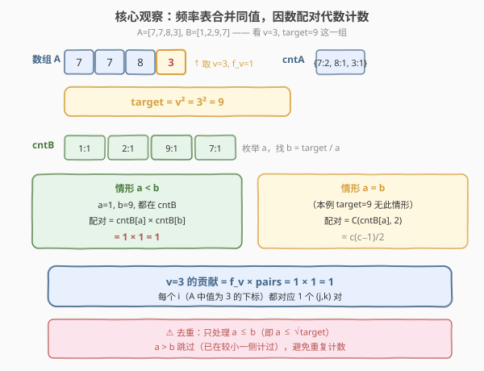
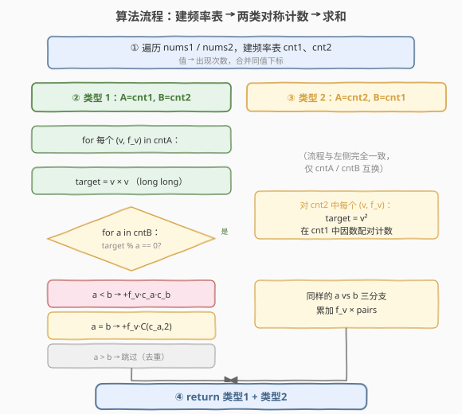

# LeetCode 数的平方等于两数乘积的方法数 题解

## 1. 题目概述

- **标题 / 题号**：数的平方等于两数乘积的方法数（#1577，medium）
- **链接**：https://leetcode.cn/problems/number-of-ways-where-square-of-number-is-equal-to-product-of-two-numbers/
- **难度**：中等
- **标签**：数组、哈希表、数学、计数

**题意**：给定两个整数数组 `nums1` 和 `nums2`，返回满足以下规则的三元组数目（类型 1 + 类型 2）：

- **类型 1**：三元组 $(i, j, k)$，满足 $\text{nums1}[i]^2 = \text{nums2}[j] \times \text{nums2}[k]$，其中 $0 \le i < \text{nums1.length}$ 且 $0 \le j < k < \text{nums2.length}$。
- **类型 2**：三元组 $(i, j, k)$，满足 $\text{nums2}[i]^2 = \text{nums1}[j] \times \text{nums1}[k]$，其中 $0 \le i < \text{nums2.length}$ 且 $0 \le j < k < \text{nums1.length}$。

**示例 1**：

```text
输入：nums1 = [7,4], nums2 = [5,2,8,9]
输出：1
解释：类型 1：(1,1,2)，nums1[1]^2 = nums2[1] * nums2[2]，即 4^2 = 2 * 8
```

**示例 2**：

```text
输入：nums1 = [1,1], nums2 = [1,1,1]
输出：9
解释：1^2 = 1 * 1，所有三元组都合法。
  类型 1：6 个 —— (0,0,1),(0,0,2),(0,1,2),(1,0,1),(1,0,2),(1,1,2)
  类型 2：3 个 —— (0,0,1),(1,0,1),(2,0,1)
```

**示例 3**：

```text
输入：nums1 = [7,7,8,3], nums2 = [1,2,9,7]
输出：2
解释：类型 1：(3,0,2)，3^2 = 1 * 9；类型 2：(3,0,1)，7^2 = 7 * 7
```

**约束**：

- $1 \le \text{nums1.length}, \text{nums2.length} \le 1000$
- $1 \le \text{nums1}[i], \text{nums2}[i] \le 10^5$

> 💡 两种类型完全对称——把 `nums1` 与 `nums2` 互换即由类型 1 变为类型 2。因此只需实现「给定数组 $A$ 与数组 $B$，统计满足 $A[i]^2 = B[j] \times B[k]$（$j<k$）的三元组数」这一个核心过程，对两种类型各调用一次再求和。

## 2. 解题思路

### 2.1 暴力思路：三重循环枚举

最直接的写法是枚举 $i$、$j$、$k$ 三重下标，验证 $A[i]^2 = B[j] \times B[k]$ 是否成立。若 $|A|=|B|=n$，复杂度为 $O(n^3)$，在 $n=1000$ 时高达 $10^9$ 次运算，必然超时。

> ⚠️ **缺陷分析**：暴力枚举把每个**数值**当成独立个体逐一配对，没有利用「相同数值产生完全相同的配对结果」这一结构。若先用频率表把相同数值合并，配对数可由频率的代数运算直接得出，无需逐下标枚举。

### 2.2 核心观察：频率表 + 因数配对计数



**第一步：建频率表。** 对数组 $B$ 统计每个值的出现次数，得频率表 `cntB`（值 → 次数）。对数组 $A$ 同样建 `cntA`。这样「$A$ 中有多少个 $i$ 使 $A[i]=v$」就是 `cntA[v]`，「$B$ 中值为 $a$ 的位置有多少个」就是 `cntB[a]`。

**第二步：固定 $v$，求配对数。** 对 $A$ 中每个**唯一值** $v$（频率 $f_v$），令目标 $\text{target} = v^2$。需要统计 $B$ 中「乘积等于 target 的下标对 $(j,k)$（$j<k$）」的数目，记为 $\text{pairs}(\text{target})$。则该 $v$ 贡献 $f_v \times \text{pairs}(\text{target})$ 个三元组（每个 $i$ 都对应同样的 $\text{pairs}$ 个 $(j,k)$）。

**第三步：因数配对代数计数。** 要算 $\text{pairs}(\text{target})$，枚举 `cntB` 中每个唯一值 $a$，若 $\text{target} \bmod a = 0$，令 $b = \text{target} / a$：

| 情形 | 条件 | 配对数公式 | 说明 |
|------|------|-----------|------|
| $a < b$ | $b$ 出现在 `cntB` 中 | $\text{cntB}[a] \times \text{cntB}[b]$ | 任取一个 $a$ 位置和一个 $b$ 位置，下标小者为 $j$、大者为 $k$，恰好一对 |
| $a = b$ | — | $\binom{\text{cntB}[a]}{2} = \frac{\text{cntB}[a](\text{cntB}[a]-1)}{2}$ | 在所有 $a$ 位置中任选两个，小者为 $j$、大者为 $k$ |
| $a > b$ | — | 跳过 | 已在「$a$ 取较小值」时计过一次，避免重复 |

> 💡 **为什么 $a < b$ 时配对数是 $\text{cntB}[a] \times \text{cntB}[b]$？** 选取任意一个值为 $a$ 的下标 $p$ 和任意一个值为 $b$ 的下标 $q$（$p \ne q$，因为 $a \ne b$ 故两下标必然不同），$\{p, q\}$ 恰对应一个合法的 $(j,k)$（取 $\min$ 为 $j$、$\max$ 为 $k$）。两个独立集合的笛卡尔积大小即为频率之积，无需再除以 2。

> ⚠️ **去重的关键**：枚举 $a$ 时只处理 $a \le b$（即 $a \le \sqrt{\text{target}}$）的情形。$a > b$ 的一侧会与 $a < b$ 重复，统一跳过。$a = b$ 是边界，用组合数 $C(n,2)$ 而非排列数 $A(n,2)$，因为 $(j,k)$ 有序但「两个相同值的位置」本身无序。

### 2.3 算法流程图



**算法步骤**：

1. **建频率表**：遍历 `nums1`、`nums2`，分别得到 `cnt1`、`cnt2`。
2. **类型 1**：以 `cnt1` 为 $A$、`cnt2` 为 $B$，对 `cnt1` 中每个 $(v, f_v)$，令 $\text{target}=v^2$，按 2.2 节方法算 $\text{pairs}$，累加 $f_v \times \text{pairs}$。
3. **类型 2**：交换角色——以 `cnt2` 为 $A$、`cnt1` 为 $B$，重复同样的过程。
4. **返回**两类结果之和。

### 2.4 示例演算

以示例 3 `nums1 = [7,7,8,3]`、`nums2 = [1,2,9,7]` 为例。

![示例演算：nums1=[7,7,8,3], nums2=[1,2,9,7]，答案 2](../images/1577_example_walkthrough.svg)

频率表：`cnt1 = {7:2, 8:1, 3:1}`，`cnt2 = {1:1, 2:1, 9:1, 7:1}`。

**类型 1**（$A=$ `nums1`，$B=$ `nums2`）：

| $v$ | $f_v$ | target $=v^2$ | 枚举 $a \in \text{cnt2}$（仅 $a \le b$） | pairs | 贡献 |
|-----|-------|--------------|------------------------------------------|-------|------|
| 7 | 2 | 49 | $a{=}7,b{=}7$（$a{=}b$，$C(1,2){=}0$）；其余 $a$ 不整除或 $b$ 不在表 | 0 | 0 |
| 8 | 1 | 64 | 无 $a$ 使 $b$ 落入 `cnt2` | 0 | 0 |
| 3 | 1 | 9 | $a{=}1,b{=}9$（$a{<}b$，$1\times1{=}1$） | 1 | 1 |

类型 1 合计 $= 1$，对应三元组 $(3,0,2)$：$3^2 = 1 \times 9$ ✓

**类型 2**（$A=$ `nums2`，$B=$ `nums1`）：

| $v$ | $f_v$ | target $=v^2$ | 枚举 $a \in \text{cnt1}$（仅 $a \le b$） | pairs | 贡献 |
|-----|-------|--------------|------------------------------------------|-------|------|
| 1 | 1 | 1 | $a{=}1,b{=}1$，但 1 不在 `cnt1` | 0 | 0 |
| 2 | 1 | 4 | 无 $a$ 使 $b$ 落入 `cnt1` | 0 | 0 |
| 9 | 1 | 81 | $a{=}3,b{=}27$，27 不在 `cnt1` | 0 | 0 |
| 7 | 1 | 49 | $a{=}7,b{=}7$（$a{=}b$，$C(2,2){=}1$） | 1 | 1 |

类型 2 合计 $= 1$，对应三元组 $(3,0,1)$：$7^2 = 7 \times 7$（取 `nums1` 中两个 7 的下标 0、1）✓

$$\text{答案} = 1 + 1 = 2 \quad \checkmark$$

## 3. 参考代码

### C++

```cpp
class Solution {
  public:
    int numTriplets(vector<int>& nums1, vector<int>& nums2) {
        unordered_map<long long, int> cnt1, cnt2;
        for (int x : nums1) cnt1[x]++;
        for (int x : nums2) cnt2[x]++;
        long long ans = 0;
        ans += countType(cnt1, cnt2);
        ans += countType(cnt2, cnt1);
        return (int)ans;
    }
  private:
    // 统计「A 中某值平方 == B 中两值乘积」的三元组数
    long long countType(unordered_map<long long, int>& cntA,
                        unordered_map<long long, int>& cntB) {
        long long res = 0;
        for (auto& [v, fv] : cntA) {
            long long target = v * v;
            for (auto& [a, ca] : cntB) {
                if (target % a != 0) continue;
                long long b = target / a;
                if (a < b) {
                    auto it = cntB.find(b);
                    if (it != cntB.end())
                        res += (long long)fv * ca * it->second;
                } else if (a == b) {
                    res += (long long)fv * (long long)ca * (ca - 1) / 2;
                }
            }
        }
        return res;
    }
};
```

### Python

```python
class Solution:
    def numTriplets(self, nums1: List[int], nums2: List[int]) -> int:
        from collections import Counter
        cnt1, cnt2 = Counter(nums1), Counter(nums2)

        def count_type(cntA, cntB):
            res = 0
            for v, fv in cntA.items():
                target = v * v
                for a, ca in cntB.items():
                    if target % a != 0:
                        continue
                    b = target // a
                    if a < b:
                        if b in cntB:
                            res += fv * ca * cntB[b]
                    elif a == b:
                        res += fv * ca * (ca - 1) // 2
            return res

        return count_type(cnt1, cnt2) + count_type(cnt2, cnt1)
```

> ⚠️ **溢出注意**：$\text{target} = v^2$ 可达 $(10^5)^2 = 10^{10}$，超出 32 位整数范围，C++ 中须用 `long long`。累加项 $f_v \times c_a \times c_b$ 最坏达 $1000 \times 1000 \times 1000 = 10^9$，多次累加也可能溢出 `int`，故 `res` 与中间值均用 `long long`。

## 4. 复杂度分析

| 维度 | 复杂度 | 说明 |
|------|--------|------|
| 时间复杂度 | $O(U_1 \cdot U_2)$ | 两类各枚举 $A$ 的唯一值（$U_1$ 个）× $B$ 的唯一值（$U_2$ 个）做整除判定；$U_1, U_2 \le 1000$，最坏 $2 \times 10^6$ 次操作 |
| 空间复杂度 | $O(U_1 + U_2)$ | 两张频率表，唯一值数各 $\le 1000$ |

> 💡 $U_1 \cdot U_2 \le 10^6$ 远小于暴力 $n^3 = 10^9$，关键在于频率表把「同值下标」合并为一次代数计算。若值域更小（如 $10^5$），也可改为枚举 $a$ 后直接数组下标查 $b$，但哈希表实现更通用。

## 5. 扩展：值域数组优化常数

当值域上界较小（本题 $10^5$）时，可用定长数组替代 `unordered_map`，消除哈希常数：

```cpp
class Solution {
    static const int MAXV = 100001;
  public:
    int numTriplets(vector<int>& nums1, vector<int>& nums2) {
        vector<int> cnt1(MAXV, 0), cnt2(MAXV, 0);
        for (int x : nums1) cnt1[x]++;
        for (int x : nums2) cnt2[x]++;
        long long ans = 0;
        ans += countType(nums1, cnt1, cnt2);
        ans += countType(nums2, cnt2, cnt1);
        return (int)ans;
    }
  private:
    long long countType(vector<int>& A, vector<int>& cntA, vector<int>& cntB) {
        long long res = 0;
        for (int v : A) {                       // 逐元素取 target，去重交给外层
            long long target = (long long)v * v;
            for (int a = 1; a <= v && a < MAXV; ++a) {  // a <= sqrt(target) 即 a <= v
                if (cntB[a] == 0 || target % a != 0) continue;
                long long b = target / a;
                if (b >= MAXV) continue;
                int cb = cntB[b];
                if (cb == 0) continue;
                if (a < b)      res += (long long)cntA[v] * cntB[a] * cb;
                else if (a == b) res += (long long)cntA[v] * (long long)cntB[a] * (cntB[a] - 1) / 2;
            }
        }
        return res;
    }
};
```

| 维度 | 哈希表版（主解） | 值域数组版 |
|------|----------------|-----------|
| 时间 | $O(U_1 \cdot U_2)$，哈希常数较大 | $O(\sum_v \sqrt{v^2}) = O(\sum_v v)$，最坏 $\sum 10^5 \approx 10^8$（值大时不优） |
| 空间 | $O(U_1 + U_2)$ | $O(\max V)$ 定长数组 |
| 适用 | 值大、唯一值少 | 值小、唯一值多 |

> ⚠️ 上面数组版外层若按「每个元素」遍历会重复计算同 $v$，应改为按唯一值遍历（用 `cntA[v]` 作 $f_v$，跳过 `cntA[v]==0`），否则只是常数劣化、不影响正确性（结果会因重复加而错）。面试中以哈希表主解讲思路即可。

## 6. 面试要点

1. **为什么用频率表而不是直接枚举下标？**

   - 暴力 $O(n^3)$ 在 $n=1000$ 超时。频率表把「相同数值」合并：$A$ 中值为 $v$ 的下标数 $f_v$、$B$ 中值为 $a$ 的下标数 $c_a$ 都只需统计一次，配对数由 $f_v \times c_a \times c_b$ 或 $C(c_a,2)$ 直接算出，复杂度降到 $O(U_1 \cdot U_2)$。

2. **$a < b$ 时为什么是 $c_a \times c_b$ 而不是要除以 2？**

   - $a \ne b$ 意味着两个下标分属不同值集合，任取 $a$ 位置 $p$ 与 $b$ 位置 $q$，$p \ne q$ 必然成立。$\min(p,q)$ 为 $j$、$\max(p,q)$ 为 $k$，一一对应一个合法对，没有重复计数。只有在 $a = b$（同值集合内部选两个）时才用 $C(n,2)$ 而非 $n(n-1)$。

3. **枚举 $a$ 时为什么只处理 $a \le b$？**

   - 配对 $\{a, b\}$ 与 $\{b, a\}$ 是同一组下标对。若枚举所有 $a$ 都计算，每对会被算两次。限制 $a \le b$（等价于 $a \le \sqrt{\text{target}}$）恰好覆盖每对一次：$a < b$ 算笛卡尔积，$a = b$ 算组合数，$a > b$ 跳过。

4. **两种类型为什么可以复用同一个函数？**

   - 类型 1 是「$A=\text{nums1}$ 平方 = $B=\text{nums2}$ 乘积」，类型 2 是「$A=\text{nums2}$ 平方 = $B=\text{nums1}$ 乘积」。把 `cntA`/`cntB` 作为参数传入，两次调用只需交换参数顺序，逻辑完全一致——这是对称性问题复用代码的典型模式。

5. **`target = v * v` 为什么要用 `long long`？**

   - $v \le 10^5$，$v^2 \le 10^{10}$，超过 `int` 上界 $2.1 \times 10^9$。C++ 中 `int * int` 会先按 32 位运算再扩展，必须显式转 `long long`（如 `(long long)v * v`）才能正确得到 64 位结果，否则触发未定义行为。

## 同类练习题

| # | 题目 | 与本题的关联 |
|---|------|-------------|
| 1 | [两数之和](https://leetcode.cn/problems/two-sum/)（[题解](../0001-0100/1_两数之和.md)） | 哈希表一次遍历找配对，本题「频率表 + 配对计数」的基础范式 |
| 454 | [四数相加 II](https://leetcode.cn/problems/4sum-ii/)（[题解](../0401-0500/454_四数相加II.md)） | 分组 + 哈希 Meet in the Middle，与本题同属「频率表计数而非枚举下标」家族 |
| 1512 | [好数对的数目](https://leetcode.cn/problems/number-of-good-pairs/)（[题解](../1501-1600/1512_好数对的数目.md)） | 频率表 + $C(n,2)$ 计数好对，即本题 $a=b$ 情形的退化版 |
| 611 | [有效三角形的个数](https://leetcode.cn/problems/valid-triangle-number/)（[题解](../0601-0700/611_有效三角形的个数.md)） | 排序 + 双指针计数配对，对照本题的哈希计数与双指针计数两种思路 |
| 1726 | [同积元组](https://leetcode.cn/problems/tuple-with-same-product/) | 枚举数组中两数乘积并按乘积分组计数，$C(k,2) \times 4$ 求同积四元组，与本题「按乘积配对计数」同源 |
