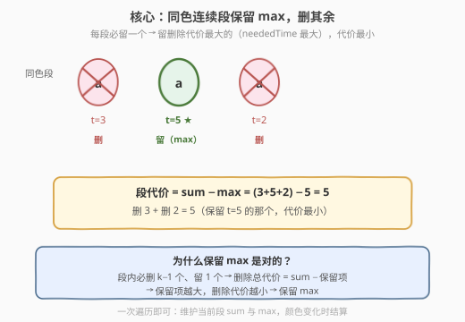
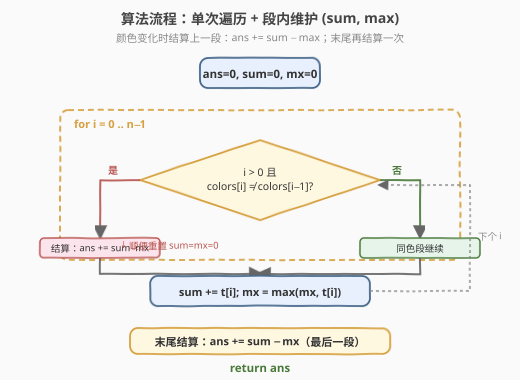
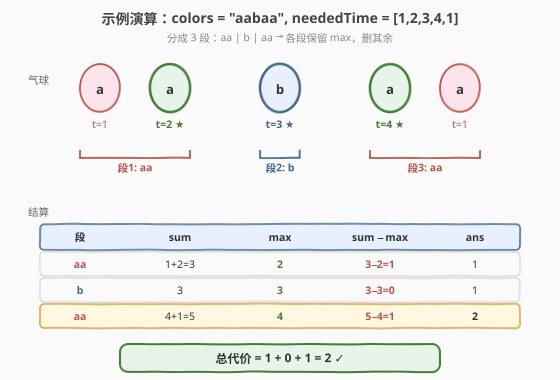

# 使绳子变成彩色的最短时间

- **题目名称**：使绳子变成彩色的最短时间
- **链接**：[1578. 使绳子变成彩色的最短时间](https://leetcode.cn/problems/minimum-time-to-make-rope-colorful/)
- **难度**：中等
- **标签**：贪心、数组、动态规划

## 1. 题目概述

Alice 把 `n` 个气球排列在一根绳子上，给定字符串 `colors`（`colors[i]` 是第 `i` 个气球的颜色）与数组 `neededTime`（`neededTime[i]` 是移除第 `i` 个气球所需的时间）。Bob 可以移除若干气球，使绳子上**不存在两个连续同色气球**。返回所需的最少总时间。

**示例 1**：

```text
输入：colors = "abaac", neededTime = [1,2,3,4,5]
输出：3
解释：移除下标 2 的 'a'（耗时 3），剩余 "abac" 无连续同色。
```

**示例 2**：

```text
输入：colors = "abc", neededTime = [1,2,3]
输出：0
解释：绳子已无连续同色，无需移除。
```

**示例 3**：

```text
输入：colors = "aabaa", neededTime = [1,2,3,4,1]
输出：2
解释：移除下标 0 与下标 4 的 'a'，各耗 1 秒，总时间 = 1 + 1 = 2。
```

**约束条件**：

- `n == colors.length == neededTime.length`
- `1 <= n <= 10^5`
- `1 <= neededTime[i] <= 10^4`
- `colors` 仅由小写英文字母组成

> 💡 题眼：**同色连续段**只能保留一个气球。要让删除代价最小，就保留段内 `neededTime` 最大的那个，删掉其余。

---

## 2. 解题思路

### 2.1 暴力思路：枚举每段保留谁？

把 `colors` 切成若干**极大同色连续段**。对每段长度 $k$，必须删掉 $k-1$ 个、保留 $1$ 个。暴力做法是对每段枚举「保留哪一个」，取使删除代价最小的方案。

段长 $k$ 时枚举 $k$ 种保留选择，总复杂度 $O(n)$（每个元素被枚举一次当候选）。其实这已经接近正解——但还可以更直接：**保留段内 `neededTime` 最大者**显然最优，无需逐个枚举。

> 💡 转换视角：段内删除总代价 $=\sum_{\text{段}} \text{neededTime} - \text{保留项}$。要让代价最小，就让「保留项」最大。这就是**贪心**。

### 2.2 核心观察：同色段保留 max，删其余



核心思路：

- 一次遍历，把序列按颜色切成若干**极大同色段**。
- 对每段维护两个量：段内 `neededTime` 之和 `sum` 与段内最大值 `mx`。
- 段的删除代价 $= \text{sum} - \text{mx}$（删掉除最大者外的所有气球）。
- 累加所有段代价即为答案。

> 💡 **贪心正确性**：段内必删 $k-1$ 个、留 $1$ 个。删除代价 $= \text{sum} - \text{保留项}$，要使其最小只需保留项最大。保留 `max` 是显然的最优选择，无需复杂的交换论证。

> ⚠️ **不要把"段"显式切出来再处理**——可以在一次遍历中**边走边维护**当前段的 `sum` 与 `mx`，遇到颜色变化就结算上一段，最后再补结一次末尾段。

### 2.3 算法流程图



流程要点：维护 `ans = 0`、当前段 `sum = 0`、`mx = 0`。对每个下标 `i`：若 `i > 0` 且 `colors[i] != colors[i-1]`，说明上一段结束——先结算 `ans += sum - mx`，并重置 `sum = mx = 0`；随后无论是否换段，都执行 `sum += neededTime[i]`、`mx = max(mx, neededTime[i])` 把当前气球并入当前段。循环结束后**再结算一次** `ans += sum - mx`（处理最后一段）。

### 2.4 示例演算

以示例 3 `colors = "aabaa", neededTime = [1,2,3,4,1]` 为例，序列被切成三段 `aa | b | aa`：



| 段 | 气球时间 | sum | max | sum − max | ans（累加后） |
|----|----------|-----|-----|-----------|---------------|
| `aa` | 1, 2 | 3 | 2 | 1 | 1 |
| `b` | 3 | 3 | 3 | 0 | 1 |
| `aa` | 4, 1 | 5 | 4 | 1 | **2** |

最终答案 $= 1 + 0 + 1 = 2$，与示例一致。

> 💡 **孤立单气球段**（如段 `b`）`sum == max`，代价 $0$——无需删除任何气球，符合直觉。

---

## 3. 参考代码

### 方法一：单次遍历 + 贪心（推荐，$O(n)$）

### C++

```cpp
class Solution {
  public:
    int minCost(string colors, vector<int>& neededTime) {
        int n = colors.size();
        long long ans = 0;
        long long sum = 0;       // 当前同色段的 neededTime 之和
        int mx = 0;              // 当前同色段的 neededTime 最大值

        for (int i = 0; i < n; ++i) {
            if (i > 0 && colors[i] != colors[i - 1]) {
                ans += sum - mx;     // 结算上一段
                sum = 0;
                mx = 0;
            }
            sum += neededTime[i];
            mx = max(mx, neededTime[i]);
        }
        ans += sum - mx;             // 结算最后一段

        return ans;
    }
};
```

### Python

```python
class Solution:
    def minCost(self, colors: str, neededTime: List[int]) -> int:
        ans = 0
        cur_sum = 0
        cur_max = 0

        for i, c in enumerate(colors):
            if i > 0 and c != colors[i - 1]:
                ans += cur_sum - cur_max   # 结算上一段
                cur_sum = 0
                cur_max = 0
            cur_sum += neededTime[i]
            cur_max = max(cur_max, neededTime[i])

        ans += cur_sum - cur_max           # 结算最后一段
        return ans
```

> 💡 **重置时机**：先结算再并入新段——`colors[i] != colors[i-1]` 触发的是「上一段结束」，所以用旧 `sum/mx` 结算后清零，再用 `neededTime[i]` 开新段。顺序不能反。

> 💡 **末尾补结**：循环在最后一段未结算时结束，需在循环外再补一次 `ans += sum - mx`。这是「边走边维护」写法的常见陷阱。

---

## 4. 复杂度分析

| 维度 | 复杂度 | 说明 |
|------|--------|------|
| 时间复杂度 | $O(n)$ | 单次遍历，每步 $O(1)$ 累加与 `max` 比较 |
| 空间复杂度 | $O(1)$ | 仅用 `ans`/`sum`/`mx` 三个变量 |

> 💡 $n \le 10^5$，$O(n)$ 一次扫描即可通过，无需任何额外数据结构。

---

## 5. 扩展：DP 视角与写法

本题也可看作**动态规划**——但这层 DP 被贪心「压缩」成了两个标量。

### 5.1 DP 状态定义

令 `dp[i]` 表示处理完前 `i` 个气球、且第 `i` 个气球**保留**时，前 `i` 个气球的最小删除代价。则：

$$
\text{dp}[i] = \min \begin{cases} \text{dp}[i-1] + \text{neededTime}[i] & \text{colors}[i] = \text{colors}[i-1] \text{，删 } i \\ \text{dp}[i-1] & \text{colors}[i] \neq \text{colors}[i-1] \end{cases}
$$

但状态还需记录「上一个保留气球的时间」以决定删谁——展开后会发现：**同色段内累计代价就是 $\sum - \max$**，DP 等价地坍缩为贪心。

### 5.2 DP 写法（仅供对照）

```cpp
int minCost(string colors, vector<int>& neededTime) {
    int n = colors.size();
    int ans = 0, i = 0;
    while (i < n) {
        int j = i, sum = 0, mx = 0;
        while (j < n && colors[j] == colors[i]) {
            sum += neededTime[j];
            mx = max(mx, neededTime[j]);
            ++j;
        }
        ans += sum - mx;
        i = j;
    }
    return ans;
}
```

这是**显式分段**版本：用双指针 `i/j` 切出每个同色段再结算，逻辑等价但多一层循环。面试中推荐方法一的「边走边结算」写法——更紧凑，无需显式找段端点。

| 写法 | 思路 | 优劣 |
|------|------|------|
| 方法一（边走遍历） | 维护 `sum/mx`，换色即结算 | 紧凑，单层循环，**推荐** |
| 显式分段（双指针） | 双指针切段再逐段结算 | 逻辑直白，多一层循环 |
| 二维 DP | 状态记录「最后保留项」 | 思路重，等价坍缩为贪心 |

---

## 6. 面试要点

1. **为什么保留段内 `max` 是最优？**

   - 同色段必删 $k-1$ 个、留 $1$ 个。删除代价 $= \text{sum} - \text{保留项}$，要使其最小只需保留项最大。保留 `max` 是显然最优，无需交换论证。

2. **为什么要单独结算最后一段？**

   - 「边走边结算」写法只在**颜色变化时**触发结算。最后一段没有后续颜色变化来触发，故循环外需补一次 `ans += sum - mx`。漏掉这是本题最常见的 off-by-one bug。

3. **能否用 DP？贪心和 DP 的关系？**

   - 可以。DP 记录「处理完前 $i$ 个且第 $i$ 个保留」的最小代价，但同色段内 DP 转移会自然坍缩为「累计 sum 减 max」——即贪心。本质上贪心是 DP 的最优子结构被压缩后的等价形式。

4. **`sum` 会溢出吗？**

   - 最坏 $n = 10^5$、$\text{neededTime}[i] = 10^4$，`sum` 上界 $10^9$，超过 `int` 上界的一半但仍在范围内；为安全用 `long long`（C++）。Python 无此问题。

5. **如果改为「最多允许 $k$ 个连续同色」呢？**

   - 段长 $> k$ 时需删 $len - k$ 个，保留 $k$ 个最大者。可用「保留 $k$ 个最大」的贪心推广——用大小为 $k$ 的堆或直接排序段内取前 $k$ 大之和。$k=1$ 即退化为本题。

---

## 7. 同类练习题

- [316. 去除重复字母](https://leetcode.cn/problems/remove-duplicate-letters/)：也是「按规则删除字符使结果最优」，但需保字典序最小且去重，贪心 + 单调栈，对比本题只关心代价
- [402. 移掉 K 位数字](https://leetcode.cn/problems/remove-k-digits/)：删除若干字符使结果数值最小，单调栈贪心，与本题「段内删多余」的贪心思路同源
- [1464. 数组中两元素的最大乘积](https://leetcode.cn/problems/maximum-product-of-two-elements-in-an-array/)：一次遍历维护极值（max），与本题维护段内 max 的手法一致
- [134. 加油站](https://leetcode.cn/problems/gas-station/)：贪心 + 一次遍历，同样是「累计量 + 极值」决定全局可行性
- [135. 分发糖果](https://leetcode.cn/problems/candy/)：相邻约束下的贪心，需两遍扫描满足双向约束，对比本题单向相邻只需一遍
