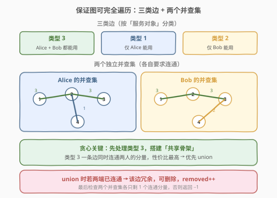
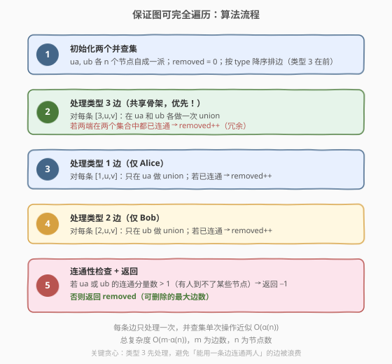
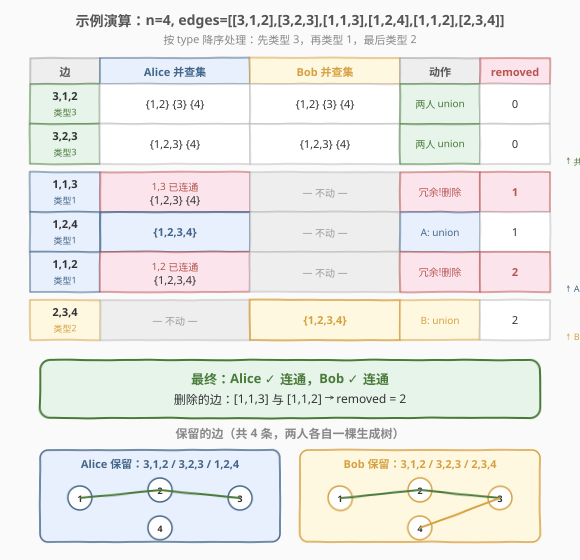

# LeetCode 保证图可完全遍历 题解

## 1. 题目概述

- **标题 / 题号**：保证图可完全遍历（#1579，hard）
- **链接**：https://leetcode.cn/problems/remove-max-number-of-edges-to-keep-graph-fully-traversable/
- **难度**：困难
- **标签**：图、并查集、贪心

**题意**：Alice 和 Bob 共有一个含 `n` 个节点的无向图，边分三类：

- **类型 1**：只能由 Alice 遍历。
- **类型 2**：只能由 Bob 遍历。
- **类型 3**：Alice 和 Bob 都可以遍历。

给定 `edges[i] = [type_i, u_i, v_i]`，表示 `u_i` 与 `v_i` 之间存在类型为 `type_i` 的双向边。在保证图**仍能被 Alice 和 Bob 完全遍历**（即两人各自都能从任一节点到达所有其它节点）的前提下，找出**可以删除的最大边数**；若无法完全遍历则返回 `-1`。

**示例 1**：

```text
输入：n = 4, edges = [[3,1,2],[3,2,3],[1,1,3],[1,2,4],[1,1,2],[2,3,4]]
输出：2
解释：删除 [1,1,2] 和 [1,1,3] 两条边后，Alice 和 Bob 仍可完全遍历。
```

**示例 2**：

```text
输入：n = 4, edges = [[3,1,2],[3,2,3],[1,1,4],[2,1,4]]
输出：0
解释：删除任何一条边都会使某人无法完全遍历。
```

**示例 3**：

```text
输入：n = 4, edges = [[3,2,3],[1,1,2],[2,3,4]]
输出：-1
解释：Alice 到不了节点 4，Bob 到不了节点 1，图无法完全遍历。
```

**约束**：

- $1 \le n \le 10^5$
- $1 \le \text{edges.length} \le \min(10^5,\ 3 \cdot n(n-1)/2)$
- $1 \le \text{type}_i \le 3$，$1 \le u_i < v_i \le n$，所有元组 `(type, u, v)` 互不相同

## 2. 解题思路

### 2.1 暴力思路：枚举删除子集

对 $m$ 条边枚举所有删除子集（共 $2^m$ 种），每种删除后分别对 Alice、Bob 跑连通性检查（DFS/BFS/并查集）。$m = 10^5$ 时 $2^m$ 完全不可行。

> 💡 转换视角：不要「枚举删什么」，而要「**贪心地尽量多删**」——只要一条边两端已经连通，删掉它不影响连通性，就该删。这本质上是给 Alice、Bob 各维护一棵**生成树**，多余的边全删。

### 2.2 核心观察：两个并查集 + 类型 3 优先



关键观察：

1. **两条独立生成树**：Alice 和 Bob 各需一棵生成树。维护**两个独立并查集** `ua`（Alice）、`ub`（Bob），各自要求最终只剩一个连通分量。
2. **三类边的服务对象不同**：
   - 类型 3：同时在 `ua`、`ub` 各做一次 union（一条边服务两人）。
   - 类型 1：只在 `ua` 做 union。
   - 类型 2：只在 `ub` 做 union。
3. **贪心优先级——类型 3 先处理**：类型 3 的边能「一鱼两吃」，性价比最高。若先用类型 1 把 Alice 的两个分量连上了，后面再来一条类型 3 连同样两个分量时，对 Alice 而言成了冗余，但这条类型 3 本可以省下一条类型 1 的边——价值被浪费。因此**先处理类型 3 搭建共享骨架，再分别补类型 1、类型 2**，能让后续专用边更多成为冗余，从而删更多。
4. **冗余即删除**：处理每条边时，若 union 时两端已在同一连通分量，则该边对当前对象无用，**删除计数 +1**。
5. **连通性兜底**：全部处理完后检查 `ua`、`ub` 是否各自只剩 1 个连通分量，否则返回 `-1`。

> ⚠️ 「类型 3 先处理」的贪心正确性可形式化：交换论证——若最优解中某条类型 3 边被专用边「抢了先」，把那条专用边换成这条类型 3 边，至少不劣（类型 3 同时服务另一人，可能还省下另一人的专用边）。故存在「类型 3 优先」的最优解。

### 2.3 算法流程图



### 2.4 示例演算

以示例 1 `n = 4, edges = [[3,1,2],[3,2,3],[1,1,3],[1,2,4],[1,1,2],[2,3,4]]` 为例。按类型降序排边后逐步处理：



| 步骤 | 边 | Alice 集合 | Bob 集合 | 动作 | removed |
|------|----|-----------|----------|------|---------|
| 1 | `3,1,2` | {1,2}{3}{4} | {1,2}{3}{4} | 两人 union | 0 |
| 2 | `3,2,3` | {1,2,3}{4} | {1,2,3}{4} | 两人 union | 0 |
| 3 | `1,1,3` | 1,3 已连通 | — | 冗余，删除 | 1 |
| 4 | `1,2,4` | {1,2,3,4} | — | Alice union | 1 |
| 5 | `1,1,2` | 1,2 已连通 | — | 冗余，删除 | 2 |
| 6 | `2,3,4` | — | {1,2,3,4} | Bob union | 2 |

> 💡 最终 Alice、Bob 各自只剩 1 个连通分量，返回 `removed = 2`。删除的正是 `[1,1,3]` 与 `[1,1,2]` 两条 Alice 专用冗余边。

## 3. 参考代码

### C++

```cpp
class Solution {
  public:
    int find(vector<int>& par, int x) {
        return par[x] == x ? x : par[x] = find(par, par[x]);
    }

    // 在 dsu 上尝试 union(u, v)，返回是否真的合并了（false 表示已连通，即冗余）
    bool unite(vector<int>& par, int u, int v) {
        int fu = find(par, u), fv = find(par, v);
        if (fu == fv) return false;
        par[fu] = fv;
        return true;
    }

    int maxNumEdgesToRemove(int n, vector<vector<int>>& edges) {
        // 1. 两个并查集
        vector<int> ua(n + 1), ub(n + 1);
        iota(ua.begin(), ua.end(), 0);
        iota(ub.begin(), ub.end(), 0);

        // 2. 按 type 降序排边（类型 3 优先）
        sort(edges.begin(), edges.end(),
             [](const auto& a, const auto& b) { return a[0] > b[0]; });

        int removed = 0;
        // Alice / Bob 各自独立的连通分量数，初始都为 n
        int compsA = n, compsB = n;

        for (auto& e : edges) {
            int t = e[0], u = e[1], v = e[2];
            if (t == 3) {
                bool a = unite(ua, u, v);  // Alice
                bool b = unite(ub, u, v);  // Bob
                if (a) compsA--;
                if (b) compsB--;
                if (!a && !b) removed++;   // 对两人都冗余 → 删
            } else if (t == 1) {
                if (!unite(ua, u, v)) removed++;  // Alice 冗余 → 删
                else compsA--;
            } else {  // t == 2
                if (!unite(ub, u, v)) removed++;  // Bob 冗余 → 删
                else compsB--;
            }
        }

        if (compsA > 1 || compsB > 1) return -1;  // 有人未连通
        return removed;
    }
};
```

### Python

```python
class Solution:
    def maxNumEdgesToRemove(self, n: int, edges: List[List[int]]) -> int:
        # 1. 两个并查集
        ua = list(range(n + 1))
        ub = list(range(n + 1))

        def find(par, x):
            while par[x] != x:
                par[x] = par[par[x]]
                x = par[x]
            return x

        def unite(par, u, v):
            fu, fv = find(par, u), find(par, v)
            if fu == fv:
                return False
            par[fu] = fv
            return True

        # 2. 按 type 降序（类型 3 优先）
        edges.sort(key=lambda e: -e[0])

        removed = 0
        comps_a, comps_b = n, n

        for t, u, v in edges:
            if t == 3:
                a = unite(ua, u, v)
                b = unite(ub, u, v)
                if a:
                    comps_a -= 1
                if b:
                    comps_b -= 1
                if not a and not b:
                    removed += 1
            elif t == 1:
                if not unite(ua, u, v):
                    removed += 1
                else:
                    comps_a -= 1
            else:  # t == 2
                if not unite(ub, u, v):
                    removed += 1
                else:
                    comps_b -= 1

        if comps_a > 1 or comps_b > 1:
            return -1
        return removed
```

> 💡 **连通分量计数**：每成功 union 一次，对应连通分量数减 1；最终若 `compsA == 1` 且 `compsB == 1` 即两人各自全连通。也可不维护计数，最后再遍历统计根的数量，但计数法更直观且 $O(1)$ 判定。

## 4. 复杂度分析

| 维度 | 复杂度 | 说明 |
|------|--------|------|
| 时间复杂度 | $O(m \cdot \alpha(n) + m \log m)$ | 排序 $O(m \log m)$；每条边至多做两次并查集操作，单次近似 $O(\alpha(n))$（阿克曼反函数，可视为常数） |
| 空间复杂度 | $O(n)$ | 两个并查集数组各 $O(n)$ |

> ⚠️ 本题 $n, m \le 10^5$，$O(m \log m)$ 约 $1.7 \times 10^6$ 次操作，轻松通过。若题目已保证输入按类型有序（实际未保证），可省去排序降到 $O(m \cdot \alpha(n))$。

## 5. 扩展：为什么不排序按「边出现顺序」处理会错？

若不按类型 3 优先，直接按输入顺序处理，可能得到**非最大**的删除数。考虑一个小例子：`n = 3`，边依次为 `[1,1,2], [3,1,2], [3,2,3], [2,1,2], [2,2,3]`。

- **不排序（按输入）**：先 `[1,1,2]` 给 Alice 连上 {1,2}；再 `[3,1,2]` 对 Alice 冗余（但对 Bob 有用，连 Bob {1,2}）；`[3,2,3]` 对 Alice 冗余、对 Bob 连 {1,2,3}。此时 Alice 还差节点 3，只能靠……后面没有类型 1 边了，Alice 永远到不了 3 → 返回 -1。
- **类型 3 优先**：`[3,1,2]` 连两人 {1,2}；`[3,2,3]` 连两人 {1,2,3}（两人都全连通）；剩下 `[1,1,2]`、`[2,1,2]`、`[2,2,3]` 全冗余 → 删 3 条。

这说明**顺序决定成败**：类型 3 的「双用」价值必须优先兑现，否则被专用边「抢功」后可能直接导致无解或删得更少。

| 处理顺序 | 类型 3 优先 | 任意顺序 |
|----------|------------|----------|
| 正确性 | ✅ 保证最大删除数 | ❌ 可能非最大甚至误判 -1 |
| 实现 | 排序 $O(m \log m)$ | 无排序 |
| 推荐 | **必选** | 不可用 |

> 💡 进一步：若边已按类型给好（如三段分开输入），可直接用稳定分区 `std::stable_partition` 按 `type==3` 前置，省去完整排序的 $\log$ 因子——但本题输入无序，排序最简。

## 6. 面试要点

1. **为什么用两个并查集而不是一个？**

   Alice 和 Bob 的连通要求是**独立**的：类型 1 边只对 Alice 有意义，类型 2 只对 Bob。若共用一个并查集，类型 1 边会「帮」Bob 连通，导致 Bob 看似连通实则没有可遍历的边。两个并查集精确对应「两条独立生成树」。

2. **为什么类型 3 必须先处理？**

   类型 3 一条边同时服务两人，性价比最高。先用类型 3 搭共享骨架，后续专用边（类型 1/2）更易成为冗余被删除，从而**最大化删除数**。反例见第 5 节：顺序错了可能直接返回 -1。

3. **冗余边的判定标准是什么？**

   union 时 `find(u) == find(v)`（两端已在同一连通分量），则该边对当前对象无贡献——加上它不改变连通性，删掉也不影响。这就是「可删除」的充要条件。

4. **如何判断最终是否完全遍历？**

   处理完所有边后，Alice（或 Bob）的并查集若连通分量数 $> 1$，说明有人到不了某些节点，返回 -1。用 `compsA/compsB` 计数：每次成功 union 减 1，最终应为 1。

5. **类型 3 边「对一人冗余、对另一人有用」时怎么处理？**

   仍然 union（对有用那人执行合并），但**不计入 removed**——因为这条边对另一人仍有价值，不能删。只有「对两人都冗余」时才 `removed++`。代码中 `if (!a && !b) removed++` 正是此意。

## 同类练习题

| # | 题目 | 与本题的关联 |
|---|------|-------------|
| 684 | [冗余连接](https://leetcode.cn/problems/redundant-connection/) | 并查集判冗余边的鼻祖题，union 失败即冗余，本题「删冗余边」思想的单人物版 |
| 685 | [冗余连接 II](https://leetcode.cn/problems/redundant-connection-ii/) | 有向图冗余边，并查集 + 入度判定，对照本题无向图的两人版 |
| 547 | [省份数量](https://leetcode.cn/problems/number-of-provinces/) | 并查集数连通分量，本题连通性检查的基础 |
| 1584 | [连接所有点的最小费用](https://leetcode.cn/problems/min-cost-to-connect-all-points/) | MST/Kruskal 同样用并查集选边，对照「选最少边连通」与本题「删最多边仍连通」是一体两面 |
| 1319 | [连通网络的操作次数](https://leetcode.cn/problems/number-of-operations-to-make-network-connected/) | 并查集 + 冗余边计数，本题「冗余边能否补足连通」的单人物变体 |
