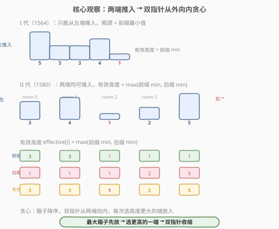
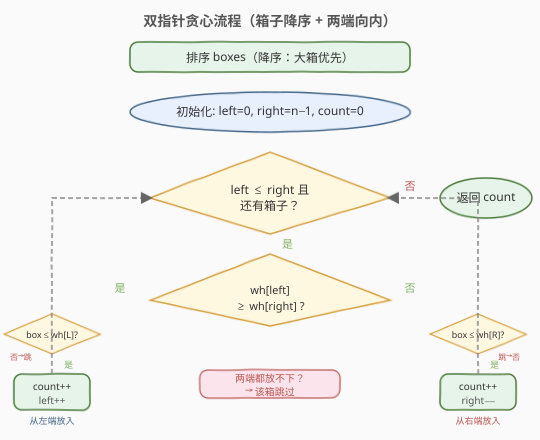
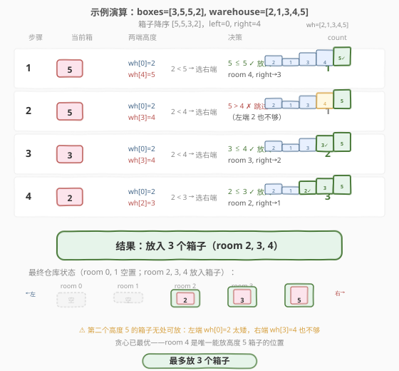

# LeetCode 把箱子放进仓库里 II 题解

## 1. 题目概述

- **标题 / 题号**：把箱子放进仓库里 II（#1580，medium）
- **链接**：https://leetcode.cn/problems/put-boxes-into-the-warehouse-ii/
- **难度**：中等
- **标签**：贪心、数组、排序

**题意**：给定两个正整数数组 `boxes` 和 `warehouse`，分别表示若干个**单位宽度箱子**的高度和仓库中 `n` 个**房间**的高度。

将箱子放入仓库需遵守以下规则：

- 箱子**不能堆叠**（每个房间最多放一个箱子）。
- **可以重排**箱子的顺序。
- 箱子可以从仓库**左端或右端**推入——这是与 [1564. 把箱子放进仓库里 I](../1501-1600/1564_把箱子放进仓库里I.md) 的核心区别。
- 箱子推入后沿房间滑动，若某房间高度**小于**箱子高度，则箱子**被挡在该房间之前**（无法穿过）。

返回**最多能放入仓库的箱子数量**。

> 💡 **与 I 代的关键差异**：I 代只能从左端推入，瓶颈是**前缀最小值**；II 代两端均可推入，每个房间可以从**更高的一侧**到达，有效高度提升为 $\max(\text{前缀 min}, \text{后缀 min})$。

**示例 1**：

```text
输入：boxes = [1,2,2,3,4], warehouse = [3,4,1,2]
输出：4
解释：4 个房间全放满。高度 4 的箱子无法放入（有效高度 max(3,2)=3 < 4）。
      高度 3 从左端推入 room 0；高度 2 从左端推入 room 1；
      高度 2 从右端推入 room 3；高度 1 推入 room 2。
```

**示例 2**：

```text
输入：boxes = [3,5,5,2], warehouse = [2,1,3,4,5]
输出：3
解释：高度 5 的箱子只能从右端推入 room 4（唯一有效高度 ≥ 5 的位置）。
      第二个高度 5 无处可放。高度 3 从右端推入 room 3，高度 2 从右端推入 room 2。
```

**约束**：

- `n == warehouse.length`
- $1 \le \text{boxes.length}, \text{warehouse.length} \le 10^5$
- $1 \le \text{boxes[i]}, \text{warehouse[i]} \le 10^9$

## 2. 解题思路

### 2.1 暴力思路

枚举箱子的所有排列（$n!$ 种），对每种排列模拟从两端推入的过程。排列数在 $n = 10^5$ 时完全不可行，且单次模拟也需要 $O(n \times m)$。

### 2.2 核心观察：双指针从两端向内贪心



本题有两个关键观察：

**观察 1：有效高度 = max(前缀最小值, 后缀最小值)**

在 I 代中，箱子只能从左端推入，room `i` 的有效高度是前缀最小值 $\min(\text{wh}[0..i])$。II 代允许从右端推入，因此 room `i` 还可以从右端到达，有效高度为后缀最小值 $\min(\text{wh}[i..n{-}1])$。

综合来看，room `i` 的**有效高度**为：

$$\text{effective}[i] = \max\Big(\min_{0 \le k \le i} \text{wh}[k],\ \min_{i \le k \le n-1} \text{wh}[k]\Big)$$

即从更高的一侧推入，取两侧瓶颈的较大值。

**观察 2：最大箱子优先 + 双指针从外向内**

将箱子**降序排列**（最大的先放）。用两个指针 `left = 0`、`right = n − 1` 从仓库两端向内收缩：

- 比较 `wh[left]` 与 `wh[right]`，选择**更高**的一端。
- 若当前箱子 $\le$ 该端高度：放入，指针向内推进一步，`count++`。
- 若当前箱子 $>$ 该端高度：该端放不下。由于另一端更矮，必然也放不下——**跳过该箱子**。

> 💡 **为什么最大箱子优先？** 最大箱子最挑剔（能放的房间最少），先放可以占据两端的位置。小箱子后放，灵活度高，能填入中间剩余的空位。这与 [1564. 把箱子放进仓库里 I](../1501-1600/1564_把箱子放进仓库里I.md) 的「最小箱子优先放最受限位置」是**对偶**策略——I 代从右端（最受限）开始匹配最小箱子，II 代从两端（最宽松）开始匹配最大箱子。

> ⚠️ **为什么只需比较 `wh[left]` 和 `wh[right]`，不用算前缀/后缀最小值？** 因为已放入的箱子都比当前箱子**更大**，它们所在房间的高度必然 $\ge$ 大箱子 $>$ 当前箱子。因此当前箱子从端点推入时，路径上所有已占房间的高度都足够，只需检查目标房间 `wh[left]` 或 `wh[right]` 本身。

### 2.3 算法流程图



算法只需一趟扫描：排序降序后，双指针从两端向内，每个箱子选择更高的一端尝试放入。

### 2.4 示例演算

以 `boxes = [3,5,5,2]`、`warehouse = [2,1,3,4,5]` 为例：



| 步骤 | 当前箱 | wh[left] | wh[right] | 决策 | 动作 | count |
|------|--------|----------|-----------|------|------|-------|
| 1 | 5 | 2 | 5 | $2 < 5$ → 选右端 | $5 \le 5$ ✓ 放入 room 4, right→3 | 1 |
| 2 | 5 | 2 | 4 | $2 < 4$ → 选右端 | $5 > 4$ ✗ 跳过（左端 2 更矮） | 1 |
| 3 | 3 | 2 | 4 | $2 < 4$ → 选右端 | $3 \le 4$ ✓ 放入 room 3, right→2 | 2 |
| 4 | 2 | 2 | 3 | $2 < 3$ → 选右端 | $2 \le 3$ ✓ 放入 room 2, right→1 | 3 |

最终 3 个箱子放入 room 2、3、4，第二个高度 5 的箱子无处可放。

> 💡 **观察关键**：步骤 2 中第二个高度 5 的箱子，左端 `wh[0]=2` 和右端 `wh[3]=4` 都不够。`room 4` 是唯一有效高度 $\ge 5$ 的位置，已被第一个箱子占据。贪心已最优——不可能放入两个高度 5 的箱子。

## 3. 参考代码

### 方法一：双指针从两端向内（推荐，$O(n \log n + m)$）

### C++

```cpp
class Solution {
public:
    int maxBoxesInWarehouse(vector<int>& boxes, vector<int>& warehouse) {
        sort(boxes.rbegin(), boxes.rend());  // 降序：大箱优先

        int left = 0, right = warehouse.size() - 1;
        int count = 0;

        for (int box : boxes) {
            if (left > right) break;
            if (warehouse[left] >= warehouse[right]) {
                if (box <= warehouse[left]) {
                    count++;
                    left++;
                }
            } else {
                if (box <= warehouse[right]) {
                    count++;
                    right--;
                }
            }
        }
        return count;
    }
};
```

### Python

```python
class Solution:
    def maxBoxesInWarehouse(self, boxes: List[int], warehouse: List[int]) -> int:
        boxes.sort(reverse=True)  # 降序：大箱优先

        left, right = 0, len(warehouse) - 1
        count = 0

        for box in boxes:
            if left > right:
                break
            if warehouse[left] >= warehouse[right]:
                if box <= warehouse[left]:
                    count += 1
                    left += 1
            else:
                if box <= warehouse[right]:
                    count += 1
                    right -= 1
        return count
```

> 💡 **代码要点**：
> 1. **降序排列**：`rbegin()/rend()`（C++）或 `reverse=True`（Python），大箱子先放。
> 2. **选更高的一端**：`wh[left] >= wh[right]` 时选左端，否则选右端。确保每步选择更有可能放入的一端。
> 3. **放不下就跳过**：不做指针移动，直接处理下一个（更小的）箱子。小箱子可能从另一端放入。
> 4. **不需要前缀/后缀最小值**：已放入的大箱子保证路径高度足够，只需检查目标房间高度。

## 4. 复杂度分析

| 维度 | 复杂度 | 说明 |
|------|--------|------|
| 时间复杂度 | $O(n \log n + m)$ | 排序 $O(n \log n)$；双指针遍历箱子 $O(n)$，每个箱子 $O(1)$ 判断 |
| 空间复杂度 | $O(1)$ | 仅常数变量 `left`、`right`、`count`（排序的递归栈 $O(\log n)$ 不计） |

> 💡 $n, m \le 10^5$，$n \log n \approx 1.7 \times 10^6$，加上 $O(n)$ 的一趟扫描，总运算量远低于时限。

## 5. 扩展：有效高度法 + 排序匹配

除了双指针方法，还有一种**等价**的方法——显式计算每个房间的有效高度，然后排序匹配：

### 5.1 思路

1. 计算 `prefixMin[i]` = $\min(\text{wh}[0..i])$，`suffixMin[i]` = $\min(\text{wh}[i..n{-}1])$。
2. `effective[i]` = $\max(\text{prefixMin}[i], \text{suffixMin}[i])$。
3. 将 `boxes` 升序、`effective` 升序，双指针贪心匹配：最小箱子匹配最小有效高度。

### C++

```cpp
class Solution {
public:
    int maxBoxesInWarehouse(vector<int>& boxes, vector<int>& warehouse) {
        int n = warehouse.size();

        vector<int> prefixMin(n), suffixMin(n);
        prefixMin[0] = warehouse[0];
        for (int i = 1; i < n; i++)
            prefixMin[i] = min(prefixMin[i - 1], warehouse[i]);

        suffixMin[n - 1] = warehouse[n - 1];
        for (int i = n - 2; i >= 0; i--)
            suffixMin[i] = min(suffixMin[i + 1], warehouse[i]);

        vector<int> effective(n);
        for (int i = 0; i < n; i++)
            effective[i] = max(prefixMin[i], suffixMin[i]);

        sort(boxes.begin(), boxes.end());
        sort(effective.begin(), effective.end());

        int count = 0, boxIdx = 0;
        for (int i = 0; i < n && boxIdx < boxes.size(); i++) {
            if (boxes[boxIdx] <= effective[i]) {
                count++;
                boxIdx++;
            }
        }
        return count;
    }
};
```

| 维度 | 双指针法 | 有效高度法 |
|------|---------|-----------|
| 时间 | $O(n \log n + m)$ | $O(n \log n + m \log m)$ |
| 空间 | $O(1)$ | $O(m)$ |
| 代码量 | 短 | 中 |
| 直觉 | 大箱先放，两端贪心 | 显式建模有效高度 |
| 推荐 | ✅ 面试首选 | 理解透彻后备用 |

> 💡 **两种方法等价**：双指针法隐式利用了「大箱子占端 → 路径高度足够」的性质，省去了显式计算前缀/后缀最小值。有效高度法更直观但多 $O(m)$ 空间。面试中优先写双指针法——更短、更优、更有「贪心直觉」。

## 6. 面试要点

1. **II 代和 I 代的核心区别是什么？**

   - I 代（1564）只能从**左端**推入，有效高度 = 前缀最小值；策略是**最小箱子优先放最受限（最右）位置**。
   - II 代（1580）可从**两端**推入，有效高度 = max(前缀最小值, 后缀最小值)；策略是**最大箱子优先放更高端**。两者是对偶贪心。

2. **为什么最大箱子先放？**

   - 最大箱子能放入的位置最少（有效高度 $\ge$ 它的房间最少），先放可以占据两端的位置。如果先放小箱子，可能把两端位置占掉，大箱子无处可放。这是「**最受限优先**」的贪心原则。

3. **为什么只需比较 `wh[left]` 和 `wh[right]`，不用算前缀/后缀最小值？**

   - 已放入的箱子都比当前箱子大，它们所在房间的高度 $\ge$ 大箱子 $\ge$ 当前箱子。因此从端点推入时，路径上已占房间的高度都足够，只需检查目标房间本身的高度。这是降序排列带来的「路径安全」保证。

4. **选更高的一端放不下时，另一端能放下吗？**

   - 不能。我们选的是更高的一端（`wh[left] >= wh[right]` 或反之）。如果更高的一端都放不下（`box > wh[higher]`），更矮的另一端必然也放不下（`box > wh[higher] >= wh[lower]`）。所以直接跳过该箱子。

5. **贪心的正确性如何证明？**

   - **交换论证**：设贪心方案 $G$ 放入 $k$ 个，最优方案 $O$ 放入 $k'$ 个。在每一步，贪心把当前最大箱子放到更高的一端。若 $O$ 把该箱子放在其他位置或没放，可以调整 $O$ 使其也放到该端（不劣于 $O$ 原方案，因为该端更高、箱子更大不会影响后续小箱子的放置）。逐箱子归纳得 $k \ge k'$。

## 同类练习题

| # | 题目 | 与本题的关联 |
|---|------|-------------|
| 1564 | [把箱子放进仓库里 I](https://leetcode.cn/problems/put-boxes-into-the-warehouse-i/)（[题解](../1501-1600/1564_把箱子放进仓库里I.md)） | 本题前传——只能从左端推入，前缀最小值 + 最小箱子优先匹配最右位置，理解 I 代后再看 II 代的对偶策略 |
| 455 | [分发饼干](https://leetcode.cn/problems/assign-cookies/)（[题解](../0401-0500/455_分发饼干.md)） | 排序 + 双指针贪心匹配的经典模板，最小资源满足最苛刻需求，与本题同属贪心匹配范式 |
| 881 | [救生艇](https://leetcode.cn/problems/boats-to-save-people/) | 排序 + 双指针从两端向内，最重的人搭配最轻的人共乘，与本题双指针收缩结构相似 |
| 435 | [无重叠区间](https://leetcode.cn/problems/non-overlapping-intervals/)（[题解](../0401-0500/435_无重叠区间.md)） | 贪心区间调度，按右端点排序选最多不重叠区间，同为「排序 + 贪心选最优」范式 |
| 976 | [三角形的最大周长](https://leetcode.cn/problems/largest-perimeter-triangle/) | 排序 + 贪心，从大到小枚举最大边，判断能否组成三角形，同为降序贪心 |
