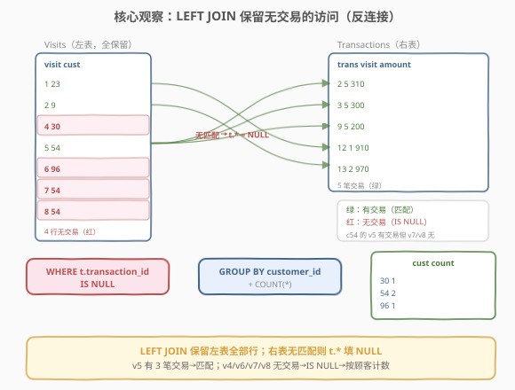
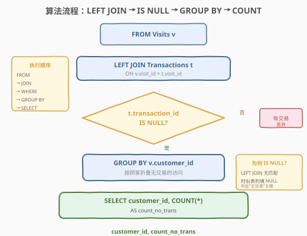
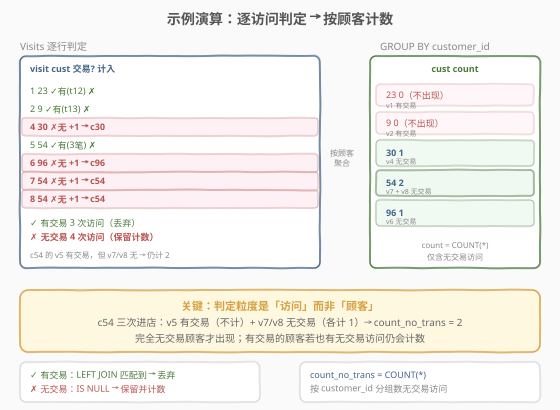

# LeetCode 进店却未进行过交易的顾客 题解

## 1. 题目概述

- **标题 / 题号**：进店却未进行过交易的顾客（#1581，easy）
- **链接**：https://leetcode.cn/problems/customer-who-visited-but-did-not-make-any-transactions/
- **难度**：简单
- **标签**：数据库、SQL、`LEFT JOIN`、反连接（anti-join）、`IS NULL`、`GROUP BY`、`COUNT`、`NOT EXISTS`、`NOT IN` 的 NULL 陷阱

**题意**：给定 `Visits`（进店访问）和 `Transactions`（交易）两张表，编写 SQL 查询，找出**进店却未进行任何交易**的顾客 ID，以及他们**只光顾不交易的次数**。结果可按任意顺序返回。

**表结构**：

```text
Table: Visits
+-------------+---------+
| Column Name | Type    |
+-------------+---------+
| visit_id    | int     |  ← 具有唯一值
| customer_id | int     |
+-------------+---------+
该表包含光临过购物中心的顾客的信息。

Table: Transactions
+----------------+---------+
| Column Name    | Type    |
+----------------+---------+
| transaction_id | int     |  ← 具有唯一值
| visit_id       | int     |
| amount         | int     |
+----------------+---------+
此表包含 visit_id 期间进行的交易的信息。
```

**示例 1**：

```text
输入：
Visits 表:
+----------+-------------+
| visit_id | customer_id |
+----------+-------------+
| 1        | 23          |
| 2        | 9           |
| 4        | 30          |
| 5        | 54          |
| 6        | 96          |
| 7        | 54          |
| 8        | 54          |
+----------+-------------+

Transactions 表:
+----------------+----------+--------+
| transaction_id | visit_id | amount |
+----------------+----------+--------+
| 2              | 5        | 310    |
| 3              | 5        | 300    |
| 9              | 5        | 200    |
| 12             | 1        | 910    |
| 13             | 2        | 970    |
+----------------+----------+--------+

输出:
+-------------+----------------+
| customer_id | count_no_trans |
+-------------+----------------+
| 54          | 2              |
| 30          | 1              |
| 96          | 1              |
+-------------+----------------+
```

**解释**：

| visit_id | customer_id | 是否有交易 | 处理 | 顾客累计无交易次数 |
|----------|-------------|-----------|------|-------------------|
| 1 | 23 | ✓ 有（t12） | 不计入 | c23 = 0（不出现） |
| 2 | 9 | ✓ 有（t13） | 不计入 | c9 = 0（不出现） |
| 4 | 30 | ✗ 无 | 计入 | c30 = 1 |
| 5 | 54 | ✓ 有（t2、t3、t9 共 3 笔） | 不计入 | — |
| 6 | 96 | ✗ 无 | 计入 | c96 = 1 |
| 7 | 54 | ✗ 无 | 计入 | c54 = 1 |
| 8 | 54 | ✗ 无 | 计入 | c54 = 2 |

> 💡 注意 c54：她**三次**进店，其中 v5 产生了 3 笔交易（不计入），v7、v8 未交易（各计 1），最终 `count_no_trans = 2`。这揭示了一个关键点——**判定粒度是「访问」而非「顾客」**：一位顾客可能既有带交易的访问、也有不带交易的访问，只统计后者。

**约束**：

- `visit_id` 是 `Visits` 表具有唯一值的列
- `transaction_id` 是 `Transactions` 表具有唯一值的列
- `Transactions.visit_id` 是指向 `Visits.visit_id` 的外键（一次访问可有 0 笔或多笔交易）
- 结果可按任意顺序返回

> 💡 本题是 SQL **"反连接（anti-join）入门招牌题"**——核心套路：用 `LEFT JOIN` 把 `Visits` 与 `Transactions` 按 `visit_id` 关联，再 `WHERE t.transaction_id IS NULL` 筛出"右表无匹配"的访问（即未产生交易的访问），最后 `GROUP BY customer_id` + `COUNT(*)` 统计每位顾客这种访问的次数。难点在于理解 `LEFT JOIN` 中"无匹配行 → 右表列填 `NULL`"的语义，以及把"无交易"这个**否定条件**转化为"`IS NULL`"的肯定判断。

## 2. 解题思路

### 2.1 暴力思路：逐访问查交易

最直觉的过程式思路：遍历每一次访问，去 `Transactions` 表里查是否存在相同 `visit_id` 的交易记录，若不存在则把该顾客的计数器加 1。伪代码：

```text
count = defaultdict(int)
for v in Visits:
    has_trans = any(t.visit_id == v.visit_id for t in Transactions)
    if not has_trans:
        count[v.customer_id] += 1
result = [(cust, c) for cust, c in count.items() if c > 0]
```

但**纯 SQL 没有显式逐行循环**——"左表每行去右表找匹配，找不到则保留"需换成集合式表达。这正是 `LEFT JOIN` 的语义：保留左表全部行，右表无匹配时右表列填 `NULL`。

### 2.2 核心观察：LEFT JOIN 反连接 + IS NULL



**问题拆解为三个子问题**：

1. **关联访问与交易**：`Visits v LEFT JOIN Transactions t ON v.visit_id = t.visit_id`。`LEFT JOIN` 保留左表（`Visits`）的全部行——即使某次访问在 `Transactions` 中没有匹配行，该访问行依然出现在结果中，只是右表（`t.*` 的所有列）被填为 `NULL`。这是与 `INNER JOIN` 的关键区别：`INNER JOIN` 会丢掉无匹配的访问，而本题恰恰需要这些"无匹配"的行。

2. **筛出无交易的访问**：`WHERE t.transaction_id IS NULL`。`LEFT JOIN` 后，无匹配的访问行其 `t.transaction_id`（右表主键，原表非空）变为 `NULL`——`IS NULL` 即等价于"该访问没有交易"。用主键列 `transaction_id` 判空最稳妥（它原本一定非空，变 `NULL` 只能是 `LEFT JOIN` 无匹配导致）。

3. **按顾客计数**：`GROUP BY v.customer_id` + `COUNT(*)`。把筛出的无交易访问按顾客折叠，每组数行数即为该顾客"只光顾不交易"的次数。

> ⚠️ **为何用 `t.transaction_id IS NULL` 而非 `t.amount IS NULL`**：`transaction_id` 是 `Transactions` 表的主键、保证非空，它在结果中为 `NULL` **当且仅当** `LEFT JOIN` 无匹配。而 `amount` 在原表中就可能为 `NULL`（若题目允许空交易额），用它判空可能误判"有匹配但金额为空"的行。**判反连接一律用右表的主键列或非空列**。

> 💡 **INNER JOIN vs LEFT JOIN**：本题最易错点是误用 `INNER JOIN`（或简写 `JOIN`）。`INNER JOIN` 只保留两表都有匹配的行——无交易的访问会被直接丢弃，结果为空。本题要保留"无匹配"的左表行，**必须** `LEFT JOIN`（或等价的 `NOT EXISTS`/`NOT IN`）。

### 2.3 算法流程图



**逻辑执行步骤**：

| 步骤 | 子句 | 作用 |
|------|------|------|
| ① | `FROM Visits v` | 读取全部访问行（左表） |
| ② | `LEFT JOIN Transactions t ON v.visit_id = t.visit_id` | 按 `visit_id` 关联交易；无匹配时 `t.*` 填 `NULL` |
| ③ | `WHERE t.transaction_id IS NULL` | 筛出无交易的访问（反连接） |
| ④ | `GROUP BY v.customer_id` | 按顾客折叠无交易访问 |
| ⑤ | `SELECT customer_id, COUNT(*)` | 每组计数 = 无交易访问次数 |

> 💡 **SQL 子句执行顺序**：`FROM`（含 `JOIN`/`ON`）→ `WHERE` → `GROUP BY` → `HAVING` → `SELECT` → `ORDER BY` → `LIMIT`。`LEFT JOIN` 在 `FROM` 阶段完成（生成含 `NULL` 的中间表），`WHERE` 在其上过滤 `IS NULL`，最后 `GROUP BY` 聚合。理解这个顺序就能明白为何 `IS NULL` 写在 `WHERE` 而非 `ON`——`ON` 只决定匹配条件，`WHERE` 才过滤最终行（详见第 5 节扩展）。

### 2.4 示例演算

以示例 1 的 7 次访问、5 笔交易为例，观察「`LEFT JOIN` → `IS NULL` 筛选 → 按顾客计数」的逐步过程：



**步骤 ①②：LEFT JOIN 匹配**

| visit_id | customer_id | 匹配的 transaction_id | t.transaction_id | 保留? |
|----------|-------------|----------------------|------------------|-------|
| 1 | 23 | 12 | 12 | ✗（非 NULL，有交易） |
| 2 | 9 | 13 | 13 | ✗ |
| 4 | 30 | —（无匹配） | NULL | ✓ |
| 5 | 54 | 2, 3, 9（一行一匹配，共 3 行） | 2 / 3 / 9 | ✗ |
| 6 | 96 | —（无匹配） | NULL | ✓ |
| 7 | 54 | —（无匹配） | NULL | ✓ |
| 8 | 54 | —（无匹配） | NULL | ✓ |

> ⚠️ **v5 产生 3 行**：`LEFT JOIN` 时 v5 在 `Transactions` 中有 3 条匹配（t2、t3、t9），故中间表里 v5 对应 **3 行**（一对多展开）。但每行的 `t.transaction_id` 都非 `NULL`，全被 `WHERE IS NULL` 过滤掉——v5 不计入任何顾客的计数。这正是用主键 `transaction_id` 判空的安全性所在：只要有一笔交易，该访问的所有展开行都非 `NULL`，全部排除。

**步骤 ③：WHERE t.transaction_id IS NULL**

保留 v4、v6、v7、v8 共 4 行无交易访问。

**步骤 ④⑤：GROUP BY customer_id + COUNT(*)**

| customer_id | 保留的访问 | COUNT(*) |
|-------------|-----------|----------|
| 23 | （无） | —（不出现） |
| 9 | （无） | —（不出现） |
| 30 | v4 | 1 |
| 54 | v7, v8 | 2 |
| 96 | v6 | 1 |

> 💡 **c54 的计数为何是 2 而非 3**：c54 共 3 次进店（v5、v7、v8），但 v5 有交易被过滤，只有 v7、v8 进入 `GROUP BY`，故 `COUNT(*) = 2`。这印证了"判定粒度是访问"——顾客是否出现在结果中、计数多少，完全由其**无交易访问**决定，有交易的访问不参与。

> ⚠️ **用 `COUNT(*)` 而非 `COUNT(t.transaction_id)`**：筛选后保留的行其 `t.transaction_id` 全为 `NULL`，若写 `COUNT(t.transaction_id)` 会得到 0（`COUNT(col)` 不计 `NULL` 行）。必须用 `COUNT(*)` 或 `COUNT(v.visit_id)`（左表列非空）计数。这是 `COUNT(*)` 与 `COUNT(col)` 在含 `NULL` 行时差异的经典坑点。

## 3. 参考代码

### SQL（解法 A：`LEFT JOIN` + `IS NULL`，推荐）

```sql
SELECT v.customer_id AS customer_id,
       COUNT(*)      AS count_no_trans
FROM Visits v
LEFT JOIN Transactions t ON v.visit_id = t.visit_id
WHERE t.transaction_id IS NULL
GROUP BY v.customer_id;
```

> 💡 **写法要点**：
> - **`LEFT JOIN`**：保留 `Visits` 全部行，无匹配交易时 `t.*` 填 `NULL`。这是反连接的核心——必须用 `LEFT` 而非 `INNER`。
> - **`WHERE t.transaction_id IS NULL`**：筛出无匹配（即无交易）的访问。用右表主键 `transaction_id` 判空最稳妥（详见 2.2）。
> - **`COUNT(*)`**：计筛选后的行数。不可写 `COUNT(t.transaction_id)`——筛选后该列全 `NULL`，会得 0。
> - **`GROUP BY v.customer_id`**：按顾客折叠，每位顾客的无交易访问数即为其 `count_no_trans`。
> - ✓ **最推荐**：语义清晰、`NULL` 安全、标准 SQL 通用，是反连接的 canonical 写法。

### SQL（解法 B：`NOT EXISTS` 相关子查询，`NULL` 安全）

```sql
SELECT v.customer_id AS customer_id,
       COUNT(*)      AS count_no_trans
FROM Visits v
WHERE NOT EXISTS (
    SELECT 1
    FROM Transactions t
    WHERE t.visit_id = v.visit_id
)
GROUP BY v.customer_id;
```

> 💡 **解法 B 的思路**：对每次访问 `v`，检查「**不存在**任何 `Transactions` 中 `visit_id` 相同的行」（`NOT EXISTS`）。若无任何交易行匹配，说明该访问未产生交易——保留并计数。
>
> **与解法 A 的关系**：`LEFT JOIN ... WHERE t.pk IS NULL` 与 `NOT EXISTS` 是反连接的两种等价表达——前者"连接后筛空"，后者"直接判定不存在"。语义完全等价，`NOT EXISTS` 天然 `NULL` 安全（不依赖 `LEFT JOIN` 产生的 `NULL` 语义），且多数现代优化器会将其优化为与 `LEFT JOIN` 相同的反连接执行计划。
>
> **性能**：相关子查询对每行访问执行一次，最坏 $O(n \cdot m)$；若 `Transactions(visit_id)` 上有索引，子查询走索引查找降到 $O(n \cdot \log m)$，与解法 A 相当。

### SQL（解法 C：`NOT IN` 子查询，注意 NULL 陷阱）

```sql
SELECT customer_id AS customer_id,
       COUNT(*)    AS count_no_trans
FROM Visits
WHERE visit_id NOT IN (
    SELECT visit_id FROM Transactions WHERE visit_id IS NOT NULL
)
GROUP BY customer_id;
```

> 💡 **解法 C 的思路**：子查询取出所有"产生过交易"的 `visit_id`，外层用 `NOT IN` 筛出不在其中的访问——即未交易的访问。
>
> ⚠️ **`NOT IN` 的 NULL 陷阱**：若子查询结果集含 `NULL`，则 `x NOT IN (1, 2, NULL)` 等价于 `x <> 1 AND x <> 2 AND x <> NULL`，而 `x <> NULL` 的结果是 `NULL`（未知），整个 `AND` 链为 `NULL`——**一行都不返回**！故必须加 `WHERE visit_id IS NOT NULL` 排除子查询中的 `NULL`。本题 `Transactions.visit_id` 作为外键理论上非空，但加 `IS NOT NULL` 是防御性的好习惯。
>
> **三法对比**：解法 A（`LEFT JOIN`）和解法 B（`NOT EXISTS`）都天然 `NULL` 安全；解法 C（`NOT IN`）有 `NULL` 陷阱需手动防御。优先选 A/B。

### Python（pandas）

```python
import pandas as pd

def customer_who_visited_but_did_not_make_any_transactions(
    visits: pd.DataFrame, transactions: pd.DataFrame
) -> pd.DataFrame:
    trans_visits = set(transactions['visit_id'])
    no_trans = visits[~visits['visit_id'].isin(trans_visits)]
    result = (
        no_trans.groupby('customer_id')
        .size()
        .reset_index(name='count_no_trans')
    )
    return result
```

> 💡 **pandas 对照**：
> - `set(transactions['visit_id'])` 取出所有有交易的 `visit_id` 集合，对应子查询 `SELECT visit_id FROM Transactions`。
> - `~visits['visit_id'].isin(trans_visits)` 对应 `NOT IN`（或 `LEFT JOIN ... IS NULL`）——布尔索引取反筛出无交易的访问。`.isin()` 对 `NULL`/`NaN` 安全，无 SQL 的 `NOT IN` 陷阱。
> - `.groupby('customer_id').size()` 对应 `GROUP BY customer_id` + `COUNT(*)`——`size()` 计每组行数（含所有行，等价 `COUNT(*)`）；注意用 `size()` 而非 `count()`，后者按列计非 `NULL` 值数（对应 `COUNT(col)`）。
> - `reset_index(name='count_no_trans')` 把分组键变回普通列并命名计数列。
> - **pandas 等价于解法 A 的写法**：`visits.merge(transactions, on='visit_id', how='left')` 后 `merged['transaction_id'].isna()` 筛选，再 `groupby` + `size()`。`how='left'` 即 `LEFT JOIN`，`isna()` 即 `IS NULL`。

## 4. 复杂度分析

| 维度 | 解法 A（`LEFT JOIN`） | 解法 B（`NOT EXISTS`） | 解法 C（`NOT IN`） | pandas |
|------|----------------------|------------------------|--------------------|--------|
| **时间** | $O(n + m)$（哈希连接） | $O(n \log m)$（有索引）/ $O(nm)$（无索引） | $O(n + m)$（哈希半连接） | $O(n + m)$ |
| **空间** | $O(n + m)$ | $O(m)$（子查询结果） | $O(m)$ | $O(n + m)$ |
| **NULL 安全** | ✓ 天然 | ✓ 天然 | ✗ 需手动 `IS NOT NULL` | ✓ `isin` 安全 |
| **推荐度** | ✓ **首选** | ✓ 语义对照 | ✓ 需谨慎 | ✓ 验证用 |

> - $n$ = `Visits` 表行数，$m$ = `Transactions` 表行数
> - **时间**：解法 A 现代优化器通常用哈希连接，$O(n + m)$ 一次扫描完成；解法 B 的 `NOT EXISTS` 相关子查询，若 `Transactions(visit_id)` 有索引则每次查找 $O(\log m)$，总计 $O(n \log m)$，无索引则退化为 $O(nm)$；解法 C 的 `NOT IN` 通常被优化为哈希半连接 $O(n + m)$，但需物化子查询结果。
> - **空间**：解法 A 需 $O(n + m)$ 存连接中间表（哈希表）；解法 B/C 需 $O(m)$ 存子查询的 `visit_id` 集合；pandas 需 $O(n + m)$ 存 DataFrame。
> - **索引优化**：在 `Transactions(visit_id)` 上建索引可让解法 B 的相关子查询走索引查找；解法 A 的哈希连接对索引依赖较小（全表扫描 + 哈希通常已足够优）。

## 5. 扩展：反连接的三种写法与 NULL 陷阱

反连接（anti-join）——"找出左表中在右表无匹配的行"——是 SQL 的经典模式。本题"无交易的访问"即典型反连接。标准写法有三种，辨析如下。

### 5.1 三种写法对照

| 写法 | 模板 | NULL 安全 | 语义 |
|------|------|-----------|------|
| **A. `LEFT JOIN` + `IS NULL`** | `L LEFT JOIN R ON L.k=R.k WHERE R.pk IS NULL` | ✓ | 连接后筛右表为空 |
| **B. `NOT EXISTS`** | `WHERE NOT EXISTS (SELECT 1 FROM R WHERE R.k=L.k)` | ✓ | 不存在匹配行 |
| **C. `NOT IN`** | `WHERE L.k NOT IN (SELECT k FROM R)` | ✗（需 `IS NOT NULL`） | 不在值集合中 |

> 💡 **A 与 B 永远等价**：`LEFT JOIN ... WHERE R.pk IS NULL` 与 `NOT EXISTS` 在逻辑上完全等价（前提是用右表非空主键列判空）。现代优化器（MySQL 8.0+、PostgreSQL）会将两者优化为相同的反连接执行计划。**优先选 A**（更直观）或 **B**（`NULL` 安全且语义自文档化）。

### 5.2 `NOT IN` 的 NULL 陷阱详解

`NOT IN` 的陷阱源于三值逻辑（TRUE / FALSE / UNKNOWN）。设子查询结果集 $S = \{1, 2, \text{NULL}\}$：

| 表达式 | 等价展开 | 结果 |
|--------|----------|------|
| `3 NOT IN (1, 2, NULL)` | `3<>1 AND 3<>2 AND 3<>NULL` → `T AND T AND UNKNOWN` | **UNKNOWN**（被 WHERE 视为假，**不返回**） |
| `1 NOT IN (1, 2, NULL)` | `1<>1 AND ...` → `FALSE AND ...` | FALSE（不返回） |

可见只要子查询结果含 `NULL`，`NOT IN` 对**任何**左表值都返回 UNKNOWN 或 FALSE——**整个查询返回空集**！这是 SQL 最经典的坑之一。

**防御方法**：子查询加 `WHERE k IS NOT NULL` 排除 `NULL`，或改用 `NOT EXISTS`（天然不受影响——`EXISTS` 只判断行是否存在，不比较值与 `NULL`）。

> ⚠️ 本题 `Transactions.visit_id` 作为外键理论上非空，`NOT IN` 不加 `IS NOT NULL` 也能通过。但生产环境中外键约束未必可靠（脏数据、`NULL` 外键），养成"用 `NOT IN` 必加 `IS NOT NULL`"或"直接用 `NOT EXISTS`"的习惯可避免隐患。

### 5.3 `ON` 与 `WHERE` 在 `LEFT JOIN` 中的区别

本题 `IS NULL` 写在 `WHERE` 子句。若误写在 `ON` 子句会怎样？

```sql
-- 错误写法：IS NULL 写在 ON
SELECT v.customer_id, COUNT(*)
FROM Visits v
LEFT JOIN Transactions t
  ON v.visit_id = t.visit_id AND t.transaction_id IS NULL
GROUP BY v.customer_id;
```

> 💡 **区别**：`ON` 只决定**匹配条件**，不影响左表行的保留——`LEFT JOIN` 仍保留全部 `Visits` 行，只是对 v5 这类有匹配的行，因附加 `t.transaction_id IS NULL` 让匹配失败，`t.*` 填 `NULL`。结果是**所有访问**（含 v5）的 `t.*` 都为 `NULL`，`GROUP BY` 后 `COUNT(*)` 变成统计**全部访问数**而非无交易访问数——答案错误。
>
> 规则：**`LEFT JOIN` 中，筛右表的条件放 `ON`（影响匹配与否），筛最终行的条件放 `WHERE`（影响保留与否）**。本题要保留"无匹配"的行并丢弃"有匹配"的行，是最终行级过滤，必须放 `WHERE`。

### 5.4 `COUNT(*)` vs `COUNT(col)` vs `COUNT(DISTINCT col)`

本题筛选后保留的行其 `t.*` 全为 `NULL`，故计数函数的选择至关重要：

| 写法 | 含义 | 本题结果 |
|------|------|----------|
| `COUNT(*)` | 所有行数（含 `NULL`） | ✓ 正确（无交易访问数） |
| `COUNT(v.visit_id)` | 左表非空列的行数 | ✓ 正确（等价 `COUNT(*)`） |
| `COUNT(t.transaction_id)` | 右表列非 `NULL` 的行数 | ✗ **得 0**（该列全 `NULL`） |
| `COUNT(DISTINCT v.visit_id)` | 左表列去重计数 | ✓ 正确（`visit_id` 唯一，等价 `COUNT(*)`） |

> 💡 本题 `COUNT(*)` = `COUNT(v.visit_id)` = `COUNT(DISTINCT v.visit_id)`（因 `visit_id` 唯一非空），三者皆可。但 `COUNT(t.transaction_id)` 会得 0——这是反连接场景下最易踩的计数坑。**反连接计数一律用 `COUNT(*)` 或左表列**。

## 6. 面试要点

1. **为什么用 `LEFT JOIN` 而不是 `INNER JOIN`？**

   > `INNER JOIN` 只保留两表都有匹配的行——无交易的访问（v4、v6、v7、v8）在 `Transactions` 中无匹配，会被直接丢弃，结果为空。本题要保留"无匹配"的访问行，必须用 `LEFT JOIN`——它保留左表全部行，右表无匹配时右表列填 `NULL`，再用 `WHERE t.transaction_id IS NULL` 筛出这些行。一句话：**保留无匹配行用 `LEFT JOIN`，丢弃无匹配行用 `INNER JOIN`**。

2. **为什么用 `t.transaction_id IS NULL` 判空？能用 `t.amount IS NULL` 吗？**

   > `transaction_id` 是 `Transactions` 的主键、保证非空，它在 `LEFT JOIN` 结果中为 `NULL` **当且仅当**无匹配行——判反连接最精确。`amount` 在原表中可能为 `NULL`（若允许空交易额），用它判空会误把"有匹配但金额为空"的行当成"无交易"。**判反连接一律用右表主键或保证非空的列**。

3. **`NOT IN` 有什么陷阱？如何避免？**

   > 若子查询结果含 `NULL`，`x NOT IN (..., NULL)` 等价于 `... AND x <> NULL`，而 `x <> NULL` 为 UNKNOWN，导致整个条件为 UNKNOWN——查询返回空集。避免方法：① 子查询加 `WHERE k IS NOT NULL` 排除 `NULL`；② 改用 `NOT EXISTS`（天然 `NULL` 安全）；③ 改用 `LEFT JOIN ... IS NULL`。生产环境推荐 `NOT EXISTS` 或 `LEFT JOIN`。

4. **`COUNT(*)` 和 `COUNT(t.transaction_id)` 在本题结果有何不同？**

   > 筛选后保留的行（无交易访问）其 `t.transaction_id` 全为 `NULL`。`COUNT(*)` 计所有行数，得正确答案；`COUNT(t.transaction_id)` 只计该列非 `NULL` 的行数，因全 `NULL` 故得 0——答案错误。反连接场景下右表列必为 `NULL`，**计数必须用 `COUNT(*)` 或左表列**，不能用右表列。

5. **c54 三次进店，为何 `count_no_trans = 2` 而非 3？**

   > 判定粒度是「访问」而非「顾客」。c54 的三次访问中，v5 产生了 3 笔交易（被 `IS NULL` 过滤），只有 v7、v8 无交易进入 `GROUP BY`，故 `COUNT(*) = 2`。这说明一位顾客可能既有带交易的访问、也有不带交易的访问——只统计后者。若题目改为"找出从未交易的顾客"，则需用 `NOT IN`/`NOT EXISTS` 判定顾客从未在 `Transactions` 出现（183 题的模式），与本题"统计无交易访问次数"不同。

> 💡 **一句话总结**：1581 是 SQL **"反连接入门招牌题"**——核心模板「`Visits LEFT JOIN Transactions ON visit_id` → `WHERE t.transaction_id IS NULL` → `GROUP BY customer_id` → `COUNT(*)`」。最大要点：**保留无匹配行必须 `LEFT JOIN`（禁 `INNER`），判空用右表主键，计数用 `COUNT(*)`（禁右表列）**；`NOT IN` 有 `NULL` 陷阱，优先 `LEFT JOIN`/`NOT EXISTS`。与 183「从不订购的客户」同为反连接经典，但 1581 多了"按顾客计数"的聚合维度。

## 同类练习题

| # | 题目 | 与本题的关联 |
|---|------|-------------|
| 183 | [从不订购的客户](https://leetcode.cn/problems/customers-who-never-order/)（[题解](../0101-0200/183_从不订购的客户.md)） | 反连接**最经典母题**——`Customers LEFT JOIN Orders WHERE o.id IS NULL` 找从未订购的客户，与 1581 共享 `LEFT JOIN + IS NULL` 骨架，但不要求计数 |
| 197 | [上升的温度](https://leetcode.cn/problems/rising-temperature/)（[题解](../0101-0200/197_上升的温度.md)） | `LEFT JOIN`/`NOT EXISTS` 做跨行比较（找比昨天温度高的日期），反连接思想用于自连接判定 |
| 570 | [至少有 5 名直接下属的经理](https://leetcode.cn/problems/managers-with-at-least-5-direct-reports/)（[题解](../0501-0600/570_至少有5名直接下属的经理.md)） | `JOIN` + `GROUP BY` + `HAVING COUNT(*) >= 5`，巩固"分组后计数 + 条件过滤"的聚合骨架（1581 是 `GROUP BY` 计数后不设阈值） |
| 1068 | [产品销售分析 I](https://leetcode.cn/problems/product-sales-analysis-i/)（[题解](../1001-1100/1068_产品销售分析I.md)） | `INNER JOIN` 关联 + 分组聚合，与 1581 形成对照——保留匹配行用 `INNER`，保留无匹配行用 `LEFT` |
| 1511 | [消费者下单频率](https://leetcode.cn/problems/customer-order-frequency/)（[题解](../1501-1600/1511_消费者下单频率.md)） | `GROUP BY` + `HAVING` 多条件聚合过滤，1581 的进阶——行级条件放 `WHERE`、组级条件放 `HAVING` 的对照练习 |
