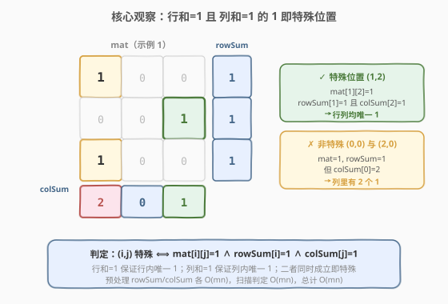
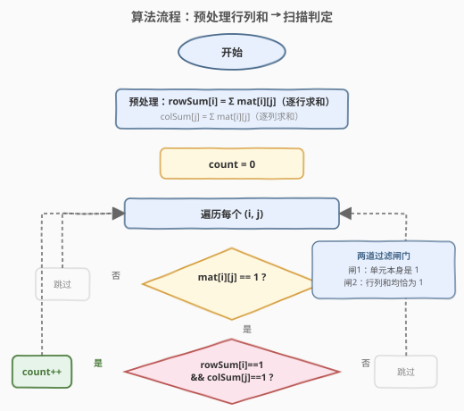

# LeetCode 二进制矩阵中的特殊位置 题解

## 1. 题目概述

- **标题 / 题号**：二进制矩阵中的特殊位置（#1582，easy）
- **链接**：https://leetcode.cn/problems/special-positions-in-a-binary-matrix/
- **难度**：简单
- **标签**：数组、矩阵

**题意**：给定一个 $m \times n$ 的二进制矩阵 `mat`，返回其中**特殊位置**的数目。

一个位置 $(i, j)$ 被称为特殊位置，当且仅当满足以下三个条件：

1. $\text{mat}[i][j] = 1$
2. 第 $i$ 行中**其余所有元素**均为 $0$（即该行只有这一个 $1$）
3. 第 $j$ 列中**其余所有元素**均为 $0$（即该列只有这一个 $1$）

**示例 1**：

```text
输入：mat = [[1,0,0],
            [0,0,1],
            [1,0,0]]
输出：1
解释：(1,2) 是特殊位置：mat[1][2]=1，且第 1 行其余元素全 0、第 2 列其余元素全 0。
```

**示例 2**：

```text
输入：mat = [[1,0,0],
            [0,1,0],
            [0,0,1]]
输出：3
解释：(0,0)、(1,1)、(2,2) 均为特殊位置（单位阵的三条对角线上各一个）。
```

**示例 3**：

```text
输入：mat = [[0,0,0,1],
            [1,0,0,0],
            [0,1,1,0],
            [0,0,0,0]]
输出：2
解释：(0,3) 和 (1,0) 是特殊位置。
```

**约束**：

- $m = \text{mat.length}$，$n = \text{mat}[i].\text{length}$
- $1 \le m, n \le 100$
- $\text{mat}[i][j]$ 取值为 $0$ 或 $1$

> 💡 题目的核心是**判定每个 $1$ 是否在所在行和所在列都唯一**。暴力做法对每个 $1$ 重新扫描行列，$O(mn(m+n))$；但「行内唯一」和「列内唯一」可以用**预处理的行和、列和** $O(1)$ 判定，整体降到 $O(mn)$。

## 2. 解题思路

### 2.1 暴力思路：对每个 1 重新扫描行列

最直观的做法是：遍历矩阵每个元素，遇到 $\text{mat}[i][j] = 1$ 时，再花 $O(m + n)$ 扫一遍第 $i$ 行和第 $j$ 列，确认其余元素全为 $0$。

```text
count = 0
for i in 0..m-1:
    for j in 0..n-1:
        if mat[i][j] == 1:
            if rowAllZeroExcept(i, j) and colAllZeroExcept(i, j):
                count += 1
return count
```

这种写法正确，但对**同一个 $1$ 所在的行/列被反复扫描**——若第 $i$ 行有多个 $1$，每发现一个都要重新扫一遍该行。更关键的是，**「行内是否只有一个 $1$」「列内是否只有一个 $1$」这两个事实与具体位置 $(i,j)$ 无关**，只取决于行号 $i$ 和列号 $j$ 本身，可以提前一次性算好。

### 2.2 核心观察：预处理行和与列和，$O(1)$ 判定



关键直觉：

- **行内唯一 $1$** $\Leftrightarrow$ 第 $i$ 行的元素之和恰好为 $1$，即 $\text{rowSum}[i] = 1$。
- **列内唯一 $1$** $\Leftrightarrow$ 第 $j$ 列的元素之和恰好为 $1$，即 $\text{colSum}[j] = 1$。
- 因此一个位置 $(i, j)$ 是特殊位置，当且仅当**三个条件同时成立**：

$$\text{mat}[i][j] = 1 \;\land\; \text{rowSum}[i] = 1 \;\land\; \text{colSum}[j] = 1$$

> 💡 **为什么行和为 $1$ 等价于"行内唯一 $1$"？** 因为矩阵元素只取 $0$ 或 $1$，行和就是该行 $1$ 的个数。行和 $= 1$ 意味着该行恰好有一个 $1$；若当前 $\text{mat}[i][j]=1$，那这个唯一的 $1$ 必然就是它自己，其余位置自然全 $0$。列同理。

> ⚠️ **不要漏掉 $\text{mat}[i][j]=1$ 这一前提**：若只判 $\text{rowSum}[i]=1 \land \text{colSum}[j]=1$ 而不判单元值，会把那些行列和均为 $1$ 但当前位置是 $0$ 的格子误判为特殊。三个条件缺一不可。

### 2.3 算法流程图



流程要点：

1. **预处理**：遍历矩阵一次，累加每行得到 $\text{rowSum}[i]$，累加每列得到 $\text{colSum}[j]$。
2. **扫描判定**：再次遍历矩阵，对每个 $\text{mat}[i][j] = 1$ 的位置，检查 $\text{rowSum}[i] = 1$ 且 $\text{colSum}[j] = 1$，满足则 `count++`。
3. **返回** `count`。

两趟遍历都是 $O(mn)$，预处理把原本每次 $O(m+n)$ 的行列扫描压缩到了 $O(1)$ 查表。

### 2.4 示例演算

![示例演算：mat = [[1,0,0],[0,0,1],[1,0,0]]](../images/special_positions_example_walkthrough.svg)

以示例 1 `mat = [[1,0,0],[0,0,1],[1,0,0]]` 为例：

**预处理**：

- $\text{rowSum} = [1, 1, 1]$（每行各一个 $1$）
- $\text{colSum} = [2, 0, 1]$（第 $0$ 列有两个 $1$，第 $2$ 列有一个）

**扫描判定**：

| 步骤 | 检查位置 | $\text{mat}[i][j]$ | $\text{rowSum}[i]$ | $\text{colSum}[j]$ | 判定 | count |
|------|----------|---------------------|---------------------|---------------------|------|-------|
| 1 | $(0,0)$ | $1$ ✓ | $1$ ✓ | $2$ ✗ | 非特殊（列内有 $2$ 个 $1$） | $0$ |
| 2 | $(1,2)$ | $1$ ✓ | $1$ ✓ | $1$ ✓ | **特殊** | $1$ |
| 3 | $(2,0)$ | $1$ ✓ | $1$ ✓ | $2$ ✗ | 非特殊（列内有 $2$ 个 $1$） | $1$ |

> 💡 **关键观察**：$(0,0)$ 和 $(2,0)$ 虽然各自所在行只有一个 $1$，但它们**共享同一列**，导致 $\text{colSum}[0] = 2$，二者均非特殊。这正是"列内唯一"约束的体现——一个 $1$ 若想特殊，不仅行里独苗，列里也得独苗。

最终答案 **$1$**。

## 3. 参考代码

### C++（预处理行列和 + 单趟扫描）

```cpp
class Solution {
  public:
    int numSpecial(vector<vector<int>>& mat) {
        int m = mat.size(), n = mat[0].size();
        vector<int> rowSum(m, 0), colSum(n, 0);

        // 预处理：累加每行、每列
        for (int i = 0; i < m; ++i)
            for (int j = 0; j < n; ++j) {
                rowSum[i] += mat[i][j];
                colSum[j] += mat[i][j];
            }

        // 扫描判定
        int count = 0;
        for (int i = 0; i < m; ++i)
            for (int j = 0; j < n; ++j)
                if (mat[i][j] == 1 && rowSum[i] == 1 && colSum[j] == 1)
                    ++count;
        return count;
    }
};
```

### Python

```python
class Solution:
    def numSpecial(self, mat: list[list[int]]) -> int:
        m, n = len(mat), len(mat[0])
        row_sum = [0] * m
        col_sum = [0] * n

        for i in range(m):
            for j in range(n):
                row_sum[i] += mat[i][j]
                col_sum[j] += mat[i][j]

        count = 0
        for i in range(m):
            for j in range(n):
                if mat[i][j] == 1 and row_sum[i] == 1 and col_sum[j] == 1:
                    count += 1
        return count
```

> 💡 **Python 进阶写法**：用 `zip(*mat)` 把矩阵转置后直接对列求和，预处理更简洁：
> ```python
> row_sum = [sum(row) for row in mat]
> col_sum = [sum(col) for col in zip(*mat)]
> ```
> 但面试中建议手写显式循环版本，便于讲清思路。

## 4. 复杂度分析

| 维度 | 复杂度 | 说明 |
|------|--------|------|
| 时间复杂度 | $O(mn)$ | 预处理遍历一次 $O(mn)$，扫描判定又一次 $O(mn)$，共 $2 \cdot mn$ |
| 空间复杂度 | $O(m + n)$ | 额外存储 `rowSum`（$m$）和 `colSum`（$n$）两个一维数组 |

> 💡 由于 $m, n \le 100$，$mn \le 10^4$，$O(mn)$ 绰绰有余。即便规模到 $10^3 \times 10^3$ 也只需 $10^6$ 次操作。

## 5. 扩展：暴力写法与单趟写法

### 5.1 暴力写法（$O(mn(m+n))$）

不预处理，对每个 $1$ 当场扫描行列。代码更短但效率低，$m = n = 100$ 时约 $10^4 \times 200 = 2 \times 10^6$ 次操作，本题数据规模下仍能通过，但不推荐。

```cpp
int numSpecial(vector<vector<int>>& mat) {
    int m = mat.size(), n = mat[0].size(), count = 0;
    for (int i = 0; i < m; ++i)
        for (int j = 0; j < n; ++j) {
            if (mat[i][j] != 1) continue;
            bool ok = true;
            for (int k = 0; k < n && ok; ++k) if (k != j && mat[i][k]) ok = false;
            for (int k = 0; k < m && ok; ++k) if (k != i && mat[k][j]) ok = false;
            if (ok) ++count;
        }
    return count;
}
```

### 5.2 单趟遍历写法（$O(mn)$，边算边判）

利用一个性质：**当扫描到 $\text{mat}[i][j] = 1$ 时，若该行此前没出现过 $1$ 且此后也不再出现 $1$，则行内唯一**。但这需要知道"此后"，单趟前向遍历无法判定。因此实际可行的单趟优化是：**预处理列和后，仅用行和的实时累加**——扫描时维护当前行的行和，遇到 $1$ 先不判，等整行扫完再回头判定。但这通常不如两趟写法清晰，面试中以两趟版本为主。

> ⚠️ 两趟 $O(mn)$ 已经是最优渐近复杂度——任何算法至少要读完整矩阵一次，$O(mn)$ 是下界。

## 6. 面试要点

1. **"特殊位置"的等价判定条件是什么？**

   - $(i,j)$ 特殊 $\Leftrightarrow$ $\text{mat}[i][j]=1$ 且第 $i$ 行只有一个 $1$ 且第 $j$ 列只有一个 $1$。由于元素只取 $0/1$，"行只有一个 $1$"等价于 $\text{rowSum}[i]=1$，"列只有一个 $1$"等价于 $\text{colSum}[j]=1$。三个条件用 $O(1)$ 查表即可判定。

2. **为什么要预处理行列和？不能对每个 1 当场扫描吗？**

   - 可以，但那样每个 $1$ 要花 $O(m+n)$ 扫描行列，总复杂度 $O(mn(m+n))$。预处理后行列和已知，判定降到 $O(1)$，总复杂度 $O(mn)$。本质是把"重复计算的行/列信息"提前算好复用。

3. **为什么行列和为 $1$ 能等价"唯一 $1$"？**

   - 矩阵元素只取 $0$ 或 $1$，行和就是该行 $1$ 的个数。行和 $=1$ 说明该行恰好一个 $1$；若当前位置 $\text{mat}[i][j]=1$，那这个唯一的 $1$ 就是它自己，其余位置自然全 $0$。若元素可取任意正整数（如 $2$），这个等价就失效了——需改为"非零元素个数"。

4. **能否只判 $\text{rowSum}[i]=1 \land \text{colSum}[j]=1$ 而省略 $\text{mat}[i][j]=1$？**

   - 不能。考虑一个 $2 \times 2$ 矩阵 $[[1,0],[0,0]]$，位置 $(1,1)$ 满足 $\text{rowSum}[1]=0 \ne 1$，看似安全；但若矩阵是 $[[1,0],[0,1]]$，$\text{rowSum}=[1,1]$、$\text{colSum}=[1,1]$，此时位置 $(0,1)$ 虽然 $\text{rowSum}[0]=1$ 且 $\text{colSum}[1]=1$，但 $\text{mat}[0][1]=0$，并非特殊。**三个条件缺一不可**。

5. **如果题目改成"统计每行每列都恰好一个 1 的位置"会怎样？**

   - 那就是本题的"行内唯一 + 列内唯一"组合，解法完全一致。进一步若问"是否存在一种排列使所有 $1$ 都特殊"（即每行每列恰一个 $1$，类似 N 皇后 / 排列矩阵），只需检查 $\sum \text{rowSum} = m$ 且 $\sum \text{colSum} = n$ 且无行/列和超过 $1$。

## 同类练习题

| # | 题目 | 与本题的关联 |
|---|------|-------------|
| 1572 | [矩阵对角线元素的和](https://leetcode.cn/problems/matrix-diagonal-sum/) | 同区间的矩阵遍历题，单次遍历累加对角线，同属"按规律下标遍历矩阵" |
| 566 | [重塑矩阵](https://leetcode.cn/problems/reshape-the-matrix/) | 二维矩阵与一维索引互转，与本题行列下标映射同源 |
| 2133 | [检查是否每一行每一列都包含全部整数](https://leetcode.cn/problems/check-if-every-row-and-column-contains-all-numbers/) | 矩阵行/列完整性校验，同样是"预处理行集合/列集合再判定"的思路 |
| 766 | [托普利茨矩阵](https://leetcode.cn/problems/toeplitz-matrix/) | 按对角线遍历校验元素相等，同属矩阵遍历判定题 |
| 1882 | [使用服务器处理任务](https://leetcode.cn/problems/process-tasks-using-servers/) | 用堆维护"每行/每列最值"的进阶，与本题"预计算行/列信息再决策"的思想相通 |
