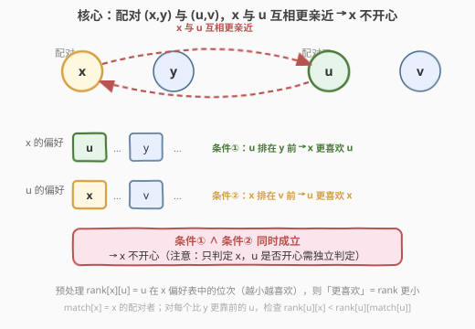
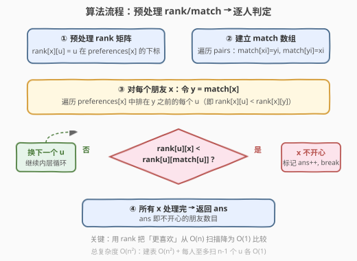
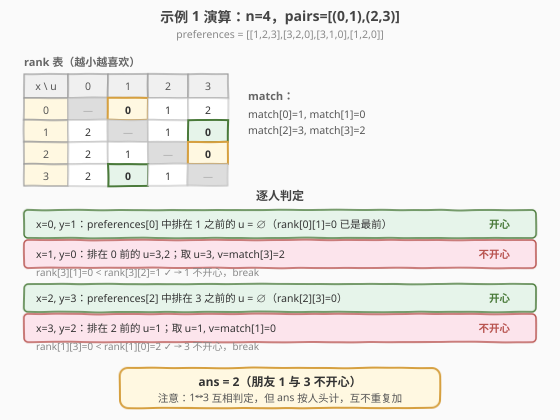

# LeetCode 统计不开心的朋友 题解

## 1. 题目概述

- **标题 / 题号**：统计不开心的朋友（#1583，medium）
- **链接**：https://leetcode.cn/problems/count-unhappy-friends/
- **难度**：中等
- **标签**：数组、模拟、预处理、哈希表

**题意**：给定 `n` 位朋友（`n` 为偶数）的亲近程度列表 `preferences`，其中 `preferences[i]` 是按**亲近程度从高到低**排列的朋友列表（不含 `i` 本身）。所有朋友被分成 `n/2` 对，配对情况由 `pairs` 给出，`pairs[i] = [xi, yi]` 表示 `xi` 与 `yi` 配对。

在 `x` 与 `y` 配对、`u` 与 `v` 配对的情况下，若**同时**满足：

- `x` 与 `u` 的亲近程度**胜过** `x` 与 `y`（即 `u` 在 `preferences[x]` 中排在 `y` 之前），且
- `u` 与 `x` 的亲近程度**胜过** `u` 与 `v`（即 `x` 在 `preferences[u]` 中排在 `v` 之前），

则 `x` **不开心**。返回不开心的朋友数目。

**示例 1**：

```text
输入：n = 4, preferences = [[1,2,3],[3,2,0],[3,1,0],[1,2,0]], pairs = [[0,1],[2,3]]
输出：2
解释：
朋友 1 不开心：1 与 0 配对，但 1 更喜欢 3，且 3 更喜欢 1（胜过 3 与 2）。
朋友 3 不开心：3 与 2 配对，但 3 更喜欢 1，且 1 更喜欢 3（胜过 1 与 0）。
朋友 0 和 2 都开心。
```

**示例 2**：

```text
输入：n = 2, preferences = [[1],[0]], pairs = [[1,0]]
输出：0
解释：朋友 0 和 1 互为最高亲近，都开心。
```

**示例 3**：

```text
输入：n = 4, preferences = [[1,3,2],[2,3,0],[1,3,0],[0,2,1]], pairs = [[1,3],[0,2]]
输出：4
```

**约束**：

- `2 <= n <= 500`，`n` 为偶数
- `preferences.length == n`，`preferences[i].length == n - 1`
- `0 <= preferences[i][j] <= n - 1`，且 `preferences[i]` 不含 `i`、所有值唯一
- `pairs.length == n/2`，每位朋友恰好出现在一对中

## 2. 解题思路

### 2.1 暴力思路：每次比较都线性扫描偏好表

对每个朋友 `x`（配对者 `y`），枚举所有其他朋友 `u`，判定「`x` 更喜欢 `u` 胜过 `y`」需要扫描一遍 `preferences[x]` 找 `u` 和 `y` 的下标再比较；同样判定「`u` 更喜欢 `x` 胜过 `v`」也要扫一遍 `preferences[u]`。

这样单次判定是 $O(n)$，外层 $n$ 人 × 内层 $n$ 个 $u$ × 每次 $O(n)$ 扫描 = $O(n^3)$。`n = 500` 时约 $1.25 \times 10^8$，常数大、容易超时。

> 💡 瓶颈在于「比较亲近程度」这一高频操作。若能把「`x` 更喜欢 `u` 胜过 `y`」从 $O(n)$ 扫描降为 $O(1)$ 比较，整体就能降到 $O(n^2)$。

### 2.2 核心观察：预处理 rank 矩阵 + match 数组



两个预处理把所有判定变为 $O(1)$：

1. **`rank[x][u]`**：`u` 在 `preferences[x]` 中的下标。**值越小表示越喜欢**。于是「`x` 更喜欢 `u` 胜过 `y`」等价于 `rank[x][u] < rank[x][y]`，$O(1)$ 比较。
2. **`match[x]`**：`x` 的配对者。由 `pairs` 一次性建好，`match[xi] = yi` 且 `match[yi] = xi`，$O(1)$ 查询。

判定 `x` 是否不开心：令 `y = match[x]`，遍历 `preferences[x]` 中**排在 `y` 之前**的每个 `u`（这些 `u` 都是 `x` 比更喜欢的），对每个 `u` 令 `v = match[u]`，检查 `rank[u][x] < rank[u][v]` 是否成立——成立则 `x` 不开心，立即 `break`。

> ⚠️ **只判定 `x`**：`u` 是否开心是另一条独立判定，由外层循环遍历到 `u` 时自行处理。因此即便 `x` 和 `u` 互相更亲近，也只各自计数一次，**不会重复**。最终答案就是被标记的人数。

### 2.3 算法流程图



### 2.4 示例演算

以示例 1 为例。先建 `rank` 表（越小越喜欢，对角线为自身记 `—`）与 `match`：



| x | y=match[x] | 排在 y 之前的 u | 取 u | v=match[u] | 判定 rank[u][x] &lt; rank[u][v] | 结果 |
|---|------------|----------------|------|------------|--------------------------------|------|
| 0 | 1 | ∅（rank[0][1]=0 最前） | — | — | — | 开心 |
| 1 | 0 | 3, 2 | 3 | 2 | rank[3][1]=0 &lt; rank[3][2]=1 ✓ | 不开心 |
| 2 | 3 | ∅（rank[2][3]=0 最前） | — | — | — | 开心 |
| 3 | 2 | 1 | 1 | 0 | rank[1][3]=0 &lt; rank[1][0]=2 ✓ | 不开心 |

> 💡 朋友 1 与 3 互相判定为不开心，但 `ans` 按**人头**计，每人只加一次，最终 `ans = 2`。朋友 0、2 各自的配对者已是其偏好表第一名，找不到「更喜欢的 `u`」，天然开心。

## 3. 参考代码

### C++

```cpp
class Solution {
  public:
    int unhappyFriends(int n, vector<vector<int>>& preferences,
                       vector<vector<int>>& pairs) {
        // rank[x][u] = u 在 x 偏好表中的下标，越小越喜欢
        vector<vector<int>> rank(n, vector<int>(n));
        for (int x = 0; x < n; ++x)
            for (int r = 0; r < n - 1; ++r)
                rank[x][preferences[x][r]] = r;

        // match[x] = x 的配对者
        vector<int> match(n);
        for (auto& p : pairs) {
            match[p[0]] = p[1];
            match[p[1]] = p[0];
        }

        int ans = 0;
        for (int x = 0; x < n; ++x) {
            int y = match[x];
            // 遍历 x 偏好表中排在 y 之前的每个 u
            for (int r = 0; r < rank[x][y]; ++r) {
                int u = preferences[x][r];
                int v = match[u];
                if (rank[u][x] < rank[u][v]) { // u 也更喜欢 x
                    ans++;
                    break; // x 已确定不开心，无需继续
                }
            }
        }
        return ans;
    }
};
```

### Python

```python
class Solution:
    def unhappyFriends(self, n: int, preferences: List[List[int]],
                       pairs: List[List[int]]) -> int:
        rank = [[0] * n for _ in range(n)]
        for x in range(n):
            for r, u in enumerate(preferences[x]):
                rank[x][u] = r

        match = [0] * n
        for x, y in pairs:
            match[x] = y
            match[y] = x

        ans = 0
        for x in range(n):
            y = match[x]
            # preferences[x][0 .. rank[x][y]-1] 都是 x 更喜欢的 u
            for r in range(rank[x][y]):
                u = preferences[x][r]
                v = match[u]
                if rank[u][x] < rank[u][v]:
                    ans += 1
                    break
        return ans
```

> 💡 内层用 `for r in range(rank[x][y])` 而非遍历全部 `preferences[x]`：一旦 `u` 排到 `y` 之后就不满足条件①，提前停止外层遍历，常数更优。

## 4. 复杂度分析

| 维度 | 复杂度 | 说明 |
|------|--------|------|
| 时间复杂度 | $O(n^2)$ | 建 `rank` 表 $O(n^2)$；判定阶段每人至多扫 $n-1$ 个 `u`、每次 $O(1)$，合计 $O(n^2)$ |
| 空间复杂度 | $O(n^2)$ | `rank` 矩阵 $n \times n$；`match` 数组 $O(n)$ |

> ⚠️ `n = 500` 时 `rank` 表约 $2.5 \times 10^5$ 个 `int`（约 1 MB），完全在限制内。若内存极紧（如嵌入式环境），可把每行 `rank` 用 `unordered_map` 替代，空间降到 $O(n)$ 但查询常数变大——本题无需如此。

## 5. 扩展：判定对称性与计数去重

- **对称性**：若 `x` 因 `u` 而不开心（即 `x↔u` 互相更亲近），则 `u` 也会在遍历到自身时被独立判定为不开心（因其也更喜欢 `x` 胜过 `match[u]=v`）。二者**互相触发但各自计数**，所以 `ans` 不会漏也不会重。
- **为何不能直接「成对计数 ×2」**：`x` 不开心的触发者 `u` 不一定也开心——例如 `u` 可能存在另一个 `w` 使 `u` 更不开心，但这不影响 `x` 的判定；且 `u` 开心与否取决于 `u` 自己的偏好表。因此必须逐人独立判定，不能简单按「成对」统计。
- **变体**：若题目改为「统计不开心配对数」或「统计互相不开心对数」，只需在判定时按 `(x,u)` 对去重计数即可，预处理结构不变。

## 6. 面试要点

1. **为什么需要预处理 `rank`？**

   - 「更喜欢」本质是偏好表中的**位次比较**。若不预处理，每次比较都要 $O(n)$ 扫描偏好表找两个下标，整体退化到 $O(n^3)$。预处理把位次查询降到 $O(1)$，是本题唯一关键优化。

2. **`match` 数组为什么要双向赋值？**

   - 配对是无向的：`pairs[i]=[xi,yi]` 意味着 `xi` 的配对者是 `yi`，反之亦然。若只赋 `match[xi]=yi`，查 `yi` 的配对者会得到默认值 0 导致错误。双向赋值 `match[xi]=yi; match[yi]=xi` 保证任一方向 $O(1)$ 可查。

3. **内层为什么遍历到 `rank[x][y]` 就停？**

   - `preferences[x][rank[x][y]]` 恰好是 `y` 本身。下标 `< rank[x][y]` 的才是「`x` 比 `y` 更喜欢」的 `u`，满足条件①；从 `y` 往后都不满足，提前终止外层循环，常数更优。

4. **会不会重复计数？**

   - 不会。外层按人 `x` 遍历，每人至多 `ans++` 一次（命中即 `break`）。`x` 与 `u` 互相触发时，二者分别在外层各自被判定一次，按人头计入，不重复。

5. **能否不建 `rank` 矩阵、改用哈希表？**

   - 可以。把每行的 `rank[x]` 换成 `unordered_map<int,int>`，空间 $O(n)$（每人 $n-1$ 项共 $O(n^2)$ 但常数更小、不预占 $n^2$ 连续内存）。查询仍是 $O(1)$ 均摊，适合 `n` 更大或偏好表稀疏的场景。本题 `n ≤ 500`，二维数组更简单且更快。

## 同类练习题

| # | 题目 | 与本题的关联 |
|---|------|-------------|
| 1386 | [电影院排座](https://leetcode.cn/problems/cinema-seat-allocation/) | 同样需要把「占用/位次」信息预处理为可 $O(1)$ 查询的结构，再枚举判定 |
| — | [面试题 16.20. T9键盘](https://leetcode.cn/problems/t9-lcci/) | 预处理映射表把「字符属于哪个数字键」降为 $O(1)$ 查询，与 `rank` 预处理思路一致 |
| 277 | [搜寻名人](https://leetcode.cn/problems/find-the-celebrity/) | 两遍扫描消除法，把高频比较操作结构化，与本题「预处理消除重复扫描」同属「先用预处理/消除把比较降为 O(1)」范式 |
| 1 | [两数之和](https://leetcode.cn/problems/two-sum/) | 用哈希表把「查找配对」从 $O(n)$ 降到 $O(1)$，与本题 `match` 数组的思路同源 |
| 874 | [模拟行走机器人](https://leetcode.cn/problems/walking-robot-simulation/) | 用哈希集合预处理障碍物，把「是否撞障碍」从线性扫描降为 $O(1)$ 查询 |
