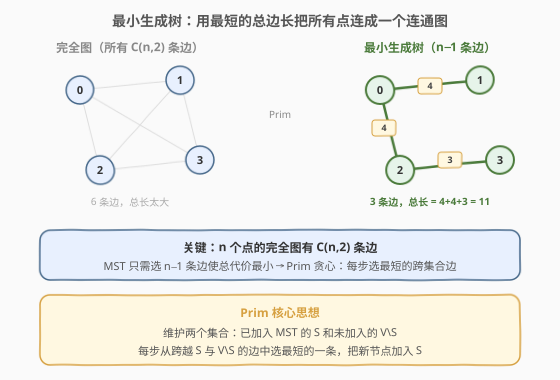
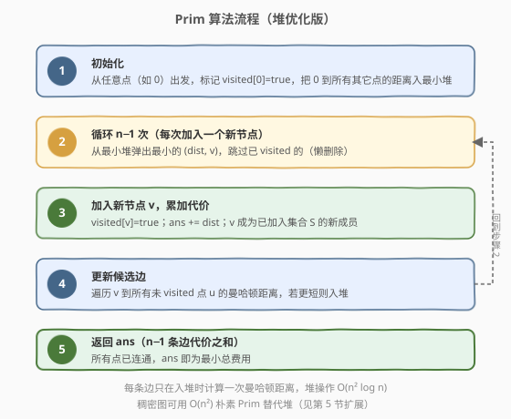
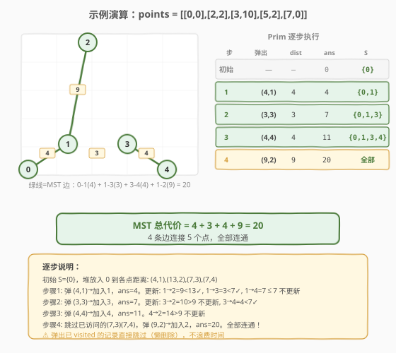

# 连接所有点的最小费用

- **题目名称**：连接所有点的最小费用
- **链接**：[1584. 连接所有点的最小费用](https://leetcode.cn/problems/min-cost-to-connect-all-points/)
- **难度**：中等
- **标签**：图、最小生成树、Prim 算法、堆/优先队列

## 1. 题目概述

给定平面上 `n` 个点 `points[i] = [xi, yi]`，两点之间的**曼哈顿距离**为 $|x_i - x_j| + |y_i - y_j|$。求使所有点连通的**最小总费用**——即从完全图中选出一棵**最小生成树（MST）**，使其 `n - 1` 条边的权值之和最小。

**示例 1**：

```text
输入：points = [[0,0],[2,2],[3,10],[5,2],[7,0]]
输出：20
解释：选 4 条边连通 5 个点：0-1(4) + 1-3(3) + 3-4(4) + 1-2(9) = 20
```

**示例 2**：

```text
输入：points = [[3,12],[-2,5],[-4,1]]
输出：18
解释：3 个点选 2 条边：0-1(12) + 1-2(6) = 18
```

**约束条件**：

- `1 <= n <= 1000`
- `-10^6 <= xi, yi <= 10^6`
- 所有点两两不同

---

## 2. 解题思路

### 2.1 暴力思路：枚举所有生成树？

`n` 个点的完全图有 $C(n, 2)$ 条边，从中选 $n - 1$ 条组成生成树的方案数是 $n^{n-2}$（Cayley 公式）。`n = 5` 时已有 $5^3 = 125$ 种，`n = 10` 时 $10^9$ 种——完全不可行。

> 💡 转换视角：不要枚举生成树，而要**贪心地逐步构建** MST——每次选最短的跨集合边，把一个新节点加入已连通集合。这正是 **Prim 算法**。

### 2.2 核心观察：Prim 算法（贪心 + 优先队列）



核心思路：

- 维护两个集合：已加入 MST 的 $S$ 和未加入的 $V \setminus S$。
- 每次从**跨越 $S$ 与 $V \setminus S$ 的边**中，选**权值最小**的一条，把新节点加入 $S$。
- 重复 $n - 1$ 次，所有节点全部加入，$n - 1$ 条边的权值之和即为答案。

> 💡 **贪心正确性（ cut property）**：对于图的任意一个割（将顶点分为 $S$ 和 $V \setminus S$），跨割的**最短边**一定属于某棵 MST。因此每步贪心选最短跨割边不会出错。

**实现方式**：用**最小堆**维护候选边——堆中存放 `(距离, 目标节点)`，每次弹出最小者。若目标节点已访问则跳过（懒删除），否则加入 MST 并把它的所有出边入堆。

### 2.3 算法流程图



### 2.4 示例演算

以示例 1 `points = [[0,0],[2,2],[3,10],[5,2],[7,0]]` 为例。各点间曼哈顿距离：

| 边 | 距离 | 边 | 距离 |
|----|------|----|------|
| 0-1 | 4 | 1-3 | 3 |
| 0-2 | 13 | 1-4 | 7 |
| 0-3 | 7 | 2-3 | 10 |
| 0-4 | 7 | 2-4 | 14 |
| 1-2 | 9 | 3-4 | 4 |



| 步骤 | 弹出 (dist, v) | 动作 | ans | S |
|------|---------------|------|-----|---|
| 初始 | — | 从 0 出发，入堆 (4,1),(13,2),(7,3),(7,4) | 0 | {0} |
| 1 | (4, 1) | 加入 1；更新 1→2=9<13, 1→3=3<7 | 4 | {0,1} |
| 2 | (3, 3) | 加入 3；更新 3→4=4<7 | 7 | {0,1,3} |
| 3 | (4, 4) | 加入 4；无更短更新 | 11 | {0,1,3,4} |
| 4 | (9, 2) | 加入 2；全部连通 | 20 | {0,1,2,3,4} |

> 💡 步骤 2 中，从节点 1 出发到节点 3 的距离仅为 3（两点 y 坐标相同），远小于 0 到 3 的 7——这正是 Prim 的精髓：**新加入的节点可能提供更短的跨集合边**。

---

## 3. 参考代码

### 方法一：堆优化 Prim（推荐，$O(n^2 \log n)$）

### C++

```cpp
class Solution {
  public:
    int minCostConnectPoints(vector<vector<int>>& points) {
        int n = points.size();
        vector<bool> visited(n, false);

        // 最小堆：(距离, 目标节点)
        priority_queue<pair<int,int>, vector<pair<int,int>>, greater<>> pq;
        int ans = 0, count = 0;

        // 从节点 0 出发
        pq.push({0, 0});

        while (count < n) {
            auto [d, u] = pq.top(); pq.pop();
            if (visited[u]) continue;          // 懒删除：已加入 MST
            visited[u] = true;
            ans += d;
            count++;

            // 把 u 到所有未访问点的距离入堆
            for (int v = 0; v < n; ++v) {
                if (!visited[v]) {
                    int dist = abs(points[u][0] - points[v][0])
                             + abs(points[u][1] - points[v][1]);
                    pq.push({dist, v});
                }
            }
        }
        return ans;
    }
};
```

### Python

```python
class Solution:
    def minCostConnectPoints(self, points: List[List[int]]) -> int:
        n = len(points)
        visited = [False] * n
        pq = [(0, 0)]  # (距离, 节点)
        ans = 0
        count = 0

        while count < n:
            d, u = heapq.heappop(pq)
            if visited[u]:
                continue              # 懒删除
            visited[u] = True
            ans += d
            count += 1
            for v in range(n):
                if not visited[v]:
                    dist = abs(points[u][0] - points[v][0]) + abs(points[u][1] - points[v][1])
                    heapq.heappush(pq, (dist, v))

        return ans
```

> 💡 **懒删除**：堆中同一节点可能有多条记录（先入了一条长边，后来又入了一条短边）。弹出时若 `visited[u]` 为 `true` 说明已处理过，直接 `continue` 跳过。这与 [743. 网络延迟时间](../0701-0800/743_网络延迟时间.md) 的 Dijkstra 懒删除思想完全一致。

---

## 4. 复杂度分析

| 维度 | 复杂度 | 说明 |
|------|--------|------|
| 时间复杂度 | $O(n^2 \log n)$ | 完全图有 $n(n-1)/2$ 条边，每条边至多入堆一次 $O(n^2)$，每次堆操作 $O(\log n)$ |
| 空间复杂度 | $O(n^2)$ | 堆中最坏存放 $O(n^2)$ 条候选边 |

> ⚠️ 本题 $n \le 1000$，$n^2 = 10^6$，堆中最多 $10^6$ 条记录，时间和空间都能接受。但若 $n$ 更大（如 $10^4$），堆版本空间会爆——此时应改用下方的 $O(n^2)$ 朴素 Prim。

---

## 5. 扩展：朴素 Prim 与 Kruskal

### 5.1 朴素 Prim（$O(n^2)$，稠密图更优）

对于**完全图**（边数 $E = n^2$），堆优化的 $O(E \log V) = O(n^2 \log n)$ 反而比朴素 $O(n^2)$ 慢一个 $\log$。朴素版用数组 `minDist[v]` 维护「未访问点到集合 $S$ 的最短距离」，每轮线性扫描找最小值：

### C++

```cpp
class Solution {
  public:
    int minCostConnectPoints(vector<vector<int>>& points) {
        int n = points.size();
        vector<int> minDist(n, INT_MAX);  // 未访问点到 S 的最短距离
        vector<bool> visited(n, false);
        minDist[0] = 0;
        int ans = 0;

        for (int i = 0; i < n; ++i) {
            // 找未访问中 minDist 最小的
            int u = -1, best = INT_MAX;
            for (int v = 0; v < n; ++v)
                if (!visited[v] && minDist[v] < best)
                    best = minDist[v], u = v;

            visited[u] = true;
            ans += minDist[u];

            // 用 u 更新所有未访问点的 minDist
            for (int v = 0; v < n; ++v)
                if (!visited[v]) {
                    int d = abs(points[u][0] - points[v][0])
                          + abs(points[u][1] - points[v][1]);
                    minDist[v] = min(minDist[v], d);
                }
        }
        return ans;
    }
};
```

### Python

```python
class Solution:
    def minCostConnectPoints(self, points: List[List[int]]) -> int:
        n = len(points)
        min_dist = [float('inf')] * n
        visited = [False] * n
        min_dist[0] = 0
        ans = 0

        for _ in range(n):
            u = -1
            best = float('inf')
            for v in range(n):
                if not visited[v] and min_dist[v] < best:
                    best = min_dist[v]
                    u = v

            visited[u] = True
            ans += min_dist[u]

            for v in range(n):
                if not visited[v]:
                    d = abs(points[u][0] - points[v][0]) + abs(points[u][1] - points[v][1])
                    min_dist[v] = min(min_dist[v], d)

        return ans
```

| 维度 | 朴素 Prim | 堆优化 Prim |
|------|-----------|-------------|
| 时间 | $O(n^2)$ | $O(n^2 \log n)$ |
| 空间 | $O(n)$ | $O(n^2)$ |
| 适用 | 稠密图（完全图） | 稀疏图 |
| 本题 ($n \le 1000$) | **更优**（常数小） | 也能过 |

> 💡 **面试建议**：若面试官说「这是一个完全图」，优先写朴素 $O(n^2)$ Prim——代码更短、无堆开销、复杂度更优。若图是稀疏的（边远少于 $n^2$），则堆版本更合适。

### 5.2 Kruskal 算法（并查集 + 排序）

Kruskal 的思路是：把所有边按权值排序，从小到大依次尝试加入，若两端不在同一连通分量（用并查集判断）则选入 MST，直到选满 $n - 1$ 条边。

```cpp
class Solution {
  public:
    int parent[1001];
    int find(int x) { return parent[x] == x ? x : parent[x] = find(parent[x]); }

    int minCostConnectPoints(vector<vector<int>>& points) {
        int n = points.size();
        vector<array<int,3>> edges;  // (dist, u, v)
        for (int i = 0; i < n; ++i)
            for (int j = i + 1; j < n; ++j)
                edges.push_back({abs(points[i][0]-points[j][0]) + abs(points[i][1]-points[j][1]), i, j});

        sort(edges.begin(), edges.end());
        iota(parent, parent + n, 0);

        int ans = 0, count = 0;
        for (auto& [d, u, v] : edges) {
            int fu = find(u), fv = find(v);
            if (fu != fv) {
                parent[fu] = fv;
                ans += d;
                if (++count == n - 1) break;
            }
        }
        return ans;
    }
};
```

Kruskal 时间 $O(n^2 \log n)$（排序 $n^2$ 条边），空间 $O(n^2)$（存所有边）。与堆 Prim 同阶，但需要显式构造所有边，空间更大。本题完全图下**不推荐 Kruskal**，但它是面试中 MST 的另一必会模板。

---

## 6. 面试要点

1. **Prim 和 Kruskal 怎么选？**

   - **Prim**（从点出发，逐步扩展）：适合**稠密图**（如完全图），朴素版 $O(V^2)$。
   - **Kruskal**（从边出发，排序 + 并查集）：适合**稀疏图**，$O(E \log E)$。
   - 本题是完全图（$E = n^2$），Prim 朴素版 $O(n^2)$ 最优。

2. **为什么 Prim 的贪心是正确的？**

   - 基于**割性质（cut property）**：对于任意一个割，跨割的最短边一定在某棵 MST 中。Prim 每步以 $S$ 与 $V \setminus S$ 为割，选最短跨割边，等价于不断应用割性质。

3. **堆优化和朴素 Prim 的区别？**

   - 堆优化用优先队列选最小值 $O(\log V)$，但每次加入新边时把所有出边入堆，空间 $O(E)$。
   - 朴素版线性扫描选最小值 $O(V)$，但只维护 `minDist` 数组，空间 $O(V)$。
   - 稠密图（$E \approx V^2$）时朴素更优；稀疏图（$E \ll V^2$）时堆更优。

4. **曼哈顿距离需要显式建图吗？**

   - 不需要。距离可以 $O(1)$ 在线计算 `abs(x1-x2) + abs(y1-y2)`，避免预存 $n^2$ 条边的空间开销（朴素 Prim）。

5. **懒删除是什么？为什么需要它？**

   - 堆中同一节点可能有多条记录（先入长边后入短边）。弹出已 `visited` 的记录直接跳过，不主动从堆中删除——比"修改堆中元素"的实现更简洁，是面试最推荐的写法。

---

## 7. 同类练习题

- [1168. 水资源分配优化](https://leetcode.cn/problems/optimize-water-distribution-in-a-village/)：虚拟节点 + Prim/Kruskal，把建水站和铺管道统一为 MST
- [1135. 最低成本联通所有城市](https://leetcode.cn/problems/connecting-cities-with-minimum-cost/)：标准 MST（Kruskal 更适合，稀疏图）
- [1489. 找到最小生成树里的关键边和伪关键边](https://leetcode.cn/problems/find-critical-and-pseudo-critical-edges-in-minimum-spanning-tree/)：MST + 删边判定，Kruskal 进阶
- [743. 网络延迟时间](https://leetcode.cn/problems/network-delay-time/)：Dijkstra 单源最短路，与 Prim 骨架相似（都靠堆选最小值），区别在目标不同
- [547. 省份数量](https://leetcode.cn/problems/number-of-provinces/)：并查集判连通分量，MST 的前置知识
