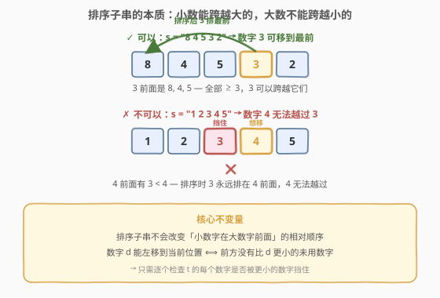
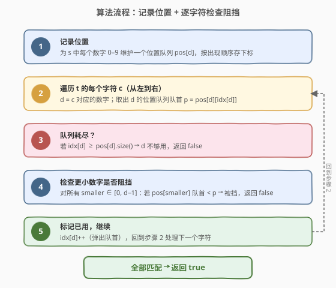
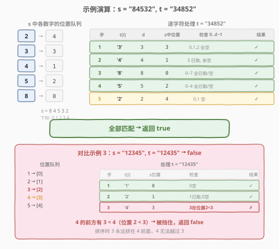

# 检查字符串是否可以通过排序子字符串得到另一个字符串

- **题目名称**：检查字符串是否可以通过排序子字符串得到另一个字符串
- **链接**：[1585. 检查字符串是否可以通过排序子字符串得到另一个字符串](https://leetcode.cn/problems/check-if-string-is-transformable-with-substring-sort-operations/)
- **难度**：困难
- **标签**：字符串、贪心、相对顺序

## 1. 题目概述

给定两个只包含数字 `'0'`–`'9'` 的字符串 `s` 和 `t`。你可以对 `s` 执行**任意次**以下操作：

- 选择 `s` 中一个**非空子字符串**，将其包含的字符**就地升序排序**。

问：能否通过若干次操作将 `s` 变成 `t`？

**示例 1**：

```text
输入：s = "84532", t = "34852"
输出：true
解释：
  "84[53]2" → "84[35]2"      （排序下标 2-3 的子串）
  "[843]52" → "[348]52"      （排序下标 0-2 的子串）
```

**示例 2**：

```text
输入：s = "34521", t = "23415"
输出：true
解释：
  "[3452]1" → "[2345]1"
  "234[51]" → "234[15]"
```

**示例 3**：

```text
输入：s = "12345", t = "12435"
输出：false
```

**示例 4**：

```text
输入：s = "1", t = "2"
输出：false
```

**约束条件**：

- `s.length == t.length`
- `1 <= s.length <= 10^5`
- `s` 和 `t` 都只包含数字字符 `'0'`–`'9'`

---

## 2. 解题思路

### 2.1 暴力思路：BFS 搜索所有中间状态？

字符串长度可达 $10^5$，每个状态有 $O(n^2)$ 种子串可排序，状态空间是天文数字。BFS/DFS 完全不可行。

> 💡 转换视角：不要模拟操作过程，而要找到**什么不变**——排序子串操作对数字相对顺序施加了什么约束。

### 2.2 核心观察：相对顺序不变量



**关键洞察**：对子串升序排序时，**较小的数字会排到前面**。因此：

- 数字 $d$ 可以**向左跨越**所有 $\ge d$ 的数字（把它们排到 $d$ 右边）。
- 数字 $d$ **永远无法跨越**任何 $< d$ 的数字（排序时更小的数字一定排在 $d$ 前面）。

这给出了一个**不变量**：

> **定理**：无论怎样排序子串，若原串中数字 $c$（在位置 $q$）小于数字 $d$（在位置 $p > q$），则 $c$ 始终保持在 $d$ 前面——$d$ 永远无法越过 $c$ 到达更靠左的位置。

**推论**：要把数字 $d$ 移到当前最前端，**当且仅当** $d$ 的前方（在原串 `s` 中）没有比 $d$ 更小的**未使用**数字。

基于此，我们只需从左到右扫描 `t`，逐个"提取"数字，检查每个数字在 `s` 中的位置是否被更小的数字挡住。

### 2.3 算法流程图



### 2.4 示例演算

以**示例 1** `s = "84532"`, `t = "34852"` 为例。

**第一步**：记录 `s` 中每个数字的出现位置（按出现顺序排队）：

| 数字 | 位置队列 |
|------|---------|
| 2 | [4] |
| 3 | [3] |
| 4 | [1] |
| 5 | [2] |
| 8 | [0] |

**第二步**：从左到右处理 `t`，每个字符取出对应数字的最左未用位置，检查是否被更小的数字阻挡：



| 步骤 | t[i] | d | s 中位置 | 检查 0..d−1 | 结果 |
|------|------|---|---------|------------|------|
| 1 | '3' | 3 | 3 | 0,1,2 队列全空 | ✓ 取出 s[3] |
| 2 | '4' | 4 | 1 | 3 已取出，0,1,2 空 | ✓ 取出 s[1] |
| 3 | '8' | 8 | 0 | 0–7 全部已取/空 | ✓ 取出 s[0] |
| 4 | '5' | 5 | 2 | 0–4 全部已取/空 | ✓ 取出 s[2] |
| 5 | '2' | 2 | 4 | 0,1 队列空 | ✓ 取出 s[4] |

全部匹配，返回 `true`。

> **对比示例 3** `s = "12345"`, `t = "12435"`：处理到 `t[2] = '4'` 时，`d = 4` 的最左位置是 `s[3] = 4`，但数字 `3` 的位置队列前端是 `s[2] = 3 < 3`（位置 2 < 3），且 `3 < 4`——**4 被 3 挡住**，返回 `false`。

---

## 3. 参考代码

### C++

```cpp
class Solution {
  public:
    bool isTransformable(string s, string t) {
        vector<int> pos[10];
        for (int i = 0; i < (int)s.size(); ++i)
            pos[s[i] - '0'].push_back(i);

        int idx[10] = {};
        for (char c : t) {
            int d = c - '0';
            if (idx[d] >= (int)pos[d].size()) return false;
            int p = pos[d][idx[d]];
            for (int smaller = 0; smaller < d; ++smaller)
                if (idx[smaller] < (int)pos[smaller].size()
                    && pos[smaller][idx[smaller]] < p)
                    return false;
            ++idx[d];
        }
        return true;
    }
};
```

### Python

```python
class Solution:
    def isTransformable(self, s: str, t: str) -> bool:
        pos = [[] for _ in range(10)]
        for i, ch in enumerate(s):
            pos[int(ch)].append(i)

        idx = [0] * 10
        for ch in t:
            d = int(ch)
            if idx[d] >= len(pos[d]):
                return False
            p = pos[d][idx[d]]
            for smaller in range(d):
                if idx[smaller] < len(pos[smaller]) and pos[smaller][idx[smaller]] < p:
                    return False
            idx[d] += 1
        return True
```

> 💡 **代码要点**：
> - `pos[d]` 是数字 `d` 在 `s` 中的位置队列（按出现顺序，FIFO）。
> - `idx[d]` 是队列的读取指针，等效于"弹出"队首。
> - 内层循环只检查 `0..d−1` 共 9 个数字，常数极小。

---

## 4. 复杂度分析

| 维度 | 复杂度 | 说明 |
|------|--------|------|
| 时间复杂度 | $O(n)$ | 每个 `s` 中的位置入队一次 $O(n)$；处理 `t` 时每个字符检查至多 9 个更小数字 $O(9n)$，总计 $O(n)$ |
| 空间复杂度 | $O(n)$ | 10 个位置队列共存储 $n$ 个下标 |

> ⚠️ 关键在于数字只有 0–9 共 10 种，内层检查是 $O(10)$ 常数。若字符集变大（如 26 个字母），复杂度变为 $O(|\Sigma| \cdot n)$。

---

## 5. 扩展：正确性证明

### 5.1 必要性（算法返回 false ⇒ 不可变换）

若处理 `t[i] = d` 时发现数字 `c < d` 的最左未用位置 `q < p`（`p` 是 `d` 的最左未用位置），则根据不变量定理：`c` 在原串中位于 `d` 前面且 `c < d`，`d` 永远无法越过 `c`。因此 `d` 不可能出现在当前位置，变换不可行。

### 5.2 充分性（算法返回 true ⇒ 可变换）

若算法返回 true，则对每个 `t[i] = d`，其最左未用位置 `p` 前方没有更小的未用数字。我们可构造操作序列：

1. 设当前需要把 `d`（原位置 `p`）提取到最前。
2. `p` 前方的所有未用数字都 $\ge d$，排序子串 `[最前, p]` 即可让 `d` 排到最前。
3. 锁定最前的 `d`（对应 `t[i]`），对剩余部分继续。

### 5.3 贪心正确性（为何总是取最左的 d）

若最左的 `d`（位置 `p_1`）被某个 `c < d`（位置 `q < p_1`）挡住，则任何更右的 `d`（位置 `p_2 > p_1`）同样被 `c` 挡住（因为 `q < p_1 < p_2`）。因此取最左的 `d` 是最优策略——它被挡住意味着所有 `d` 都被挡住。

---

## 6. 面试要点

1. **排序子串操作的本质是什么？**

   - 升序排序子串会让小数字左移、大数字右移。等价于：小数字可以跨越大的，但大数字永远不能跨越小的。这是一条不可违反的相对顺序约束。

2. **为什么不用 BFS/模拟？**

   - 字符串长度 $10^5$，子串选择有 $O(n^2)$ 种，状态空间指数级。必须从"不变量"角度分析，而非模拟操作。

3. **为什么贪心取最左的 d 是正确的？**

   - 最左的 `d` 位置最小，前方字符最少，最不容易被挡。若它被某个 `c < d` 挡住，更右的 `d` 也一定被同一个 `c` 挡住（`c` 的位置更小）。所以取最左的 `d` 不会丢失任何可行解。

4. **如何判断两个字符串的数字组成不同？**

   - 若 `t` 中某个数字 `d` 的出现次数超过 `s` 中的次数，队列会耗尽（`idx[d] >= pos[d].size()`），直接返回 false。这自然处理了字符计数不匹配的情况。

5. **时间复杂度为什么是 O(n) 而非 O(n²)？**

   - 数字只有 0–9 共 10 种，内层"检查更小数字"的循环最多 9 次，是常数。每个位置入队和出队各一次，总体 $O(n)$。

---

## 7. 同类练习题

- [1505. 最多K次交换相邻数位后得到的最小整数](https://leetcode.cn/problems/smallest-string-with-swaps/)：字符串重排变体，相邻交换 + 逆序对计数，对比本题的子串排序约束
- [1850. 邻位交换的最小次数](https://leetcode.cn/problems/minimum-adjacent-swaps-to-reach-the-kth-smallest-number/)：相邻交换变换字符串的最小次数，逆序对思想
- [315. 计算右侧小于当前元素的个数](https://leetcode.cn/problems/count-of-smaller-numbers-after-self/)：逆序对 / 相对顺序计数的经典题，理解"谁在谁前面"的核心概念
- [1540. K次操作转变字符串](https://leetcode.cn/problems/k-th-missing-positive-number/)：字符串变换判定问题（同目录），贪心匹配思路相通
