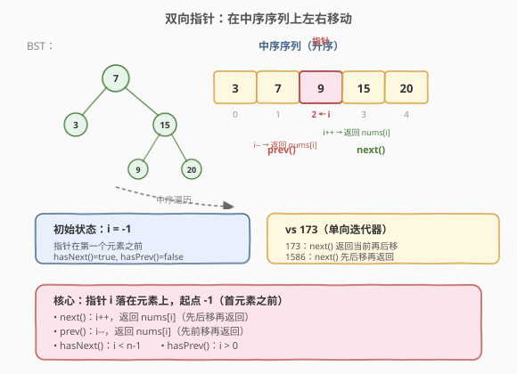
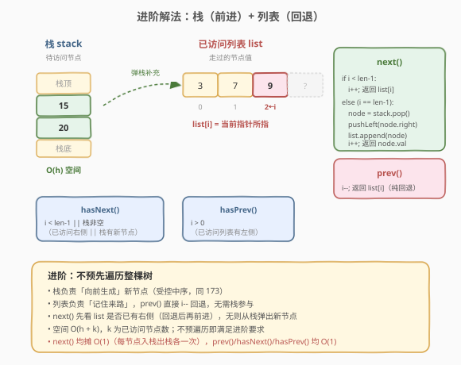
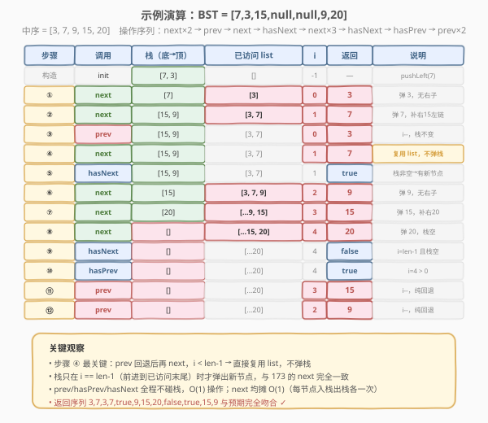

# 二叉搜索树迭代器II

- **题目名称**：二叉搜索树迭代器II
- **链接**：[1586. 二叉搜索树迭代器 II](https://leetcode.cn/problems/binary-search-tree-iterator-ii/)
- **难度**：中等
- **标签**：树、BST、栈、设计、中序遍历、迭代器

## 1. 题目概述

实现一个**二叉搜索树（BST）双向迭代器** `BSTIterator`，按**中序遍历**的升序序列支持**前后双向移动**：

- `BSTIterator(TreeNode root)`：用 BST 根节点初始化。内部指针初始化为一个**不存在于树中且小于任意节点值**的虚拟位置。
- `boolean hasNext()`：若指针在中序序列中**右侧**存在数值，返回 `true`，否则 `false`。
- `int next()`：将指针**向右移动**，然后返回指针所指数值。
- `boolean hasPrev()`：若指针在中序序列中**左侧**存在数值，返回 `true`，否则 `false`。
- `int prev()`：将指针**向左移动**，然后返回指针所指数值。

> 💡 直白理解：指针 `i` 落在**中序数组的某个元素上**，初始 `i = -1`（首元素之前）。`next()` = `i++` 后返回 `nums[i]`；`prev()` = `i--` 后返回 `nums[i]`。对比 [173. 二叉搜索树迭代器](../0101-0200/173_二叉搜索树迭代器.md) 的单向 `next()`，本题多了 `prev()` / `hasPrev()` 的**回退能力**。

**示例 1**：

```text
输入
["BSTIterator", "next", "next", "prev", "next", "hasNext", "next", "next", "next", "hasNext", "hasPrev", "prev", "prev"]
[[[7, 3, 15, null, null, 9, 20]], [], [], [], [], [], [], [], [], [], [], [], []]
输出
[null, 3, 7, 3, 7, true, 9, 15, 20, false, true, 15, 9]

解释
BST 结构：7 为根，左孩子 3，右孩子 15；15 左孩子 9，右孩子 20。
中序序列 = [3, 7, 9, 15, 20]

bSTIterator.next();    // i: -1→0, 返回 3
bSTIterator.next();    // i: 0→1, 返回 7
bSTIterator.prev();    // i: 1→0, 返回 3
bSTIterator.next();    // i: 0→1, 返回 7
bSTIterator.hasNext(); // i=1 < 4, 返回 true
bSTIterator.next();    // i: 1→2, 返回 9
bSTIterator.next();    // i: 2→3, 返回 15
bSTIterator.next();    // i: 3→4, 返回 20
bSTIterator.hasNext(); // i=4 = n-1 且无更多节点, 返回 false
bSTIterator.hasPrev(); // i=4 > 0, 返回 true
bSTIterator.prev();    // i: 4→3, 返回 15
bSTIterator.prev();    // i: 3→2, 返回 9
```

**约束条件**：

- 树中节点个数范围 `[1, 10^5]`
- `0 <= Node.val <= 10^6`
- 最多调用 `10^5` 次 `hasNext`、`next`、`hasPrev`、`prev`
- **进阶**：你可以不提前遍历树中的值来解决问题吗？

> ⚠️ 注意 `next()` 的语义与 173 不同：173 是「返回当前再后移」，1586 是「**先后移再返回**」。这保证指针始终落在真实元素上（除了初始的 `-1`），`prev()` 和 `next()` 对称地移动并返回。

---

## 2. 解题思路

### 2.1 暴力思路：预存中序数组

构造时做一次完整中序遍历，把所有值存入数组 `nums`，用下标 `i`（初始 `-1`）记录指针位置：

- `next()`：`i++`，返回 `nums[i]`
- `prev()`：`i--`，返回 `nums[i]`
- `hasNext()`：`i < n - 1`
- `hasPrev()`：`i > 0`

简单直接，所有操作 $O(1)$，但**内存 $O(n)$**，且不满足进阶的「不提前遍历」要求。

### 2.2 核心观察：受控中序 + 已访问列表 = 延迟求值的双向迭代器



关键想法来自 [173](../0101-0200/173_二叉搜索树迭代器.md) 的**受控中序**——用栈把中序遍历拆成单步，**用到哪算到哪**。但 1586 多了 `prev()` 回退，需要额外记住**走过的节点**。

**双组件设计**：

| 组件 | 作用 | 空间 |
|------|------|------|
| **栈 `stack`** | 受控中序，负责**向前生成**新节点（同 173） | $O(h)$ |
| **列表 `list`** | 记录已访问过的节点值，负责**向后回退** | $O(k)$（已访问数） |
| **指针 `i`** | 当前位置在 `list` 中的下标，初始 `-1` | $O(1)$ |

> 💡 **核心不变量**：`list` 中存储所有「已被 `next()` 生成过」的节点值，`i` 指向当前指针位置。`next()` 时若 `i < len(list) - 1`（已访问列表右侧有值），直接 `i++` 复用，**不碰栈**；若 `i == len(list) - 1`（已到已访问末尾），才从栈弹出新节点并 `append` 到 `list`。`prev()` 永远只做 `i--`，与栈无关。

### 2.3 算法流程图



**`next()` 步骤**：

1. 若 `i < len(list) - 1`：直接 `i++`，返回 `list[i]`（**回退后再前进**，复用已有值）。
2. 若 `i == len(list) - 1`：从栈弹出 `node`（栈顶 = 当前最小），把 `node.right` 的左链压栈，将 `node.val` 追加到 `list`，`i++`，返回 `node.val`。

**`prev()` 步骤**：`i--`，返回 `list[i]`（纯回退，不碰栈）。

**`hasNext()`**：`i < len(list) - 1`（已访问列表右侧有值）**或**栈非空（还有新节点可生成）。

**`hasPrev()`**：`i > 0`。

**构造函数**：`i = -1`，`list = []`，对 `root` 执行 `pushLeft`（一路向左压栈，同 173）。

### 2.4 示例演算

以 `root = [7,3,15,null,null,9,20]` 为例，中序序列 `[3, 7, 9, 15, 20]`：



| 步骤 | 调用 | 栈（底→顶） | list | i | 返回 | 说明 |
|------|------|-------------|------|---|------|------|
| 构造 | init | [7, 3] | [] | -1 | — | pushLeft(7) |
| ① | next | [7] | [3] | 0 | **3** | 弹 3，无右子 |
| ② | next | [15, 9] | [3, 7] | 1 | **7** | 弹 7，补右 15 左链 |
| ③ | prev | [15, 9] | [3, 7] | 0 | **3** | i--，栈不变 |
| ④ | next | [15, 9] | [3, 7] | 1 | **7** | i < len-1，**复用 list** |
| ⑤ | hasNext | [15, 9] | [3, 7] | 1 | **true** | 栈非空 |
| ⑥ | next | [15] | [3, 7, 9] | 2 | **9** | 弹 9，无右子 |
| ⑦ | next | [20] | […9, 15] | 3 | **15** | 弹 15，补右 20 |
| ⑧ | next | [] | […15, 20] | 4 | **20** | 弹 20，栈空 |
| ⑨ | hasNext | [] | […20] | 4 | **false** | i=len-1 且栈空 |
| ⑩ | hasPrev | [] | […20] | 4 | **true** | i > 0 |
| ⑪ | prev | [] | […20] | 3 | **15** | i--，纯回退 |
| ⑫ | prev | [] | […20] | 2 | **9** | i--，纯回退 |

> 💡 **步骤 ④ 最关键**：`prev()` 回退后再 `next()`，`i < len(list)-1` 成立，直接复用 `list[1] = 7`，**不弹栈**。这就是双向迭代器的精髓——回退后前进走的是「来时的路」，无需重新生成节点。

---

## 3. 参考代码

### 方法一：预存中序数组（简单，$O(n)$ 空间）

### C++

```cpp
class BSTIterator {
    vector<int> nums;
    int i = -1;

    void dfs(TreeNode* root) {
        if (!root) return;
        dfs(root->left);
        nums.push_back(root->val);
        dfs(root->right);
    }
  public:
    BSTIterator(TreeNode* root) {
        dfs(root);
    }

    bool hasNext() { return i < (int)nums.size() - 1; }
    int  next()    { return nums[++i]; }
    bool hasPrev() { return i > 0; }
    int  prev()    { return nums[--i]; }
};
```

### Python

```python
class BSTIterator:
    def __init__(self, root: Optional[TreeNode]):
        self.nums = []
        def dfs(node):
            if not node:
                return
            dfs(node.left)
            self.nums.append(node.val)
            dfs(node.right)
        dfs(root)
        self.i = -1

    def hasNext(self) -> bool:
        return self.i < len(self.nums) - 1

    def next(self) -> int:
        self.i += 1
        return self.nums[self.i]

    def hasPrev(self) -> bool:
        return self.i > 0

    def prev(self) -> int:
        self.i -= 1
        return self.nums[self.i]
```

### 方法二：受控中序 + 已访问列表（进阶，$O(h + k)$ 空间）

### C++

```cpp
class BSTIterator {
    stack<TreeNode*> st;       // 受控中序：向前生成新节点
    vector<int> vals;          // 已访问节点值：向后回退
    int i = -1;                // 指针，初始在首元素之前

    void pushLeft(TreeNode* node) {
        while (node) {
            st.push(node);
            node = node->left;
        }
    }
  public:
    BSTIterator(TreeNode* root) {
        pushLeft(root);
    }

    bool hasNext() {
        return i < (int)vals.size() - 1 || !st.empty();
    }

    int next() {
        ++i;
        if (i < (int)vals.size()) {   // 回退后再前进：复用已有值
            return vals[i];
        }
        // i == vals.size()：已到已访问末尾，从栈生成新节点
        TreeNode* node = st.top();
        st.pop();
        if (node->right) {
            pushLeft(node->right);
        }
        vals.push_back(node->val);
        return node->val;
    }

    bool hasPrev() {
        return i > 0;
    }

    int prev() {
        --i;
        return vals[i];
    }
};
```

### Python

```python
class BSTIterator:
    def __init__(self, root: Optional[TreeNode]):
        self.stack = []
        self.vals = []
        self.i = -1
        self._push_left(root)

    def _push_left(self, node: Optional[TreeNode]) -> None:
        while node:
            self.stack.append(node)
            node = node.left

    def hasNext(self) -> bool:
        return self.i < len(self.vals) - 1 or len(self.stack) > 0

    def next(self) -> int:
        self.i += 1
        if self.i < len(self.vals):       # 回退后再前进：复用已有值
            return self.vals[self.i]
        # 已到已访问末尾，从栈生成新节点
        node = self.stack.pop()
        if node.right:
            self._push_left(node.right)
        self.vals.append(node.val)
        return node.val

    def hasPrev(self) -> bool:
        return self.i > 0

    def prev(self) -> int:
        self.i -= 1
        return self.vals[self.i]
```

> ⚠️ **易错点**：
> - `next()` 中先 `i++` 再判断 `i < len(vals)`：若成立说明该位置已有值（回退后前进），直接复用；否则 `i == len(vals)`，需从栈弹出。注意 `vals` 的合法下标是 `0..len-1`，`i == len(vals)` 表示越界，需要生成。
> - `hasNext()` 的两个条件缺一不可：`i < len(vals)-1` 覆盖「回退后有右侧已访问值」，`!st.empty()` 覆盖「栈有新节点」。两者都为假时才返回 `false`。
> - `prev()` 不需要检查栈或生成新节点，因为回退到的位置一定在 `vals` 中（能走到 `i` 说明之前生成过）。

---

## 4. 复杂度分析

| 维度 | 方法一（数组） | 方法二（栈+列表） |
|------|----------------|-------------------|
| **构造时间** | $O(n)$（完整中序） | $O(h)$（压左链） |
| **`next()` 时间** | $O(1)$ | **均摊 $O(1)$**（复用时 $O(1)$；弹栈时可能补左链 $O(h)$，但每节点入栈出栈各一次，总压栈 $\leq n$） |
| **`prev()` 时间** | $O(1)$ | $O(1)$（纯 `i--`） |
| **`hasNext()`/`hasPrev()` 时间** | $O(1)$ | $O(1)$ |
| **空间** | $O(n)$（存全部值） | $O(h + k)$（栈 $O(h)$ + 已访问列表 $O(k)$，$k$ 为已生成节点数） |

> 💡 **进阶要求分析**：方法二构造时只压左链 $O(h)$，**不预遍历整棵树**，满足进阶要求。`next()` 的均摊 $O(1)$ 分析与 173 完全一致——每个节点仅在 `pushLeft` 中入栈一次、`next()` 中出栈一次。$k$（已访问数）在最坏情况下可达 $n$，但这是 `prev()` 回退能力的固有代价——你必须记住来时的路。

> ⚠️ **$k$ 的上限**：若调用者只 `next()` 不 `prev()`，$k$ 线性增长到 $n$。若反复 `next()`/`prev()` 在小范围内移动，$k$ 只增长到该范围右端。最坏 $k = n$，空间退化为 $O(n)$，但仍优于方法一的「构造时即 $O(n)$」——方法二是**按需增长**的。

---

## 5. 扩展：与 173 的对比及进一步优化

### 5.1 1586 vs 173 对比

| 维度 | 173（单向） | 1586（双向） |
|------|-------------|--------------|
| `next()` 语义 | 返回当前值**再**后移 | **先**后移再返回值 |
| 初始指针 | 不返回值，首次 `next()` 得最小值 | $i = -1$，首次 `next()` 得最小值 |
| `prev()` | ❌ 不支持 | ✅ 支持 |
| 核心数据结构 | 单栈 | 栈 + 已访问列表 |
| 空间 | $O(h)$ | $O(h + k)$ |
| 能否不预遍历 | ✅（栈即可） | ✅（栈 + 按需增长的列表） |

> 💡 语义差异的根本原因：173 的 `next()` 是「**读后推进**」（像 `scanf`），1586 的 `next()` 是「**推进后读**」（像迭代器 `++it; *it`）。1586 的设计让 `next()`/`prev()` 对称——都是「先移动再返回」，指针始终落在真实元素上（除初始 $-1$）。

### 5.2 用父指针实现 $O(h)$ 空间的 `prev()`

若 TreeNode 带 `parent` 指针，可以在 $O(h)$ 时间内找到中序前驱（类似 [285. 二叉搜索树中的中序后继](https://leetcode.cn/problems/inorder-successor-in-bst/) 的前驱版），无需维护已访问列表。但 LeetCode 的 `TreeNode` 不含 `parent`，需在构造时遍历树建立父指针（$O(n)$ 一次性），之后 `prev()` $O(h)$、空间严格 $O(h)$（不含 $k$）。适用于树极大但只在小范围内回退的场景。

---

## 6. 面试要点

1. **1586 和 173 的 `next()` 语义有何不同？**

   > 173 是「返回当前值再后移指针」（读后推进），1586 是「先后移指针再返回值」（推进后读）。1586 的设计让 `next()` 和 `prev()` 对称——都是先移动再返回，指针始终落在真实元素上。初始时指针在 $-1$（首元素之前），首次 `next()` 移到 $0$ 返回最小值。

2. **进阶解法为什么需要「栈 + 列表」两个结构？**

   > 栈负责「向前生成」新节点（受控中序，同 173），列表负责「记住来路」支持 `prev()` 回退。`prev()` 只需 `i--` 取列表中已有值，不碰栈；`next()` 时若 `i < len-1` 说明回退后有右侧已访问值，直接复用列表，无需重新弹栈。两者职责分明，栈不关心回退，列表不关心前进。

3. **`next()` 均摊 $O(1)$ 的分析还成立吗？**

   > 成立。回退后前进的 `next()` 是 $O(1)$（纯数组访问）。弹栈型 `next()` 可能补左链 $O(h)$，但每节点一生只入栈一次、出栈一次，总压栈 $\leq n$。$n$ 次弹栈型 `next()` 总开销 $O(n)$，加上无数次复用型 $O(1)$，均摊仍 $O(1)$。

4. **`hasNext()` 的判断条件为什么是「或」？**

   > 两个条件覆盖两种「有右侧值」的情况：①`i < len(vals)-1`——已访问列表右侧有值（回退后右侧有已生成的节点）；②栈非空——还有未访问的新节点可生成。两者满足任一即 `hasNext() = true`。若都为假（已到末尾且栈空），返回 `false`。

5. **能否用 Morris 遍历实现 $O(1)$ 空间的双向迭代器？**

   > 理论上 Morris 的线索可以辅助回溯，但 `prev()` 需要找中序前驱，Morris 恰好在建/断线索时就知道前驱位置。然而实现极复杂（要在线索和指针间维护状态），且 Morris 修改树结构不线程安全。面试中提及 Morris 展示深度即可，实际写「栈+列表」最清晰。

---

## 7. 同类练习题

- [173. 二叉搜索树迭代器](https://leetcode.cn/problems/binary-search-tree-iterator/)（[题解](../0101-0200/173_二叉搜索树迭代器.md)）：单向迭代器，1586 的前置题，理解受控中序 + 栈的骨架
- [94. 二叉树的中序遍历](https://leetcode.cn/problems/binary-tree-inorder-traversal/)（[题解](../0001-0100/94_二叉树的中序遍历.md)）：迭代中序的基础模板，「一路向左压栈 + 弹栈转右」
- [230. 二叉搜索树中第K小的元素](https://leetcode.cn/problems/kth-smallest-element-in-a-bst/)：受控中序调 k 次即停，提前终止优化
- [285. 二叉搜索树中的中序后继](https://leetcode.cn/problems/inorder-successor-in-bst/)：找给定节点的中序下一个，即迭代器的「单步 `next()`」特化版
- [284. 顶端迭代器](https://leetcode.cn/problems/peeking-iterator/)：在迭代器上加 `peek()` 能力，同样是「扩展基础迭代器」的设计题
