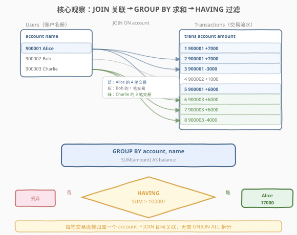
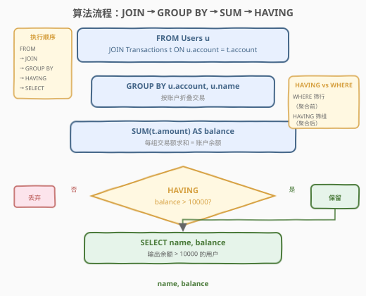
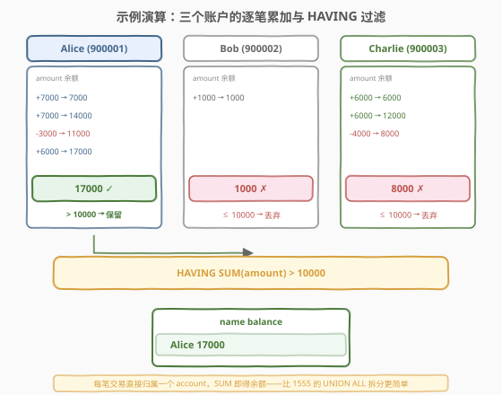

# LeetCode 银行账户概要 II 题解

## 1. 题目概述

- **标题 / 题号**：银行账户概要 II（#1587，easy）
- **链接**：https://leetcode.cn/problems/bank-account-summary-ii/
- **难度**：简单
- **标签**：数据库、SQL、`JOIN`、`GROUP BY`、`SUM`、`HAVING`、聚合后过滤

**题意**：给定 `Users`（账户名册）与 `Transactions`（交易流水）两张表，编写 SQL 查询，报告**余额高于 10000 的所有用户的名字和余额**。账户的余额等于包含该账户的所有交易的总和，所有账户起始余额为 0。

**表结构**：

```text
Table: Users
+--------------+---------+
| Column Name  | Type    |
+--------------+---------+
| account      | int     |  ← 主键
| name         | varchar |
+--------------+---------+
account 是该表的主键。
每行包含一个用户的帐号与名字。
不会有两个用户具有相同的名称。

Table: Transactions
+---------------+---------+
| Column Name   | Type    |
+---------------+---------+
| trans_id      | int     |  ← 主键
| account       | int     |  → Users.account
| amount        | int     |
| transacted_on | date    |
+---------------+---------+
trans_id 是该表主键。
每行包含所有账户的交易改变情况。
收到钱 → amount 为正；转出钱 → amount 为负。
```

**输出列**：`name`、`balance`（余额）。结果无顺序要求。

**示例 1**：

```text
输入：
Users 表:
+------------+------------+
| account    | name       |
+------------+------------+
| 900001     | Alice      |
| 900002     | Bob        |
| 900003     | Charlie    |
+------------+------------+

Transactions 表:
+------------+------------+------------+---------------+
| trans_id   | account    | amount     | transacted_on |
+------------+------------+------------+---------------+
| 1          | 900001     | 7000       | 2020-08-01    |
| 2          | 900001     | 7000       | 2020-08-02    |
| 3          | 900001     | -3000      | 2020-08-03    |
| 4          | 900002     | 1000       | 2020-08-05    |
| 5          | 900001     | 6000       | 2020-08-06    |
| 6          | 900003     | 6000       | 2020-08-07    |
| 7          | 900003     | 6000       | 2020-08-08    |
| 8          | 900003     | -4000      | 2020-08-09    |
+------------+------------+------------+---------------+

输出：
+------------+------------+
| name       | balance    |
+------------+------------+
| Alice      | 17000      |
+------------+------------+
```

**解释**：

| account | name | 交易明细 | 余额计算 | 余额 | $> 10000$? |
|---------|------|----------|----------|------|------------|
| 900001 | Alice | +7000, +7000, −3000, +6000 | $7000 + 7000 - 3000 + 6000$ | $17000$ | ✓ 保留 |
| 900002 | Bob | +1000 | $1000$ | $1000$ | ✗ 丢弃 |
| 900003 | Charlie | +6000, +6000, −4000 | $6000 + 6000 - 4000$ | $8000$ | ✗ 丢弃 |

> 💡 本题是 SQL **"JOIN + GROUP BY + HAVING 聚合过滤招牌题"**——核心三步：① `JOIN` 把 `Users` 与 `Transactions` 按 `account` 关联；② `GROUP BY account` + `SUM(amount)` 算每个账户余额；③ `HAVING SUM(amount) > 10000` 过滤聚合后的结果。难点在于理解 `HAVING` 与 `WHERE` 的区别——`HAVING` 过滤的是**分组聚合后**的结果，`WHERE` 过滤的是**聚合前**的行。

## 2. 解题思路

### 2.1 暴力思路：逐账户累加交易

最直觉的过程式思路：对每个用户，遍历 `Transactions` 表，累加该账户的所有 `amount`，再判断是否 $> 10000$。伪代码：

```text
result = []
for u in Users:
    balance = sum(t.amount for t in Transactions if t.account == u.account)
    if balance > 10000:
        result.append((u.name, balance))
```

逻辑正确，但 SQL 表达「逐行累加」最自然的方式是**分组聚合**——按 `account` 分组后 `SUM`，而非逐行子查询。关键是过滤条件作用于**聚合结果**（`SUM(amount)`），这就需要 `HAVING` 而非 `WHERE`。

### 2.2 核心观察：JOIN 关联 + GROUP BY 求和 + HAVING 过滤



**关键洞察**：本题的 `Transactions` 表每行**直接归属一个 `account`**（不像 1555 题有 `paid_by`/`paid_to` 双向），因此：

1. **`JOIN`** 即可把用户名与交易关联——`Users u JOIN Transactions t ON u.account = t.account`。
2. **`GROUP BY u.account, u.name`** 把同一账户的多笔交易折叠成一组。
3. **`SUM(t.amount)`** 对每组求和 = 该账户余额。
4. **`HAVING SUM(t.amount) > 10000`** 过滤聚合后余额超阈值的组。

> 💡 **为何用 `INNER JOIN` 而非 `LEFT JOIN`？** 题目要找余额 $> 10000$ 的用户。无任何交易的账户余额为 0，不满足 $> 10000$，天然被排除。`INNER JOIN` 只保留有交易的账户，更高效且结果正确。若题目改为「列出所有用户余额（含 0）」，则需 `LEFT JOIN` + `IFNULL(SUM, 0)`。

> ⚠️ **`HAVING` vs `WHERE` 是本题核心考点**：过滤条件 `SUM(amount) > 10000` 作用于**聚合函数结果**，必须在 `HAVING` 中写。若误写 `WHERE SUM(amount) > 10000` 会报错——`WHERE` 在 `GROUP BY` 之前执行，此时 `SUM` 尚未计算。口诀：**筛行用 `WHERE`（聚合前），筛组用 `HAVING`（聚合后）**。

### 2.3 算法流程图



**逻辑执行步骤**：

| 步骤 | 子句 | 作用 |
|------|------|------|
| ① | `FROM Users u JOIN Transactions t ON u.account = t.account` | 关联用户名与交易（INNER JOIN，丢弃无交易账户） |
| ② | `GROUP BY u.account, u.name` | 按账户折叠交易行 |
| ③ | `SUM(t.amount) AS balance` | 每组交易额求和 = 余额 |
| ④ | `HAVING SUM(t.amount) > 10000` | 过滤聚合后余额 $> 10000$ 的组 |
| ⑤ | `SELECT u.name, SUM(t.amount) AS balance` | 输出名与余额 |

> 💡 **SQL 子句执行顺序**：`FROM`（含 `JOIN`/`ON`）→ `WHERE` → `GROUP BY` → `HAVING` → `SELECT` → `ORDER BY` → `LIMIT`。`HAVING` 在 `GROUP BY` 之后、`SELECT` 之前执行，因此能引用聚合函数 `SUM`。理解这个顺序就能明白为何过滤聚合结果必须用 `HAVING`。

### 2.4 示例演算

以示例 1 的 3 个账户、8 笔交易为例，观察「逐笔累加 → 分组求和 → HAVING 过滤」的逐步过程：



**步骤 ①②：JOIN + GROUP BY account**

| account | name | 匹配的交易行 | 折叠后 |
|---------|------|-------------|--------|
| 900001 | Alice | t1(+7000), t2(+7000), t3(−3000), t5(+6000) | 4 行 → 1 组 |
| 900002 | Bob | t4(+1000) | 1 行 → 1 组 |
| 900003 | Charlie | t6(+6000), t7(+6000), t8(−4000) | 3 行 → 1 组 |

**步骤 ③：SUM(amount) AS balance**

| account | name | 求和表达式 | 余额 |
|---------|------|-----------|------|
| 900001 | Alice | $7000 + 7000 - 3000 + 6000$ | $17000$ |
| 900002 | Bob | $1000$ | $1000$ |
| 900003 | Charlie | $6000 + 6000 - 4000$ | $8000$ |

**步骤 ④⑤：HAVING SUM(amount) > 10000**

- Alice $17000 > 10000$ → ✓ 保留
- Bob $1000 \leq 10000$ → ✗ 丢弃
- Charlie $8000 \leq 10000$ → ✗ 丢弃

最终输出 1 行：`(Alice, 17000)`，与示例一致。

> 💡 **余额的动态变化**：Alice 的余额曾达 $14000$（t2 后）、再降至 $11000$（t3 后）、最终回升至 $17000$（t5 后）。但 `SUM` 只看**最终总额**，不关心中间波动——`HAVING` 过滤的是聚合后的终值，与过程中是否曾超过 $10000$ 无关。

## 3. 参考代码

### SQL（解法 A：JOIN + GROUP BY + HAVING，推荐）

```sql
SELECT u.name AS name,
       SUM(t.amount) AS balance
FROM Users u
JOIN Transactions t ON u.account = t.account
GROUP BY u.account, u.name
HAVING SUM(t.amount) > 10000;
```

> 💡 **写法要点**：
> - **`JOIN`（INNER JOIN）**：关联 `Users` 与 `Transactions`，只保留有交易的账户。无交易账户余额为 0，不满足 $> 10000$，丢失无妨。
> - **`GROUP BY u.account, u.name`**：按账户分组。`account` 是主键已唯一，`name` 与 `account` 一一对应（题目保证无重名），同时 `GROUP BY` 是为了满足 SQL 严格模式中「非聚合列必须出现在 `GROUP BY` 中」的要求。
> - **`SUM(t.amount)`**：每组交易额求和 = 账户余额。`amount` 可正可负（收入/支出），`SUM` 自动累加。
> - **`HAVING SUM(t.amount) > 10000`**：过滤聚合后余额超阈值的组。✓ **必须用 `HAVING`**，不可用 `WHERE`。
> - ✓ **最推荐**：一步到位、语义清晰、标准 SQL 通用。

### SQL（解法 B：子查询先聚合再过滤，HAVING 的等价写法）

```sql
SELECT name, balance
FROM (
    SELECT u.name AS name,
           SUM(t.amount) AS balance
    FROM Users u
    JOIN Transactions t ON u.account = t.account
    GROUP BY u.account, u.name
) AS sub
WHERE balance > 10000;
```

> 💡 **解法 B 的思路**：先在子查询中完成 `JOIN + GROUP BY + SUM` 算出每个账户的余额，外层用 `WHERE balance > 10000` 过滤。
>
> **与解法 A 的关系**：逻辑完全等价。子查询中 `SUM` 已计算完毕，`balance` 成为外层的普通列，故可用 `WHERE` 而非 `HAVING`。这正说明 `HAVING` 与 `WHERE` 的区别是**执行时机**——`HAVING` 在聚合后过滤聚合函数，`WHERE` 在聚合前过滤行；若聚合结果已被物化为普通列（子查询），`WHERE` 同样可用。
>
> **可读性**：解法 A 更简洁（一句搞定）；解法 B 层次更分明（先算余额、再过滤），适合复杂查询中需要复用余额中间结果的场景。

### SQL（解法 C：CTE 先建余额表再过滤，推荐复杂场景）

```sql
WITH AccountBalance AS (
    SELECT u.account AS account,
           u.name AS name,
           SUM(t.amount) AS balance
    FROM Users u
    JOIN Transactions t ON u.account = t.account
    GROUP BY u.account, u.name
)
SELECT name, balance
FROM AccountBalance
WHERE balance > 10000;
```

> 💡 **解法 C 的优势**：用 CTE 把「算余额」封装为 `AccountBalance`，主查询聚焦于过滤——**层次最清晰、可读性最佳**。MySQL 8.0+ 支持 CTE，LeetCode 在线判题环境兼容。若后续需要 JOIN 余额表做更多分析（如关联信用额度判透支），CTE 可直接复用。

### Python（pandas）

```python
import pandas as pd

def bank_account_summary_ii(users: pd.DataFrame, transactions: pd.DataFrame) -> pd.DataFrame:
    merged = users.merge(transactions, on='account', how='inner')
    bal = merged.groupby(['account', 'name'], as_index=False)['amount'].sum()
    result = bal[bal['amount'] > 10000]
    return result[['name', 'amount']].rename(columns={'amount': 'balance'})
```

> 💡 **pandas 对照**：
> - `.merge(transactions, on='account', how='inner')`——对应 `INNER JOIN ON account`。
> - `.groupby(['account', 'name'])['amount'].sum()`——对应 `GROUP BY account, name` + `SUM(amount)`。
> - `bal['amount'] > 10000`——对应 `HAVING SUM(amount) > 10000`（pandas 中聚合后即普通列，布尔索引过滤等价 `WHERE`）。
> - `.rename(columns={'amount': 'balance'})`——列名对齐输出要求。

## 4. 复杂度分析

| 维度 | 解法 A（HAVING） | 解法 B（子查询） | 解法 C（CTE） | pandas |
|------|-----------------|-----------------|--------------|--------|
| **时间** | $O(U + T)$ | $O(U + T)$ | $O(U + T)$ | $O(U + T)$ |
| **空间** | $O(U + T)$ | $O(U)$（物化中间表） | $O(U)$（CTE 物化） | $O(U + T)$ |
| **扫表次数** | 各表 1 次 | 各表 1 次 | 各表 1 次 | 各表 1 次 |
| **可读性** | ✓ 简洁 | ✓ 分层 | ✓ **最清晰** | ✓ 清晰 |
| **推荐度** | ✓ **首选** | ✓ 复杂场景 | ✓ 复杂场景 | ✓ 验证用 |

> - $U$ = `Users` 行数，$T$ = `Transactions` 行数
> - **所有解法时间复杂度相同**：`JOIN` 用哈希连接 $O(U + T)$，`GROUP BY` 哈希分组 $O(T)$，`HAVING` 过滤 $O(U)$（分组数 $\leq U$），总体线性。
> - **空间**：解法 A 的中间连接表含 $T$ 行（每笔交易一行），`GROUP BY` 后缩为 $U$ 行；解法 B/C 需额外物化 $U$ 行中间结果。
> - **索引优化**：在 `Transactions(account)` 上建索引可加速 `JOIN`（嵌套循环连接走索引查找），但现代优化器通常用哈希连接，对索引依赖较小。

## 5. 扩展：HAVING vs WHERE 与本题变体

### 5.1 HAVING 与 WHERE 的核心区别

| 维度 | `WHERE` | `HAVING` |
|------|---------|----------|
| **执行时机** | `GROUP BY` 之前 | `GROUP BY` 之后 |
| **过滤对象** | 原始行（聚合前） | 分组（聚合后） |
| **能否用聚合函数** | ✗ 不能 | ✓ 能（`SUM`/`COUNT`/`AVG`/...） |
| **能否用普通列** | ✓ 能 | ✓ 能（但须在 `GROUP BY` 中） |
| **本题用途** | 筛「某笔交易金额 > X」的行 | 筛「账户总余额 > 10000」的组 |

> 💡 **口诀**：`WHERE` 筛行（聚合前），`HAVING` 筛组（聚合后）。过滤条件含聚合函数 → `HAVING`；不含 → `WHERE`。

### 5.2 若题目改为「只统计 2020-08-01 之后的交易余额 > 10000」

```sql
SELECT u.name AS name,
       SUM(t.amount) AS balance
FROM Users u
JOIN Transactions t ON u.account = t.account
WHERE t.transacted_on >= '2020-08-01'   -- 行级过滤 → WHERE
GROUP BY u.account, u.name
HAVING SUM(t.amount) > 10000;            -- 组级过滤 → HAVING
```

> 💡 这里同时用了 `WHERE` 和 `HAVING`：`WHERE` 过滤**交易行**（日期条件，聚合前），`HAVING` 过滤**分组**（余额条件，聚合后）。两者各司其职、不可互换。

### 5.3 与 1555（银行账户概要）的对比

| 维度 | 1587（本题） | 1555（银行账户概要） |
|------|-------------|---------------------|
| **交易结构** | 单向：每行直接归属一个 `account` | 双向：每行有 `paid_by` + `paid_to` |
| **初始额度** | 0（不涉及 `Users` 金额列） | `Users.credit`（需纳入流水） |
| **关联方式** | `JOIN` 即可 | 需 `UNION ALL` 拆成两路 delta |
| **过滤条件** | `HAVING SUM > 10000` | `IF(SUM < 0, 'Yes', 'No')` 判透支 |
| **无交易用户** | 余额 0，天然被 `INNER JOIN` 排除 | 必须含 `Users` 一路保不丢 |
| **难度** | 简单 | 中等 |

> 💡 1555 的难点在于「一次转账拆两条 delta」+「必须包含无交易用户」；1587 无此问题——每笔交易直接归属一个账户，`JOIN + GROUP BY + SUM` 一步到位。1587 是 1555 的**简化版**，适合作为 `HAVING` 入门。

### 5.4 GROUP BY 的列选择

本题 `GROUP BY u.account, u.name`。能否只 `GROUP BY u.account`？

- **MySQL 非严格模式**：可以——MySQL 默认允许 `GROUP BY` 子句中未出现的非聚合列出现在 `SELECT` 中（取分组内任意一行的值）。由于 `name` 与 `account` 一一对应（题目保证无重名），结果正确。
- **MySQL 严格模式（`ONLY_FULL_GROUP_BY`）**：报错——非聚合列 `u.name` 必须出现在 `GROUP BY` 中。
- **标准 SQL**：要求所有非聚合列都在 `GROUP BY` 中。

> ⚠️ **最佳实践**：始终 `GROUP BY` 所有非聚合列，兼容严格模式与标准 SQL。LeetCode 的 MySQL 默认开启 `ONLY_FULL_GROUP_BY`，漏写会直接报错。

## 6. 面试要点

1. **`HAVING` 和 `WHERE` 有什么区别？本题为什么用 `HAVING`？**

   > `WHERE` 在 `GROUP BY` 之前执行，过滤原始行，不能引用聚合函数；`HAVING` 在 `GROUP BY` 之后执行，过滤分组，可以引用聚合函数。本题过滤条件是 `SUM(amount) > 10000`——作用于聚合结果，必须在 `HAVING` 中写。若误写 `WHERE SUM(amount) > 10000` 会报错，因为 `WHERE` 执行时 `SUM` 尚未计算。

2. **为什么用 `INNER JOIN` 而不是 `LEFT JOIN`？**

   > 题目要找余额 $> 10000$ 的用户。无交易的账户余额为 0，不满足阈值，天然被排除。`INNER JOIN` 只保留有交易的账户，结果正确且更高效。若改为「列出所有用户余额」，则需 `LEFT JOIN` + `IFNULL(SUM(t.amount), 0)` 保证无交易用户也在结果中。

3. **`GROUP BY u.account, u.name` 为什么要同时 `GROUP BY` name？**

   > SQL 标准要求 `SELECT` 中的非聚合列必须出现在 `GROUP BY` 中。`u.name` 是非聚合列（不在 `SUM`/`COUNT` 等函数内），必须 `GROUP BY`。MySQL 严格模式（`ONLY_FULL_GROUP_BY`，LeetCode 默认开启）会对此报错。虽然 `name` 与 `account` 一一对应（题目保证无重名），只 `GROUP BY account` 在非严格模式下结果正确，但最佳实践是同时写上以保证兼容性。

4. **如果只统计某日期之后的交易余额，怎么写？**

   > 同时用 `WHERE` 和 `HAVING`：`WHERE t.transacted_on >= '某日期'` 过滤交易行（聚合前），`HAVING SUM(t.amount) > 10000` 过滤分组（聚合后）。`WHERE` 筛行、`HAVING` 筛组，各司其职。详见 5.2 节。

5. **本题与 1555（银行账户概要）有什么区别？**

   > 1587 的交易是**单向**的——每行直接归属一个 `account`，`JOIN + GROUP BY + SUM` 即可算余额。1555 的交易是**双向**的——每行有 `paid_by` 和 `paid_to`，需用 `UNION ALL` 把一次转账拆成两条 delta（付款方 `−amount`、收款方 `+amount`），还要把初始额度 `credit` 纳入流水。1587 是 1555 的简化版，无拆分需求。

> 💡 **一句话总结**：1587 是 SQL **"JOIN + GROUP BY + HAVING 聚合过滤"入门招牌题**——核心模板「`Users JOIN Transactions ON account` → `GROUP BY account, name` → `SUM(amount) AS balance` → `HAVING SUM > 10000`」。最大要点：**过滤聚合结果用 `HAVING` 不用 `WHERE`；`INNER JOIN` 足矣（无交易用户余额 0 不满足阈值）；`GROUP BY` 所有非聚合列兼容严格模式**。

## 同类练习题

| # | 题目 | 与本题的关联 |
|---|------|-------------|
| 1555 | [银行账户概要 🔒](https://leetcode.cn/problems/bank-account-summary/)（[题解](../1501-1600/1555_银行账户概要.md)） | 本题的**双向交易升级版**——需 `UNION ALL` 拆 delta + 含初始额度，对照「单向 JOIN vs 双向 UNION ALL」 |
| 570 | [至少有 5 名直接下属的经理](https://leetcode.cn/problems/managers-with-at-least-5-direct-reports/) | `JOIN` + `GROUP BY` + `HAVING COUNT(*) >= 5`，同为「聚合后过滤」骨架（1587 是 `SUM`，570 是 `COUNT`） |
| 184 | [部门工资最高的员工](https://leetcode.cn/problems/department-highest-salary/) | `JOIN` + `GROUP BY` 取每组最大值，巩固「JOIN 横向补字段 + 聚合」的多表查询范式 |
| 1511 | [消费者下单频率](https://leetcode.cn/problems/customer-order-frequency/)（[题解](../1501-1600/1511_消费者下单频率.md)） | `GROUP BY` + `HAVING` 多条件聚合过滤，1587 的进阶——同时用 `WHERE`（行级）和 `HAVING`（组级） |
| 1068 | [产品销售分析 I](https://leetcode.cn/problems/product-sales-analysis-i/)（[题解](../1001-1100/1068_产品销售分析I.md)） | `INNER JOIN` 关联 + 分组聚合，巩固「JOIN + GROUP BY + SUM」基础骨架 |
