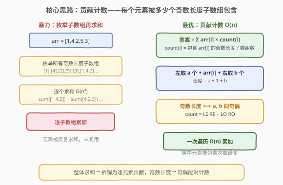
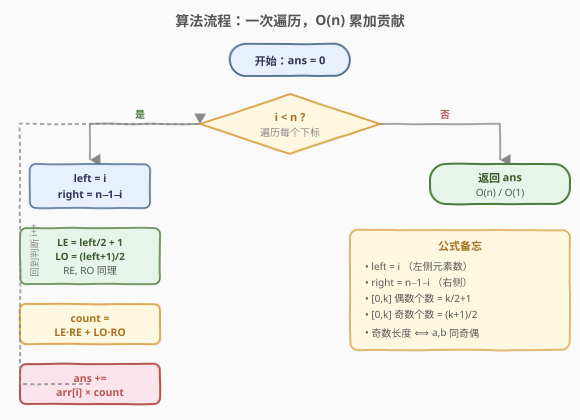
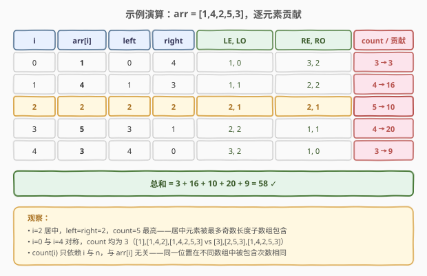

# 所有奇数长度子数组的和

- **题目名称**：所有奇数长度子数组的和
- **链接**：[1588. 所有奇数长度子数组的和](https://leetcode.cn/problems/sum-of-all-odd-length-subarrays/)
- **难度**：简单
- **标签**：数组、前缀和、数学、贡献计数

## 1. 题目概述

给定一个**正整数**数组 `arr`，返回数组中**所有奇数长度非空连续子数组**的元素之和。

**示例 1**：

```text
输入：arr = [1,4,2,5,3]
输出：58
解释：所有奇数长度子数组及各自之和：
      长度 1: [1]+[4]+[2]+[5]+[3] = 15
      长度 3: [1,4,2]+[4,2,5]+[2,5,3] = 7+11+10 = 28
      长度 5: [1,4,2,5,3] = 15
      总和 = 15 + 28 + 15 = 58
```

**示例 2**：

```text
输入：arr = [1,2]
输出：3
解释：奇数长度子数组只有 [1] 和 [2]，和 = 3
```

**示例 3**：

```text
输入：arr = [10,11,12]
输出：66
解释：[10]+[11]+[12]+[10,11,12] = 10+11+12+33 = 66
```

**约束条件**：

- `1 <= arr.length <= 100`
- `1 <= arr[i] <= 1000`

> ⚠️ 注意两点：① 子数组**必须连续**且**非空**；② 只统计**奇数长度**（1, 3, 5, …）的子数组。`n ≤ 100` 较小，三重循环暴力也能过，但有更优雅的 $O(n)$ 数学解法。

---

## 2. 解题思路

### 2.1 暴力思路：枚举所有奇数长度子数组

最直接的做法：枚举子数组起点 `i`、终点 `j`，若长度 `j - i + 1` 为奇数则累加其和。

```text
for i in 0..n-1:
    for j in i..n-1 step 2:      // j-i 为偶数，长度为奇数
        累加 arr[i..j] 的和
```

> ⚠️ **复杂度**：枚举 $O(n^2)$ 个子数组，每个求和 $O(n)$，总时间 $O(n^3)$，空间 $O(1)$。`n = 100` 时约 $10^6$ 次操作，能 AC，但**没有利用「每个元素被多个子数组共享」的结构**。

**优化 1（前缀和）**：预处理前缀和 $P$，则 `arr[i..j]` 的和 $= P[j+1] - P[i]$，$O(1)$ 取得，总时间降到 $O(n^2)$。

**优化 2（贡献计数）**：与其枚举子数组再求和，不如换视角——**枚举每个元素，看它被多少个奇数长度子数组包含**。元素 `arr[i]` 对答案的贡献为 $\text{arr}[i] \times \text{count}(i)$，其中 $\text{count}(i)$ 是包含 `arr[i]` 的奇数长度子数组个数。

### 2.2 核心观察：贡献计数 + 奇偶配对



固定下标 `i`，包含 `arr[i]` 的子数组 $[l, r]$ 必须满足 $l \le i \le r$。其长度为 $r - l + 1$，**长度为奇数 ⟺ $r - l$ 为偶数 ⟺ $l$ 与 $r$ 奇偶性相同**。

换一种等价描述更便于计数：子数组由「`i` 左侧取 $a$ 个元素 + `arr[i]` 本身 + `i` 右侧取 $b$ 个元素」组成，其中：

- $a \in [0, \text{left}]$，$\text{left} = i$（`i` 左侧元素总数）
- $b \in [0, \text{right}]$，$\text{right} = n - 1 - i$（`i` 右侧元素总数）
- 子数组长度 $= a + 1 + b$，**为奇数 ⟺ $a + b$ 为偶数 ⟺ $a, b$ 同奇偶**

> 💡 **关键转换**：「子数组长度为奇数」等价于「左右各取的元素数 $a, b$ **同奇同偶**」。于是把「数子数组个数」归约为「数同奇偶的 $(a, b)$ 对数」。

在 $[0, \text{left}]$ 中：

- 偶数的个数 $= \lfloor \text{left} / 2 \rfloor + 1$，记为 $\text{LE}$
- 奇数的个数 $= \lfloor (\text{left} + 1) / 2 \rfloor$，记为 $\text{LO}$

在 $[0, \text{right}]$ 中：

- 偶数的个数 $= \lfloor \text{right} / 2 \rfloor + 1$，记为 $\text{RE}$
- 奇数的个数 $= \lfloor (\text{right} + 1) / 2 \rfloor$，记为 $\text{RO}$

合法 $(a, b)$ 对数 $=$（$a$ 偶且 $b$ 偶）$+$（$a$ 奇且 $b$ 奇）：

$$\text{count}(i) = \text{LE} \cdot \text{RE} + \text{LO} \cdot \text{RO}$$

最终答案：

$$\text{ans} = \sum_{i=0}^{n-1} \text{arr}[i] \cdot \text{count}(i)$$

> 💡 **直观理解**：把每个奇数长度子数组的和「拆」到它包含的每个元素上。每个元素 `arr[i]` 被算了 $\text{count}(i)$ 次，加总后等价于原问题。这是「**整体求和拆解为逐元素贡献**」的经典套路。

### 2.3 算法流程图



### 2.4 示例演算

以 `arr = [1,4,2,5,3]`（$n = 5$）为例，逐下标套用公式：



| $i$ | $\text{arr}[i]$ | $\text{left}=i$ | $\text{right}=4-i$ | $\text{LE}, \text{LO}$ | $\text{RE}, \text{RO}$ | $\text{count}(i)$ | 贡献 |
|-----|-----------------|------------------|---------------------|------------------------|------------------------|--------------------|------|
| 0 | 1 | 0 | 4 | 1, 0 | 3, 2 | $1{\cdot}3 + 0{\cdot}2 = 3$ | 3 |
| 1 | 4 | 1 | 3 | 1, 1 | 2, 2 | $1{\cdot}2 + 1{\cdot}2 = 4$ | 16 |
| 2 | 2 | 2 | 2 | 2, 1 | 2, 1 | $2{\cdot}2 + 1{\cdot}1 = 5$ | 10 |
| 3 | 5 | 3 | 1 | 2, 2 | 1, 1 | $2{\cdot}1 + 2{\cdot}1 = 4$ | 20 |
| 4 | 3 | 4 | 0 | 3, 2 | 1, 0 | $3{\cdot}1 + 2{\cdot}0 = 3$ | 9 |

总和 $= 3 + 16 + 10 + 20 + 9 = 58$，与示例 1 一致 ✓。

> 💡 验证 $i = 0$：包含 `arr[0]=1` 的奇数长度子数组有 `[1]`、`[1,4,2]`、`[1,4,2,5,3]`，共 3 个，与公式结果一致。中间下标 `i = 2` 被包含得最多（5 个），符合「居中元素被更多子数组覆盖」的直觉。

---

## 3. 参考代码

### 方法一：贡献计数（推荐，$O(n)$）

### C++

```cpp
class Solution {
  public:
    int sumOddLengthSubarrays(vector<int>& arr) {
        int n = arr.size();
        int ans = 0;
        for (int i = 0; i < n; ++i) {
            int left = i, right = n - 1 - i;
            int LE = left / 2 + 1;             // [0, left] 中偶数个数
            int LO = (left + 1) / 2;           // [0, left] 中奇数个数
            int RE = right / 2 + 1;            // [0, right] 中偶数个数
            int RO = (right + 1) / 2;          // [0, right] 中奇数个数
            int count = LE * RE + LO * RO;     // 包含 arr[i] 的奇数长度子数组个数
            ans += arr[i] * count;
        }
        return ans;
    }
};
```

### Python

```python
class Solution:
    def sumOddLengthSubarrays(self, arr: List[int]) -> int:
        n = len(arr)
        ans = 0
        for i, x in enumerate(arr):
            left, right = i, n - 1 - i
            LE = left // 2 + 1       # [0, left] 中偶数个数
            LO = (left + 1) // 2     # [0, left] 中奇数个数
            RE = right // 2 + 1      # [0, right] 中偶数个数
            RO = (right + 1) // 2    # [0, right] 中奇数个数
            count = LE * RE + LO * RO
            ans += x * count
        return ans
```

> 💡 **整型范围**：$n \le 100$，$\text{count}(i) \le \lceil n/2 \rceil^2 \le 2500$，$\text{arr}[i] \le 1000$，单点贡献 $\le 2.5 \times 10^6$，总和 $\le 2.5 \times 10^8$，用 `int` 即可（C++ `int` 至少 $2.1 \times 10^9$），无需 `long long`。

---

## 4. 复杂度分析

| 维度 | 复杂度 | 说明 |
|------|--------|------|
| 时间复杂度 | $O(n)$ | 一次遍历，每个下标 $O(1)$ 计算贡献 |
| 空间复杂度 | $O(1)$ | 仅常数变量，无额外数组 |

> 💡 对比暴力 $O(n^3)$ 与前缀和 $O(n^2)$：$n = 100$ 时三者都能过，但 $O(n)$ 解法把「奇数长度」这一约束转化为「奇偶配对计数」，是面试中展现数学洞察的加分项。若数组规模扩到 $10^5$，只有 $O(n)$ 可行。

---

## 5. 扩展：前缀和 $O(n^2)$ 与暴力 $O(n^3)$

### 5.1 前缀和 $O(n^2)$

预处理前缀和后，外层枚举长度 `len = 1, 3, 5, ...`（奇数），内层枚举起点 `i`，$O(1)$ 取子数组和。

### C++

```cpp
class Solution {
  public:
    int sumOddLengthSubarrays(vector<int>& arr) {
        int n = arr.size();
        vector<int> P(n + 1, 0);
        for (int i = 0; i < n; ++i) P[i + 1] = P[i] + arr[i];
        int ans = 0;
        for (int len = 1; len <= n; len += 2)        // 只枚举奇数长度
            for (int i = 0; i + len <= n; ++i)
                ans += P[i + len] - P[i];
        return ans;
    }
};
```

### Python

```python
class Solution:
    def sumOddLengthSubarrays(self, arr: List[int]) -> int:
        n = len(arr)
        P = [0] * (n + 1)
        for i in range(n):
            P[i + 1] = P[i] + arr[i]
        ans = 0
        for length in range(1, n + 1, 2):     # 只枚举奇数长度
            for i in range(n - length + 1):
                ans += P[i + length] - P[i]
        return ans
```

### 5.2 暴力 $O(n^3)$

最朴素：三重循环枚举 `(i, j)` 并内层求和。

### C++

```cpp
class Solution {
  public:
    int sumOddLengthSubarrays(vector<int>& arr) {
        int n = arr.size();
        int ans = 0;
        for (int i = 0; i < n; ++i)
            for (int j = i; j < n; j += 2)    // j-i 为偶数 → 长度奇数
                for (int k = i; k <= j; ++k)
                    ans += arr[k];
        return ans;
    }
};
```

### Python

```python
class Solution:
    def sumOddLengthSubarrays(self, arr: List[int]) -> int:
        n = len(arr)
        ans = 0
        for i in range(n):
            for j in range(i, n, 2):          # j-i 为偶数 → 长度奇数
                ans += sum(arr[i:j + 1])
        return ans
```

| 维度 | 暴力 $O(n^3)$ | 前缀和 $O(n^2)$ | 贡献计数 $O(n)$ |
|------|---------------|-----------------|------------------|
| 时间 | $O(n^3)$ | $O(n^2)$ | $O(n)$ |
| 空间 | $O(1)$ | $O(n)$ | $O(1)$ |
| $n = 100$ 实测 | 能过（$\sim 10^6$） | 能过（$\sim 5 \times 10^3$） | **最优**（$\sim 100$） |
| 可读性 | 最直观 | 直观 | 需推导奇偶配对公式 |

> 💡 **面试建议**：先讲暴力（展示对题意的准确理解），再前缀和优化（展示「以空间换时间」的经典套路），最后抛出贡献计数 $O(n)$（展示数学洞察与「整体拆解为局部贡献」的思维）。三步递进是面试加分的标准节奏。

---

## 6. 面试要点

1. **为什么贡献计数是对的？每个元素被算了几次？**

   - 奇数长度子数组的总和 $= \sum_{\text{子数组 } S} \sum_{x \in S} x$。交换求和顺序 $= \sum_{i} \text{arr}[i] \cdot |\{S : i \in S, |S| \text{ 奇}\}|$。即每个元素乘以「包含它的奇数长度子数组个数」再累加——这就是贡献计数的数学依据。

2. **「奇数长度」如何转化为可计数的奇偶配对？**

   - 包含 `arr[i]` 的子数组由「左侧取 $a$ 个 + 右侧取 $b$ 个」构成，长度 $= a + b + 1$。**长度为奇 ⟺ $a + b$ 为偶 ⟺ $a, b$ 同奇偶**。于是合法对数 $=$ 左偶×右偶 + 左奇×右奇，每项都是 $O(1)$ 可算的整数。

3. **`left = i`、`right = n - 1 - i` 的含义？**

   - `left` 是 `i` 左侧元素个数（可取 $0$ 到 `i` 个），`right` 是 `i` 右侧元素个数（可取 $0$ 到 `n-1-i` 个）。两者与下标 `i` 的对称关系使公式简短易记：居中元素 `left ≈ right`，被包含次数最多。

4. **为什么 $[0, k]$ 中偶数个数是 $k/2 + 1$、奇数个数是 $(k+1)/2$？**

   - $[0, k]$ 共 $k+1$ 个整数。偶数从 $0$ 开始，步长 $2$，共 $\lfloor k/2 \rfloor + 1$ 个；奇数从 $1$ 开始，共 $\lfloor (k+1)/2 \rfloor$ 个。两者之和 $= k + 1$，可作自检。

5. **如果题目改成「偶数长度子数组的和」怎么做？**

   - 思路完全对称：包含 `arr[i]` 的偶数长度子数组个数 $=$ 左偶×右奇 + 左奇×右偶（$a, b$ 异奇偶）。或者直接用「所有子数组之和 − 奇数长度之和」——前者每个 `arr[i]` 被包含 $(i+1)(n-i)$ 次。

---

## 7. 同类练习题

- [238. 除自身以外数组的乘积](https://leetcode.cn/problems/product-of-array-except-self/)：另一经典「贡献」视角——每个位置的乘积 = 左侧乘积 × 右侧乘积，与本题「左右各取若干元素」的对称计数同源
- [303. 区域和检索 - 数组不可变](https://leetcode.cn/problems/range-sum-query-immutable/)：前缀和模板题，本题 $O(n^2)$ 解法的前置基础
- [560. 和为 K 的子数组](https://leetcode.cn/problems/subarray-sum-equals-k/)：前缀和 + 哈希统计子数组，子数组计数家族的另一代表
- [1248. 统计「优美子数组」](https://leetcode.cn/problems/count-number-of-nice-subarrays/)：恰好 K 个奇数的子数组计数，与本题「按奇偶性筛选子数组」思想同源，可用「至多 K」转化
- [1352. 最后 K 个数的乘积](https://leetcode.cn/problems/product-of-the-last-k-numbers/)：前缀积 + 倒序查询，前缀思想在乘法上的对应
