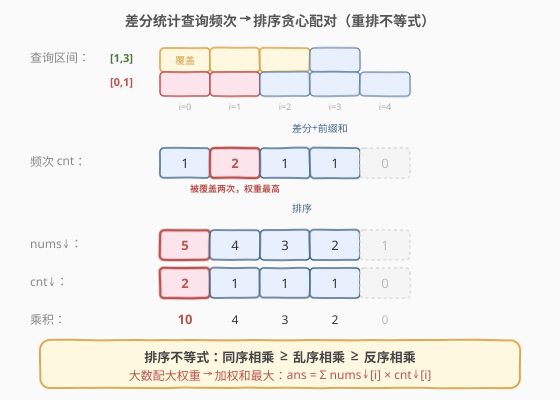
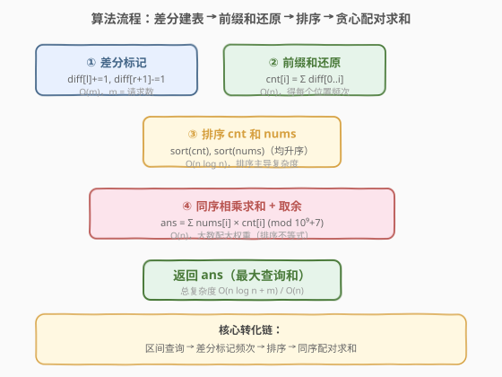
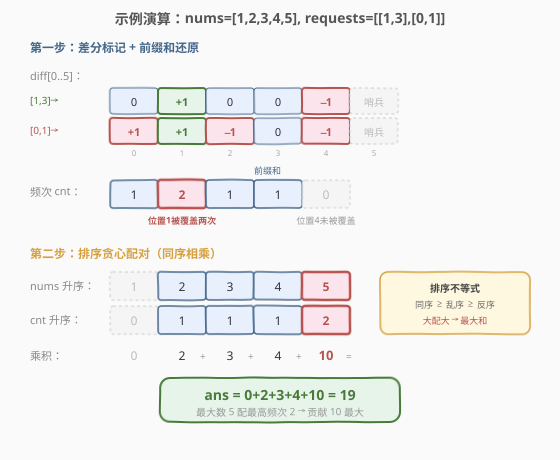

# 所有排列中的最大和

- **题目名称**：所有排列中的最大和
- **链接**：[1589. 所有排列中的最大和](https://leetcode.cn/problems/maximum-sum-obtained-of-any-permutation/)
- **难度**：中等
- **标签**：贪心、数组、差分数组、排序、前缀和

## 1. 题目概述

有一个整数数组 `nums` 和一个查询数组 `requests`，其中 `requests[i] = [starti, endi]`。第 `i` 个查询求 `nums[starti] + nums[starti + 1] + ... + nums[endi]` 的结果（下标从 0 开始）。你可以**任意排列** `nums` 中的数字，求所有查询结果之和的**最大值**。答案对 $10^9 + 7$ 取余。

**示例 1**：

```text
输入：nums = [1,2,3,4,5], requests = [[1,3],[0,1]]
输出：19
解释：排列 [3,5,4,2,1] 时：
  requests[0] -> nums[1] + nums[2] + nums[3] = 5 + 4 + 2 = 11
  requests[1] -> nums[0] + nums[1] = 3 + 5 = 8
  总和 = 11 + 8 = 19
```

**示例 2**：

```text
输入：nums = [1,2,3,4,5,6], requests = [[0,1]]
输出：11
解释：排列 [6,5,4,3,2,1]，查询和为 6 + 5 = 11
```

**示例 3**：

```text
输入：nums = [1,2,3,4,5,10], requests = [[0,2],[1,3],[1,1]]
输出：47
解释：排列 [4,10,5,3,2,1]，查询结果分别为 [19, 18, 10]
```

**约束条件**：

- `n == nums.length`
- `1 <= n <= 10^5`
- `0 <= nums[i] <= 10^5`
- `1 <= requests.length <= 10^5`
- `requests[i].length == 2`
- `0 <= starti <= endi < n`

> ⚠️ 关键信号：可以任意排列 `nums`，且查询是**区间求和**——这意味着每个位置被查询的**次数**决定了该位置放多大数的收益。把大数放在被查询次数最多的位置，贪心即最优。

---

## 2. 解题思路

### 2.1 暴力思路：枚举所有排列？

`n = 10^5` 时排列数是 $n!$，天文数字，完全不可行。即使 `n` 很小，逐个排列枚举也无意义——我们需要找到**哪种放置策略最优**，而非试遍每种放置。

> 💡 转换视角：不要想"怎么排"，而要想"每个位置被查询了几次"。把每个位置的查询次数 `cnt[i]` 算出来后，总和就是 $\sum \text{nums}[i] \times \text{cnt}[i]$——一个**加权和**。要让加权和最大，自然用**排序贪心**：大数配大权重。

### 2.2 核心观察：差分数组统计频次 + 排序贪心



整个解法分两步：

**第一步：统计每个位置被查询的次数。**

每个查询 `[starti, endi]` 是一个闭区间，把区间内每个位置的计数 +1。这正是**差分数组**的招牌场景：对 `diff[starti] += 1`、`diff[endi + 1] -= 1`，最后前缀和还原即得 `cnt[i]`。

> 💡 这与 [370. 区间加法](../0301-0400/370_区间加法.md)、[1109. 航班预订统计](../1101-1200/1109_航班预订统计.md) 完全同构——都是「离线区间加 + 一次性还原」。本题的 `inc` 恒为 1。

**第二步：排序贪心——大数配大权重。**

把 `cnt` 数组降序排列、`nums` 数组也降序排列，然后逐位相乘求和。这就是经典的**排序不等式（重排不等式）**：

$$\text{ans} = \sum_{i=0}^{n-1} \text{nums}_{\downarrow}[i] \times \text{cnt}_{\downarrow}[i]$$

> 💡 **排序不等式**：对于两个序列 $a$ 和 $b$，**同序相乘之和 $\ge$ 乱序相乘之和 $\ge$ 反序相乘之和**。因此把最大的 `nums` 配最大的 `cnt`、次大配次大……必然取得最大加权和。这是贪心策略正确性的数学保证。

### 2.3 算法流程图



### 2.4 示例演算

以示例 1 `nums = [1,2,3,4,5]`, `requests = [[1,3],[0,1]]` 为例：



**第一步：差分数组统计频次**

| 步骤 | 操作 | diff[0] | diff[1] | diff[2] | diff[3] | diff[4] | diff[5] |
|------|------|---------|---------|---------|---------|---------|---------|
| 初始 | — | 0 | 0 | 0 | 0 | 0 | 0 |
| 1 | 查询 [1,3]：diff[1]+=1, diff[4]-=1 | 0 | 1 | 0 | 0 | −1 | 0 |
| 2 | 查询 [0,1]：diff[0]+=1, diff[2]-=1 | 1 | 1 | −1 | 0 | −1 | 0 |

前缀和还原 `cnt`：

| 位置 | 0 | 1 | 2 | 3 | 4 |
|------|---|---|---|---|---|
| cnt  | 1 | 2 | 1 | 1 | 0 |

> 💡 位置 1 被 [1,3] 和 [0,1] 两次查询覆盖，频次最高为 2；位置 4 不被任何查询覆盖，频次为 0。

**第二步：排序贪心配对**

| nums 降序 | 5 | 4 | 3 | 2 | 1 |
|-----------|---|---|---|---|---|
| cnt 降序 | 2 | 1 | 1 | 1 | 0 |
| 乘积 | 10 | 4 | 3 | 2 | 0 |

总和 = $10 + 4 + 3 + 2 + 0 = 19$，与示例输出一致。

> 💡 频次为 0 的位置（如位置 4）无论放什么数贡献都是 0，所以把最小的数放那里即可——排序贪心自然处理了这种情况。

---

## 3. 参考代码

### C++

```cpp
class Solution {
  public:
    int maxSumRangeQuery(vector<int>& nums, vector<vector<int>>& requests) {
        int n = nums.size();
        vector<int> diff(n + 1, 0);

        for (auto& req : requests) {
            int l = req[0], r = req[1];
            diff[l] += 1;
            diff[r + 1] -= 1;
        }

        vector<int> cnt(n);
        int cur = 0;
        for (int i = 0; i < n; ++i) {
            cur += diff[i];
            cnt[i] = cur;
        }

        sort(cnt.begin(), cnt.end());
        sort(nums.begin(), nums.end());

        long long ans = 0;
        const int MOD = 1e9 + 7;
        for (int i = 0; i < n; ++i) {
            ans = (ans + (long long)nums[i] * cnt[i]) % MOD;
        }
        return ans;
    }
};
```

### Python

```python
class Solution:
    def maxSumRangeQuery(self, nums: List[int], requests: List[List[int]]) -> int:
        n = len(nums)
        diff = [0] * (n + 1)

        for l, r in requests:
            diff[l] += 1
            diff[r + 1] -= 1

        cnt = []
        cur = 0
        for i in range(n):
            cur += diff[i]
            cnt.append(cur)

        cnt.sort()
        nums.sort()

        MOD = 10**9 + 7
        ans = 0
        for i in range(n):
            ans = (ans + nums[i] * cnt[i]) % MOD
        return ans
```

> 💡 **实现要点**：① `diff` 开到 `n + 1`，因为 `r + 1` 最大可达 `n`（当 `r = n - 1` 时），与 370 题完全一致；② `cnt` 和 `nums` 都**升序**排列后同序相乘——升序的同序配对等价于降序的同序配对，结果相同；③ 乘积用 `long long` 中间运算避免溢出，每步取余。

---

## 4. 复杂度分析

| 维度 | 复杂度 | 说明 |
|------|--------|------|
| 时间复杂度 | $O(n \log n + m)$ | 差分标记 $O(m)$（$m$ = 请求数），前缀和还原 $O(n)$，排序 $O(n \log n)$，求和 $O(n)$，排序主导 |
| 空间复杂度 | $O(n)$ | 差分数组 $n + 1$ 与频次数组 $n$（可原地复用 `diff` 做 `cnt`） |

> 💡 本题 $n, m \le 10^5$，$n \log n \approx 1.7 \times 10^6$，远在时限内。差分把 $m$ 次区间标记从暴力的 $O(m \cdot n)$ 压缩到 $O(m + n)$，是本题能过的关键。

---

## 5. 扩展：排序不等式与重排贪心

本题的贪心本质是**排序不等式**（也叫**重排不等式**）的直接应用：

> 设 $a_1 \le a_2 \le \dots \le a_n$，$b_1 \le b_2 \le \dots \le b_n$，则对任意排列 $\sigma$：
> $$\sum_{i=1}^{n} a_i b_{n+1-i} \le \sum_{i=1}^{n} a_i b_{\sigma(i)} \le \sum_{i=1}^{n} a_i b_i$$
> 即**同序 $\ge$ 乱序 $\ge$ 反序**。

**直觉理解**：大数乘大数"放大"的效果最强——把 100 配给权重 10 得 1000，配给权重 1 才得 100。因此要让加权和最大，就把每对都做成"大配大"。

**常见变体**：

| 题型 | 策略 | 代表题 |
|------|------|--------|
| 加权和最大 | 同序配对（大配大） | 本题 1589 |
| 加权和最小 | 反序配对（大配小） | [396. 旋转函数](https://leetcode.cn/problems/rotate-function/) |
| 总代价最小 | 反序配对 | 装箱/调度问题 |

> 💡 看到「任意排列 + 求加权和最值」这一组合，第一反应就是排序不等式——先算权重，再排序配对。

---

## 6. 面试要点

1. **为什么大数配高频位置一定最优？**

   - 由**排序不等式**：两个序列同序相乘之和 $\ge$ 任意乱序相乘之和。把 `nums` 和 `cnt` 都降序排列后逐位相乘，取得最大加权和。这是数学保证，不需要复杂的贪心证明。

2. **怎么高效统计每个位置被查询的次数？**

   - 用**差分数组**：每个查询 `[l, r]` 转化为 `diff[l] += 1`、`diff[r + 1] -= 1`，$O(1)$ 标记。所有查询处理完后做一次前缀和还原 `cnt`。总时间 $O(m + n)$，远优于暴力的 $O(m \cdot n)$。

3. **差分数组为什么开到 `n + 1`？**

   - 本题 0-indexed，`r + 1` 最大可达 `n`（当 `r = n - 1` 时）。开 `n + 1` 保证 `diff[r + 1] -= 1` 不越界。下标 `n` 处的值在还原 `cnt[0..n-1]` 时不写入答案，仅承接最后一个 `-1`。与 [370. 区间加法](../0301-0400/370_区间加法.md) 完全一致。

4. **为什么升序排列后同序相乘也对？**

   - 升序序列的同序配对（最小配最小、最大配最大）与降序序列的同序配对（最大配最大、最小配最小）是**同一个配对方案**——只是遍历方向不同。两种写法结果完全一致，升序更方便因为直接 `sort` 即可。

5. **取余有什么注意点？**

   - `nums[i] * cnt[i]` 最大可达 $10^5 \times 10^5 = 10^{10}$，超过 32 位 `int` 范围。C++ 中必须转 `long long` 再乘，每步取余。Python 整数任意精度，末步取余即可。

---

## 7. 同类练习题

- [370. 区间加法](https://leetcode.cn/problems/range-addition/)（[题解](../0301-0400/370_区间加法.md)）：差分数组母题——多个区间加后还原数组，本题第一步（统计频次）的模板来源
- [1109. 航班预订统计](https://leetcode.cn/problems/corporate-flight-bookings/)（[题解](../1101-1200/1109_航班预订统计.md)）：差分数组 1-indexed 版本，与本题第一步完全同构
- [1094. 拼车](https://leetcode.cn/problems/car-pooling/)：差分数组判断任意时刻人数是否超容，区间加后取前缀和最大值
- [396. 旋转函数](https://leetcode.cn/problems/rotate-function/)：排序不等式的反序配对求最小值，与本题同源但方向相反
- [1833. 雪糕的最大数量](https://leetcode.cn/problems/maximum-ice-cream-bars/)：排序贪心求最大数量，与本题共享「排序后贪心选取」的核心思想
