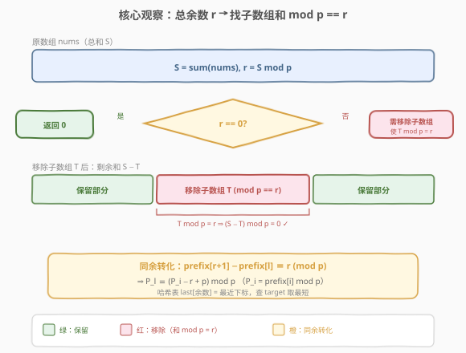
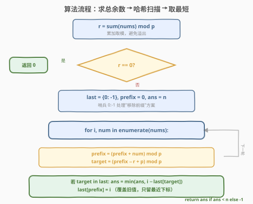
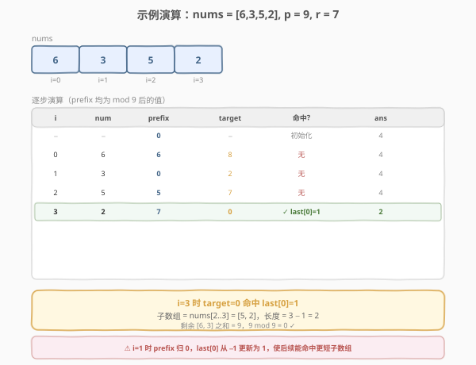

# LeetCode 使数组和能被P整除 题解

## 1. 题目概述

- **标题 / 题号**：使数组和能被 P 整除（#1590，medium）
- **链接**：https://leetcode.cn/problems/make-sum-divisible-by-p/
- **难度**：中等
- **标签**：数组、哈希表、前缀和、同余定理

**题意**：给定一个正整数数组 `nums` 和一个正整数 `p`，要求移除**最短**的子数组（可以为空），使得剩余元素之和能被 `p` 整除。**不允许移除整个数组**。返回需要移除的最短子数组长度，无法满足则返回 `-1`。

**示例 1**：

```text
输入：nums = [3,1,4,2], p = 6
输出：1
解释：总和 10，10 % 6 = 4 ≠ 0。移除子数组 [4]，剩余 [3,1,2] 之和为 6，能被 6 整除。
```

**示例 2**：

```text
输入：nums = [6,3,5,2], p = 9
输出：2
解释：总和 16，16 % 9 = 7 ≠ 0。移除子数组 [5,2]，剩余 [6,3] 之和为 9。
```

**示例 3**：

```text
输入：nums = [1,2,3], p = 3
输出：0
解释：总和 6，6 % 3 = 0，已能整除，无需移除。
```

**示例 4**：

```text
输入：nums = [1,2,3], p = 7
输出：-1
解释：总和 6，6 % 7 = 6。唯一和 % 7 == 6 的子数组是整个数组 [1,2,3]，但不允许移除整个数组，故返回 -1。
```

**约束**：

- $1 \le \text{nums.length} \le 10^5$
- $1 \le \text{nums[i]} \le 10^9$
- $1 \le p \le 10^9$

## 2. 解题思路

### 2.1 暴力思路：枚举所有子数组

枚举所有 $O(n^2)$ 个子数组 $[l, r]$，计算其和并对 $p$ 取余，若等于总余数则更新最短长度。时间复杂度 $O(n^2)$（即使配合前缀和），$n = 10^5$ 时不可接受。

> 💡 转换视角：不要枚举子数组，而要利用**同余定理**把"子数组和的余数"转化为"两个前缀和余数之差"。

### 2.2 核心观察：前缀和 + 同余定理



**第一步：问题转化。** 设总和为 $S$，令 $r = S \bmod p$。

- 若 $r = 0$，总和已能被 $p$ 整除，直接返回 $0$。
- 若 $r \ne 0$，需要移除一个子数组，使其和 $T$ 满足 $T \bmod p = r$。这样剩余和 $S - T \equiv r - r \equiv 0 \pmod p$。

**第二步：同余转化。** 引入前缀和 $\text{prefix}[i] = \sum_{k=0}^{i-1} \text{nums}[k]$（$\text{prefix}[0] = 0$）。子数组 $\text{nums}[l..r]$ 的和为 $\text{prefix}[r+1] - \text{prefix}[l]$。令 $P_i = \text{prefix}[i] \bmod p$，则：

$$
(\text{prefix}[r+1] - \text{prefix}[l]) \bmod p = r \iff P_l \equiv (P_{r+1} - r + p) \bmod p
$$

> ⚠️ 即对每个右端点 $i = r+1$，需要找到**最大的**左端点下标 $l < i$，使得 $P_l = (P_i - r + p) \bmod p$。$l$ 越大，子数组 $[l, i-1]$ 越短。

**第三步：哈希表存最近下标。** 用哈希表 `last` 记录每个前缀余数**最近一次出现的下标**。扫描时对每个 $i$，查 `target = (P_i - r + p) % p` 是否在表中，若在则用 $i - \text{last}[\text{target}]$ 更新答案（子数组长度），然后更新 `last[P_i] = i`。

> 💡 **为何存"最近"而非"最早"？** 我们要**最小化**子数组长度 $i - l$，即**最大化** $l$。因此对同一余数只保留最新下标，覆盖旧值即可——这与 [974. 和可被K整除的子数组](https://leetcode.cn/problems/subarray-sums-divisible-by-k/) 恰好相反：974 要**计数**所以存最早下标无意义（用计数法），本题要**最短长度**所以存最近下标。

### 2.3 算法流程图



### 2.4 示例演算

以**示例 2** `nums = [6,3,5,2]`, `p = 9` 为例。总和 $S = 16$，$r = 16 \bmod 9 = 7$。



初始 `last = {0: -1}`，`prefix = 0`，`ans = 4`（数组长度）。

| 步骤 | i | nums[i] | prefix (mod 9) | target = (prefix−7+9) % 9 | last 中有? | 子数组长度 | ans | 更新 last |
|------|---|---------|----------------|--------------------------|-----------|-----------|-----|-----------|
| 0 | — | — | 0 | — | — | — | 4 | {0:−1} |
| 1 | 0 | 6 | 6 | (6−7+9)%9 = 8 | 无 | — | 4 | {0:−1, 6:0} |
| 2 | 1 | 3 | 0 | (0−7+9)%9 = 2 | 无 | — | 4 | {0:1, 6:0} |
| 3 | 2 | 5 | 5 | (5−7+9)%9 = 7 | 无 | — | 4 | {0:1, 6:0, 5:2} |
| 4 | 3 | 2 | 7 | (7−7+9)%9 = 0 | 有，last[0]=1 | 3−1 = 2 | **2** | {0:1, 6:0, 5:2, 7:3} |

最终 `ans = 2 < 4`，返回 `2`。对应的移除子数组为 `nums[2..3] = [5,2]`，剩余 `[6,3]` 之和为 $9$，能被 $9$ 整除。

> 💡 **注意步骤 2**：`prefix` 变为 $0$ 后，`last[0]` 从 $-1$ 更新为 $1$。这步很关键——后续若 `target = 0`，将用最新的 $l = 1$ 得到更短的子数组，而非 $l = -1$（那会移除整个前缀导致答案偏大甚至非法）。

## 3. 参考代码

### C++

```cpp
class Solution {
  public:
    int minSubarray(vector<int>& nums, int p) {
        long long r = 0;
        for (int num : nums) r = (r + num) % p;
        if (r == 0) return 0;

        unordered_map<long long, int> last;
        last[0] = -1;
        long long prefix = 0;
        int n = nums.size();
        int ans = n;
        for (int i = 0; i < n; ++i) {
            prefix = (prefix + nums[i]) % p;
            long long target = (prefix - r + p) % p;
            auto it = last.find(target);
            if (it != last.end())
                ans = min(ans, i - it->second);
            last[prefix] = i;
        }
        return ans < n ? ans : -1;
    }
};
```

### Python

```python
class Solution:
    def minSubarray(self, nums: List[int], p: int) -> int:
        r = sum(nums) % p
        if r == 0:
            return 0

        last = {0: -1}
        prefix = 0
        n = len(nums)
        ans = n
        for i, num in enumerate(nums):
            prefix = (prefix + num) % p
            target = (prefix - r) % p
            if target in last:
                ans = min(ans, i - last[target])
            last[prefix] = i
        return ans if ans < n else -1
```

> 💡 **代码要点**：
> - 用 `long long` 累加，避免 `nums[i]` 高达 $10^9$ 时 `int` 溢出（总和可达 $10^{14}$）。
> - Python 的 `%` 对负数自然返回非负结果，C++ 需 `+ p` 再 `% p` 防止负数。
> - `last[0] = -1` 作为哨兵，表示"前缀和为 0 出现在下标 −1"，使能匹配到从头开始的子数组。
> - `ans` 初始化为 `n`，最终若仍等于 `n` 说明只能移除整个数组（非法），返回 `-1`。

## 4. 复杂度分析

| 维度 | 复杂度 | 说明 |
|------|--------|------|
| 时间复杂度 | $O(n)$ | 一次遍历计算总余数 $O(n)$；一次遍历哈希查表 $O(n)$，每次查找/插入均摊 $O(1)$ |
| 空间复杂度 | $O(n)$ | 哈希表 `last` 最多存 $n+1$ 个不同的前缀余数 |

## 5. 扩展：为何不能用滑动窗口？

本题的子数组和**不要求非负单调性**——虽然 `nums[i]` 均为正，但我们要匹配的是"和 $\bmod p = r$"而非"和等于某定值"。取模后前缀余数序列**不单调**（如示例 2 中前缀余数为 $0, 6, 0, 5, 7$，有起伏），因此滑动窗口的双指针收缩条件无法成立，必须用哈希表记录历史余数。

> ⚠️ 若 `nums[i]` 可正可负，滑动窗口同样失效（和不单调）；但前缀和 + 同余 + 哈希的方案**对任意整数数组都成立**，是更通用的范式。

## 6. 面试要点

1. **如何把"移除子数组使剩余和整除 p"转化为同余问题？**

   - 设总和 $S$，$r = S \bmod p$。剩余和 $= S - T$，要 $(S - T) \bmod p = 0$，即 $T \bmod p = r$。于是转化为：找最短的、和 $\bmod p = r$ 的子数组。

2. **为什么要存"最近下标"而非"最早下标"？**

   - 要最小化子数组长度 $i - l$，就要最大化 $l$。对同一余数，最新下标最大，覆盖旧值即可。对比 [974](https://leetcode.cn/problems/subarray-sums-divisible-by-k/) 求计数时用的是累加次数法，两题同源不同问。

3. **`last[0] = -1` 这个哨兵的作用？**

   - 表示"前缀和为 0 出现在下标 −1"。当 `target = 0` 时，意味着从头开始的子数组和 $\bmod p = r$，长度为 $i - (-1) = i + 1$。没有它就会漏掉"移除前缀"的方案。

4. **为什么返回 `-1` 的情况只发生在只能移除整个数组时？**

   - 若存在任意长度 $< n$ 的子数组满足和 $\bmod p = r$，答案一定 $\le n - 1$。只有当**唯一**满足条件的子数组是整个数组（即 $S \bmod p = r$ 且无更短子数组）时，才返回 `-1`。代码中用 `ans < n` 判定。

5. **C++ 中为何用 `long long`？**

   - `nums[i] \le 10^9`，$n \le 10^5$，总和可达 $10^{14}$，远超 `int` 上界 $\approx 2.1 \times 10^9$。虽只取模，但累加过程中 `r + num` 可能达 $2 \times 10^9$（接近 `int` 上界），用 `long long` 最稳妥。

## 同类练习题

| # | 题目 | 与本题的关联 |
|---|------|-------------|
| 974 | [和可被 K 整除的子数组](https://leetcode.cn/problems/subarray-sums-divisible-by-k/) | 前缀和 + 同余定理的**计数版**，对比本题的**最短长度版**，同一套同余转化不同问法 |
| 525 | [连续数组](https://leetcode.cn/problems/contiguous-array/) | 前缀和 + 哈希存最早下标求**最长**子数组，与本题求**最短**形成镜像（存最早 vs 存最近） |
| 560 | [和为 K 的子数组](https://leetcode.cn/problems/subarray-sum-equals-k/) | 前缀和 + 哈希计数的基础模板，理解前缀和差分解子数组和的鼻祖 |
| 1524 | [和为奇数的子数组数目](https://leetcode.cn/problems/number-of-sub-arrays-with-odd-sum/) | 前缀和按奇偶性分组的同余思想变体，$p = 2$ 的特例 |
