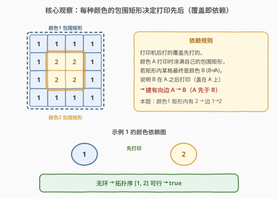
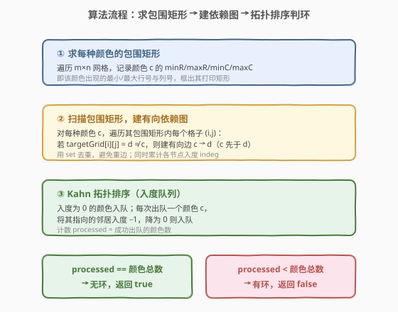
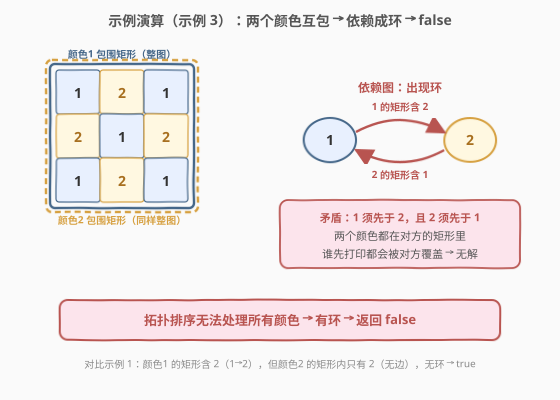

# 奇怪的打印机 II

- **题目名称**：奇怪的打印机 II
- **链接**：[1591. 奇怪的打印机 II](https://leetcode.cn/problems/strange-printer-ii/)
- **难度**：困难
- **标签**：图、拓扑排序、依赖图、模拟

## 1. 题目概述

有一台奇怪的打印机，遵循两条规则：

- 每次操作用**同一种颜色**打印一个**矩形**，覆盖该矩形内原有的颜色；
- **每种颜色只能使用一次**。

给定最终 `m × n` 的目标网格 `targetGrid`（`targetGrid[row][col]` 是位置 `(row, col)` 的颜色编号，取值 `1..60`），判断是否存在一组合法操作打印出该网格。

**示例 1**：

```text
输入：targetGrid = [[1,1,1,1],[1,2,2,1],[1,2,2,1],[1,1,1,1]]
输出：true
解释：先整块打印颜色 1（覆盖全图），再在中心 2×2 打印颜色 2。
```

**示例 2**：

```text
输入：targetGrid = [[1,1,1,1],[1,1,3,3],[1,1,3,4],[5,5,1,4]]
输出：true
```

**示例 3**：

```text
输入：targetGrid = [[1,2,1],[2,1,2],[1,2,1]]
输出：false
解释：颜色 1 和 2 的包围矩形都是整张图，互相包含 → 形成依赖环，无解。
```

**示例 4**：

```text
输入：targetGrid = [[1,1,1],[3,1,3]]
输出：false
```

**约束条件**：

- `m == targetGrid.length`
- `n == targetGrid[i].length`
- `1 <= m, n <= 60`
- `1 <= targetGrid[row][col] <= 60`

---

## 2. 解题思路

### 2.1 暴力思路：枚举打印顺序？

颜色编号 $1..60$，共有至多 $60!$ 种打印顺序，逐一模拟验证显然不可行。而且每步还需确定矩形的位置与大小，搜索空间爆炸。

> 💡 转换视角：不要模拟打印过程，而要分析**颜色之间的覆盖关系**——谁必须先打、谁必须后打，把问题转化为**有向图的环检测**。

### 2.2 核心观察：包围矩形 + 覆盖关系 = 依赖边



关键事实：

1. **每种颜色只打印一次**，且打印时是一个矩形。因此颜色 $c$ 的所有出现格子一定落在**同一个矩形**内——这个矩形就是 $c$ 在网格中的**包围矩形**（最小外接矩形，由 `minR/maxR/minC/maxC` 确定）。

2. 打印机**后打的覆盖先打的**。当颜色 $c$ 打印时，它把自己的包围矩形**整个涂成 $c$**。如果该矩形内某格最终是颜色 $d$（$d \ne c$），说明 $d$ 是在 $c$ **之后**打印的（盖在 $c$ 之上）。

由此得到建边规则：

> **规则**：对颜色 $c$ 的包围矩形内每个格子，若颜色为 $d \ne c$，则建有向边 $c \to d$（$c$ 必须先于 $d$ 打印）。

3. 若该依赖图**无环**，则存在合法拓扑序，对应一组合法打印方案，返回 `true`；若**有环**，则存在矛盾（$a$ 须先于 $b$ 且 $b$ 须先于 $a$），返回 `false`。

> 💡 **为何包围矩形内的格子一定被 $c$ 覆盖过？** 因为 $c$ 的包围矩形由 $c$ 出现的最小/最大行列决定，$c$ 打印时必然涂满这个矩形（题目要求打印的是矩形，且 $c$ 的所有出现都在其中）。矩形内非 $c$ 的格子是被后续颜色覆盖的结果。

### 2.3 算法流程图



### 2.4 示例演算

以**示例 3** `targetGrid = [[1,2,1],[2,1,2],[1,2,1]]` 为例：



| 颜色 | 包围矩形 | 矩形内出现的其他颜色 | 建边 |
|------|----------|---------------------|------|
| 1 | 整张图 (行 0-2, 列 0-2) | 2 | $1 \to 2$ |
| 2 | 整张图 (行 0-2, 列 0-2) | 1 | $2 \to 1$ |

依赖图为 $1 \to 2 \to 1$，存在环，拓扑排序无法处理所有颜色 → 返回 `false`。

> 💡 **对比示例 1**：颜色 1 的包围矩形（整图）含 2，建边 $1 \to 2$；颜色 2 的包围矩形（中心 $2\times2$）内只有 2，**无边**。图无环，拓扑序 $[1, 2]$ 合法 → `true`。

---

## 3. 参考代码

### C++

```cpp
class Solution {
  public:
    bool isPrintable(vector<vector<int>>& targetGrid) {
        int m = targetGrid.size(), n = targetGrid[0].size();
        // 每种颜色的包围矩形
        int minR[61], maxR[61], minC[61], maxC[61];
        for (int c = 1; c <= 60; ++c) {
            minR[c] = m; maxR[c] = -1; minC[c] = n; maxC[c] = -1;
        }
        vector<bool> hasColor(61, false);
        for (int i = 0; i < m; ++i)
            for (int j = 0; j < n; ++j) {
                int c = targetGrid[i][j];
                hasColor[c] = true;
                minR[c] = min(minR[c], i);
                maxR[c] = max(maxR[c], i);
                minC[c] = min(minC[c], j);
                maxC[c] = max(maxC[c], j);
            }

        // 建依赖图：c 的包围矩形内出现 d≠c → 边 c→d（set 去重）
        vector<unordered_set<int>> adj(61);
        for (int c = 1; c <= 60; ++c) {
            if (maxR[c] < 0) continue;            // 该颜色未出现
            for (int i = minR[c]; i <= maxR[c]; ++i)
                for (int j = minC[c]; j <= maxC[c]; ++j) {
                    int d = targetGrid[i][j];
                    if (d != c) adj[c].insert(d);
                }
        }

        // 入度
        vector<int> indeg(61, 0);
        for (int c = 1; c <= 60; ++c)
            for (int d : adj[c]) indeg[d]++;

        // Kahn 拓扑排序
        queue<int> q;
        int total = 0;
        for (int c = 1; c <= 60; ++c) {
            if (hasColor[c]) {
                total++;
                if (indeg[c] == 0) q.push(c);
            }
        }
        int processed = 0;
        while (!q.empty()) {
            int c = q.front(); q.pop();
            processed++;
            for (int d : adj[c])
                if (--indeg[d] == 0) q.push(d);
        }
        return processed == total;
    }
};
```

### Python

```python
class Solution:
    def isPrintable(self, targetGrid: List[List[int]]) -> bool:
        m, n = len(targetGrid), len(targetGrid[0])
        colors = set()
        minR, maxR, minC, maxC = {}, {}, {}, {}
        for i in range(m):
            for j in range(n):
                c = targetGrid[i][j]
                colors.add(c)
                if c not in minR:
                    minR[c] = maxR[c] = i
                    minC[c] = maxC[c] = j
                else:
                    minR[c] = min(minR[c], i)
                    maxR[c] = max(maxR[c], i)
                    minC[c] = min(minC[c], j)
                    maxC[c] = max(maxC[c], j)

        # 建依赖图：c 的包围矩形内出现 d≠c → 边 c→d
        adj = {c: set() for c in colors}
        for c in colors:
            for i in range(minR[c], maxR[c] + 1):
                for j in range(minC[c], maxC[c] + 1):
                    d = targetGrid[i][j]
                    if d != c:
                        adj[c].add(d)

        indeg = {c: 0 for c in colors}
        for c in colors:
            for d in adj[c]:
                indeg[d] += 1

        # Kahn 拓扑排序
        from collections import deque
        q = deque([c for c in colors if indeg[c] == 0])
        processed = 0
        while q:
            c = q.popleft()
            processed += 1
            for d in adj[c]:
                indeg[d] -= 1
                if indeg[d] == 0:
                    q.append(d)
        return processed == len(colors)
```

> 💡 **代码要点**：
> - 用 `set` / `unordered_set` 存邻接关系，自动去重，避免同一对颜色被多次建边导致入度虚高。
> - `hasColor` 只对网格中实际出现的颜色做拓扑统计，未出现的颜色不参与。
> - 入度为 0 的颜色先入队，BFS 逐步消解；最终 `processed == total` 当且仅当无环。

---

## 4. 复杂度分析

设 $C$ 为网格中出现的不同颜色数（$C \le 60$），网格规模 $m \times n$（$m, n \le 60$）。

| 维度 | 复杂度 | 说明 |
|------|--------|------|
| 时间复杂度 | $O(C \cdot m \cdot n)$ | 求包围矩形 $O(mn)$；每种颜色扫描其包围矩形至多 $O(mn)$，共 $C$ 种；拓扑排序 $O(C^2)$，可忽略 |
| 空间复杂度 | $O(C^2)$ | 邻接表最多 $C^2$ 条边（每对颜色至多一条去重边） |

> ⚠️ 本题 $C \le 60$、$mn \le 3600$，$C \cdot mn \le 2.16 \times 10^5$，非常宽松。瓶颈在于对每种颜色都重新扫描其包围矩形；若颜色很多且矩形都很大，可优化为「记录每格所属颜色后按矩形批量扫描」，但本题无需。

---

## 5. 扩展：正确性与构造性

### 5.1 为何「无环 ⇔ 可行」

- **无环 ⇒ 可行**：拓扑序给出打印顺序。按拓扑序逆序打印即可——靠后的颜色先打印（被覆盖），靠前的颜色最后打印（露在最上层）。每种颜色打印时涂自己的包围矩形，最终每格的颜色就是拓扑序中**最靠前**且覆盖该格的颜色，恰为目标颜色。
- **有环 ⇒ 不可行**：环上颜色互相要求「我先于你且你先于我」，无论怎样安排顺序都会矛盾，无合法方案。

### 5.2 为何只需看包围矩形而非任意矩形

题目限定每次打印的是矩形，且同色只用一次。颜色 $c$ 的所有格子必同属一次矩形操作，故该矩形至少要覆盖 $c$ 的包围矩形。又因为**打印矩形可以比包围矩形更大**（多涂的部分会被后续颜色覆盖），但「更大」只会引入更多依赖边，不会消除环——所以用包围矩形建边是**充分**的：若包围矩形对应的图无环，则存在合法打印方案。

---

## 6. 面试要点

1. **为什么把打印问题转成图论问题？**

   - 直接模拟打印顺序是 $O(C!)$ 不可行。但颜色间的覆盖关系天然构成偏序：谁必须先打、谁必须后打。把「偏序」抽象成有向边，问题就变成**判有向图是否有环**——拓扑排序的经典应用。

2. **包围矩形是怎么确定的？为什么合法？**

   - 对颜色 $c$，取其所有出现格子的最小/最大行列号，即为包围矩形。因为 $c$ 只打印一次且打印的是矩形，它的所有格子必然同属该矩形，故包围矩形是 $c$ 的打印矩形的**最小下界**。

3. **建边方向怎么记？**

   - $c$ 打印时涂满自己的包围矩形，若矩形内某格最终是 $d \ne c$，说明 $d$ 在 $c$ **之后**打印（盖在 $c$ 上）。所以 $c$ 先于 $d$，边为 $c \to d$。口诀：**「矩形里看见别人，自己先打印」**。

4. **为什么要用 set 去重？**

   - 同一对 $(c, d)$ 可能在 $c$ 的包围矩形内出现多次（多个格子都是 $d$）。不去重会让 $d$ 的入度被重复累加，拓扑排序时永远无法降到 0，误判为有环。

5. **拓扑排序如何判环？**

   - Kahn 算法：入度为 0 的节点入队，逐步删边。若最终处理的节点数 `<` 总节点数，说明有节点入度始终不为 0，即存在环。也可以用 DFS 三色标记法判环，二者等价。

---

## 7. 同类练习题

- [207. 课程表](https://leetcode.cn/problems/course_schedule/)：拓扑排序判环的母题，本题的图论骨架与之完全一致
- [210. 课程表 II](https://leetcode.cn/problems/course-schedule-ii/)：拓扑排序输出具体顺序，理解 Kahn 的出队序即拓扑序
- [802. 找到最终的安全状态](https://leetcode.cn/problems/find-eventual-safe-states/)：DFS 三色标记判环，另一种判环实现
- [2392. 给矩阵修建单位](https://leetcode.cn/problems/build-a-matrix-with-conditions/)：拓扑排序 + 矩阵布局构造，图论与网格结合的进阶
- [664. 奇怪的打印机](https://leetcode.cn/problems/strange-printer/)：本题的「前传」，区间 DP 求最少打印次数，对比本题的可行性判定
