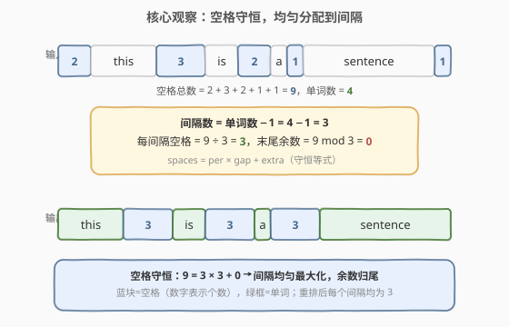
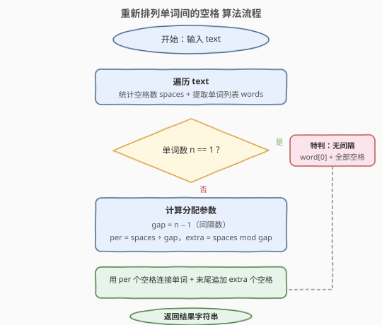
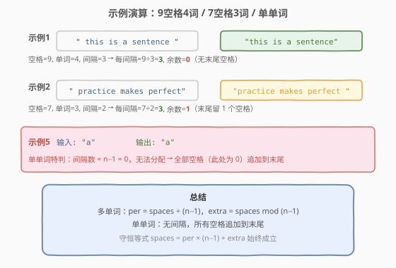

# 重新排列单词间的空格

- **题目名称**：重新排列单词间的空格
- **链接**：[1592. 重新排列单词间的空格](https://leetcode.cn/problems/rearrange-spaces-between-words/)
- **难度**：简单
- **标签**：字符串、模拟

## 1. 题目概述

给你一个字符串 `text`，由若干被空格包围的**单词**组成。每个单词由一个或多个小写英文字母组成，两个单词之间至少存在一个空格，且 `text` 至少包含一个单词。

请你重新排列空格，使每对相邻单词之间的空格数目都**相等**，并尽可能**最大化**该数目。如果不能完全平均分配，将多余的空格放置在字符串**末尾**。返回的字符串长度应与原 `text` 相同。

**示例 1**：

```text
输入：text = "  this   is  a sentence "
输出："this   is   a   sentence"
解释：总共有 9 个空格和 4 个单词。9 / (4-1) = 3，每个间隔 3 个空格，恰好分完。
```

**示例 2**：

```text
输入：text = " practice   makes   perfect"
输出："practice   makes   perfect "
解释：总共有 7 个空格和 3 个单词。7 / (3-1) = 3 余 1，每个间隔 3 个空格，末尾留 1 个。
```

**示例 3**：

```text
输入：text = "hello   world"
输出："hello   world"
```

**示例 4**：

```text
输入：text = "  walks  udp package   into  bar a"
输出："walks  udp  package  into  bar  a "
```

**示例 5**：

```text
输入：text = "a"
输出："a"
```

**约束条件**：

- $1 \le \text{text.length} \le 100$
- `text` 由小写英文字母和 `' '` 组成
- `text` 中至少包含一个单词

> 💡 关键约束是「返回字符串长度与原 `text` 相同」——这意味着**空格总数守恒**，我们只是在重新分配空格的位置，而非增删空格。

---

## 2. 解题思路

### 2.1 直觉思路：模拟空格重排

最朴素的想法是：先数清楚一共有多少个空格、多少个单词，然后把空格「均匀撒」到单词之间的间隔里。

这里有一个隐藏的结构——**空格总数守恒**：无论怎么重排，空格的总数不变，变的是它们的分布位置。因此问题被拆成两个独立子任务：

1. **统计**：数出空格总数 `spaces` 和单词列表 `words`。
2. **分配**：把 `spaces` 个空格均匀分配到 `n-1` 个间隔里，余数丢到末尾。

### 2.2 核心观察：空格守恒 + 均匀除法



**观察一：空格总数守恒。**

重排不增删空格，只是改变其位置。所以只需遍历一次 `text`，统计空格字符 `' '` 的总数 `spaces`，同时提取所有单词（连续字母段）。

**观察二：均匀分配 = 整除 + 取余。**

设单词数为 $n$，则相邻单词间的**间隔数**为 $n - 1$。将 `spaces` 个空格均匀分配到 $n - 1$ 个间隔里：

$$\text{per} = \left\lfloor \frac{\text{spaces}}{n - 1} \right\rfloor, \quad \text{extra} = \text{spaces} \bmod (n - 1)$$

- 每个间隔放 `per` 个空格（**最大化**每间隔空格数）。
- 末尾追加 `extra` 个空格（余数归尾）。

> 💡 **为什么这样能最大化每间隔空格数？** 因为 `per` 是 `spaces` 除以 `n-1` 的商，是每个间隔能分到的最大整数。若给某个间隔多分 1 个，则必有另一个间隔少 1 个——不均匀。整除商就是均匀分配的上界。

**观察三：单单词特判。**

当 $n = 1$ 时，间隔数 $n - 1 = 0$，除法会除以零。此时没有间隔可以分配，**所有空格都追加到唯一的单词末尾**。

> ⚠️ **边界陷阱**：$n = 1$ 时必须特判，否则 `spaces / (n - 1)` 会触发除零错误。这是本题最容易踩的坑。

### 2.3 算法流程图



流程要点：

1. **遍历统计**：扫描 `text`，遇到空格则 `spaces++`，遇到字母则累积成单词，遇空格边界则将当前单词入列表。
2. **单单词特判**：若 `n == 1`，直接返回 `word[0] + spaces个空格`。
3. **计算分配**：`gap = n - 1`，`per = spaces / gap`，`extra = spaces % gap`。
4. **拼接结果**：单词之间用 `per` 个空格连接，末尾追加 `extra` 个空格。

### 2.4 示例演算



以三个例子说明：

- **示例 1** `"  this   is  a sentence "`：空格 $= 2+3+2+1+1 = 9$，单词 $= 4$，间隔 $= 3$，$\text{per} = 9 \div 3 = 3$，$\text{extra} = 0$ → `"this   is   a   sentence"`。
- **示例 2** `" practice   makes   perfect"`：空格 $= 1+3+3 = 7$，单词 $= 3$，间隔 $= 2$，$\text{per} = 7 \div 2 = 3$，$\text{extra} = 1$ → `"practice   makes   perfect "`（末尾多 1 个空格）。
- **示例 5** `"a"`：单词 $= 1$，特判 → 所有空格（此处为 0）追加末尾 → `"a"`。

> 💡 **示例 2 是关键**：它展示了「余数归尾」的场景——7 个空格无法被 2 个间隔整除，商 3 余 1，多出的 1 个空格放到字符串末尾。

---

## 3. 参考代码

### C++（单趟遍历统计 + 拼接）

```cpp
class Solution {
public:
    string reorderSpaces(string text) {
        int spaces = 0;
        vector<string> words;
        string word;
        for (char c : text) {
            if (c == ' ') {
                ++spaces;
                if (!word.empty()) {
                    words.push_back(word);
                    word.clear();
                }
            } else {
                word += c;
            }
        }
        if (!word.empty()) words.push_back(word);

        if (words.size() == 1) {
            return words[0] + string(spaces, ' ');
        }
        int gap = words.size() - 1;
        int per = spaces / gap;
        int extra = spaces % gap;
        string result;
        for (int i = 0; i < (int)words.size(); ++i) {
            if (i > 0) result += string(per, ' ');
            result += words[i];
        }
        result += string(extra, ' ');
        return result;
    }
};
```

### Python（divmod + join 一行拼接）

```python
class Solution:
    def reorderSpaces(self, text: str) -> str:
        spaces = text.count(' ')
        words = text.split()
        if len(words) == 1:
            return words[0] + ' ' * spaces
        per, extra = divmod(spaces, len(words) - 1)
        return (' ' * per).join(words) + ' ' * extra
```

> 💡 **Python 简洁性**：`str.split()` 无参时自动按任意空白符分割并去除首尾空格，天然提取单词列表；`divmod` 一步算出商和余数；`(' ' * per).join(words)` 一行完成间隔拼接。三者组合使核心逻辑仅 3 行。
>
> ⚠️ **C++ 遍历统计的细节**：遇到空格时若 `word` 非空需立即入列并清空——这保证连续多个空格不会产生空单词。遍历结束后还要检查 `word` 是否非空（处理末尾无空格的情况）。

---

## 4. 复杂度分析

| 维度 | 复杂度 | 说明 |
|------|--------|------|
| 时间复杂度 | $O(n)$ | 单趟遍历统计 $O(n)$ + 拼接结果 $O(n)$，总计 $O(n)$ |
| 空间复杂度 | $O(n)$ | 存储单词列表与结果字符串，最坏 $n$ 个单字符单词 |

> 💡 由于 $n \le 100$，$O(n)$ 绰绰有余。即便 $n$ 到 $10^5$ 也只需 $10^5$ 次操作。

---

## 5. 扩展：避免存储单词列表的原地写法

上述解法先存单词列表再拼接，空间 $O(n)$。若追求极致空间效率，可以**两次扫描**：第一次只数空格数和单词数（不存单词），第二次边扫描边写入结果。但这样代码复杂度显著上升，且对 $n \le 100$ 无实际收益，面试中不推荐。

> ⚠️ 原地写法的陷阱在于：结果字符串长度可能短于原串（合并了多余空格），不能直接在原串上修改，仍需新字符串。因此 $O(n)$ 空间是下界，无法进一步优化。

---

## 6. 面试要点

1. **为什么要特判单词数为 1 的情况？**

   - 当 $n = 1$ 时间隔数 $n - 1 = 0$，`spaces / (n - 1)` 会除零。此时没有间隔可分配空格，所有空格都追加到唯一单词的末尾。这是本题最核心的边界条件。

2. **如何保证每间隔空格数是「最大化」的？**

   - `per = spaces / (n - 1)` 是整除商，即每个间隔能分到的最大整数空格数。若给某间隔多分 1 个，必有另一间隔少 1 个——不均匀，违反「相等」要求。整除商是均匀分配的上界，天然最大化。

3. **多余的空格为什么放末尾而不是放头部或均匀分散？**

   - 题目明确要求「将多余的空格放置在字符串末尾」。从守恒等式 $\text{spaces} = \text{per} \times (n-1) + \text{extra}$ 看，$\text{extra}$ 是整除后的余数（$0 \le \text{extra} < n-1$），无法再均匀分到间隔里，只能集中放一处，题目指定末尾。

4. **Python 的 `str.split()` 无参和 `split(' ')` 有什么区别？**

   - `split()` 无参时按**任意连续空白符**分割，自动去除首尾空格，不会产生空字符串元素。`split(' ')` 按**单个空格**分割，连续空格会产生空字符串（如 `"a  b".split(' ')` 得 `['a', '', 'b']`）。本题用无参 `split()` 恰好提取所有单词，非常方便。

5. **返回字符串长度为什么一定等于原 `text` 长度？**

   - 空格守恒：重排只改变空格位置，不增删。单词总长度不变，空格总数不变，故 $\text{len}(\text{结果}) = \sum \text{len}(\text{word}_i) + \text{spaces} = \text{len}(\text{text})$。这是验证代码正确性的一个不变式。

---

## 7. 同类练习题

- [151. 反转字符串中的单词](https://leetcode.cn/problems/reverse-words-in-a-string/)：同属「单词+空格」字符串重排，本题重排空格分布，151 题反转单词顺序并压缩多余空格
- [434. 字符串中的单词数](https://leetcode.cn/problems/number-of-segments-in-a-string/)：统计单词数，与本题提取单词列表的逻辑一致
- [58. 最后一个单词的长度](https://leetcode.cn/problems/length-of-last-word/)（[题解](../0001-0100/58_最后一个单词的长度.md)）：从右向左扫描跳过空格找单词，同属空格与单词处理家族
- [557. 反转字符串中的单词 III](https://leetcode.cn/problems/reverse-words-in-a-string-iii/)：单词级处理，逐单词反转字符，对比本题的空格级重排
- [1528. 重新排列字符串](https://leetcode.cn/problems/shuffle-string/)（[题解](../1501-1600/1528_重新排列字符串.md)）：按 indices 重排字符，对比本题按均匀除法重排空格
