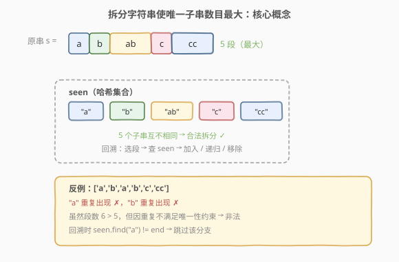
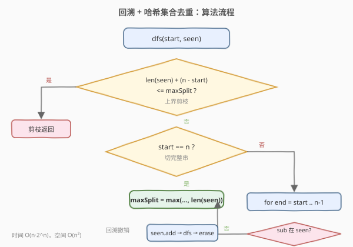
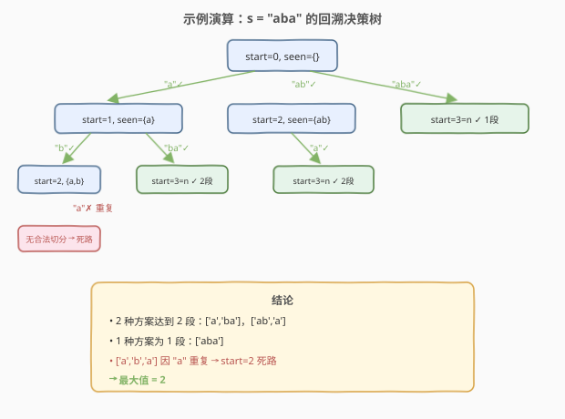

# LeetCode 拆分字符串使唯一子字符串的数目最大 题解

## 1. 题目概述

- **标题 / 题号**：拆分字符串使唯一子字符串的数目最大（#1593，medium）
- **链接**：https://leetcode.cn/problems/split-a-string-into-the-max-number-of-unique-substrings/
- **难度**：中等
- **标签**：字符串、回溯、哈希表

**题意**：给定字符串 `s`，将其拆分为若干**非空子字符串**，使得：

1. 拆分后的子字符串按顺序拼接后能还原原字符串；
2. 每个**子字符串都互不相同**（唯一）。

返回满足条件的拆分中，子字符串数目的**最大值**。

**示例 1**：

```text
输入：s = "ababccc"
输出：5
解释：一种最大拆分为 ['a', 'b', 'ab', 'c', 'cc']。
      像 ['a', 'b', 'a', 'b', 'c', 'cc'] 不满足，因为 'a' 和 'b' 重复出现。
```

**示例 2**：

```text
输入：s = "aba"
输出：2
解释：一种最大拆分为 ['a', 'ba']。不能拆成 ['a','b','a']，因为 'a' 重复。
```

**示例 3**：

```text
输入：s = "aa"
输出：1
解释：无法进一步拆分——['a','a'] 中 'a' 重复，只能整体作为一段。
```

**约束**：

- `1 <= s.length <= 16`
- `s` 仅包含小写英文字母

## 2. 解题思路

### 2.1 暴力思路：枚举所有切分位置

长度为 `n` 的字符串有 `n - 1` 个间隙，每个间隙「切或不切」，共 $2^{n-1}$ 种分割方案。对每种方案，检查所有子串是否互不相同。`n = 16` 时 $2^{15} = 32768$ 种，可行但写法笨拙，且无法利用已选子串信息做剪枝。

### 2.2 核心观察：回溯 + 哈希集合去重



把拆分看作「从左到右依次切出一段」的决策过程：站在位置 `start`，尝试所有终点 `end`（`start <= end < n`），切出子串 `s[start..end]`：

- 若该子串**尚未出现在当前拆分中**（用哈希集合 `seen` 判定），则把它加入 `seen`，递归处理 `end + 1` 之后的部分；
- 递归返回后，从 `seen` 中移除该子串（**回溯撤销选择**）；
- 若该子串已在 `seen` 中，跳过本分支。

当 `start == n` 时，说明已切完整串，用当前拆分段数更新全局最大值。

> 💡 **回溯三要素**：
> - **路径**：已切出的子串集合 `seen`（哈希集合，兼顾「记录」与「唯一性判定」）。
> - **选择**：在当前 `start` 处，所有使 `s[start..end]` 不在 `seen` 中的 `end`。
> - **终止**：`start == n`，更新 `maxSplit = max(maxSplit, len(seen))`。

### 2.3 算法流程图



**剪枝优化**：剩余字符数为 `n - start`，即使每个字符都切成独立且唯一的子串，最多也只能再增加 `n - start` 段。若 `len(seen) + (n - start) <= maxSplit`，当前分支**不可能超越已知最优**，直接剪枝返回。

> 💡 这一上界剪枝在 `n = 16` 时能大幅削减搜索空间，是本题从「勉强通过」到「快速通过」的关键。

### 2.4 示例演算

以 `s = "aba"` 为例，回溯决策树如下：



```text
start=0, seen={}
├─ end=0: "a" 不在 seen → seen={a}, 递归 start=1
│   ├─ end=1: "b" 不在 seen → seen={a,b}, 递归 start=2
│   │   └─ end=2: "a" 已在 seen ✗ 跳过 → 无合法切分，死路返回
│   └─ end=2: "ba" 不在 seen → seen={a,ba}, 递归 start=3=n ✓ 记录 2 段
├─ end=1: "ab" 不在 seen → seen={ab}, 递归 start=2
│   └─ end=2: "a" 不在 seen → seen={ab,a}, 递归 start=3=n ✓ 记录 2 段
└─ end=2: "aba" 不在 seen → seen={aba}, 递归 start=3=n ✓ 记录 1 段
```

最大值为 **2**，对应 `['a', 'ba']`、`['ab', 'a']` 两种方案。注意 `['a', 'b', 'a']` 因 `"a"` 重复而无法完成切分——在 `start=2` 时 `"a"` 已在 `seen` 中，该分支成为死路。

> 💡 注意 `start=1, end=2` 时 `"ba"` 不在 `seen` 中——`seen` 只追踪**当前路径**上的子串，不同分支间通过回溯互不干扰。

## 3. 参考代码

### C++

```cpp
class Solution {
  public:
    int maxUniqueSplit(string s) {
        int n = s.size();
        unordered_set<string> seen;
        int maxSplit = 0;
        dfs(s, 0, seen, maxSplit);
        return maxSplit;
    }

  private:
    void dfs(const string& s, int start, unordered_set<string>& seen, int& maxSplit) {
        int n = s.size();
        // 上界剪枝：剩余字符最多再贡献 n - start 段
        if ((int)seen.size() + (n - start) <= maxSplit) {
            return;
        }
        if (start == n) {
            maxSplit = max(maxSplit, (int)seen.size());
            return;
        }
        for (int end = start; end < n; ++end) {
            string sub = s.substr(start, end - start + 1);
            if (seen.find(sub) == seen.end()) {
                seen.insert(sub);
                dfs(s, end + 1, seen, maxSplit);
                seen.erase(sub);          // 回溯
            }
        }
    }
};
```

### Python

```python
class Solution:
    def maxUniqueSplit(self, s: str) -> int:
        n = len(s)
        seen = set()
        self.ans = 0

        def dfs(start: int):
            # 上界剪枝
            if len(seen) + (n - start) <= self.ans:
                return
            if start == n:
                self.ans = max(self.ans, len(seen))
                return
            for end in range(start, n):
                sub = s[start:end + 1]
                if sub not in seen:
                    seen.add(sub)
                    dfs(end + 1)
                    seen.remove(sub)      # 回溯

        dfs(0)
        return self.ans
```

> 💡 **回溯模板**：`seen.insert(sub)` → `dfs(end + 1)` → `seen.erase(sub)`。与 [131. 分割回文串](../0101-0200/131_分割回文串.md) 的 `path.push / dfs / path.pop` 骨架完全一致，区别仅在于「选择条件」从「回文判定」换成了「唯一性判定」。

## 4. 复杂度分析

| 维度 | 复杂度 | 说明 |
|------|--------|------|
| 时间复杂度 | $O(n \cdot 2^n)$ | 最坏 $2^{n-1}$ 种分割，每种最多 $n$ 个子串做哈希操作；剪枝后实际远小于此 |
| 空间复杂度 | $O(n^2)$ | `seen` 集合最多 $n$ 个子串，每个最长 $n$；递归栈 $O(n)$ |

> 💡 `n <= 16` 是回溯题的典型规模暗示——$2^{15} = 32768$，配合剪枝轻松通过。

## 5. 扩展：字符串哈希优化（可选）

当 `n` 更大时（如 `n <= 100`），`unordered_set<string>` 的子串插入与查找每次 $O(n)$ 字符串拷贝会成为瓶颈。可用**滚动哈希（Rabin-Karp）**将子串比较降为 $O(1)$：

- 预处理前缀哈希 $h[i] = (h[i-1] \cdot B + s[i]) \bmod P$，其中 $B$ 为基数（如 131），$P$ 为大质数（如 $10^9 + 7$）；
- 子串 $s[l..r]$ 的哈希值为 $h[r+1] - h[l] \cdot B^{r-l+1} \bmod P$；
- `seen` 改为 `unordered_set<long long>`，存哈希值而非字符串。

> ⚠️ 单哈希存在碰撞风险，竞赛中常用双哈希（两组 $B, P$）降低冲突概率。本题 `n <= 16` 无需此优化。

## 6. 面试要点

1. **为什么用回溯而不是 DP？**

   - 本题要求**最大化段数**，看似可 DP，但「唯一性」约束依赖于**当前已选的全部子串**——状态是「位置 + 已选子串集合」，状态空间 $O(n \cdot 2^{\text{子串总数}})$ 过大。回溯天然适合这种「选择间有全局约束」的场景，配合剪枝高效解决。

2. **上界剪枝的原理是什么？**

   - 剩余 `n - start` 个字符，即使全部切成单字符且各不相同，最多增加 `n - start` 段。若 `len(seen) + (n - start) <= maxSplit`，当前分支**无论怎么切都不可能超越已知最优**，直接返回。这是「乐观估计」剪枝的典型应用。

3. **`seen` 为什么用集合而不是列表？**

   - 集合的 `insert / erase / find` 均摊 $O(1)$（平均），列表的 `find` 是 $O(n)$。本题每次递归都要做唯一性判定，集合能将总复杂度从 $O(n^2 \cdot 2^n)$ 降到 $O(n \cdot 2^n)$。

4. **回溯时为什么要 `erase`？**

   - `seen` 是跨分支共享的。进入下一层前 `insert`，返回后必须 `erase` 恢复现场，否则兄弟分支会看到不属于自己路径的子串，导致漏选或误判。与 `path.pop()` 同理。

5. **和「分割回文串」（131）有什么区别？**

   - 131 枚举**所有**满足「每段回文」的方案；1593 求**最优值**（最大段数），满足「每段唯一」。两者同为回溯切分字符串，约束条件不同：前者用回文表预处理 $O(1)$ 判定，后者用哈希集合 $O(1)$ 判定。

## 同类练习题

| # | 题目 | 与本题的关联 |
|---|------|-------------|
| 131 | [分割回文串](https://leetcode.cn/problems/palindrome-partitioning/)（[题解](../0101-0200/131_分割回文串.md)） | 回溯切分字符串的经典模板，约束为「每段回文」 |
| 93 | [复原 IP 地址](https://leetcode.cn/problems/restore-ip-addresses/) | 回溯切分 + 分段合法性剪枝 |
| 139 | [单词拆分](https://leetcode.cn/problems/word-break/)（[题解](../0101-0200/139_单词拆分.md)） | DP 判定能否拆分，对比回溯求最优值的区别 |
| 140 | [单词拆分 II](https://leetcode.cn/problems/word-break-ii/)（[题解](../0101-0200/140_单词拆分II.md)） | 记忆化回溯枚举所有拆分方案 |
| 47 | [全排列 II](https://leetcode.cn/problems/permutations-ii/) | 回溯 + 去重，与本题「子串唯一」的去重思想相通 |
