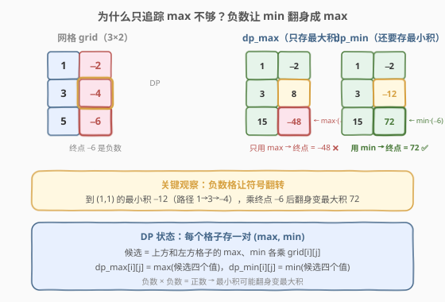
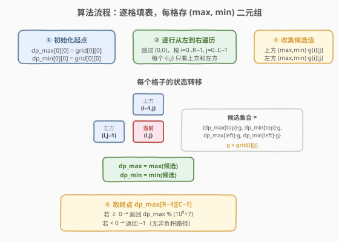
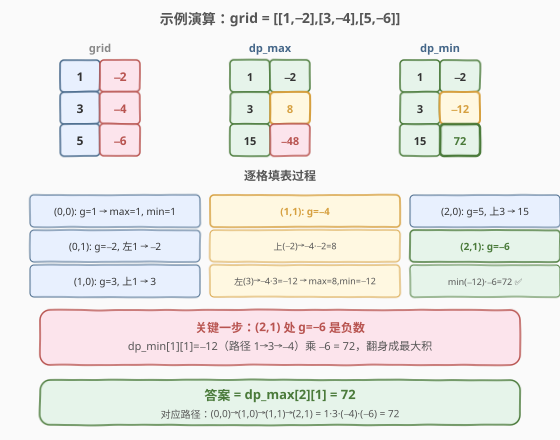

# LeetCode 矩阵的最大非负积 题解

## 1. 题目概述

- **标题 / 题号**：矩阵的最大非负积（#1594，medium）
- **链接**：https://leetcode.cn/problems/max-non-negative-product-in-a-matrix/
- **难度**：中等
- **标签**：数组、动态规划、矩阵

**题意**：给定一个 `rows × cols` 的矩阵 `grid`。你从 `(0, 0)` 出发，每步只能**向右**或**向下**移动，最终到达 `(rows-1, cols-1)`。路径的**积**为路径上所有元素相乘的结果。

返回所有路径中**最大非负积**，对 $10^9 + 7$ 取模。若不存在非负积路径，返回 `-1`。

**示例 1**：

```text
输入：grid = [[-1,-2,-3],
             [-4,-5,-6],
             [-7,-8,-9]]
输出：-1
解释：任意路径都经过 5 个负数，5 个负数相乘仍为负数，不存在非负积。
```

**示例 2**：

```text
输入：grid = [[1,-2],
             [3,-4],
             [5,-6]]
输出：72
解释：路径 (0,0)→(1,0)→(1,1)→(2,1) 的积 = 1×3×(−4)×(−6) = 72。
```

**约束**：

- `1 <= rows, cols <= 15`
- `-4 <= grid[i][j] <= 4`

## 2. 解题思路

### 2.1 暴力思路：枚举所有路径

从 `(0, 0)` 到 `(rows-1, cols-1)` 的每步选「右」或「下」，共需 `(R-1) + (C-1)` 步，其中 `R-1` 步向下。路径总数为 $C(R+C-2, R-1)$。当 `R = C = 15` 时，$C(28, 14) \approx 4 \times 10^7$——勉强但低效，且每条路径要乘 29 个数。

> 💡 转换视角：路径有大量**公共前缀**，用 DP 把"到每个格子的最优积"记下来，避免重复计算。

### 2.2 核心观察：每个格子存 (max, min) 二元组

如果只追踪到每个格子的**最大积** `dp_max`，会漏掉一种情况：**负数让符号翻转**。当当前格子的值是负数时，前方的**最小积**（可能是个大负数）乘以这个负数后反而变成**最大积**。



如上图所示，以 `grid = [[1,-2],[3,-4],[5,-6]]` 为例：

- 到 `(1,1)` 的最大积是 `8`（路径 `1→−2→−4`），最小积是 `−12`（路径 `1→3→−4`）。
- 终点 `(2,1)` 的值是 `−6`（负数）。若只看 `dp_max[1][1]=8`，则 `8×(−6)=−48`；但 `dp_min[1][1]=−12` 乘 `−6` 得 `72`，反而最大。
- **结论**：每个格子必须同时存最大积和最小积，因为负数格会让最小积翻身变最大。

> ⚠️ 这与 [152. 乘积最大子数组](../0001-0100/152_乘积最大子数组.md) 的核心思路完全一致——只要有负数，就必须同时维护 max 和 min。

### 2.3 算法流程图



**状态定义**：

- `dp_max[i][j]`：从 `(0,0)` 到 `(i,j)` 所有路径中的**最大积**
- `dp_min[i][j]`：从 `(0,0)` 到 `(i,j)` 所有路径中的**最小积**

**转移方程**：

对于格子 `(i, j)`（跳过 `(0,0)`），设 `g = grid[i][j]`：

1. 收集**前置格子的 max 和 min**：上方 `(i-1, j)`（若存在）和左方 `(i, j-1)`（若存在）。
2. 候选值集合 = `{dp_max[top]·g, dp_min[top]·g, dp_max[left]·g, dp_min[left]·g}`（只取存在的前驱）。
3. `dp_max[i][j] = max(候选)`，`dp_min[i][j] = min(候选)`。

**初始化**：`dp_max[0][0] = dp_min[0][0] = grid[0][0]`。

**答案**：`dp_max[R-1][C-1]`。若 $\ge 0$ 返回其对 $10^9+7$ 取模；否则返回 `-1`。

> 💡 **取模时机**：转移时直接对 `dp_max` / `dp_min` 取模不会影响最终答案的符号判定——因为 $10^9+7$ 是素数且 `grid[i][j]` 的绝对值 $\le 4$，取模后乘法运算的符号关系不变。但更安全的做法是**先不取模**（`R,C ≤ 15`，路径积最多 $4^{29}$，用 `long long` 足够），最后再对答案取模。

### 2.4 示例演算

以 `grid = [[1,-2],[3,-4],[5,-6]]` 为例，逐格填表：



| 格子 | `g` | 前驱 | 候选值 | `dp_max` | `dp_min` | 说明 |
|------|-----|------|--------|----------|----------|------|
| (0,0) | 1 | — | — | 1 | 1 | 初始化 |
| (0,1) | −2 | 左(1,1) | {−2} | −2 | −2 | 仅左方前驱 |
| (1,0) | 3 | 上(1,1) | {3} | 3 | 3 | 仅上方前驱 |
| (1,1) | −4 | 上(−2,−2)、左(3,3) | {8, −12} | 8 | −12 | **负数格：左方 min 翻身** |
| (2,0) | 5 | 上(3,3) | {15} | 15 | 15 | 仅上方前驱 |
| (2,1) | −6 | 上(8,−12)、左(15,15) | {−48, 72, −90} | **72** | −90 | **min(−12)×(−6)=72 翻身成 max** |

最终 `dp_max[2][1] = 72 ≥ 0`，返回 `72`。对应路径 `(0,0)→(1,0)→(1,1)→(2,1) = 1×3×(−4)×(−6) = 72`。

> 💡 关键在 `(1,1)`：`dp_min=−12` 来自路径 `1→3→−4`，到终点乘 `−6` 后翻身成 `72`。若只追踪 `dp_max`，终点只得 `−48`，完全错过正解。

## 3. 参考代码

### 方法一：二维 DP（推荐）

### C++

```cpp
class Solution {
  public:
    int maxProductPath(vector<vector<int>>& grid) {
        int R = grid.size(), C = grid[0].size();
        const int MOD = 1e9 + 7;

        // dp_max[i][j] / dp_min[i][j]：到 (i,j) 的最大/最小积
        vector<vector<long long>> dp_max(R, vector<long long>(C));
        vector<vector<long long>> dp_min(R, vector<long long>(C));

        dp_max[0][0] = dp_min[0][0] = grid[0][0];

        for (int i = 0; i < R; ++i) {
            for (int j = 0; j < C; ++j) {
                if (i == 0 && j == 0) continue;
                long long g = grid[i][j];
                long long cur_max = LLONG_MIN, cur_min = LLONG_MAX;

                // 上方前驱 (i-1, j)
                if (i > 0) {
                    cur_max = max(cur_max, dp_max[i-1][j] * g);
                    cur_max = max(cur_max, dp_min[i-1][j] * g);
                    cur_min = min(cur_min, dp_max[i-1][j] * g);
                    cur_min = min(cur_min, dp_min[i-1][j] * g);
                }
                // 左方前驱 (i, j-1)
                if (j > 0) {
                    cur_max = max(cur_max, dp_max[i][j-1] * g);
                    cur_max = max(cur_max, dp_min[i][j-1] * g);
                    cur_min = min(cur_min, dp_max[i][j-1] * g);
                    cur_min = min(cur_min, dp_min[i][j-1] * g);
                }

                dp_max[i][j] = cur_max;
                dp_min[i][j] = cur_min;
            }
        }

        long long ans = dp_max[R-1][C-1];
        if (ans < 0) return -1;
        return (int)(ans % MOD);
    }
};
```

### Python

```python
class Solution:
    def maxProductPath(self, grid: List[List[int]]) -> int:
        R, C = len(grid), len(grid[0])
        MOD = 10 ** 9 + 7

        dp_max = [[0] * C for _ in range(R)]
        dp_min = [[0] * C for _ in range(R)]
        dp_max[0][0] = dp_min[0][0] = grid[0][0]

        for i in range(R):
            for j in range(C):
                if i == 0 and j == 0:
                    continue
                g = grid[i][j]
                cands = []
                if i > 0:  # 上方前驱
                    cands.append(dp_max[i-1][j] * g)
                    cands.append(dp_min[i-1][j] * g)
                if j > 0:  # 左方前驱
                    cands.append(dp_max[i][j-1] * g)
                    cands.append(dp_min[i][j-1] * g)
                dp_max[i][j] = max(cands)
                dp_min[i][j] = min(cands)

        ans = dp_max[R-1][C-1]
        if ans < 0:
            return -1
        return ans % MOD
```

> 💡 **为什么用 `long long`？** 路径最多 `R+C−1 ≤ 29` 个格子，每个值绝对值 $\le 4$，积的绝对值最多 $4^{29} \approx 2.9 \times 10^{17}$，超出 `int` 范围但 `long long`（$\approx 9.2 \times 10^{18}$）足够。

### 方法二：滚动数组优化（O(C) 空间）

由于每个格子只依赖上方和左方，可以把 `dp_max` / `dp_min` 压缩成一维数组：

### C++

```cpp
class Solution {
  public:
    int maxProductPath(vector<vector<int>>& grid) {
        int R = grid.size(), C = grid[0].size();
        const int MOD = 1e9 + 7;

        vector<long long> mx(C), mn(C);  // 滚动数组
        mx[0] = mn[0] = grid[0][0];

        for (int j = 1; j < C; ++j)
            mx[j] = mn[j] = mx[j-1] * grid[0][j];  // 第一行只能从左来

        for (int i = 1; i < R; ++i) {
            // 第一列只能从上来
            mx[0] = mx[0] * grid[i][0];
            mn[0] = mn[0] * grid[i][0];
            for (int j = 1; j < C; ++j) {
                long long g = grid[i][j];
                long long a = mx[j] * g;       // 上方 max
                long long b = mn[j] * g;       // 上方 min
                long long c = mx[j-1] * g;     // 左方 max
                long long d = mn[j-1] * g;     // 左方 min
                mx[j] = max({a, b, c, d});
                mn[j] = min({a, b, c, d});
            }
        }

        long long ans = mx[C-1];
        return ans < 0 ? -1 : (int)(ans % MOD);
    }
};
```

## 4. 复杂度分析

| 维度 | 复杂度 | 说明 |
|------|--------|------|
| 时间复杂度 | $O(R \times C)$ | 每个格子常数时间转移（最多 4 个候选） |
| 空间复杂度（二维） | $O(R \times C)$ | 两个 $R \times C$ 的 DP 表 |
| 空间复杂度（滚动） | $O(C)$ | 压缩为一维数组 |

> ⚠️ 本题 $R, C \le 15$，$R \times C \le 225$，任何写法都能通过。滚动数组的价值在于模板迁移到大矩阵时仍成立。

## 5. 扩展：取模的正确性

转移时是否可以直接对 `dp_max` / `dp_min` 取模？答案是**可以**，但需要理解为什么：

- $10^9 + 7$ 是素数，且 `grid[i][j]` 的绝对值 $\le 4$，与模数互素。
- 取模不改变乘积的**零/非零**性，也不改变正负关系（因为模数远大于积的范围时，符号不变）。
- 但若积可能非常大（如本题 $4^{29}$），**不取模用 `long long` 更安全**——避免取模后负数变正数的边界问题。最后对答案统一取模即可。

> 💡 **对比 [152. 乘积最大子数组](../0001-0100/152_乘积最大子数组.md)**：152 题的积可能很大但**不需要取模**（返回原始值），而本题要求取模。两者核心思路相同（同时维护 max/min），但本题的矩阵路径结构让 DP 多了一维。

## 6. 面试要点

1. **为什么不能只存最大积？**

   - 当当前格子是负数时，前方的**最小积**（大负数）乘以负数后变正，可能成为新的最大积。只存 max 会漏掉这种情况。

2. **状态定义是什么？转移方程怎么写？**

   - `dp_max[i][j]` / `dp_min[i][j]` 分别表示到 `(i,j)` 的最大/最小积。
   - 转移：收集上方和左方前驱的 max/min 各乘 `grid[i][j]`，取四值中的 max 和 min。

3. **和 152 题的区别？**

   - 152 是**一维数组**连续子数组，前驱只有左边一个；本题是**二维矩阵**路径，前驱有上方和左方两个。
   - 152 不取模；本题要求取模。
   - 核心思路完全一致：**负数存在时必须同时维护 max 和 min**。

4. **为什么用 `long long` 而不直接取模？**

   - 积最大可达 $4^{29} \approx 2.9 \times 10^{17}$，超 `int` 但不超 `long long`。
   - 先不取模、最后统一取模，避免取模后符号判定出错。

5. **什么时候返回 `-1`？**

   - 当 `dp_max[R-1][C-1] < 0` 时，说明所有路径的积都是负数，返回 `-1`。

## 同类练习题

| # | 题目 | 与本题的关联 |
|---|------|-------------|
| 152 | [乘积最大子数组](https://leetcode.cn/problems/maximum-product-subarray/)（[题解](../0001-0100/152_乘积最大子数组.md)） | 一维版 max/min 双追踪，本题的直接前身 |
| 62 | [不同路径](https://leetcode.cn/problems/unique-paths/)（[题解](../0001-0100/62_不同路径.md)） | 矩阵只右下走的路径计数，DP 骨架相同 |
| 64 | [最小路径和](https://leetcode.cn/problems/minimum-path-sum/)（[题解](../0001-0100/64_最小路径和.md)） | 矩阵路径求最值，转移方向相同但只需一个 DP 表 |
| 174 | [地下城游戏](https://leetcode.cn/problems/dungeon-game/)（[题解](../0101-0200/174_地下城游戏.md)） | 矩阵路径反向 DP，状态定义决定子结构 |
| 2304 | [网格中的最小路径代价](https://leetcode.cn/problems/minimum-path-falling-cost-in-a-grid/) | 矩阵路径 DP，转移时维护多个前驱的最值 |
