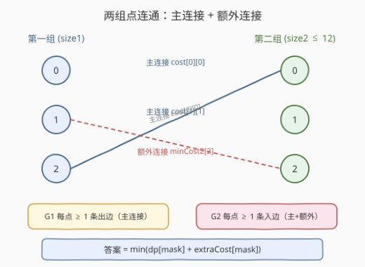
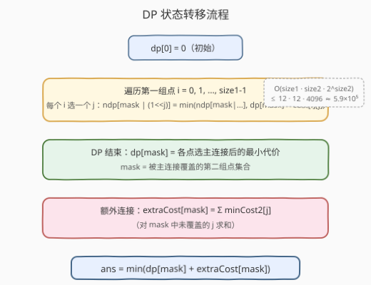
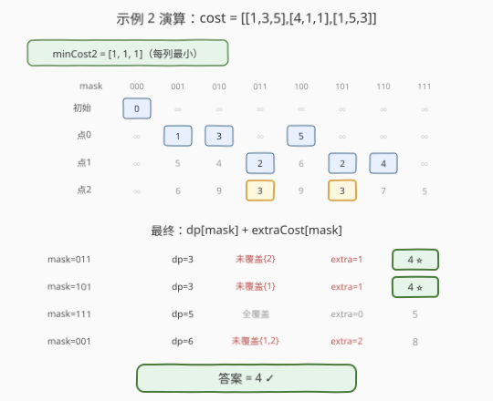

# 连通两组点的最小成本

- **题目名称**：连通两组点的最小成本
- **链接**：[1595. 连通两组点的最小成本](https://leetcode.cn/problems/minimum-cost-to-connect-two-groups-of-points/)
- **难度**：困难
- **标签**：动态规划、状态压缩、位运算

## 1. 题目概述

给定两组点：第一组 `size1` 个点，第二组 `size2` 个点，且 `size1 >= size2`。用一个 `size1 × size2` 的矩阵 `cost` 表示连接代价，`cost[i][j]` 是第一组点 `i` 与第二组点 `j` 的连接成本。要求**两组中的每个点都至少与另一组中的一个点相连**，求满足条件的**最小总成本**。

**示例 1**：

```text
输入：cost = [[15, 96], [36, 2]]
输出：17
解释：1--A (15), 2--B (2)，总成本 17。
```

**示例 2**：

```text
输入：cost = [[1, 3, 5], [4, 1, 1], [1, 5, 3]]
输出：4
解释：1--A (1), 2--B (1), 2--C (1), 3--A (1)，总成本 4。
      点 2 和 A 各有两条边，但题目不限制边数，只求最低总成本。
```

**示例 3**：

```text
输入：cost = [[2, 5, 1], [3, 4, 7], [8, 1, 2], [6, 2, 4], [3, 8, 8]]
输出：10
```

**约束条件**：

- `size1 == cost.length`
- `size2 == cost[i].length`
- `1 <= size1, size2 <= 12`
- `size1 >= size2`
- `0 <= cost[i][j] <= 100`

> ⚠️ **关键信号**：`size2 <= 12` 且 `size1 >= size2`——较小的第二组最多 12 个点，`2^12 = 4096` 个子集。这恰好是**状压 DP** 的甜区：用位掩码记录第二组点的覆盖状态，在第一组上逐点推进。

---

## 2. 解题思路

### 2.1 暴力思路：枚举所有连边方案

每个第一组点可连向第二组点的任意非空子集（共 $2^{\text{size2}} - 1$ 种选择），$\text{size1}$ 个点合计 $(2^{\text{size2}} - 1)^{\text{size1}}$ 种方案。$\text{size2} = 12$ 时达 $4095^{12}$，完全不可行。

> 💡 转换视角：连接方案可以分解为「每个第一组点选一条**主连接**」+「为未覆盖的第二组点补**额外连接**」。这一分解把指数级搜索变成了状压 DP。

### 2.2 核心观察：主连接 + 额外连接分解



**关键洞察**：最优方案中，每个第一组点 `i` 可能连接多个第二组点，但我们总可以将其拆分为：

- **主连接**：每个第一组点 `i` 选**恰好一个**第二组点 `j`（满足"第一组每点至少一条边"的约束），代价 `cost[i][j]`；
- **额外连接**：对于主连接未能覆盖的第二组点 `j'`，从**任意**第一组点 `i'` 补一条边，取最便宜的 `min(cost[i'][j'])`。

> 💡 **为什么分解不影响最优性？** 额外连接的来源不受限制——可以从任意第一组点出发。对于未覆盖的第二组点 `j`，全局最优的补边代价就是 $\min_i \text{cost}[i][j]$，与主连接的选择**互相独立**。即便最优方案中某第一组点连了多条边，我们也能把其中一条归为"主连接"，其余视为"额外连接"（可能来自同一点，代价不增）。

**预处理**：对每个第二组点 `j`，预先计算最小连入代价：

$$\text{minCost2}[j] = \min_{0 \le i < \text{size1}} \text{cost}[i][j]$$

对于掩码 `mask` 中**未被覆盖**的第二组点，额外代价为：

$$\text{extraCost}[\text{mask}] = \sum_{\substack{j \notin \text{mask}}} \text{minCost2}[j]$$

### 2.3 状态压缩 DP



**状态定义**：

> $\text{dp}[\text{mask}]$ = 依次为每个第一组点各选一个主连接后，已覆盖的第二组点集合为 `mask` 时的最小总代价。

**状态转移**：处理第一组点 `i` 时，枚举它选择第二组点 `j`（0..size2-1），代价 `cost[i][j]`：

$$\text{ndp}[\text{mask} \mid (1 \ll j)] = \min\bigl(\text{ndp}[\text{mask} \mid (1 \ll j)],\ \text{dp}[\text{mask}] + \text{cost}[i][j]\bigr)$$

- **初始**：`dp[0] = 0`（尚未处理任何第一组点）。
- **答案**：$\min_{\text{mask}} \bigl(\text{dp}[\text{mask}] + \text{extraCost}[\text{mask}]\bigr)$。

> ⚠️ **为什么不直接要求 `mask == full`？** 主连接只保证每个第一组点有一条边，但不保证所有第二组点都被覆盖。比如所有第一组点都选了同一个第二组点 `j`，则其他第二组点未覆盖。额外连接在最终一步统一补齐，避免在 DP 中枚举多连接子集（那样会退化到 $O(4^{\text{size2}})$）。

### 2.4 示例演算

以示例 2 `cost = [[1, 3, 5], [4, 1, 1], [1, 5, 3]]` 为例（size1=3, size2=3）：



**预处理**：`minCost2 = [1, 1, 1]`（每列最小值）。

**DP 逐层推进**（mask 用 3 位二进制表示，低位对应 j=0）：

| 处理点 | mask=000 | mask=001 | mask=010 | mask=011 | mask=100 | mask=101 | mask=110 | mask=111 |
|--------|----------|----------|----------|----------|----------|----------|----------|----------|
| 初始 | **0** | ∞ | ∞ | ∞ | ∞ | ∞ | ∞ | ∞ |
| 点 0 | ∞ | **1** | **3** | ∞ | **5** | ∞ | ∞ | ∞ |
| 点 1 | ∞ | 5 | 4 | **2** | 6 | **2** | **4** | ∞ |
| 点 2 | ∞ | 6 | 9 | **3** | 9 | **3** | 7 | **5** |

**最终答案**：对每个 `mask` 计算 `dp[mask] + extraCost[mask]`：

| mask | dp[mask] | 未覆盖点 | extraCost | 合计 |
|------|----------|----------|-----------|------|
| 011 | 3 | {2} | 1 | **4** ⭐ |
| 101 | 3 | {1} | 1 | **4** ⭐ |
| 111 | 5 | — | 0 | 5 |
| 001 | 6 | {1,2} | 2 | 8 |
| 110 | 7 | {0} | 1 | 8 |

最优解为 **4**，对应 `mask=011`（点 0→j=0, 点 1→j=1, 点 2→j=0，额外补 j=2）或 `mask=101`（点 0→j=0, 点 1→j=2, 点 2→j=0，额外补 j=1），与示例一致。

---

## 3. 参考代码

### C++

```cpp
class Solution {
  public:
    int connectTwoGroups(vector<vector<int>>& cost) {
        int size1 = cost.size(), size2 = cost[0].size();
        int full = (1 << size2) - 1;

        vector<int> minCost2(size2, INT_MAX);
        for (int j = 0; j < size2; ++j)
            for (int i = 0; i < size1; ++i)
                minCost2[j] = min(minCost2[j], cost[i][j]);

        vector<int> extraCost(1 << size2, 0);
        for (int mask = 0; mask <= full; ++mask)
            for (int j = 0; j < size2; ++j)
                if (!(mask >> j & 1))
                    extraCost[mask] += minCost2[j];

        vector<int> dp(1 << size2, INT_MAX);
        dp[0] = 0;
        for (int i = 0; i < size1; ++i) {
            vector<int> ndp(1 << size2, INT_MAX);
            for (int mask = 0; mask <= full; ++mask) {
                if (dp[mask] == INT_MAX) continue;
                for (int j = 0; j < size2; ++j) {
                    int nm = mask | (1 << j);
                    ndp[nm] = min(ndp[nm], dp[mask] + cost[i][j]);
                }
            }
            dp = move(ndp);
        }

        int ans = INT_MAX;
        for (int mask = 0; mask <= full; ++mask)
            if (dp[mask] != INT_MAX)
                ans = min(ans, dp[mask] + extraCost[mask]);
        return ans;
    }
};
```

### Python

```python
class Solution:
    def connectTwoGroups(self, cost: List[List[int]]) -> int:
        size1, size2 = len(cost), len(cost[0])
        full = (1 << size2) - 1

        minCost2 = [min(cost[i][j] for i in range(size1)) for j in range(size2)]

        extraCost = [0] * (1 << size2)
        for mask in range(1 << size2):
            for j in range(size2):
                if not (mask >> j & 1):
                    extraCost[mask] += minCost2[j]

        INF = float('inf')
        dp = [INF] * (1 << size2)
        dp[0] = 0
        for i in range(size1):
            ndp = [INF] * (1 << size2)
            for mask in range(1 << size2):
                if dp[mask] == INF:
                    continue
                for j in range(size2):
                    nm = mask | (1 << j)
                    if dp[mask] + cost[i][j] < ndp[nm]:
                        ndp[nm] = dp[mask] + cost[i][j]
            dp = ndp

        return min(dp[mask] + extraCost[mask] for mask in range(1 << size2))
```

> 💡 **滚动数组**：`dp` 只依赖上一轮的值，用 `dp` / `ndp` 两层数组交替即可，空间 $O(2^{\text{size2}})$。`extraCost` 预计算后复用，不随 DP 轮次变化。

---

## 4. 复杂度分析

| 维度 | 复杂度 | 说明 |
|------|--------|------|
| 时间复杂度 | $O(\text{size1} \cdot \text{size2} \cdot 2^{\text{size2}})$ | DP 轮数 $\text{size1}$，每轮枚举 $2^{\text{size2}}$ 个 mask，每个 mask 枚举 $\text{size2}$ 个目标点 |
| 空间复杂度 | $O(2^{\text{size2}})$ | `dp` / `ndp` / `extraCost` 各 $O(2^{\text{size2}})$ |

> ⚠️ 代入上限 $\text{size1} = \text{size2} = 12$：$12 \times 12 \times 4096 \approx 5.9 \times 10^5$，毫秒级完成。`extraCost` 预计算 $O(\text{size2} \cdot 2^{\text{size2}}) \approx 4.9 \times 10^4$，可忽略。

---

## 5. 扩展：子集枚举 DP（不做分解）

如果不做"主连接 + 额外连接"分解，也可直接让每个第一组点 `i` 连向第二组点的一个**非空子集** `sub`，DP 直接追踪覆盖集合。但需要注意：当所有第二组点已被覆盖时，当前第一组点仍须至少连一条边（约束不可省），需额外取 $\min_j \text{cost}[i][j]$ 补上。

```cpp
for (int i = 0; i < size1; ++i) {
    vector<int> ndp(1 << size2, INT_MAX);
    for (int mask = 0; mask <= full; ++mask) {
        if (dp[mask] == INT_MAX) continue;
        int rem = full ^ mask;
        if (rem == 0) {
            int best = *min_element(cost[i].begin(), cost[i].end());
            ndp[mask] = min(ndp[mask], dp[mask] + best);
            continue;
        }
        for (int sub = rem; sub; sub = (sub - 1) & rem) {
            int c = 0;
            for (int j = 0; j < size2; ++j)
                if (sub >> j & 1) c += cost[i][j];
            ndp[mask | sub] = min(ndp[mask | sub], dp[mask] + c);
        }
    }
    dp = move(ndp);
}
// 答案 = dp[full]
```

复杂度 $O(\text{size1} \cdot 3^{\text{size2}})$（子集枚举摊还），$\text{size2} = 12$ 时约 $6.4 \times 10^6$，仍可过但常数更大。**分解法的优势在于把多连接的决策推迟到末尾统一贪心补齐，DP 转移只需枚举单个目标点，效率高一个量级。**

---

## 6. 面试要点

1. **为什么用 `mask` 记录第二组而非第一组的覆盖状态？**

   - 因为 `size2 <= size1`，用较小的一组建掩码可以让状态数 $2^{\text{size2}}$ 最小。题目保证 `size1 >= size2`，所以对第二组建掩码是天然选择。

2. **"主连接 + 额外连接"分解为什么正确？**

   - 每个第一组点至少需要一条边（主连接满足），每个第二组点至少需要一条边（主连接覆盖一部分，剩余由额外连接补齐）。额外连接取全局最小 $\min_i \text{cost}[i][j]$，与主连接方案独立，因此两部分可分别优化后合并。

3. **为什么不能只取 `dp[full]` 作为答案？**

   - `dp[mask]` 只保证每个第一组点选了一条主连接，`mask` 是被覆盖的第二组点集合。可能并非所有第二组点都被覆盖（比如所有第一组点都选了同一个 `j`）。需要枚举所有 `mask`，加上 `extraCost` 补齐未覆盖点，取整体最小。

4. **`extraCost` 为什么可以预处理？**

   - 额外连接的代价只取决于"哪些第二组点未覆盖"和"每个第二组点的最小连入代价"，与主连接的具体方案无关。因此 $\text{extraCost}[\text{mask}]$ 只依赖 `mask`，可以预计算一张表。

5. **`size2 = 12` 为什么是状压 DP 的甜区？**

   - $2^{12} = 4096$ 个状态，配合 $\text{size1} \le 12$ 轮外循环和 $\text{size2}$ 内循环，总操作 $\sim 6 \times 10^5$。一般经验：$n \le 20$ 的"选/不选"问题可考虑状压 DP，$n \le 12$ 时转移里还能再套一层枚举。

---

## 7. 同类练习题

- [1655. 分配重复整数](https://leetcode.cn/problems/distribute-repeating-integers/)：状压 DP 进阶，`mask` 表示已分配的需求子集，与本题"mask 表示已覆盖点集合"同构
- [691. 贴纸拼词](https://leetcode.cn/problems/stickers-to-spell-word/)：`mask` 表示已拼出的目标字符子集，求最少贴纸数（最值型状压 DP，转移结构类似）
- [526. 优美的排列](https://leetcode.cn/problems/beautiful-arrangement/)（[题解](../0501-0600/526_优美的安排.md))：`mask` 表示已放数字集合，`popcount` 定位置——与本题"逐点推进 + mask 追踪覆盖"的骨架一致
- [1799. N 次操作后的最大分数](https://leetcode.cn/problems/maximize-score-after-n-operations/)：`mask` 表示剩余可用数字，成对取数求最大得分，状态设计思路与本题一致
- [1125. 最小的必要团队](https://leetcode.cn/problems/smallest-sufficient-team/)：`mask` 表示已满足的技能集合，求最少人数——同样是最小覆盖型状压 DP，对比"最小代价"与"最少人数"
