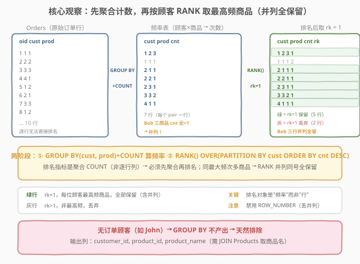
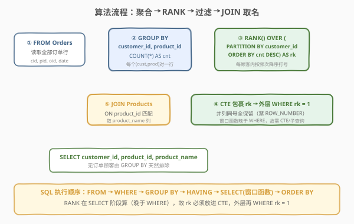
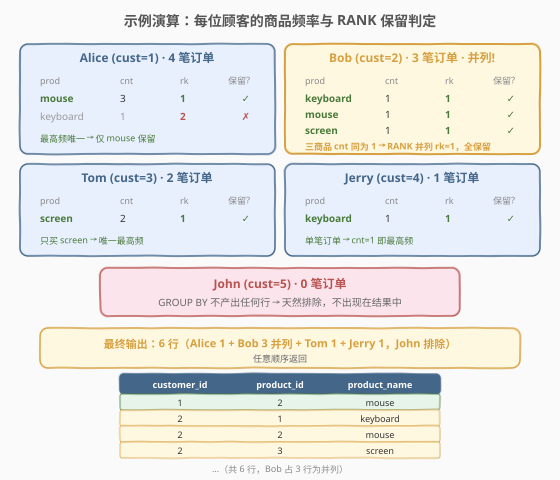

# LeetCode 每位顾客最经常订购的商品 题解

## 1. 题目概述

- **标题 / 题号**：每位顾客最经常订购的商品（#1596，medium）
- **链接**：https://leetcode.cn/problems/the-most-frequently-ordered-products-for-each-customer/
- **难度**：中等
- **标签**：数据库、SQL、窗口函数、`RANK`、Top-1 per group、并列保留、`GROUP BY` + `COUNT`、聚合后排名、`JOIN`、`MAX` + `IN` 子查询、LeetCode 锁题

**题意**：给定 `Customers`、`Orders`、`Products` 三张表，编写 SQL 查询，找到**每位顾客最经常订购的商品**。若同一顾客有多个商品并列最高订购次数，则**全部返回**；无订单的顾客不出现在结果中。结果可按任意顺序返回。

**表结构**：

```text
Table: Customers
+---------------+---------+
| Column Name   | Type    |
+---------------+---------+
| customer_id   | int     |  ← 具有唯一值
| name          | varchar |
+---------------+---------+
该表包含消费者的信息。

Table: Orders
+---------------+---------+
| Column Name   | Type    |
+---------------+---------+
| order_id      | int     |  ← 具有唯一值
| order_date    | date    |
| customer_id   | int     |
| product_id    | int     |
+---------------+---------+
该表包含 id 为 customer_id 的消费者的订单信息。

Table: Products
+---------------+---------+
| Column Name   | Type    |
+---------------+---------+
| product_id    | int     |  ← 具有唯一值
| product_name  | varchar |
| price         | int     |
+---------------+---------+
该表包含商品信息。
```

**输出列**：`customer_id`、`product_id`、`product_name`，可按任意顺序返回。

> ⚠️ 本题的 `Customers` 表为**干扰项**——输出列只需 `customer_id`（来自 `Orders`）、`product_id`（来自 `Orders`）、`product_name`（来自 `Products`），完全不涉及客户名。识别并剔除冗余表是本题的第一个小考点（与同库 1549「每件商品的最新订单」剔除 `Customers` 同理）。

**示例 1**：

```text
输入：
Customers 表:
+-------------+-----------+
| customer_id | name      |
+-------------+-----------+
| 1           | Alice     |
| 2           | Bob       |
| 3           | Tom       |
| 4           | Jerry     |
| 5           | John      |
+-------------+-----------+

Orders 表:
+----------+------------+-------------+------------+
| order_id | order_date | customer_id | product_id |
+----------+------------+-------------+------------+
| 1        | 2020-07-31 | 1           | 1          |
| 2        | 2020-07-30 | 2           | 2          |
| 3        | 2020-08-29 | 3           | 3          |
| 4        | 2020-07-29 | 4           | 1          |
| 5        | 2020-06-10 | 1           | 2          |
| 6        | 2020-08-01 | 2           | 1          |
| 7        | 2020-08-01 | 3           | 3          |
| 8        | 2020-08-03 | 1           | 2          |
| 9        | 2020-08-07 | 2           | 3          |
| 10       | 2020-07-15 | 1           | 2          |
+----------+------------+-------------+------------+

Products 表:
+------------+--------------+-------+
| product_id | product_name | price |
+------------+--------------+-------+
| 1          | keyboard     | 120   |
| 2          | mouse        | 80    |
| 3          | screen       | 600   |
| 4          | hard disk    | 450   |
+------------+--------------+-------+

输出:
+-------------+------------+--------------+
| customer_id | product_id | product_name |
+-------------+------------+--------------+
| 1           | 2          | mouse        |
| 2           | 1          | keyboard     |
| 2           | 2          | mouse        |
| 2           | 3          | screen       |
| 3           | 3          | screen       |
| 4           | 1          | keyboard     |
+-------------+------------+--------------+
```

**解释**：

| 顾客 | 订单数 | 各商品订购次数 | 最高频 | 保留 |
|------|--------|----------------|--------|------|
| Alice (1) | 4 笔 | keyboard×1, mouse×3 | mouse（3 次） | 1 行 |
| Bob (2) | 3 笔 | mouse×1, keyboard×1, screen×1 | **三者并列**（各 1 次） | 3 行 |
| Tom (3) | 2 笔 | screen×2 | screen（2 次） | 1 行 |
| Jerry (4) | 1 笔 | keyboard×1 | keyboard（1 次） | 1 行 |
| John (5) | 0 笔 | — | — | 0 行（排除） |

**约束**：

- `customer_id` 是 `Customers` 表具有唯一值的列
- `order_id` 是 `Orders` 表具有唯一值的列
- `product_id` 是 `Products` 表具有唯一值的列
- 结果可按任意顺序返回

> 💡 本题是 SQL **"Top-1 per group 并列保留 + 聚合后排名"招牌题**——核心套路：先 `GROUP BY customer_id, product_id` + `COUNT(*)` 算出每位顾客对每件商品的**订购次数**，再 `RANK() OVER (PARTITION BY customer_id ORDER BY cnt DESC)` 给每位顾客的商品按次数降序打序号 `rk`，最后 `WHERE rk = 1` 过滤。两个难点：① **排名指标是聚合 `COUNT`（非逐行列）**，必须先 `GROUP BY` 聚合再排名——不能像 1549 那样直接对原始行 `RANK`；② **并列保留**——Bob 三件商品次数同为 1，必须用 `RANK`/`DENSE_RANK`（并列同号）而非 `ROW_NUMBER`（强制唯一，会丢两行）。

## 2. 解题思路

### 2.1 暴力思路：逐顾客找最高频

最直觉的过程式思路：对每位顾客，统计其各商品的订购次数，找到最大次数，再筛出等于该最大次数的所有商品。伪代码：

```text
result = []
for each customer c:
    counts = defaultdict(int)
    for o in Orders where o.customer_id == c.id:
        counts[o.product_id] += 1
    if counts:  # 有订单
        max_cnt = max(counts.values())
        for pid, cnt in counts.items():
            if cnt == max_cnt:
                result.append((c.id, pid, product_name[pid]))
```

但**纯 SQL 没有显式逐行循环**——"按顾客分组 + 组内找最大频次的所有商品"需换成集合式表达。关键在于：组内最大频次可能对应**多个商品**（如 Bob 的三个并列），不能简单 `ORDER BY cnt DESC LIMIT 1`（会丢并列行）。

### 2.2 核心观察：两阶段——先聚合 COUNT 再 RANK（并列全保留）



**问题拆解为三个子问题**：

1. **聚合计数**：`GROUP BY customer_id, product_id` + `COUNT(*) AS cnt`。把 `Orders` 的原始行折叠成「每位顾客 × 每件商品 → 订购次数」的频率表。例如 Alice 买 mouse 三次（order #5、#8、#10），折叠后 `(1, 2, 3)` 一行。

2. **组内排序打序号**：`RANK() OVER (PARTITION BY customer_id ORDER BY cnt DESC)` 给每位顾客的商品按次数倒序编号。`PARTITION BY customer_id` 表示「每位顾客独立编号」；`ORDER BY cnt DESC` 表示「次数越多的商品序号越小」。**关键**：`RANK` 对排序值相同的行分配**相同序号**——Bob 的 keyboard、mouse、screen 同为 `cnt = 1`，均得 `rk = 1`。

3. **过滤最高频**：`WHERE rk = 1`。由于 `RANK` 让最大次数的所有商品都得 `rk = 1`，**并列行天然全保留**——无需额外判断。

> ⚠️ **本题与 1549「每件商品的最新订单」的关键区别**：1549 的排名指标是**逐行列**（`order_date`），可直接对原始订单行 `RANK() OVER (PARTITION BY product_id ORDER BY order_date DESC)`；本题的排名指标是**聚合值**（`COUNT(*)`），原始订单行没有"次数"这个列——**必须先 `GROUP BY` 聚合出频率表，再对聚合后的行 `RANK`**。这是「聚合后排名」模式的招牌特征。

> ⚠️ **本题最易错点**：误用 `ROW_NUMBER()`。`ROW_NUMBER` 强制组内序号唯一递增，即便排序值相同也分配 1、2、3…——Bob 的三个 `cnt = 1` 商品会得 `rk = 1`、`2`、`3`，过滤 `rk = 1` 只剩一行，**丢失两个并列商品**。本题必须用 `RANK` 或 `DENSE_RANK`（两者在 `rk = 1` 时结果一致）。

> 💡 **RANK vs DENSE_RANK vs ROW_NUMBER**：详见第 5 节扩展。一句话——**取"最高频的所有商品"用 `RANK`/`DENSE_RANK`，取"恰好前 N 行"用 `ROW_NUMBER`**。

### 2.3 算法流程图



**逻辑执行步骤**：

| 步骤 | 子句 | 作用 |
|------|------|------|
| ① | `FROM Orders` | 读取全部订单行 |
| ② | `GROUP BY customer_id, product_id` + `COUNT(*) AS cnt` | 折叠为「顾客×商品→次数」频率表 |
| ③ | `RANK() OVER (PARTITION BY customer_id ORDER BY cnt DESC) AS rk` | 每顾客组内按次数降序打序号（并列同号） |
| ④ | CTE 包裹 `rk` → 外层 `WHERE rk = 1` | 过滤保留每顾客最高频的所有商品（并列全留） |
| ⑤ | `JOIN Products ON product_id` | 关联商品表取 `product_name` |

> 💡 **SQL 子句执行顺序**：`FROM`（含 `JOIN`/`ON`）→ `WHERE` → `GROUP BY` → `HAVING` → `SELECT`（含窗口函数）→ `ORDER BY` → `LIMIT`。窗口函数在 `SELECT` 阶段计算，**晚于 `WHERE` 与 `GROUP BY`**——这正是「`rk` 必须放进 CTE/子查询，外层再过滤」的根本原因（与 1549/1532 同理）。且 `RANK` 作用于 `GROUP BY` 之后的聚合行，故 `GROUP BY` 和 `RANK` 分属两个查询层（CTE 嵌套）。

### 2.4 示例演算

以示例 1 数据为例，观察「`GROUP BY` 聚合 → `RANK` 打序号 → 过滤 `rk = 1`」的逐步过程：



**步骤 ①②：GROUP BY + COUNT 聚合**

每位顾客各商品的订购次数：

| 顾客 | 商品 | cnt | 说明 |
|------|------|-----|------|
| Alice (1) | mouse | 3 | order #5、#8、#10 |
| Alice (1) | keyboard | 1 | order #1 |
| Bob (2) | keyboard | 1 | order #6 |
| Bob (2) | mouse | 1 | order #2 |
| Bob (2) | screen | 1 | order #9 |
| Tom (3) | screen | 2 | order #3、#7 |
| Jerry (4) | keyboard | 1 | order #4 |

> 💡 **John (5) 无订单**：`GROUP BY` 只对 `Orders` 中出现的行聚合，John 没有任何订单行，自然不产出任何分组——天然排除，无需额外 `WHERE`。

**步骤 ③：RANK() OVER (PARTITION BY customer_id ORDER BY cnt DESC)**

| 顾客 | 商品 | cnt | rk | 保留? |
|------|------|-----|----|-------|
| Alice | mouse | 3 | 1 | ✓ |
| Alice | keyboard | 1 | 2 | ✗ |
| Bob | keyboard | 1 | 1 | ✓ |
| Bob | mouse | 1 | 1 | ✓（与 keyboard、screen 同 cnt，并列 rk=1） |
| Bob | screen | 1 | 1 | ✓ |
| Tom | screen | 2 | 1 | ✓ |
| Jerry | keyboard | 1 | 1 | ✓ |

**步骤 ④⑤：WHERE rk = 1 + JOIN Products**

保留 5 行（Alice 1 + Bob 3 + Tom 1 + Jerry 1），`JOIN Products` 取 `product_name`，得到最终 6 行输出（Bob 贡献 3 行并列）。

> 💡 **Bob 的 rk 为何三个都是 1？** `RANK` 对排序值相同的行分配相同序号。Bob 三件商品的 `cnt` 同为 1，`ORDER BY cnt DESC` 后三者并列最高，`RANK` 全部给 `rk = 1`。若用 `ROW_NUMBER`，会强制分成 1、2、3，过滤 `= 1` 只留一个——丢失两个并列商品。

> ⚠️ **为何输出是 6 行而非 5 行？** 步骤 ③ 的 `rk = 1` 行共 5 行（聚合后的频率行），但 Bob 占 3 行——每行对应一个 `(customer_id, product_id)` 对。`JOIN Products` 后每行追加 `product_name`，行数不变仍为 6 行（Alice 1 + Bob 3 + Tom 1 + Jerry 1 = 6）。注意「频率表行数」与「输出行数」一致，因为每个 `(customer, product)` 对最多产出一条输出。

## 3. 参考代码

### SQL（解法 A：`RANK` 窗口函数，推荐）

```sql
WITH counts AS (
    SELECT customer_id, product_id, COUNT(*) AS cnt
    FROM Orders
    GROUP BY customer_id, product_id
),
ranked AS (
    SELECT customer_id, product_id,
           RANK() OVER (PARTITION BY customer_id ORDER BY cnt DESC) AS rk
    FROM counts
)
SELECT r.customer_id  AS customer_id,
       r.product_id   AS product_id,
       p.product_name AS product_name
FROM ranked r
JOIN Products p ON r.product_id = p.product_id
WHERE r.rk = 1;
```

> 💡 **写法要点**：
> - **两层 CTE**：`counts` 先 `GROUP BY customer_id, product_id` + `COUNT(*)` 聚合出频率表；`ranked` 再对聚合行 `RANK`。两层缺一不可——`RANK` 的对象是「频率」而非「原始行」，必须先聚合。
> - **`RANK()` 而非 `ROW_NUMBER()`**：本题核心。`RANK` 让最大次数的所有商品都得 `rk = 1`，并列全保留；`ROW_NUMBER` 强制唯一会丢并列行。
> - **`PARTITION BY customer_id`**：每位顾客独立编号，`rk` 在每顾客组内从 1 重新开始。
> - **`JOIN Products`**：`Orders` 没有 `product_name`，需关联 `Products` 取商品名。用 `INNER JOIN`——`ranked` 只含有过订单的（顾客, 商品）对，天然无空匹配。
> - **`Customers` 表不用**：输出无需客户名，剔除冗余表。
> - ✓ **最推荐**：语义清晰、性能优（一次聚合 + 一次排序），MySQL 8.0+/PostgreSQL 通用。

### SQL（解法 B：`MAX(cnt)` + `IN` 子查询，无窗口函数）

```sql
WITH counts AS (
    SELECT customer_id, product_id, COUNT(*) AS cnt
    FROM Orders
    GROUP BY customer_id, product_id
)
SELECT c.customer_id  AS customer_id,
       c.product_id   AS product_id,
       p.product_name AS product_name
FROM counts c
JOIN Products p ON c.product_id = p.product_id
WHERE (c.customer_id, c.cnt) IN (
    SELECT customer_id, MAX(cnt)
    FROM counts
    GROUP BY customer_id
);
```

> 💡 **解法 B 的思路**：子查询 `SELECT customer_id, MAX(cnt) ... GROUP BY customer_id` 算出每位顾客的「最大订购次数」，外层用 `(customer_id, cnt) IN ...` 筛出**恰好等于该最大次数的所有商品**——并列行天然全保留（同次数多商品都匹配）。`GROUP BY` 只包含有订单的顾客，无订单顾客（John）自动排除。
>
> **与解法 A 的区别**：不依赖窗口函数，兼容 MySQL 5.7 等旧版本。语义上「`cnt` 等于该顾客最大次数 ⇔ 它是最高频商品之一」等价于 `RANK() = 1`，是 Top-1 per group 的经典非窗口写法。`(col1, col2) IN (...)` 是 MySQL 的**行构造器（row constructor）**语法，等价于逐列 `AND` 拼接但更精确——避免"顾客 A 的次数 + 顾客 B 的最大次数"的交叉错配。
>
> ⚠️ **`counts` CTE 被引用两次**：MySQL 8.0+ 的 CTE 可被多次引用且只物化一次；但若用 MySQL 5.7（不支持 CTE），需把 `counts` 写成派生表（子查询）`FROM (SELECT ... GROUP BY ...) counts` 重复两遍，或用临时表。

### SQL（解法 C：`NOT EXISTS` 相关子查询，语义对照）

```sql
WITH counts AS (
    SELECT customer_id, product_id, COUNT(*) AS cnt
    FROM Orders
    GROUP BY customer_id, product_id
)
SELECT c.customer_id  AS customer_id,
       c.product_id   AS product_id,
       p.product_name AS product_name
FROM counts c
JOIN Products p ON c.product_id = p.product_id
WHERE NOT EXISTS (
    SELECT 1
    FROM counts c2
    WHERE c2.customer_id = c.customer_id
      AND c2.cnt > c.cnt
);
```

> 💡 **解法 C 的思路**：对每个 `(顾客, 商品, 次数)` 行 `c`，检查「**不存在**同一顾客中次数比它大的商品」（`c2.cnt > c.cnt`）。若无更大次数，说明 `c` 处于该顾客的最高频——保留。同次数多商品互不"更大"（`>` 严格大于，不包含等于），故并列全保留。
>
> **与解法 B 的对照**：解法 B 用「等于最大值」正向匹配，解法 C 用「没有更大值」反向判定，两者等价（$x = \max S \iff \nexists y \in S,\ y > x$）。相关子查询对每行执行一次，最坏 $O(n^2)$（$n$ 为频率表行数）；可在频率表上建索引缓解，但频率表本身是临时结果，实际性能不如解法 A/B。

### Python（pandas）

```python
import pandas as pd

def the_most_frequently_ordered_products_for_each_customer(
    customers: pd.DataFrame, orders: pd.DataFrame, products: pd.DataFrame
) -> pd.DataFrame:
    counts = (
        orders.groupby(['customer_id', 'product_id'])
        .size()
        .reset_index(name='cnt')
    )
    counts['max_cnt'] = counts.groupby('customer_id')['cnt'].transform('max')
    top = counts[counts['cnt'] == counts['max_cnt']]
    result = top.merge(products, on='product_id', how='inner')
    return result[['customer_id', 'product_id', 'product_name']].reset_index(drop=True)
```

> 💡 **pandas 对照**：
> - `orders.groupby(['customer_id', 'product_id']).size()` 对应 `GROUP BY customer_id, product_id` + `COUNT(*)`——`size()` 计每组行数（等价 `COUNT(*)`）。`reset_index(name='cnt')` 把分组键变回普通列并命名计数列。
> - `.groupby('customer_id')['cnt'].transform('max')` 对应子查询 `MAX(cnt) ... GROUP BY customer_id`——`transform` 把组内最大值广播回每行，长度与原 DataFrame 对齐。
> - `counts['cnt'] == counts['max_cnt']` 对应 `WHERE (customer_id, cnt) IN (...)`——筛出等于最大次数的所有行，并列全保留。
> - 若想对照解法 A 的 `RANK`：`counts['rk'] = counts.groupby('customer_id')['cnt'].rank(method='min', ascending=False)`，再 `counts[counts['rk'] == 1]`。pandas `rank(method='min')` = SQL `RANK`，`method='dense'` = `DENSE_RANK`，`method='first'` = `ROW_NUMBER`（强制唯一，会丢并列，**不可用**）。
> - `merge(products, on='product_id', how='inner')` 对应 SQL 的 `JOIN Products`。

## 4. 复杂度分析

| 维度 | 解法 A（`RANK`） | 解法 B（`MAX` + `IN`） | 解法 C（`NOT EXISTS`） | pandas |
|------|------------------|------------------------|------------------------|--------|
| **时间** | $O(n + m \log m)$ | $O(n + m)$ | $O(n + m^2)$（最坏） | $O(n + m \log m)$ |
| **空间** | $O(m)$ | $O(m)$ | $O(m)$ | $O(m)$ |
| **是否依赖窗口函数** | 是（MySQL 8.0+） | 否 | 否 | 否（`transform`） |
| **并列保留** | ✓ `RANK` 同号 | ✓ `IN` 匹配最大值 | ✓ `>` 不含等于 | ✓ `== max_cnt` |
| **推荐度** | ✓ **首选** | ✓ 旧版本/无窗口函数首选 | ✓ 语义对照 | ✓ 验证用 |

> - $n$ = `Orders` 表行数，$m$ = 频率表行数（即不同的 `(customer_id, product_id)` 对数，$m \le n$）
> - **时间**：所有解法的第一阶段 `GROUP BY` 聚合需 $O(n)$（哈希聚合扫描 `Orders` 一次）。第二阶段：解法 A 的 `RANK` 需对每顾客组内排序 $O(\sum k_i \log k_i) \le O(m \log m)$（$k_i$ 为顾客 $i$ 的不同商品数）；解法 B 的 `MAX(cnt) ... GROUP BY` 哈希聚合 $O(m)$ + `IN` 半连接 $O(m)$（哈希查找），总体 $O(n + m)$，**理论最快**；解法 C 对频率表每行执行一次相关子查询，最坏 $O(m^2)$。
> - **空间**：所有解法的 `counts` CTE/频率表需 $O(m)$ 存储；解法 A 的排序额外 $O(m)$；解法 B 的哈希表 $O(m)$。
> - **索引优化**：在 `Orders(customer_id, product_id)` 上建复合索引可让 `GROUP BY` 走索引有序聚合（Loose Index Scan），避免哈希表；但本题数据量小，索引收益有限。

## 5. 扩展：聚合后排名 vs 逐行排名 + 三窗口函数并列对照

本题的辨析核心有两层：① **排名对象是「聚合值」还是「逐行列」**；② **并列时选哪个窗口函数**。

### 5.1 聚合后排名 vs 逐行排名

| 维度 | 1549 每件商品的最新订单 | 1596 每位顾客最经常订购的商品 |
|------|-------------------------|-------------------------------|
| 排名指标 | `order_date`（**逐行列**） | `COUNT(*)`（**聚合值**） |
| `RANK` 作用对象 | 原始 `Orders` 行 | `GROUP BY` 后的频率表行 |
| 查询结构 | 单层：`RANK` 直接在 `Orders` 上 | 两层：先 `GROUP BY` 聚合再 `RANK` |
| `PARTITION BY` | `product_id` | `customer_id` |
| `ORDER BY` | `order_date DESC` | `cnt DESC` |
| 并列来源 | 同一最大日期多笔订单 | 同一最大次数多个商品 |

> 💡 **判别信号**：若题目说"最经常/最频繁/次数最多"，排名指标是 `COUNT`——**必须先聚合再排名**（两阶段）；若题目说"最新/最大/最高"且指标是表中的现成列，可直接对原始行排名（单阶段）。1596 属前者，1549 属后者。

> ⚠️ **不能在 `RANK` 的 `ORDER BY` 里直接写 `COUNT(*)`**：`RANK() OVER (PARTITION BY customer_id ORDER BY COUNT(*) DESC)` 在「原始行」上执行时，`COUNT(*)` 无意义（每行都是 1）。`RANK` 的 `ORDER BY` 只能用**当前查询层可见的列**——聚合后的 `cnt` 列在 `counts` CTE 中可见，故 `RANK` 必须写在 `counts` 之后的 `ranked` 层。这是「聚合后排名」必须分两层的根本原因。

### 5.2 ROW_NUMBER vs RANK vs DENSE_RANK（并列处理对照）

设某顾客有 3 件商品，次数倒序为 `3, 1, 1`（后两者并列）：

| 商品 | cnt | `ROW_NUMBER` | `RANK` | `DENSE_RANK` |
|------|-----|--------------|--------|--------------|
| mouse | 3 | 1 | 1 | 1 |
| keyboard | 1 | 2 | 2 | 2 |
| screen | 1 | 3 | 2 | 2 |

> 💡 **口诀**：
> - `ROW_NUMBER`：**强制唯一**，并列也分 1、2、3（不跳号，但每行不同）。
> - `RANK`：**并列同号，后续跳号**（1, 2, 2, 4）。
> - `DENSE_RANK`：**并列同号，后续不跳**（1, 2, 2, 3）。

| 函数 | `WHERE rk = 1` 保留行数 | 本题适用? |
|------|-------------------------|-----------|
| `ROW_NUMBER` | 1 行（仅 mouse） | ✗ 丢并列 |
| `RANK` | 1 行（mouse，因 keyboard/screen 的 rk=2） | ✓ |
| `DENSE_RANK` | 1 行（mouse，同上） | ✓ |

> ⚠️ 上例中最大次数唯一（mouse 的 3），故 `RANK`/`DENSE_RANK` 只留 1 行。但 Bob 的场景（三商品 cnt 同为 1）才是并列考验：`RANK` 给三者同 `rk = 1`，全保留；`ROW_NUMBER` 分成 1、2、3，只留 1 行。**本题必须避免 `ROW_NUMBER`**。`RANK` 与 `DENSE_RANK` 在 `= 1` 时等价，任选其一。

### 5.3 与同库 1549「每件商品的最新订单」的对照

| 维度 | 1549 每件商品的最新订单 | 1596 每位顾客最经常订购的商品 |
|------|-------------------------|-------------------------------|
| 目标 | 每商品**最大日期所有订单** | 每顾客**最高频所有商品** |
| 排名指标 | `order_date`（逐行列） | `COUNT(*)`（聚合值） |
| 查询层数 | 单层 `RANK` | 两层：`GROUP BY` → `RANK` |
| 并列处理 | **并列全保留**（同日多笔） | **并列全保留**（同次数多商品） |
| 选函数 | `RANK` / `DENSE_RANK` | `RANK` / `DENSE_RANK` |
| 非窗口等价 | `MAX(order_date) + IN` | `MAX(cnt) + IN` |
| 干扰表 | `Customers`（不用） | `Customers`（不用） |

> 💡 **一句话辨析**：两者同为「Top-1 per group 并列保留」，但 1549 排名对象是**原始行的列**（单层 `RANK`），1596 排名对象是**聚合后的 `COUNT`**（两层 `GROUP BY` → `RANK`）。识别"指标是聚合值"是本题的关键。

### 5.4 变体：若要求"含无订单顾客"如何处理？

本题排除无订单顾客（John 不出现）。若题目改为「**每位顾客都列出**，无订单者的 `product_id`/`product_name` 为 `NULL`」，需从 `Customers` 出发 `LEFT JOIN`：

```sql
WITH counts AS (
    SELECT customer_id, product_id, COUNT(*) AS cnt
    FROM Orders
    GROUP BY customer_id, product_id
),
ranked AS (
    SELECT customer_id, product_id,
           RANK() OVER (PARTITION BY customer_id ORDER BY cnt DESC) AS rk
    FROM counts
)
SELECT c.customer_id  AS customer_id,
       r.product_id   AS product_id,
       p.product_name AS product_name
FROM Customers c
LEFT JOIN ranked r ON c.customer_id = r.customer_id AND r.rk = 1
LEFT JOIN Products p ON r.product_id = p.product_id;
```

> 💡 关键在 `LEFT JOIN ranked r ON c.customer_id = r.customer_id AND r.rk = 1`——把 `rk = 1` 的过滤条件放进 `ON`（而非 `WHERE`），让无订单顾客（`ranked` 中无匹配）仍以 `NULL` 保留。这是「`INNER` vs `LEFT JOIN`」选择决定结果集是否含"无匹配行"的典型示范（与 1581 反连接的 `ON` vs `WHERE` 辨析同源）。

## 6. 面试要点

1. **为什么本题需要两层 CTE（先 `GROUP BY` 再 `RANK`）？**

   > 排名指标是 `COUNT(*)`——一个**聚合值**，而非原始 `Orders` 行上的现成列。`RANK() OVER (PARTITION BY customer_id ORDER BY cnt DESC)` 中的 `cnt` 必须先由 `GROUP BY customer_id, product_id` + `COUNT(*)` 算出。若直接对原始行 `RANK`，`ORDER BY COUNT(*)` 对每行都是 1（每行自身计数为 1），排名无意义。故必须「先聚合出频率表 → 再对频率表排名」两层。对比 1549 排名指标是 `order_date`（逐行列），可单层 `RANK`。

2. **为什么本题用 `RANK` 而非 `ROW_NUMBER`？**

   > 本题要求"最高频的**所有**商品"——若同一顾客有多个商品次数并列最高（如 Bob 的 keyboard、mouse、screen 同为 1 次），需全部返回。`RANK` 对排序值相同的行分配相同序号，三个都得 `rk = 1`，过滤后并列全保留。`ROW_NUMBER` 强制组内序号唯一（1、2、3），过滤 `= 1` 只剩一个，丢失并列商品。

3. **`RANK` 和 `DENSE_RANK` 在本题有区别吗？**

   > 在「过滤 `rk = 1`」时**无区别**——两者都让最高频的所有商品得 `rk = 1`。区别在后续序号：`RANK` 跳号（1, 2, 2, 4），`DENSE_RANK` 不跳（1, 2, 2, 3）。本题只取 `= 1`，跳不跳号无关，故皆可。若题目改为"取前两高频"（`rk <= 2`），`RANK` 的 `rk <= 2` 含最高频 + 第二频（但第二频的并列全含），`DENSE_RANK` 的 `rk <= 2` 也含最高频 + 第二频——此时两者结果仍一致（因并列同号），差异只在第三频是否从 3 还是 4 开始。

4. **解法 B 中 `(customer_id, cnt) IN (...)` 为何不能拆成两个 `IN`？**

   > `customer_id IN (...) AND cnt IN (...)` 是两个独立的 `IN`——会误匹配"顾客 A 的次数 + 顾客 B 的最大次数"的交叉组合。例如 Alice 的 keyboard `cnt=1` 恰好等于 Bob 的 `MAX(cnt)=1`，会被误判为 Alice 的最高频（实际 Alice 最高频是 mouse 的 3 次）。行构造器 `(customer_id, cnt) IN (SELECT customer_id, MAX(cnt) ...)` 要求元组**整体匹配**某条 `(顾客, 该顾客最大次数)`，避免串味。这与 1549 解法 B 的 `(product_id, order_date) IN (...)` 同理。

5. **如何处理"无订单的顾客"？**

   > `GROUP BY customer_id, product_id` 只对 `Orders` 中出现的行聚合——无订单顾客（John）没有任何订单行，不产出任何分组，天然排除，无需额外 `WHERE`。这是「`GROUP BY` 天然排除无数据分组」的特性。若误从 `Customers` 出发 `LEFT JOIN`，John 会以 `NULL` 行出现，需额外处理。本题要求排除无订单顾客，从 `Orders` 出发 `GROUP BY` 最直接。

> 💡 **一句话总结**：1596 是 SQL **"Top-1 per group 并列保留 + 聚合后排名"招牌题**——核心模板「`GROUP BY customer_id, product_id` + `COUNT(*)` 聚合 → `RANK() OVER (PARTITION BY customer_id ORDER BY cnt DESC)` 打 `rk` → 外层 `WHERE rk = 1` → `JOIN Products` 取名」。最大要点：**排名指标是聚合 `COUNT` 时必须先 `GROUP BY` 再 `RANK`（两阶段）**；**最高频有并列时必须用 `RANK`/`DENSE_RANK`，禁用 `ROW_NUMBER`**；无订单顾客由 `GROUP BY` 天然排除。与 1549「逐行列排名单层 `RANK`」形成"聚合后 vs 逐行"的经典对照。

## 同类练习题

| # | 题目 | 与本题的关联 |
|---|------|-------------|
| 1549 | [每件商品的最新订单 🔒](https://leetcode.cn/problems/the-most-recent-orders-for-each-product/)（[题解](../1501-1600/1549_每件商品的最新订单.md)） | 同库同家族 Top-1 per group 并列保留，**排名指标是逐行列 `order_date`（单层 `RANK`）**，与本题"聚合值 `COUNT`（两层）"形成对照 |
| 184 | [部门工资最高的员工](https://leetcode.cn/problems/department-highest-salary/)（[题解](../0101-0200/184_部门工资最高的员工.md)） | Top-1 per group 入门题，若并列最高薪需全返回则与 1596 同构（用 `RANK`/`MAX+IN`），排名指标是逐行列 `salary` |
| 185 | [部门工资前三高的所有员工 🔒](https://leetcode.cn/problems/department-top-three-salaries/) | `DENSE_RANK` 取每组前 3 高薪，并列用 `DENSE_RANK` 不跳号，与 1596 共享"并列保留"思想 |
| 1532 | [最近的三笔订单 🔒](https://leetcode.cn/problems/the-most-recent-three-orders/)（[题解](../1501-1600/1532_最近的三笔订单.md)） | `ROW_NUMBER` 取每组前 3 行（强制唯一），与 1596 "并列保留用 `RANK`"形成"强制唯一 vs 并列全留"的对照 |
| 1174 | [即时食物配送 II 🔒](https://leetcode.cn/problems/immediate-food-delivery-ii/) | `ROW_NUMBER`/`MIN` 求首次订单 → 聚合算比例，共享「`PARTITION BY` 找组内最值 + 聚合」骨架 |
