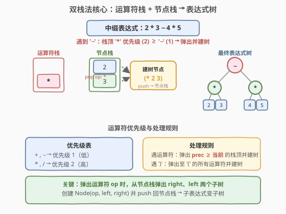
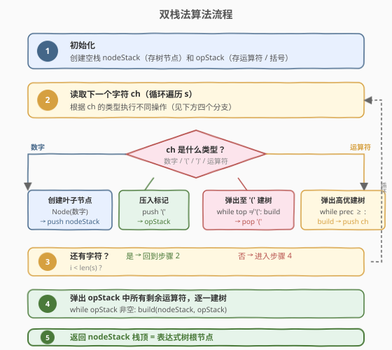
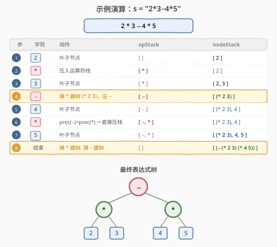

# LeetCode 根据中缀表达式构造二叉表达式树 题解

## 1. 题目概述

- **标题 / 题号**：根据中缀表达式构造二叉表达式树（#1597，hard）
- **链接**：https://leetcode.cn/problems/build-binary-expression-tree-from-infix-expression/
- **难度**：困难
- **标签**：栈、表达式解析、二叉树、Shunting-Yard 算法

**题意**：给定一个表示**中缀表达式**的字符串 `s`，其中包含数字（`0-9`）、四则运算符（`+`、`-`、`*`、`/`）和括号（`(`、`)`）。请构造一棵**二叉表达式树**，满足：

- **叶节点**是数字（`val` 为数字字符串），`left` / `right` 为 `None`。
- **内部节点**是运算符（`val` 为运算符字符），`left` 为左操作数子树，`right` 为右操作数子树。
- 树的结构反映**运算符优先级**：`*` / `/` 优先级高于 `+` / `-`，括号可改变优先级。

**节点定义**：

```python
class Node:
    def __init__(self, val, left=None, right=None):
        self.val = val
        self.left = left
        self.right = right
```

**示例 1**：

```text
输入：s = "2*3-4*5"
输出：根为 '-' 的表达式树
     −
    / \
   *   *
  / \ / \
 2  3 4  5
解释：* 优先级高于 -，故 2*3 和 4*5 先各自成子树，- 作为根连接两者。
```

**示例 2**：

```text
输入：s = "2-3/(5*2)+4"
输出：根为 '+' 的表达式树
       +
      / \
     −   4
    / \
   2   /
      / \
     3   *
        / \
       5   2
解释：括号内 5*2 先算 → 3/(5*2) 次之 → 2-... 再次 → 最后 +4。
```

**约束**：

- `1 <= s.length <= 1000`
- `s` 由数字、`+`、`-`、`*`、`/`、`(`、`)` 组成
- `s` 是合法的中缀表达式

## 2. 解题思路

### 2.1 暴力思路：递归分治找最低优先级运算符

最直观的思路是**递归分治**：在当前表达式中找到**优先级最低**的运算符（不在括号内），以此运算符为根，左侧递归构造左子树，右侧构造右子树。

- 第一趟扫描找 `+` / `-`（优先级低），第二趟找 `*` / `/`（优先级高）。
- 找到则分割递归；找不到说明整体是数字或被括号包裹（去括号后再找）。

问题在于：每层递归都要**线性扫描**子区间找分割点，最坏情况（如 `"1+2+3+...+n"`）每层只切掉一个元素，退化到 $O(n^2)$。

> 💡 能否做到**一次扫描**就完成建树？可以——这正是 **Shunting-Yard 双栈法**的优势。

### 2.2 核心观察：双栈法（Shunting-Yard 变体）



经典 Shunting-Yard 算法用两个栈将中缀表达式转为后缀表达式。本题做一处关键改造：**不输出后缀序列，而是直接在栈上建树**。

**两个栈**：

| 栈 | 存储内容 | 说明 |
|----|----------|------|
| `nodeStack` | `Node*` | 数字叶子节点或已构建的子树根 |
| `opStack` | `char` | 运算符和 `(` 标记 |

**核心操作 `build()`**——弹出运算符并建树：

1. 从 `opStack` 弹出运算符 `op`
2. 从 `nodeStack` 弹出 `right`（先弹的是右操作数）
3. 从 `nodeStack` 弹出 `left`（后弹的是左操作数）
4. 创建 `Node(op, left, right)`，push 回 `nodeStack`

> ⚠️ **弹栈顺序**：先弹 right 再弹 left，因为栈是后进先出，表达式左操作数先入栈。

**优先级表**：

| 运算符 | 优先级 |
|--------|--------|
| `+`  `-` | 1（低） |
| `*`  `/` | 2（高） |

**处理规则**：

- **数字**：创建叶子节点 → push `nodeStack`
- **`(`**：push `opStack`（作为子表达式边界标记）
- **`)`**：循环 `build()` 直到弹出 `(`（将括号内子表达式归约为一棵子树）
- **运算符 `op`**：循环弹出 `opStack` 中 `prec ≥ prec(op)` 的运算符并 `build()`，然后 push `op`

> 💡 **为什么用 `≥` 而非 `>`？** 四则运算都是**左结合**的。`"2-3+4"` 应理解为 `(2-3)+4`，遇到 `+` 时需先弹出同级的 `-` 建树，使 `-` 成为 `+` 的左子树。用 `≥` 保证同级运算符从左到右依次归约。

### 2.3 算法流程图



### 2.4 示例演算

以 `s = "2*3-4*5"` 为例，逐字符走一遍双栈法：



| 步骤 | 字符 | 动作 | opStack | nodeStack |
|------|------|------|---------|-----------|
| ① | `2` | 叶子节点 | `[ ]` | `[ 2 ]` |
| ② | `*` | 压栈 | `[ * ]` | `[ 2 ]` |
| ③ | `3` | 叶子节点 | `[ * ]` | `[ 2, 3 ]` |
| ④ | `-` | `prec(*)≥prec(-)` → 弹 `*` 建树 `(* 2 3)`，压 `-` | `[ - ]` | `[ (* 2 3) ]` |
| ⑤ | `4` | 叶子节点 | `[ - ]` | `[ (* 2 3), 4 ]` |
| ⑥ | `*` | `prec(-)<prec(*)` → 直接压栈 | `[ -, * ]` | `[ (* 2 3), 4 ]` |
| ⑦ | `5` | 叶子节点 | `[ -, * ]` | `[ (* 2 3), 4, 5 ]` |
| ⑧ | 结束 | 弹 `*` 建树 `(* 4 5)`，弹 `-` 建树 `(- (* 2 3) (* 4 5))` | `[ ]` | `[ (- (* 2 3) (* 4 5)) ]` |

> 💡 **步骤④是关键**：遇到 `-` 时，栈顶 `*` 优先级更高，必须先弹出 `*` 并与 `2`、`3` 组合成子树 `(* 2 3)`，然后才能压入 `-`。这保证了 `*` 比 `-` 先结合（优先级高的先算）。
>
> **步骤⑥**：遇到 `*` 时栈顶是 `-`，`prec(-) < prec(*)`，不弹出，直接压栈。这让后面的 `4*5` 能先于前面的 `-` 结合。

最终 `nodeStack` 栈底只剩一个节点 `(- (* 2 3) (* 4 5))`，即为表达式树的根。

## 3. 参考代码

### 方法一：双栈法（推荐，$O(n)$）

### C++

```cpp
/**
 * 二叉表达式树节点定义（题目提供）
 * class Node {
 * public:
 *     string val;
 *     Node* left;
 *     Node* right;
 *     Node() : val(""), left(nullptr), right(nullptr) {}
 *     Node(string x) : val(x), left(nullptr), right(nullptr) {}
 *     Node(string x, Node* left, Node* right) : val(x), left(left), right(right) {}
 * };
 */
class Solution {
  public:
    Node* expTree(string s) {
        unordered_map<char, int> prec{{'+', 1}, {'-', 1}, {'*', 2}, {'/', 2}};
        stack<Node*> nodes;
        stack<char> ops;

        for (int i = 0; i < (int)s.size(); ) {
            char ch = s[i];
            if (isdigit(ch)) {
                int j = i;
                while (j < (int)s.size() && isdigit(s[j])) ++j;
                nodes.push(new Node(s.substr(i, j - i)));
                i = j;
                continue;
            }
            if (ch == '(') {
                ops.push(ch);
            } else if (ch == ')') {
                while (ops.top() != '(')
                    build(nodes, ops);
                ops.pop();                        // 弹出 '('
            } else if (prec.count(ch)) {
                while (!ops.empty() && ops.top() != '(' &&
                       prec[ops.top()] >= prec[ch])
                    build(nodes, ops);
                ops.push(ch);
            }
            ++i;
        }

        while (!ops.empty())                      // 弹出剩余运算符
            build(nodes, ops);

        return nodes.top();
    }

  private:
    void build(stack<Node*>& nodes, stack<char>& ops) {
        char op = ops.top(); ops.pop();
        Node* r = nodes.top(); nodes.pop();       // 先弹 right
        Node* l = nodes.top(); nodes.pop();       // 再弹 left
        nodes.push(new Node(string(1, op), l, r));
    }
};
```

### Python

```python
class Solution:
    def expTree(self, s: str) -> 'Node':
        prec = {'+': 1, '-': 1, '*': 2, '/': 2}
        nodes = []
        ops = []

        i = 0
        while i < len(s):
            ch = s[i]
            if ch.isdigit():
                j = i
                while j < len(s) and s[j].isdigit():
                    j += 1
                nodes.append(Node(s[i:j]))
                i = j
                continue
            if ch == '(':
                ops.append(ch)
            elif ch == ')':
                while ops[-1] != '(':
                    self._build(nodes, ops)
                ops.pop()                        # 弹出 '('
            elif ch in prec:
                while (ops and ops[-1] != '(' and
                       prec[ops[-1]] >= prec[ch]):
                    self._build(nodes, ops)
                ops.append(ch)
            i += 1

        while ops:                               # 弹出剩余运算符
            self._build(nodes, ops)
        return nodes[0]

    @staticmethod
    def _build(nodes, ops):
        op = ops.pop()
        right = nodes.pop()                      # 先弹 right
        left = nodes.pop()                       # 再弹 left
        nodes.append(Node(op, left, right))
```

> 💡 **对比 [224. 基本计算器](../0201-0300/224_基本计算器.md) / [227. 基本计算器 II](../0201-0300/227_基本计算器II.md)**：基本计算器也是双栈法，但求值时 `build()` 弹出两个数字直接算出结果 push 回去；本题 `build()` 弹出两个节点创建子树节点 push 回去。**算法骨架完全相同，区别只在"归约时算值还是建树"**。

## 4. 复杂度分析

| 维度 | 复杂度 | 说明 |
|------|--------|------|
| 时间复杂度 | $O(n)$ | 每个字符恰好处理一次（入栈 / 出栈各一次），`build()` 每次弹出 1 个运算符 + 2 个节点，总操作数 $O(n)$ |
| 空间复杂度 | $O(n)$ | 两个栈最坏各存 $O(n)$ 个元素（如 `"1+2+3+...+n"` 时 `opStack` 为空但 `nodeStack` 存 $n$ 个节点） |

> ⚠️ 嵌套括号如 `"(((((1+2)))))"` 会让 `opStack` 存 $O(n)$ 个 `(`，但总体仍为 $O(n)$。

## 5. 扩展：递归分治法

除了双栈法，还可以用**递归分治**：在当前区间找到**右最低优先级运算符**（右结合优先找右边的同级运算符以保证左结合性），以此分割递归。

### C++

```cpp
class Solution {
    string s;
  public:
    Node* expTree(string str) {
        s = str;
        return build(0, s.size() - 1);
    }
  private:
    int findMatch(int idx) {
        int bal = 0;
        for (int i = idx; i < (int)s.size(); ++i) {
            if (s[i] == '(') ++bal;
            else if (s[i] == ')') --bal;
            if (bal == 0) return i;
        }
        return -1;
    }
    int findOp(int lo, int hi, const string& ops) {
        int bal = 0, pos = -1;
        for (int i = lo; i <= hi; ++i) {
            if (s[i] == '(') ++bal;
            else if (s[i] == ')') --bal;
            else if (bal == 0 && ops.find(s[i]) != string::npos)
                pos = i;                         // 右最低优先级
        }
        return pos;
    }
    Node* build(int lo, int hi) {
        // 剥外层括号
        while (lo < hi && s[lo] == '(' && findMatch(lo) == hi) {
            ++lo; --hi;
        }
        int pos = findOp(lo, hi, "+-");          // 先找 +/-
        if (pos == -1) pos = findOp(lo, hi, "*/"); // 再找 */
        if (pos == -1) return new Node(s.substr(lo, hi - lo + 1));
        Node* root = new Node(string(1, s[pos]));
        root->left = build(lo, pos - 1);
        root->right = build(pos + 1, hi);
        return root;
    }
};
```

### Python

```python
class Solution:
    def expTree(self, s: str) -> 'Node':
        def find_match(idx):
            bal = 0
            for i in range(idx, len(s)):
                if s[i] == '(': bal += 1
                elif s[i] == ')': bal -= 1
                if bal == 0: return i
            return -1

        def find_op(lo, hi, ops_set):
            bal = 0
            pos = -1
            for i in range(lo, hi + 1):
                if s[i] == '(': bal += 1
                elif s[i] == ')': bal -= 1
                elif bal == 0 and s[i] in ops_set:
                    pos = i                      # 右最低优先级
            return pos

        def build(lo, hi):
            while lo < hi and s[lo] == '(' and find_match(lo) == hi:
                lo += 1
                hi -= 1
            pos = find_op(lo, hi, '+-')
            if pos == -1:
                pos = find_op(lo, hi, '*/')
            if pos == -1:
                return Node(s[lo:hi + 1])
            root = Node(s[pos])
            root.left = build(lo, pos - 1)
            root.right = build(pos + 1, hi)
            return root

        return build(0, len(s) - 1)
```

| 维度 | 双栈法 | 递归分治 |
|------|--------|----------|
| 时间 | $O(n)$ | $O(n^2)$（每层扫描找分割点） |
| 空间 | $O(n)$（栈） | $O(n)$（递归深度） |
| 优点 | 一次扫描，线性复杂度 | 思路直观，易理解 |
| 适用 | 面试首选 | 数据量小或作为验证 |

> 💡 **为什么找"右"最低优先级？** 左结合性要求 `2-3+4` = `(2-3)+4`，树根为 `+`。找右边的 `+` 分割，左侧 `2-3` 递归后根为 `-`，恰好得到 `+(- 2 3, 4)`。若找左边的 `-` 分割，会得到 `-(2, + 3 4)` = `2-(3+4)`，语义错误。

## 6. 面试要点

1. **为什么用两个栈而不是递归？**

   双栈法一次扫描 $O(n)$ 即可建树；递归分治每层需线性扫描找分割点，最坏 $O(n^2)$。双栈法也更自然地处理左结合性和优先级——通过 `prec ≥` 比较自动决定何时归约。

2. **为什么弹出条件是 `>=` 而不是 `>`？**

   四则运算都是**左结合**的。`"2-3+4"` 应为 `(2-3)+4`，遇到 `+` 时需先弹出同级的 `-` 建树，使 `-` 成为 `+` 的左子树。用 `>=` 保证同级运算符从左到右依次归约；用 `>` 则 `-` 留在栈中，最终 `-` 成为根，结果变成 `2-(3+4)`，语义错误。

3. **如何处理括号？**

   `(` 压入 `opStack` 作为**子表达式边界标记**，其"优先级"最低（不参与 `prec` 比较，`ops.top() != '('` 条件阻止弹出）。`)` 触发循环 `build()` 直到弹出 `(`，将括号内子表达式归约为一棵子树后丢弃 `(`。

4. **叶节点和内部节点的区别？**

   叶节点（数字）：`left = right = None`，`val` 为数字字符串。内部节点（运算符）：`left` = 左操作数子树，`right` = 右操作数子树，`val` 为运算符字符。

5. **和基本计算器（224/227）的关系？**

   核心算法完全相同（双栈法 + 优先级比较）。区别仅在 `build()` 的归约动作：计算器弹出两个数字**算出结果** push 回去，本题弹出两个节点**创建子树** push 回去。掌握了双栈法，三类问题（中缀→后缀、中缀→求值、中缀→表达式树）一通百通。

## 同类练习题

| # | 题目 | 与本题的关联 |
|---|------|-------------|
| 224 | [基本计算器](https://leetcode.cn/problems/basic-calculator/)（[题解](../0201-0300/224_基本计算器.md)） | 栈处理中缀表达式求值（含括号与一元符号），本题的"只求值不建树"版本，双栈法同骨架 |
| 227 | [基本计算器 II](https://leetcode.cn/problems/basic-calculator-ii/)（[题解](../0201-0300/227_基本计算器II.md)） | 中缀表达式求值（无括号），双栈法的直接应用，`build()` 弹出数字算结果而非建树 |
| 150 | [逆波兰表达式求值](https://leetcode.cn/problems/evaluate-reverse-polish-notation/)（[题解](../0101-0200/150_逆波兰表达式求值.md)） | 后缀表达式求值，可对比"中缀→后缀→求值"与"中缀→表达式树"两条路线 |
| 394 | [字符串解码](https://leetcode.cn/problems/decode-string/) | 栈处理嵌套结构（数字+括号），双栈法的另一应用场景 |
| 736 | [Lisp 语法解析](https://leetcode.cn/problems/parse-lisp-expression/) | 递归下降解析，表达式求值的另一范式，对比栈法与递归法 |
