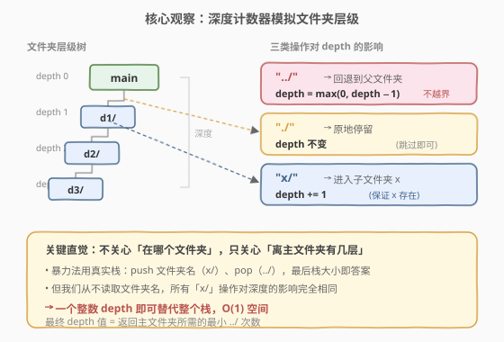
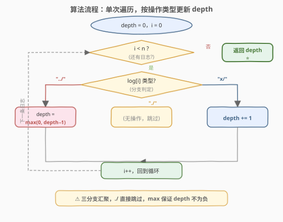
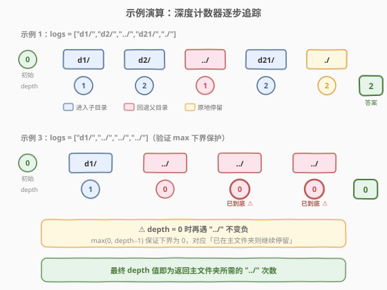

# 文件夹操作日志搜集器

- **题目名称**：文件夹操作日志搜集器
- **链接**：[1598. 文件夹操作日志搜集器](https://leetcode.cn/problems/crawler-log-folder/)
- **难度**：简单
- **标签**：栈、模拟、字符串

## 1. 题目概述

LeetCode 文件系统启动时位于**主文件夹**，用户依次执行一系列变更文件夹操作并记录日志。每条日志 `logs[i]` 是以下三种之一：

- `"../"`：移动到当前文件夹的**父文件夹**；若已在主文件夹则**继续停留**。
- `"./"`：继续停留在当前文件夹。
- `"x/"`：移动到名为 `x` 的**子文件夹**（题目保证 `x` 一定存在）。

执行完所有操作后，求**返回主文件夹所需的最小步数**（即还需执行多少次 `"../"`）。

**示例 1**：

```text
输入：logs = ["d1/","d2/","../","d21/","./"]
输出：2
解释：执行 "../" 操作 2 次，即可回到主文件夹。
```

**示例 2**：

```text
输入：logs = ["d1/","d2/","./","d3/","../","d31/"]
输出：3
```

**示例 3**：

```text
输入：logs = ["d1/","../","../","../"]
输出：0
```

**约束条件**：

- `1 <= logs.length <= 10^3`
- `2 <= logs[i].length <= 10`
- `logs[i]` 包含小写英文字母、数字、`'.'` 和 `'/'`
- 文件夹名称由小写英文字母和数字组成

> 💡 题目只问"离主文件夹还有几层"，是典型的**状态追踪**问题——只需记录当前深度，无需关心具体在哪个文件夹。

---

## 2. 解题思路

### 2.1 暴力思路：用真实栈模拟文件夹层级

最直观的做法是用一个**栈**忠实地模拟文件夹层级：遇到 `"x/"` 就把文件夹名 `x` 压栈，遇到 `"../"` 就弹栈（栈空时不弹），遇到 `"./"` 不动。最终栈的大小即为返回主文件夹所需的步数。

```text
stack = []
for log in logs:
    if log == "../":
        if stack: stack.pop()       # 回退一层（栈空则不动）
    elif log == "./":
        pass                       # 原地停留
    else:
        stack.append(log[:-1])     # 压入子文件夹名（去掉末尾 '/'）
return len(stack)
```

时间复杂度 $O(n)$，空间复杂度 $O(n)$（最坏情况栈深达 $n$）。问题在于——**我们从未读取过压入栈的文件夹名**。所有 `"x/"` 操作对深度的影响完全相同（都是 `+1`），存下来的名字纯属浪费空间。

### 2.2 核心观察：深度计数器替代栈



关键直觉：**不关心"在哪个文件夹"，只关心"离主文件夹有几层"**。三类操作对深度的影响是确定的：

- `"../"` → `depth = max(0, depth - 1)`（回退一层，但深度不为负）
- `"./"` → `depth` 不变（原地停留，直接跳过）
- `"x/"` → `depth += 1`（进入子文件夹，深度加一）

> 💡 **为什么用 `max(0, depth - 1)` 而不是 `depth - 1`？** 题目规定"若已在主文件夹则继续停留"。主文件夹对应 `depth = 0`，此时 `"../"` 不应使深度变为负数——`max(0, ...)` 正是这个下界保护。示例 3 中连续三个 `"../"` 在 `depth = 0` 时全部被挡住，最终答案为 0。

> 💡 **操作类型判定**：只需比较 `log` 是否等于 `"../"` 或 `"./"`，其余情况一律按 `"x/"` 处理（题目保证格式合法）。无需解析文件夹名。

### 2.3 算法流程图



整个流程是单层循环：读取 `log[i]` → 判断类型 → 更新 `depth` → 进入下一条。`"./"` 分支为空操作直接跳过，三个分支汇聚后 `i++` 回到循环头。遍历结束后 `depth` 即为答案。

### 2.4 示例演算



以**示例 1** `logs = ["d1/","d2/","../","d21/","./"]` 为例：

| 步骤 | 操作 | 类型 | depth | 说明 |
|------|------|------|-------|------|
| 初始 | — | — | 0 | 启动于主文件夹 |
| 1 | `d1/` | 子目录 | 1 | depth += 1 |
| 2 | `d2/` | 子目录 | 2 | depth += 1 |
| 3 | `../` | 回退 | 1 | max(0, 2−1) = 1 |
| 4 | `d21/` | 子目录 | 2 | depth += 1 |
| 5 | `./` | 停留 | 2 | 不变 |

最终 `depth = 2`，即需 2 次 `"../"` 返回主文件夹 ✓。

以**示例 3** `logs = ["d1/","../","../","../"]` 验证下界保护：

| 步骤 | 操作 | depth | 说明 |
|------|------|-------|------|
| 初始 | — | 0 | — |
| 1 | `d1/` | 1 | depth += 1 |
| 2 | `../` | 0 | max(0, 1−1) = 0 |
| 3 | `../` | 0 | max(0, 0−1) → 0（被挡住 ⚠） |
| 4 | `../` | 0 | max(0, 0−1) → 0（被挡住 ⚠） |

最终 `depth = 0`，已在主文件夹，无需操作 ✓。

---

## 3. 参考代码

### C++（深度计数器一次遍历）

```cpp
class Solution {
  public:
    int minOperations(vector<string>& logs) {
        int depth = 0;
        for (const string& log : logs) {
            if (log == "../") {
                depth = max(0, depth - 1);
            } else if (log == "./") {
                continue;
            } else {
                depth++;
            }
        }
        return depth;
    }
};
```

### Python

```python
class Solution:
    def minOperations(self, logs: list[str]) -> int:
        depth = 0
        for log in logs:
            if log == "../":
                depth = max(0, depth - 1)
            elif log == "./":
                continue
            else:
                depth += 1
        return depth
```

> 💡 **`continue` 可省略**：`"./"` 分支什么都不做，直接落到循环末尾即可。显式写 `continue` 只是为了和 `../`、`x/` 三个分支对称，可读性更好。

---

## 4. 复杂度分析

| 维度 | 复杂度 | 说明 |
|------|--------|------|
| 时间复杂度 | $O(n)$ | 遍历 `logs` 一次，每条日志只做常数次字符串比较与算术运算 |
| 空间复杂度 | $O(1)$ | 只用一个整数 `depth`，与暴力栈法的 $O(n)$ 相比省去全部存储 |

---

## 5. 扩展：真实栈解法

若题目改为"需要输出返回主文件夹的**路径**"（即经过哪些文件夹名回退），则深度计数器不够用，必须用真实栈记录层级中的文件夹名：

```cpp
class Solution {
  public:
    int minOperations(vector<string>& logs) {
        vector<string> stk;
        for (const string& log : logs) {
            if (log == "../") {
                if (!stk.empty()) stk.pop_back();
            } else if (log == "./") {
                continue;
            } else {
                stk.push_back(log.substr(0, log.size() - 1));  // 去掉末尾 '/'
            }
        }
        return stk.size();
    }
};
```

| 维度 | 计数器法 | 真实栈法 |
|------|----------|----------|
| 时间 | $O(n)$ | $O(n)$ |
| 空间 | $O(1)$ | $O(n)$ |
| 能否输出路径 | 否 | 是 |
| 本题推荐 | **更优** | 大材小用 |

> 💡 **"计数器替代栈"是一种通用优化模式**：当栈中元素的状态只影响"深度/个数"而不影响后续决策时（即所有元素的"贡献"同质），就可以用一个标量替代整个栈。类似思想见于 [844. 退格键比较](https://leetcode.cn/problems/backspace-string-compare/)（退格符删除字符，只需数剩余长度）。

---

## 6. 面试要点

1. **为什么计数器能替代栈？**

   - 栈法中压入的文件夹名**从未被读取**——所有 `"x/"` 对深度的贡献都是 `+1`，与具体名字无关。当栈只承载"数量"信息且元素同质时，一个整数标量即可替代整个栈，空间从 $O(n)$ 降到 $O(1)$。

2. **`max(0, depth - 1)` 的作用是什么？**

   - 对应题目"若已在主文件夹则继续停留"的规则。主文件夹 `depth = 0`，`"../"` 不应让深度变负。`max(0, ...)` 是下界保护，确保深度始终非负。示例 3 中连续 `"../"` 在 `depth = 0` 时全部被挡住。

3. **如何判定操作类型？需要解析字符串吗？**

   - 不需要解析。直接用 `==` 比较 `log` 是否等于 `"../"` 或 `"./"`，其余情况一律按子目录处理（`depth++`）。题目保证格式合法，无需校验。

4. **如果题目改成"输出回退路径"呢？**

   - 计数器法无法记录具体文件夹名，必须退回真实栈法（见第 5 节）。这体现了"空间换信息"的权衡——存更多状态才能回答更细的问题。

5. **`"./"` 分支为什么可以直接跳过？**

   - `"./"` 表示原地停留，对深度无任何影响。分支体为空即可，显式 `continue` 只是风格选择。跳过它不改变 `depth`，也不影响后续操作。

---

## 7. 同类练习题

- [844. 退格键比较](https://leetcode.cn/problems/backspace-string-compare/)：退格符删除字符，同样可用"计数器替代栈"（数剩余长度而非真实压栈），与本题同属"同质元素栈→标量优化"
- [682. 棒球比赛](https://leetcode.cn/problems/baseball-game/)：用栈记录每轮得分，`+`/`D`/`C` 三种操作改写栈顶——与本题"按操作类型更新状态"思路同源，但需读取栈顶故不可降为计数器
- [1544. 整理字符串](https://leetcode.cn/problems/make-the-string-great/)：栈模拟相邻字符消除，判定时需读取栈顶字符故不可降维，对照本题"何时能用计数器"
- [71. 简化路径](https://leetcode.cn/problems/simplify-path/)（[题解](../0001-0100/71_简化路径.md)）：用栈处理路径层级（`..` 弹栈、目录名压栈），是本题的"绝对路径"升级版——需输出简化路径故必须用栈
- [1441. 用栈操作构建数组](https://leetcode.cn/problems/build-an-array-with-stack-operations/)：栈模拟生成目标数组，`push`/`pop` 操作序列模拟，同属"按规则模拟栈行为"的简单题
