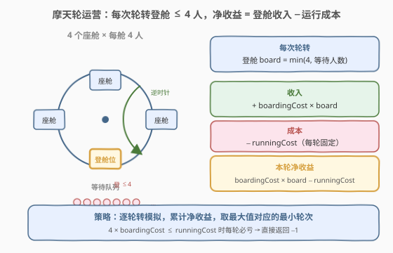
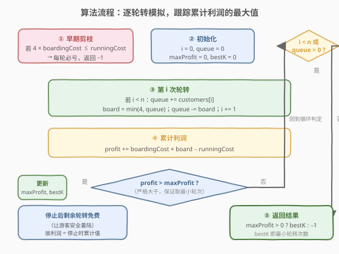
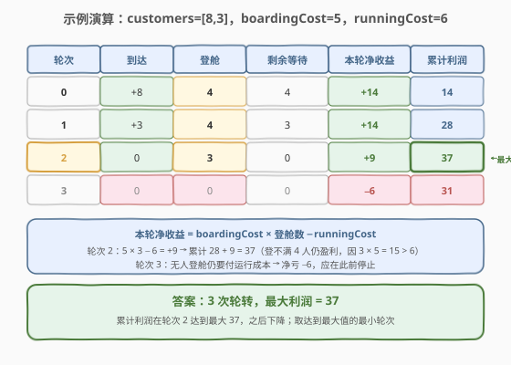

# LeetCode 经营摩天轮的最大利润 题解

## 1. 题目概述

- **标题 / 题号**：经营摩天轮的最大利润（#1599，medium）
- **链接**：https://leetcode.cn/problems/maximum-profit-of-operating-a-centennial-wheel/
- **难度**：中等
- **标签**：数组、贪心、模拟

**题意**：你经营一座摩天轮，共有 **4 个座舱**，每个座舱**最多容纳 4 位游客**。每次逆时针轮转需支付运行成本 `runningCost`。游客在登上离地面最近的座舱时支付 `boardingCost`，该座舱再次抵达地面时离开。

给定数组 `customers`，`customers[i]` 表示**第 `i` 次轮转之前**到达的新游客数（下标从 0 开始）。这意味着**必须先轮转 `i` 次才能等到第 `i` 批游客**——游客到达与轮转下标绑定。若有座舱空闲就不能让游客等待；等待人数超过 4 时，每次只有 4 位能登舱，其余等待下次轮转。

你可以随时停下摩天轮（即便还没服务完所有游客）；**停止后为让游客安全着陆，剩余轮转全部免费**。返回**最大化利润所需的最小轮转次数**；若不存在利润为正的方案，返回 `-1`。

**示例 1**：

```text
输入：customers = [8,3], boardingCost = 5, runningCost = 6
输出：3
解释：
1. 8 位到达，4 位登舱，4 位等待，轮转。利润 4×5 − 1×6 = 14。
2. 3 位到达，4 位登舱（含等待），3 位等待，轮转。利润 8×5 − 2×6 = 28。
3. 最后 3 位登舱，轮转。利润 11×5 − 3×6 = 37。
轮转 3 次得最大利润 37。
```

**示例 2**：

```text
输入：customers = [10,9,6], boardingCost = 6, runningCost = 4
输出：7
解释：累计利润依次 20, 40, 60, 80, 100, 120, 122，第 7 次达最大 122。
```

**示例 3**：

```text
输入：customers = [3,4,0,5,1], boardingCost = 1, runningCost = 92
输出：-1
解释：满舱也只有 4×1 = 4 < 92，每次轮转必亏，利润永不为正。
```

**约束**：

- `n == customers.length`
- `1 <= n <= 10^5`
- `0 <= customers[i] <= 50`
- `1 <= boardingCost, runningCost <= 100`

## 2. 解题思路

### 2.1 暴力思路：枚举停止时机

摩天轮在第 `k` 次轮转后停止，利润为「前 `k` 次轮转的累计净收益」。暴力做法是枚举每个停止点 `k`，对每个 `k` 从头模拟一遍前 `k` 次轮转，取所有利润的最大值——这是 $O(K^2)$，其中 $K$ 为总轮转数，显然太慢。

> 💡 关键观察：每次轮转的净收益**只取决于当次登舱人数**，与前序无关；累计利润是逐轮累加的。因此**一趟线性扫描**即可得到所有停止点的累计利润，再取最大。

### 2.2 核心观察：逐轮转模拟 + 累计利润取最大

每次轮转的净收益为：

$$\text{profit}_i = \text{boardingCost} \times \min(4,\ \text{queue}_i) - \text{runningCost}$$

其中 `queue_i` 是第 `i` 次轮转时（加入本批游客后）的等待人数。累计利润 $P_k = \sum_{i=0}^{k-1} \text{profit}_i$。由于停止后剩余轮转免费，**停止于第 `k` 次时的最终利润就是 $P_k$**。



如上图所示，模型可归纳为三点：

1. **每轮登舱上限 4**：`board = min(4, queue)`，超过的继续等待。
2. **每轮固定成本**：无论登几人都要付 `runningCost`；登 0 人则纯亏 `runningCost`。
3. **取最大累计值**：累计利润随轮次波动（中途可能下降），需记录所有时刻的最大值及对应**最小轮次**。

> ⚠️ **提前剪枝**：满舱收入 $4 \times \text{boardingCost}$ 是单轮最大收入。若 $4 \times \text{boardingCost} \le \text{runningCost}$，则**任意一次轮转都非盈利**，累计利润单调不增，最大值只能是初始的 0（不轮转），不可能为正 → 直接返回 `-1`。这正是示例 3 的情况。

### 2.3 算法流程图



**状态**：`i`（已轮转次数，即下一个要处理的批号）、`queue`（等待人数）、`profit`（累计利润）、`maxProfit`、`bestK`。

**主循环**（`while i < n 或 queue > 0`）：

1. 若 `i < n`：`queue += customers[i]`。
2. `board = min(4, queue)`；`queue -= board`；`i += 1`。
3. `profit += boardingCost * board - runningCost`。
4. 若 `profit > maxProfit`（**严格大于**）：`maxProfit = profit`，`bestK = i`（即当前轮转次数）。严格大于保证同一最大值取**最小轮次**。

**终止**：当 `i >= n` 且 `queue == 0`，再轮转只会登 0 人纯亏，停止。返回 `maxProfit > 0 ? bestK : -1`。

> 💡 **为何用严格大于？** 累计利润可能在多个轮次达到同一峰值（如先升后降再回升到同值）。题目要求**最小轮转次数**，故仅在严格超过历史最大时才更新 `bestK`，相同时保留更早的轮次。

### 2.4 示例演算

以示例 1 `customers = [8,3]`，`boardingCost = 5`，`runningCost = 6` 为例：



| 轮次 | 到达 | 登舱 | 剩余等待 | 本轮净收益 | 累计利润 |
|------|------|------|----------|------------|----------|
| 0 | +8 | 4 | 4 | $4 \times 5 - 6 = +14$ | 14 |
| 1 | +3 | 4 | 3 | $4 \times 5 - 6 = +14$ | 28 |
| 2 | 0 | 3 | 0 | $3 \times 5 - 6 = +9$ | **37** ← 最大 |
| 3 | 0 | 0 | 0 | $0 - 6 = -6$ | 31 |

轮次 2 累计达 37（最大），轮次 3 开始下降。返回 `bestK = 3`（达到最大值时的轮转次数）。

> 💡 注意轮次 2 只登 3 人仍盈利（$3 \times 5 = 15 > 6$）。是否做这最后一趟「不满舱」的轮转，由累计利润是否创新高决定——模拟过程自动判定，无需特判。

## 3. 参考代码

### C++

```cpp
class Solution {
  public:
    int minOperationsMaxProfit(vector<int>& customers, int boardingCost, int runningCost) {
        // 满舱仍不盈利 -> 每轮必亏，不可能为正
        if (4 * boardingCost <= runningCost) return -1;

        int i = 0, n = customers.size();
        int queue = 0, profit = 0;
        int maxProfit = 0, bestK = -1;

        while (i < n || queue > 0) {
            if (i < n) queue += customers[i];
            int board = min(4, queue);
            queue -= board;
            ++i;
            profit += boardingCost * board - runningCost;
            if (profit > maxProfit) {   // 严格大于 -> 取最小轮次
                maxProfit = profit;
                bestK = i;
            }
        }
        return maxProfit > 0 ? bestK : -1;
    }
};
```

### Python

```python
class Solution:
    def minOperationsMaxProfit(self, customers: List[int], boardingCost: int, runningCost: int) -> int:
        # 满舱仍不盈利 -> 每轮必亏
        if 4 * boardingCost <= runningCost:
            return -1

        i, n = 0, len(customers)
        queue = profit = 0
        max_profit = 0
        best_k = -1

        while i < n or queue > 0:
            if i < n:
                queue += customers[i]
            board = min(4, queue)
            queue -= board
            i += 1
            profit += boardingCost * board - runningCost
            if profit > max_profit:   # 严格大于 -> 取最小轮次
                max_profit = profit
                best_k = i

        return best_k if max_profit > 0 else -1
```

> 💡 `bestK` 初始化为 `-1`：若全程未出现正利润，循环结束后 `maxProfit` 仍为 0，直接返回 `-1`，与「利润非正返回 -1」的语义一致。

## 4. 复杂度分析

| 维度 | 复杂度 | 说明 |
|------|--------|------|
| 时间复杂度 | $O(n + S/4)$ | $S$ 为游客总数；轮转次数 = 到达阶段 $n$ 次 + 清空队列 $\lceil S_{\text{余}}/4 \rceil$ 次，每次 $O(1)$ |
| 空间复杂度 | $O(1)$ | 只用常数个变量 |

> ⚠️ 约束下 $n \le 10^5$、`customers[i] <= 50`，游客总数 $S \le 5 \times 10^6$，最坏约 $1.25 \times 10^6$ 次轮转，C++/Python 均可轻松通过。

## 5. 扩展：清空队列阶段的 $O(1)$ 批量加速

当所有批次到达完毕（`i >= n`）后，若 `4 * boardingCost > runningCost`（已通过早期剪枝保证），剩余队列每轮登 4 人、净赚固定值 $g = 4 \times \text{boardingCost} - \text{runningCost} > 0$。这一段累计利润**单调递增**，可用除法一次性算完，无需逐轮循环：

- 满舱轮数 `full = queue // 4`：累计利润增加 `full * g`，最大值出现在最后一次满舱轮转（轮次 `i + full`）。
- 余数 `rem = queue % 4`：若 `rem > 0` 再登一次 `rem` 人，净收益 `rem * boardingCost - runningCost`；仅当它为正时才可能再创新高。

这样总时间降为严格 $O(n)$，对极大队列更稳健：

```cpp
// 接主循环之后，处理 i >= n 的剩余队列
if (queue > 0) {
    int g = 4 * boardingCost - runningCost;     // > 0
    int full = queue / 4, rem = queue % 4;
    profit += full * g;
    if (profit > maxProfit) { maxProfit = profit; bestK = i + full; }
    if (rem > 0) {
        profit += rem * boardingCost - runningCost;
        if (profit > maxProfit) { maxProfit = profit; bestK = i + full + 1; }
    }
}
// 此时主循环条件可改为 while (i < n)
```

> 💡 由于满舱段单调递增，只需检查「最后一次满舱」和「最后一次余数」两个候选点，即可锁定该阶段对全局最大值的贡献。

## 6. 面试要点

1. **为什么游客到达与轮转下标绑定？**

   - 题目明确 `customers[i]` 是「第 `i` 次轮转之前」到达的游客，且「必须在新游客到来前轮转 `i` 次」。即要拿到第 `i` 批游客，必须先完成 `i` 次轮转。因此不能跳过亏损轮转去直接取后面批次，必须顺序模拟。

2. **提前剪枝的条件是什么？**

   - 单轮最大收入为满舱 $4 \times \text{boardingCost}$。若它 $\le \text{runningCost}$，任意轮转都非盈利，累计利润单调不增，最大值只能是 0，返回 `-1`。

3. **为什么更新最大值用严格大于？**

   - 累计利润可能多次达到同一峰值；题目要**最小轮转次数**，严格大于保证只在真正超过历史最大时更新 `bestK`，相等时保留更早轮次。

4. **停止后剩余轮转免费，对算法有何影响？**

   - 这意味着停止于第 `k` 次时最终利润就是累计 $P_k$，无需为「让游客落地」额外付运行成本。算法只需跟踪累计利润序列的最大值即可。

5. **何时返回 `-1`？**

   - 全程累计利润从未超过 0（`maxProfit == 0`）时返回 `-1`；只要某一轮转使累计利润为正，就返回首次达到该最大值的最小轮次。

## 同类练习题

| # | 题目 | 与本题的关联 |
|---|------|-------------|
| 121 | [买卖股票的最佳时机](https://leetcode.cn/problems/best-time-to-buy-and-sell-stock/)（[题解](../0001-0100/121_买卖股票的最佳时机.md)） | 一次遍历跟踪前缀最值，本题同样「线性扫描累计、取最大」的套路 |
| 53 | [最大子数组和](https://leetcode.cn/problems/maximum-subarray-sum/)（[题解](../0001-0100/53_最大子数组和.md)） | 累计和在波动序列中取最大，思路同源 |
| 1518 | [换水问题](https://leetcode.cn/problems/water-bottles/)（[题解](./1518_换水问题.md)） | 模拟「每轮用满换新」的循环计数，本题登舱满 4 的逻辑与之同构 |
| 2073 | [买票需要的时间](https://leetcode.cn/problems/time-needed-to-buy-tickets/) | 逐位模拟每轮消耗一个名额，与本题逐轮登舱 4 人的轮转模拟同型 |
