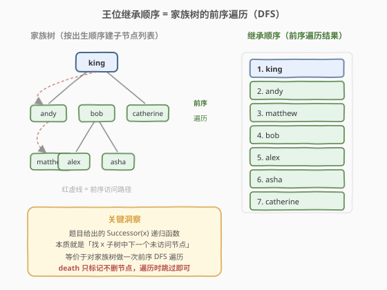
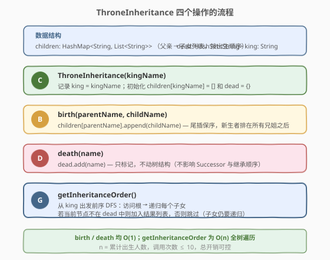
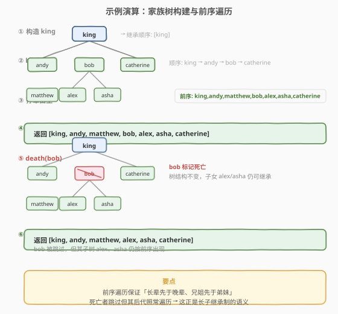

# 王位继承顺序

- **题目名称**：王位继承顺序
- **链接**：[1600. 王位继承顺序](https://leetcode.cn/problems/throne-inheritance/)
- **难度**：中等
- **标签**：树、深度优先搜索、设计、哈希表

## 1. 题目概述

一个王国里住着国王、他的孩子们、他的孙子们等等。每一个时间点，这个家庭里有人出生也有人死亡。王国的继承顺序第一继承人总是国王自己，题目用递归函数 `Successor(x, curOrder)` 描述了「给定一个人 `x` 和当前继承顺序，返回 `x` 的下一继承人」的逻辑：

- 若 `x` 没有孩子，或 `x` 的所有孩子都已在 `curOrder` 中：若 `x` 是国王返回 `null`，否则返回 `Successor(x 的父亲, curOrder)`。
- 否则返回 `x` 不在 `curOrder` 中**最年长**的孩子。

要求实现 `ThroneInheritance` 类，支持 `birth`（出生）、`death`（死亡）、`getInheritanceOrder`（获取当前继承顺序，排除已死者）三个操作。

**示例**：

```text
输入：
["ThroneInheritance", "birth", "birth", "birth", "birth", "birth", "birth", "getInheritanceOrder", "death", "getInheritanceOrder"]
[["king"], ["king", "andy"], ["king", "bob"], ["king", "catherine"], ["andy", "matthew"], ["bob", "alex"], ["bob", "asha"], [null], ["bob"], [null]]

输出：
[null, null, null, null, null, null, null, ["king", "andy", "matthew", "bob", "alex", "asha", "catherine"], null, ["king", "andy", "matthew", "alex", "asha", "catherine"]]
```

**约束条件**：

- `1 <= kingName.length, parentName.length, childName.length, name.length <= 15`
- 名字仅含小写英文字母，所有 `childName` 和 `kingName` 互不相同。
- `death` 中的 `name` 要么是国王，要么是已出生人员。
- 每次 `birth` 时 `parentName` 对应人员一定活着。
- 最多调用 $10^5$ 次 `birth` 和 `death`；最多调用 $10$ 次 `getInheritanceOrder`。

---

## 2. 解题思路

### 2.1 暴力思路：按题意模拟 Successor 函数

最直接的思路是照搬题目给出的 `Successor(x, curOrder)` 递归函数：每次要确定下一个继承人时，从国王出发反复调用 `Successor`，把返回的人加入 `curOrder`，直到返回 `null`。

问题在于：每确定一个继承人都要从某个节点向上回溯到父亲再向下找子女，单次 `Successor` 调用可能遍历 $O(n)$ 个节点，而 `curOrder` 有 $n$ 个人，构造完整顺序需要 $O(n^2)$。同时还需要维护「每个人是否已在 `curOrder` 中」的标记，并在每次 `death` 后重新计算——开销大且实现繁琐。

> 💡 转换视角：仔细观察 `Successor` 的语义——它总是优先访问 `x` 的最年长未访问子女；当 `x` 的子女全部访问完毕，才回溯到 `x` 的父亲继续。这恰恰是**前序深度优先遍历（ preorder DFS）**的定义。

### 2.2 核心观察：继承顺序 = 家族树的前序遍历



关键洞察：

- **家族树是一棵多叉树**：国王是根，`birth(parent, child)` 即给 `parent` 添加一个子节点。由于每次 `birth` 都把新孩子**尾插**到 `parent` 的子女列表，子女列表天然按**出生顺序（即长幼顺序）**排列。
- **`Successor` = 前序 DFS**：前序遍历的规则是「先访问根，再依次递归访问每个子树」。`Successor(x)` 找的正是 `x` 子树中下一个该被前序访问的节点——优先 `x` 最年长的未访问子女，子女子树全部访问完才回溯到父亲。因此**反复调用 `Successor` 得到的序列，就是从国王出发的一次前序遍历结果**。
- **`death` 只标记不删节点**：题目明确「一个人的死亡不会影响 `Successor` 函数，也不会影响当前的继承顺序」，只需在输出时跳过死者。注意死者**后代仍要参与继承**（如示例中 `bob` 死后，其子 `alex`、`asha` 仍出现在顺序中）。

> ⚠️ 前序遍历保证「长辈先于晚辈、兄姐先于弟妹」——这正是长子继承制（primogeniture）的语义：年长者及其全部后代优先于年幼者。

### 2.3 算法流程图



数据结构设计：

- `children: HashMap<String, List<String>>`：父亲 → 子女列表（按出生顺序尾插保序）。
- `dead: HashSet<String>`：死亡人员集合，`O(1)` 查询。
- `king: String`：国王名字（树的根）。

三个操作：

| 操作 | 实现 | 复杂度 |
|------|------|--------|
| `birth(parent, child)` | `children[parent].append(child)` | $O(1)$ |
| `death(name)` | `dead.add(name)` | $O(1)$ |
| `getInheritanceOrder()` | 从 `king` 出发前序 DFS，跳过 `dead` 中的节点 | $O(n)$ |

### 2.4 示例演算

以题目示例为例，家族树构建与前序遍历过程如下：



| 步骤 | 操作 | 家族树变化 | 继承顺序 |
|------|------|-----------|---------|
| ① | `ThroneInheritance("king")` | 根节点 king | `[king]` |
| ② | `birth("king","andy")` 等 3 次 | king 下挂 andy、bob、catherine | `[king, andy, bob, catherine]` |
| ③ | `birth("andy","matthew")`、`birth("bob","alex")`、`birth("bob","asha")` | andy 下挂 matthew；bob 下挂 alex、asha | `[king, andy, matthew, bob, alex, asha, catherine]` |
| ④ | `getInheritanceOrder()` | 前序遍历全树 | `[king, andy, matthew, bob, alex, asha, catherine]` |
| ⑤ | `death("bob")` | bob 加入 dead 集合，树结构不变 | — |
| ⑥ | `getInheritanceOrder()` | 前序遍历，跳过 bob | `[king, andy, matthew, alex, asha, catherine]` |

> 💡 步骤 ⑥ 中 `bob` 被跳过，但其子树 `alex`、`asha` 仍按前序出现——这验证了「死亡只标记不删节点」的设计：死者的继承权转移给其后代，而非其兄弟姐妹。

---

## 3. 参考代码

### C++

```cpp
class ThroneInheritance {
  public:
    unordered_map<string, vector<string>> children;
    unordered_set<string> dead;
    string king;

    ThroneInheritance(string kingName) : king(kingName) {
        children[kingName] = {};
    }

    void birth(string parentName, string childName) {
        children[parentName].push_back(childName);
        children[childName] = {};
    }

    void death(string name) {
        dead.insert(name);
    }

    vector<string> getInheritanceOrder() {
        vector<string> order;
        dfs(king, order);
        return order;
    }

  private:
    void dfs(const string& name, vector<string>& order) {
        if (!dead.count(name)) {
            order.push_back(name);
        }
        for (const string& child : children[name]) {
            dfs(child, order);
        }
    }
};
```

### Python

```python
class ThroneInheritance:
    def __init__(self, kingName: str):
        self.king = kingName
        self.children = defaultdict(list)
        self.dead = set()

    def birth(self, parentName: str, childName: str) -> None:
        self.children[parentName].append(childName)

    def death(self, name: str) -> None:
        self.dead.add(name)

    def getInheritanceOrder(self) -> List[str]:
        order = []

        def dfs(name: str) -> None:
            if name not in self.dead:
                order.append(name)
            for child in self.children[name]:
                dfs(child)

        dfs(self.king)
        return order
```

> 💡 C++ 版在 `birth` 时给 `childName` 也初始化一个空列表（`children[childName] = {}`），确保 `getInheritanceOrder` 递归到叶子节点时 `children[name]` 存在，避免 `unordered_map` 的边界问题。Python 版用 `defaultdict(list)` 天然处理了这一点。

---

## 4. 复杂度分析

| 维度 | 复杂度 | 说明 |
|------|--------|------|
| `birth` 时间 | $O(1)$ | 哈希表尾插，均摊常数 |
| `death` 时间 | $O(1)$ | 哈希集合插入 |
| `getInheritanceOrder` 时间 | $O(n)$ | 前序遍历全树，$n$ 为累计出生人数 |
| 空间 | $O(n)$ | `children` 存 $n$ 个节点及其边，`dead` 最坏 $O(n)$ |

> ⚠️ 本题 `birth` 和 `death` 最多调用 $10^5$ 次，故 $n \le 10^5$；`getInheritanceOrder` 最多调用 $10$ 次，总遍历开销 $10 \times 10^5 = 10^6$，完全可控。

---

## 5. 扩展：为什么不是中序或后序？

本题的继承顺序之所以是**前序**而非中序/后序，根源在于 `Successor` 函数的语义：它总是**先访问节点本身**，再深入其子树。对比三种遍历在家族树上的语义：

| 遍历方式 | 访问顺序 | 继承语义 |
|----------|---------|---------|
| **前序** | 根 → 子女子树 | 长辈先于晚辈 ✅ 符合长子继承制 |
| 中序 | 仅对二叉树有意义，多叉树无定义 | — |
| 后序 | 子女子树 → 根 | 晚辈先于长辈 ❌ 违背继承制 |

更本质地，前序遍历对多叉树的访问顺序满足：**任意节点及其全部后代构成一个连续区间**，且在该区间内节点本身排在最前。这保证了一个人的继承权完整地「传给」其长子一脉，只有该脉全部绝嗣（无人或全部死亡）后，继承权才流转到下一个兄弟姐妹——这正是 `Successor` 回溯到父亲继续查找的逻辑。

> 💡 如果题目改成「死后由兄弟姐妹继承而非子女继承」，则等价于后序遍历或层序遍历——遍历方式由继承规则决定，而非随意选择。

---

## 6. 面试要点

1. **如何看出这是前序遍历？**

   - `Successor(x)` 的逻辑是「优先访问 `x` 最年长的未访问子女，子女全部访问完才回溯到父亲」——这正是前序 DFS「先根后子树」的递归定义。反复调用 `Successor` 从国王开始填充 `curOrder`，等价于一次完整的前序遍历。

2. **`death` 为什么要「只标记不删」？**

   - 题目明确「死亡不影响 `Successor` 函数和继承顺序」。若删除节点会破坏树结构，导致死者后代丢失继承权；而标记法保留树拓扑，遍历时跳过死者即可，其后代照常继承。这与长子继承制语义一致（死者的继承权由其长子顶替）。

3. **子女列表为什么要按出生顺序尾插？**

   - `birth` 调用顺序即出生顺序，尾插保证 `children[parent]` 列表中**索引越小越年长**。前序遍历按列表顺序递归，自然实现「年长兄姐及其后代优先于年幼弟妹」。

4. **时间复杂度是否可能成为瓶颈？**

   - `birth`/`death` 均 $O(1)$，$10^5$ 次调用无压力；`getInheritanceOrder` 为 $O(n)$，但调用次数 $\le 10$，总开销 $\le 10^6$。若 `getInheritanceOrder` 调用频繁（如 $10^5$ 次），可考虑缓存前序序列并在 `birth`/`death` 时增量维护，但本题无需。

5. **能否不用递归实现前序遍历？**

   - 可以用显式栈：入栈时按子女列表**逆序**压入（保证最年长者先出栈），弹出时访问。递归版更简洁，栈版适合面试官追问「栈深度限制」时展示。本题 $n \le 10^5$，递归深度可能达到 $n$（退化为链），需注意栈溢出风险，可主动提及改用迭代版。

---

## 7. 同类练习题

- [144. 二叉树的前序遍历](https://leetcode.cn/problems/binary-tree-preorder-traversal/)：前序 DFS 的母题，递归与栈迭代两种写法
- [589. N 叉树的前序遍历](https://leetcode.cn/problems/n-ary-tree-preorder-traversal/)：多叉树前序遍历，与本题家族树结构完全一致
- [429. N 叉树的层序遍历](https://leetcode.cn/problems/n-ary-tree-level-order-traversal/)：多叉树 BFS，对比前序 DFS 的差异
- [146. LRU 缓存](https://leetcode.cn/problems/lru-cache/)：同为「设计类」题目，哈希表 + 数据结构的经典组合
- [1656. 设计有序流](https://leetcode.cn/problems/design-an-ordered-stream/)：设计类 + 有序输出，思路有共通之处
