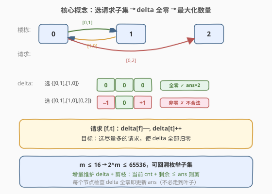
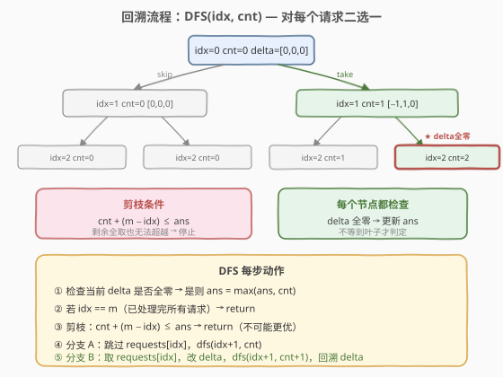

# LeetCode 可达的最大交换次数 题解

## 1. 题目概述

- **标题 / 题号**：可达的最大交换次数（#1601，hard）
- **链接**：https://leetcode.cn/problems/maximum-number-of-achievable-transfer-requests/
- **难度**：困难
- **标签**：回溯、位运算、枚举

**题意**：我们有 `n` 栋楼，编号 `0` 到 `n-1`。给定 `requests` 数组，其中 `requests[i] = [from_i, to_i]` 表示一名员工希望从楼 `from_i` 调换到楼 `to_i`。所有楼的**净变化初始为 0**（即每栋楼的进出人数相等）。

我们需要**选择尽可能多的请求**使其全部生效，且最终**每栋楼的净变化均为 0**。返回可达成的最大请求数。

> 一栋楼的「净变化」= 警进楼人数 − 搬出楼人数。选中的请求全部执行后，所有楼的净变化必须同时为 0。

**示例 1**：

```text
输入：n = 3, requests = [[0,0],[1,2],[2,1]]
输出：3
解释：三个请求全选。[0,0] 不改变任何楼；[1,2] 和 [2,1] 互相抵消。delta = [0,0,0]。
```

**示例 2**：

```text
输入：n = 3, requests = [[0,1],[1,0],[0,2]]
输出：2
解释：选 {[0,1], [1,0]}：d[0] 从 −1 回到 0，d[1] 从 +1 回到 0，d[2] 始终为 0。delta = [0,0,0]。
      若再取 [0,2] 则 d[0]=−1, d[2]=+1，不平衡。
```

**示例 3**：

```text
输入：n = 4, requests = [[0,3],[3,1],[1,2],[2,0]]
输出：4
解释：四个请求构成一条环 0→3→1→2→0，每栋楼进出各一次，delta = [0,0,0,0]。
```

**约束**：

- $1 \le n \le 20$
- $1 \le \text{requests.length} \le 16$
- $\text{requests}[i].\text{length} == 2$
- $0 \le \text{from}_i, \text{to}_i < n$

> ⚠️ 请求数 $m \le 16$ 是本题的关键约束——$2^{16} = 65536$，子集枚举完全可行。但朴素枚举每个子集都要重算 delta（$O(m)$），回溯 + 增量维护 + 剪枝能大幅减少实际搜索量。

## 2. 解题思路

### 2.1 暴力思路：枚举所有子集

对 $m$ 个请求枚举所有 $2^m$ 个子集，对每个子集统计各楼的净变化 `delta`，若全为 0 则用子集大小更新答案。单次检查 $O(m + n)$，总复杂度 $O(2^m \cdot (m + n))$。$m = 16$ 时约 $65536 \times 36 \approx 2.4 \times 10^6$，实际可行但浪费严重——每个子集从头算 delta，大量重复计算。

> 💡 **优化方向**：与其对每个子集重算 delta，不如**增量维护**——沿 DFS 深搜，每取一个请求就修改 delta 的两位，回溯时恢复。配合剪枝，远少于 $2^m$ 个节点。

### 2.2 核心观察：回溯 + delta 增量 + 剪枝



**第一步：把「选请求子集」翻译成 delta 数组。** 维护一个长度为 $n$ 的数组 `delta`，初始全 0。选中请求 `[f, t]` 时 `delta[f]--`、`delta[t]++`。目标是选尽量多的请求使 `delta` **全为 0**。

**第二步：增量维护，不走回头路。** DFS 遍历请求序列，对第 `idx` 个请求二选一：

- **跳过**：不修改 delta，直接 `dfs(idx+1, cnt)`
- **取**：修改 delta 两位，递归 `dfs(idx+1, cnt+1)`，**回溯时恢复 delta**

这把「每次重算 $O(m)$」降为「每步 $O(1)$」。

**第三步：每个节点都检查全零，不等到叶子。** 传统写法只在叶子（`idx == m`）检查 delta。但中间某个节点也可能 delta 全零（如选了 `[0,1]` 和 `[1,0]` 后，还剩请求未处理）——此时 `cnt` 就是一个合法答案。在每个节点都检查能更早更新 `ans`，也使剪枝更早生效。

**第四步：剪枝——剩余请求全取也无法超越当前最优就停。** 若当前已取 `cnt` 个、还剩 `m - idx` 个请求未处理，则理论最大可达 `cnt + (m - idx)`。若该值 $\le \text{ans}$，整棵子树都不可能产生更优解，直接剪掉。

> ⚠️ **剪枝顺序很重要**：先检查全零更新 `ans`，再判断是否剪枝。因为更新 `ans` 可能让后续分支被剪掉；反过来则可能错过更新。

### 2.3 算法流程图



DFS 每个节点的处理顺序：

1. **检查全零**：若 `delta` 全为 0，则 `ans = max(ans, cnt)`（当前选中的请求集合合法）
2. **终止条件**：若 `idx == m`（所有请求已处理完），return
3. **剪枝**：若 `cnt + (m - idx) <= ans`，return（即使剩余全取也无法超越）
4. **分支 A（跳过）**：`dfs(idx+1, cnt)`，delta 不变
5. **分支 B（取）**：`delta[f]--`, `delta[t]++`，`dfs(idx+1, cnt+1)`，回溯 `delta[f]++`, `delta[t]--`

> 💡 **分支顺序**：先「跳过」后「取」或反之均可。实测先跳过后取的写法更直观——先探索「少取」的路径，让 ans 逐步上升，使后续「多取」路径被剪枝的概率更高。但先「取」后「跳」能让 ans 更快上升，剪枝更早。两种顺序都正确，复杂度相同。

### 2.4 示例演算

以 `n = 3, requests = [[0,1],[1,0],[0,2]]` 为例，预期答案 `2`（选 `{[0,1], [1,0]}`）：

![示例演算：n=3, requests=[[0,1],[1,0],[0,2]]，答案=2](../images/1601_example_walkthrough.svg)

| 步 | 动作 | delta | 全零? | cnt | ans | 说明 |
|----|------|-------|-------|-----|-----|------|
| 0 | 起始 | [0,0,0] | ✓ | 0 | 0 | idx=0, delta 全零, ans=0 |
| 1 | 跳[0,1] | [0,0,0] | ✓ | 0 | 0 | idx=1, 仍全零 |
| 2 | 取[0,1] | [−1,1,0] | ✗ | 1 | 0 | d[0]−− d[1]++ |
| 3 | 取[1,0] | [0,0,0] | ✓ | 2 | **2** | ★ 全零! ans=max(0,2)=2 |
| 4 | 取[0,2] | [−1,0,1] | ✗ | 3 | 2 | d[0]−− d[2]++ 非零 |
| 5 | 跳[0,2] | [0,0,0] | ✓ | 2 | 2 | 叶子, 已是最佳 |
| 6 | 剪枝 | — | — | 0 | 2 | cnt=0 + 剩余1 ≤ ans=2, 跳过! |

> 💡 **看第 3 步**：取了 `[0,1]` 和 `[1,0]` 后，`d[0]` 从 −1 回到 0、`d[1]` 从 +1 回到 0——两个请求互相抵消。此时 `idx=2` 还未到叶子，但 delta 已全零，`ans` 更新为 2。后续探索 `[0,2]` 的分支（步 4）虽然 `cnt=3` 但 delta 非零，不影响 `ans`。步 6 中 `cnt=0 + 剩余1 = 1 ≤ ans=2`，整棵子树被剪掉——剪枝的威力。

## 3. 参考代码

### C++

```cpp
class Solution {
  public:
    int maximumRequests(int n, vector<vector<int>>& requests) {
        vector<int> delta(n, 0);
        int m = requests.size();
        int ans = 0;
        dfs(0, 0, m, requests, delta, ans);
        return ans;
    }

  private:
    void dfs(int idx, int cnt, int m,
             vector<vector<int>>& requests,
             vector<int>& delta, int& ans) {
        // 1. 检查当前 delta 是否全零
        bool ok = true;
        for (int d : delta)
            if (d != 0) { ok = false; break; }
        if (ok) ans = max(ans, cnt);

        // 2. 所有请求已处理
        if (idx == m) return;

        // 3. 剪枝：剩余全取也无法超越 ans
        if (cnt + (m - idx) <= ans) return;

        // 4. 分支 A：跳过 requests[idx]
        dfs(idx + 1, cnt, m, requests, delta, ans);

        // 5. 分支 B：取 requests[idx]，改 delta，回溯
        int f = requests[idx][0], t = requests[idx][1];
        delta[f]--;
        delta[t]++;
        dfs(idx + 1, cnt + 1, m, requests, delta, ans);
        delta[f]++;
        delta[t]--;
    }
};
```

### Python

```python
class Solution:
    def maximumRequests(self, n: int, requests: List[List[int]]) -> int:
        delta = [0] * n
        m = len(requests)
        ans = 0

        def dfs(idx: int, cnt: int):
            nonlocal ans
            # 1. 检查当前 delta 是否全零
            if all(d == 0 for d in delta):
                ans = max(ans, cnt)
            # 2. 所有请求已处理
            if idx == m:
                return
            # 3. 剪枝：剩余全取也无法超越 ans
            if cnt + (m - idx) <= ans:
                return
            # 4. 分支 A：跳过
            dfs(idx + 1, cnt)
            # 5. 分支 B：取，改 delta，回溯
            f, t = requests[idx]
            delta[f] -= 1
            delta[t] += 1
            dfs(idx + 1, cnt + 1)
            delta[f] += 1
            delta[t] -= 1

        dfs(0, 0)
        return ans
```

## 4. 复杂度分析

| 维度 | 复杂度 | 说明 |
|------|--------|------|
| 时间复杂度 | $O(2^m \cdot n)$ | 最坏情况遍历 $2^m$ 个节点，每节点检查 delta 全零 $O(n)$；剪枝使实际远小于最坏 |
| 空间复杂度 | $O(n + m)$ | delta 数组 $O(n)$ + DFS 递归栈 $O(m)$ |

> 💡 **剪枝效果**：$m = 16$ 时最坏 $2^{16} = 65536$ 个节点。实际运行中，`ans` 随搜索迅速上升，大量子树被 `cnt + 剩余 ≤ ans` 剪掉。LeetCode 上实测 $0\text{ ms}$（C++），远优于不剪枝的 $2^m \cdot (m+n)$ 暴力。

## 5. 扩展：位掩码枚举法

除回溯外，可直接枚举 $2^m$ 个子集的位掩码 `mask`，对每个 `mask` 统计 delta：

```cpp
int maximumRequests(int n, vector<vector<int>>& requests) {
    int m = requests.size(), ans = 0;
    for (int mask = 0; mask < (1 << m); ++mask) {
        vector<int> delta(n, 0);
        for (int i = 0; i < m; ++i)
            if (mask >> i & 1) {
                delta[requests[i][0]]--;
                delta[requests[i][1]]++;
            }
        bool ok = true;
        for (int d : delta)
            if (d != 0) { ok = false; break; }
        if (ok) ans = max(ans, __builtin_popcount(mask));
    }
    return ans;
}
```

| 方法 | 时间复杂度 | 空间复杂度 | 特点 |
|------|-----------|-----------|------|
| **回溯 + 剪枝** | $O(2^m \cdot n)$（实际远小） | $O(n + m)$ | 增量维护 delta，剪枝大幅减少搜索 |
| 位掩码枚举 | $O(2^m \cdot (m + n))$ | $O(n)$ | 简洁直接，无剪枝但常数稍大 |

> 💡 两种方法本质都是枚举子集，区别在于：回溯**增量维护** delta（每步 $O(1)$ 改两位）+ **剪枝**；位掩码每个子集**从头算** delta（$O(m)$）但无额外开销。$m \le 16$ 时两者都轻松通过，回溯在 $m$ 更大时优势明显。

## 6. 面试要点

1. **为什么在每个节点都检查 delta 全零，而不是只在叶子？**
   - 选中的请求子集可能在中间某步就使 delta 全零（如 `[0,1]` 和 `[1,0]` 互相抵消后还剩请求未处理）。只在叶子检查会漏掉这些合法的中间状态。更重要的是，提前更新 `ans` 能让剪枝更早生效——后续分支的 `cnt + 剩余 ≤ ans` 条件更容易满足。

2. **剪枝条件 `cnt + (m - idx) <= ans` 为什么用 `<=` 而不是 `<`？**
   - `cnt + (m - idx)` 是当前子树理论上能取到的最大请求数。若它等于 `ans`，即使全取也只能追平当前最优、不可能超越，继续搜索无意义。用 `<=` 剪掉「追平」的分支是安全的——我们只关心严格更优的解。

3. **回溯时为什么要恢复 delta？**
   - delta 是 DFS 的共享状态。取请求时修改了 `delta[f]` 和 `delta[t]`，若不恢复，回到父节点后「跳过」分支的 delta 就被污染了。恢复操作（`delta[f]++; delta[t]--`）与修改操作严格对称，确保每条路径看到正确的 delta。

4. **能否优化「检查 delta 全零」的 $O(n)$ 开销？**
   - 可以维护一个 `nonzero` 计数器，记录 delta 中非零元素的个数。取请求时，若 `delta[f]` 从 0 变非零则 `nonzero++`、从非零变 0 则 `nonzero--`（`delta[t]` 同理）。检查全零变为 `nonzero == 0` 的 $O(1)$ 判定。但代码复杂度增加，$n \le 20$ 时 $O(n)$ 检查已足够快。

5. **如果 $m$ 更大（如 $m = 30$），该怎么做？**
   - $2^{30} \approx 10^9$，子集枚举不再可行。可考虑 **Meet in the Middle**：把请求分成两半，各自枚举子集并记录 delta 签名，再合并两半的 delta 互补的子集。但 $m \le 16$ 的约束使得本题无需此优化。

## 同类练习题

| # | 题目 | 与本题的关联 |
|---|------|-------------|
| 78 | [子集](https://leetcode.cn/problems/subsets/)（[题解](../0001-0100/78_子集.md)） | 回溯枚举子集的母题，本题在其基础上增加「delta 全零」的合法性约束 |
| 39 | [组合总和](https://leetcode.cn/problems/combination-sum/)（[题解](../0001-0100/39_组合总和.md)） | 回溯 + 剪枝的经典模板，剪枝思路与本题一脉相承 |
| 473 | [火柴拼正方形](https://leetcode.cn/problems/matchsticks-to-square/) | 回溯 + 剪枝的另一应用，维护多条「边」的当前和并剪枝 |
| 1239 | [串联字符串的最大长度](https://leetcode.cn/problems/maximum-length-of-a-concatenated-string-with-unique-characters/) | 回溯枚举子集 + 增量维护字符集 + 剪枝，结构与本题高度同构 |
| 526 | [优美的排列](https://leetcode.cn/problems/beautiful-arrangement/)（[题解](../0501-0600/526_优美的排列.md)） | 状态压缩 / 回溯 + 剪枝，在排列空间中搜索满足约束的方案 |
